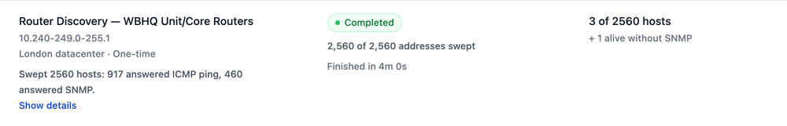
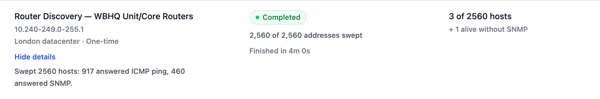
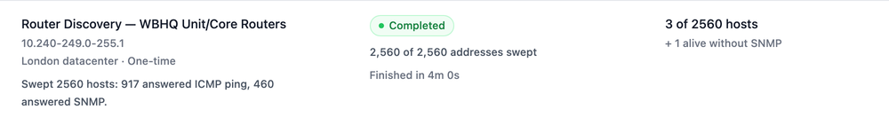
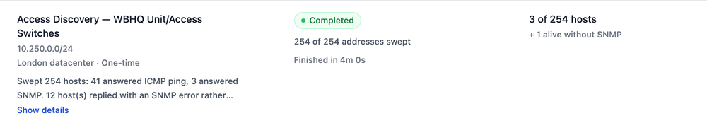
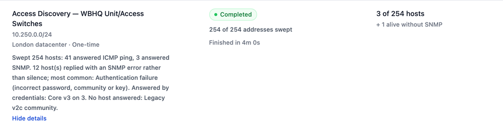
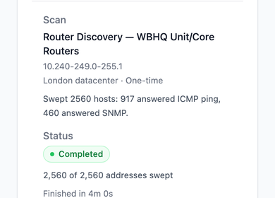

# Discovery scan "Show details" / "Hide details" (issue #3842)

These screenshots come from the Discovery page fixture (`packages/E2E/Discovery`). It
renders the real page with synthetic scans.

## Before

The reporter's scan summary fits in the two-line preview. "Show details" and
"Hide details" both showed the whole sentence. Clicking only moved the link
above the text.

## After

A message that fits in the preview is shown in full, with no toggle.

A longer message shows a two-line preview and "Show details".

"Show details" shows the whole message. "Hide details" sits under it.

On a phone, the preview is measured at the card's width.

