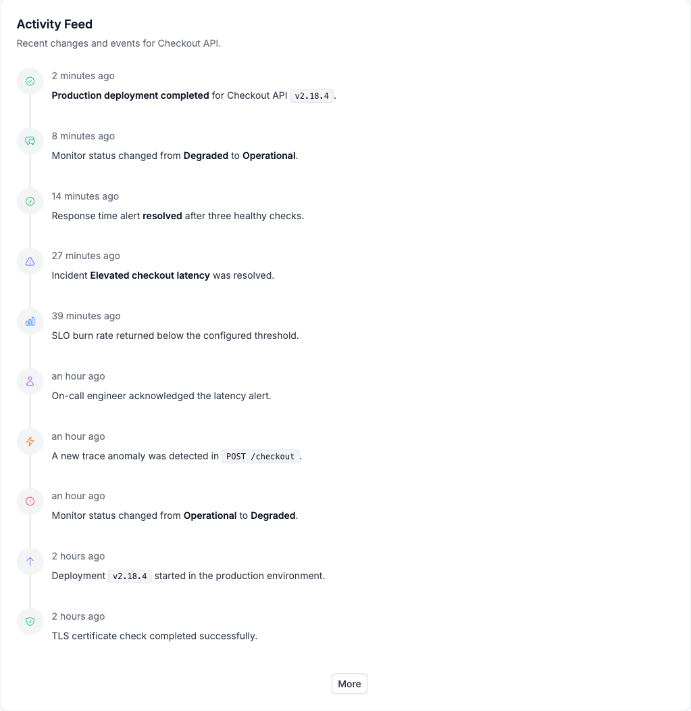
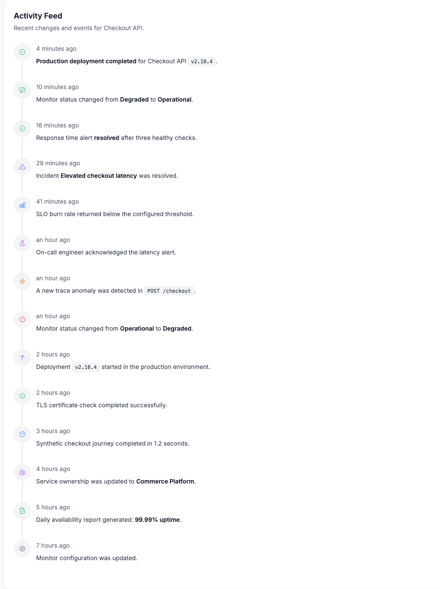

# Activity feed visual QA

These screenshots exercise the production `Card`, `Feed`, `FeedItem`, `Button`,
`Markdown`, and `Icon` components with OneUptime's shipped styles.

## Initial view

The feed starts with the 10 newest events and an exact **More** action at the
end.

## After selecting More

The feed expands to include older events while retaining newest-first order.

