# Mobile design revamp

Captures of the real Expo / React Native Web build with synthetic fixtures at
390 × 844. "Before" images are the previously committed review screenshots.
These are browser captures; on iOS and Android the previous build additionally
lost the styling of every `Pressable` drawn with a style callback (rows, chips,
response buttons, the project switcher), which web never showed.

## Light

| Screen | Before | After |
| --- | --- | --- |
| Home | 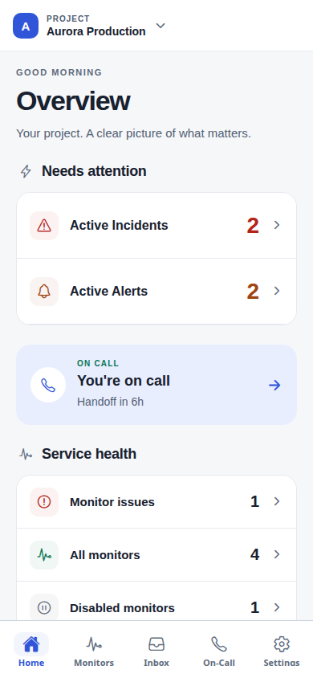 | 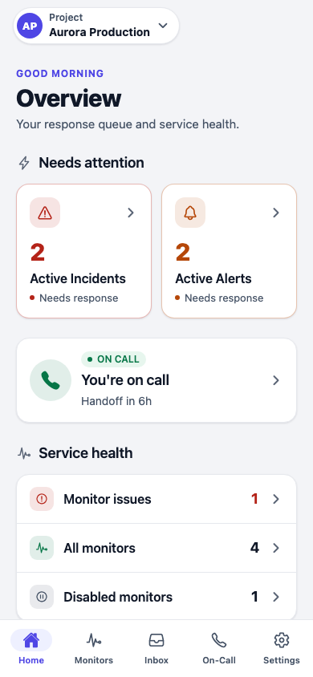 |
| Inbox |  | 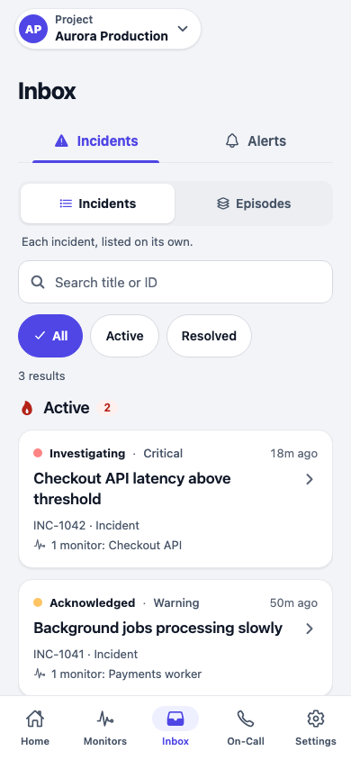 |
| Incident | 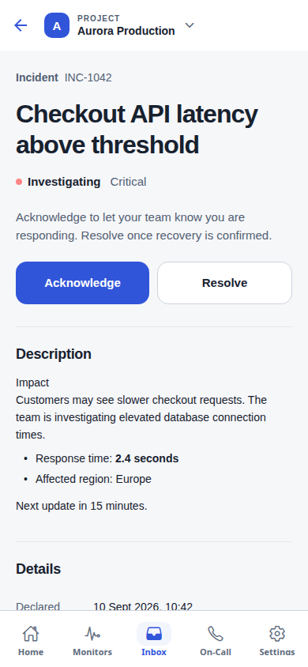 | 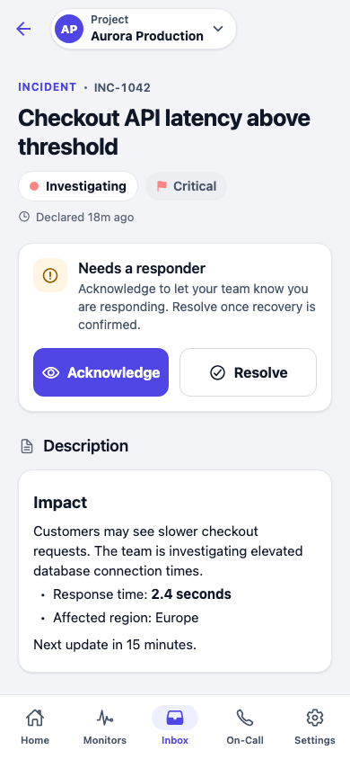 |
| Monitors | 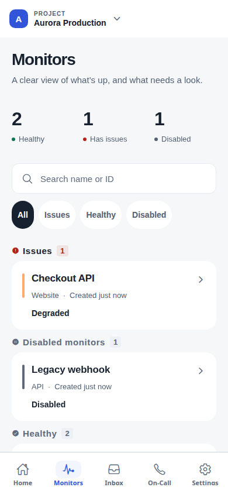 | 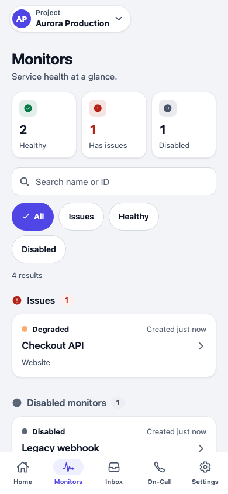 |
| On-Call | 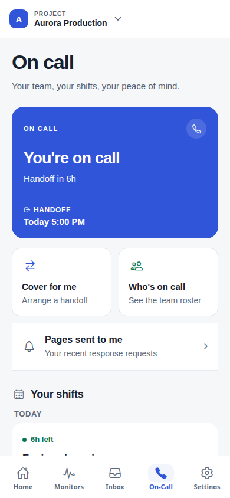 | 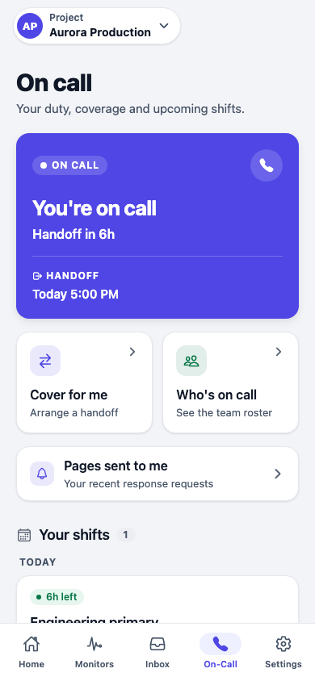 |
| Calendar sync | 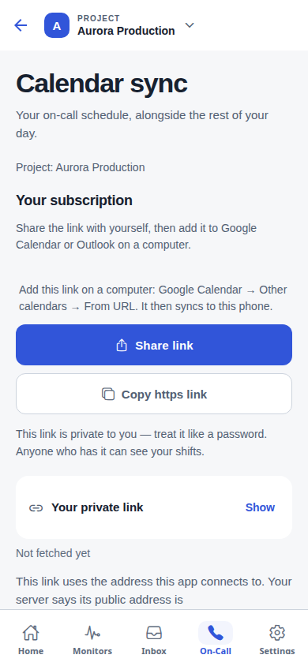 | 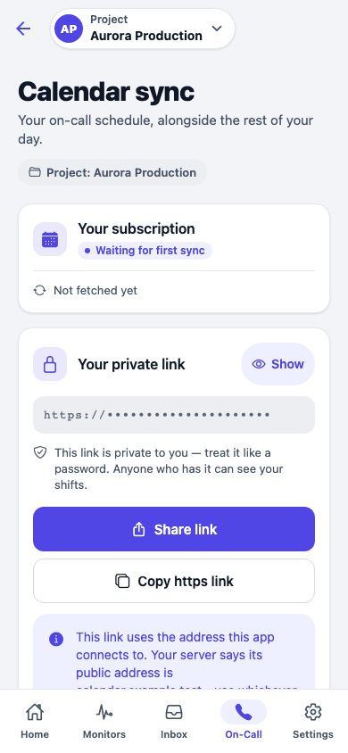 |
| Settings |  | 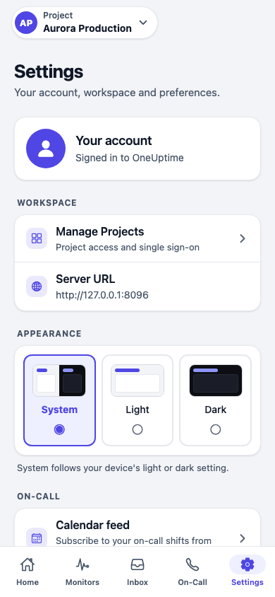 |
| Sign in |  | 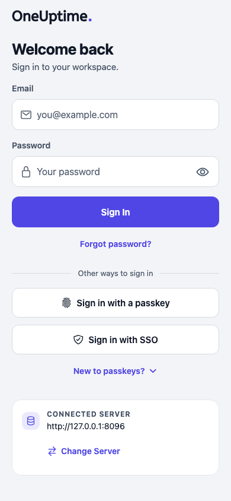 |

## Dark

| Home | Inbox | Incident |
| --- | --- | --- |
| 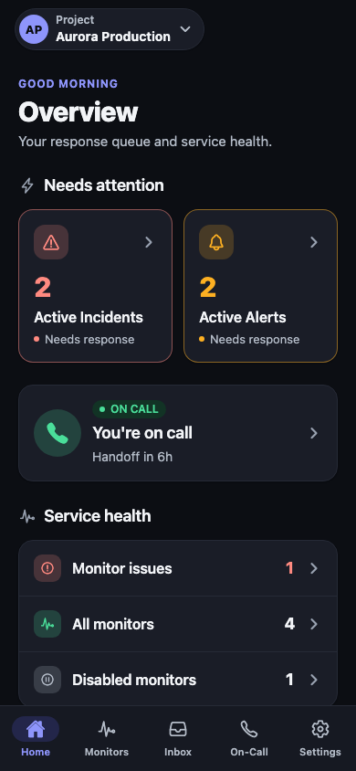 | 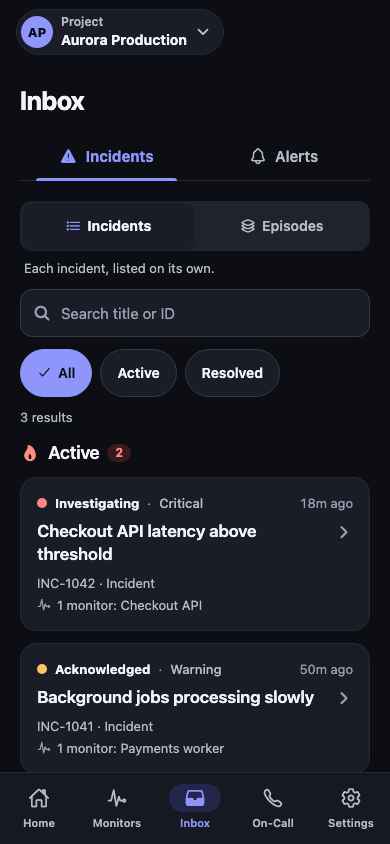 | 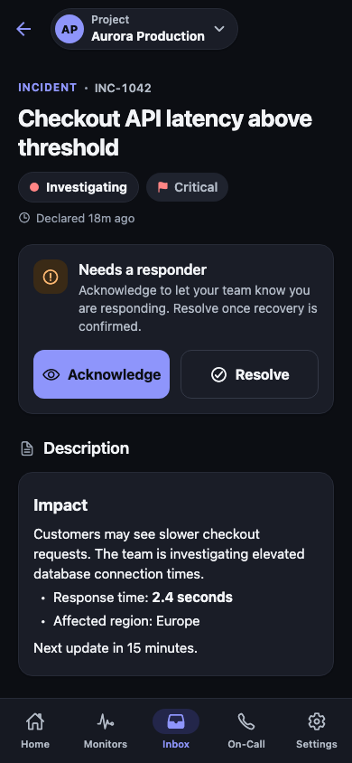 |

| On-Call | Monitors | Settings |
| --- | --- | --- |
| 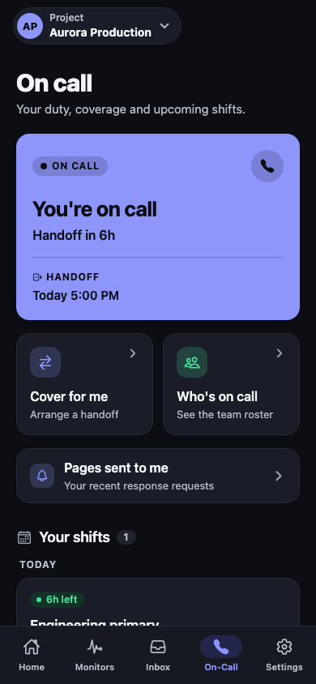 | 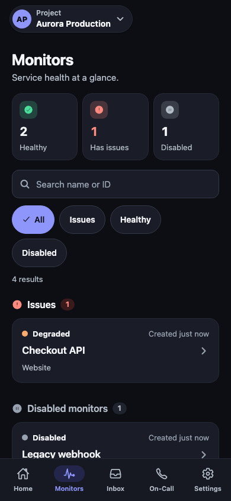 | 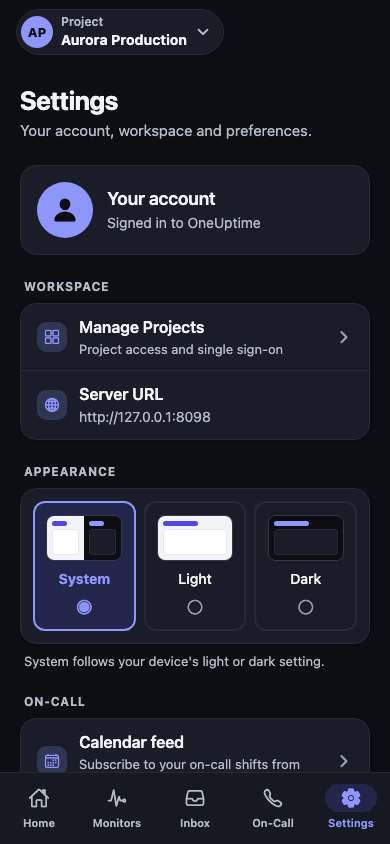 |

The complete set for all four test viewports is regenerated in
[`packages/MobileApp/docs/screenshots`](../../../packages/MobileApp/docs/screenshots) by
`UPDATE_SCREENSHOTS=1 npm run test-ui`.
