# Mobile experience polish

Screenshots of the actual Expo / React Native Web app with synthetic account,
project and operational data. These are browser viewport captures, not native
iOS or Android screenshots. Before images are the previously committed design
references; after images come from this change's Playwright journeys.

## Home

| Before | After |
| --- | --- |
|  | 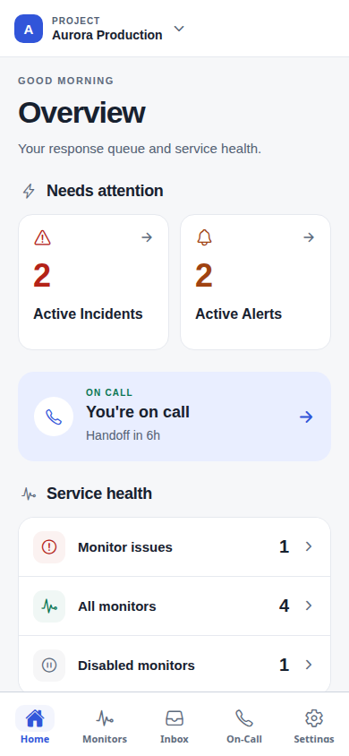 |

## Inbox

| Before | After |
| --- | --- |
| 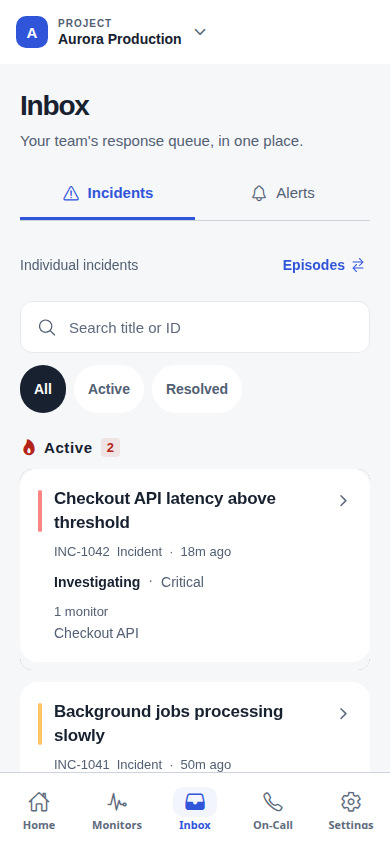 | 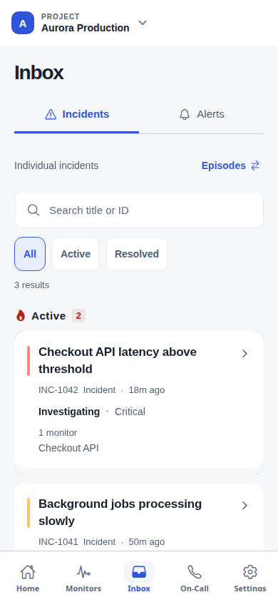 |

## Main flows

| Monitor health | Incident response | Sign in |
| --- | --- | --- |
| 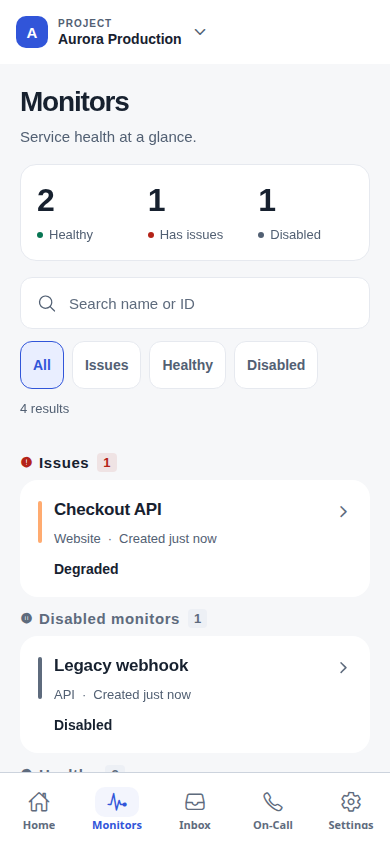 |  | 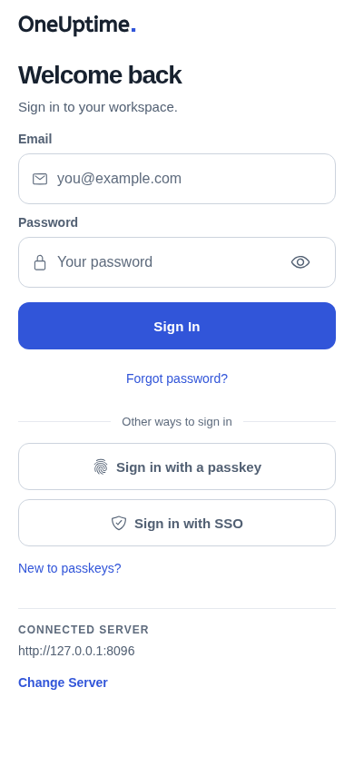 |

| Coverage review | Note composer | Settings |
| --- | --- | --- |
| 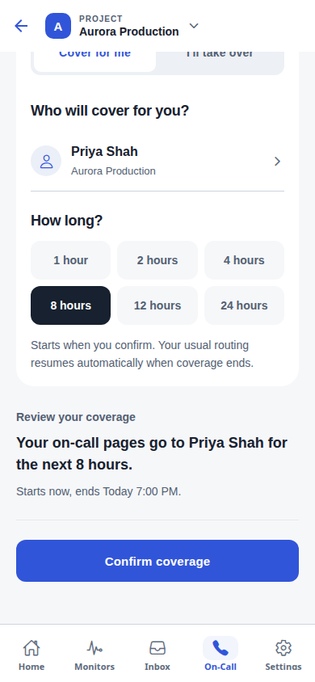 | 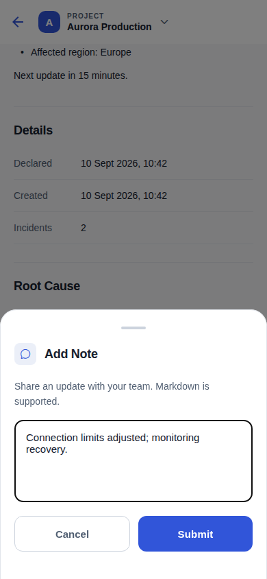 | 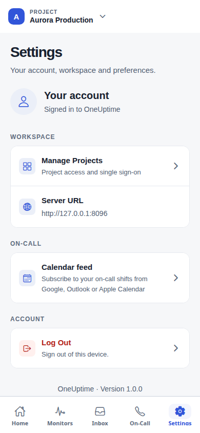 |

## Small phones and error recovery

| 320-point Home | Filter and reset | Teammate retry |
| --- | --- | --- |
| 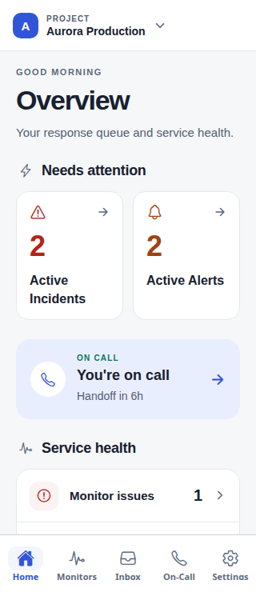 | 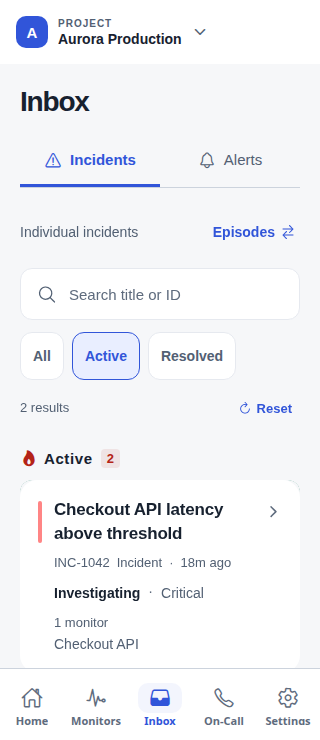 | 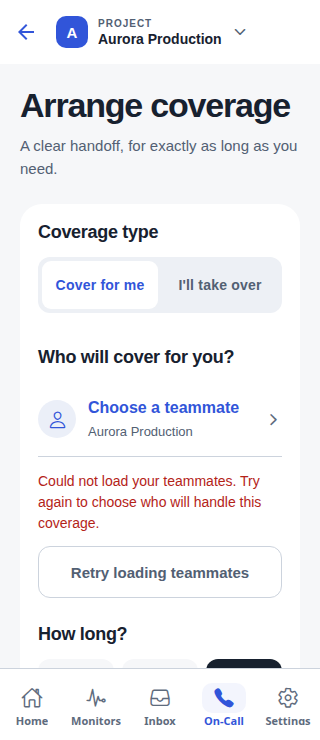 |

[Incident state recovery](iphone-size-incidents-state-retry.png) shows how a
failed metadata request is distinguished from an empty response queue.

## Larger screens

- Android-size: [on-call overview](android-size-oncall-overview.png),
  [coverage review](android-size-oncall-coverage-review.png).
- Tablet: [Home](tablet-home.png), [monitors](tablet-monitors.png),
  [Settings](tablet-settings.png).

Viewports: small phone 320 × 740, iPhone-size 390 × 844, Android-size 412 × 915,
tablet 768 × 1024. Viewport names describe dimensions, not native emulation.

Run `npm run test-ui` from `MobileApp` to reproduce the browser journeys and
capture screenshots in the Playwright report. The [audit report](../../../MobileApp/docs/UI_AUDIT_2026_09.md)
records the fixes, focused unit/integration checks and environment limitations.
