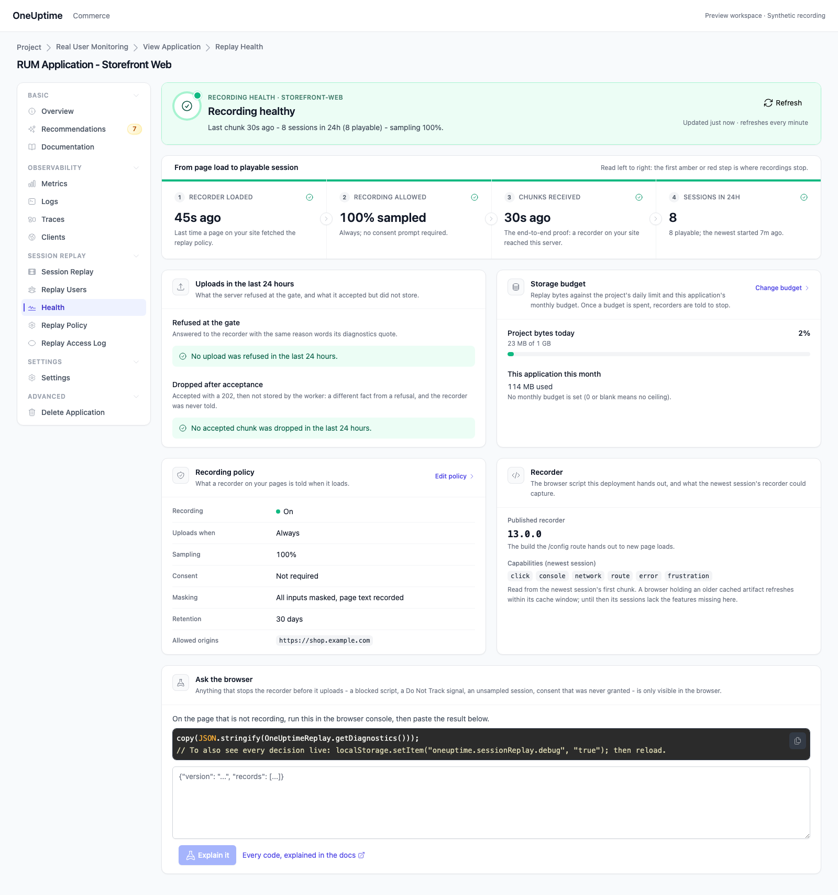
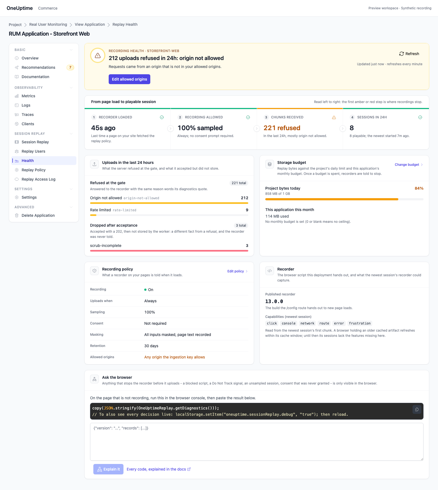
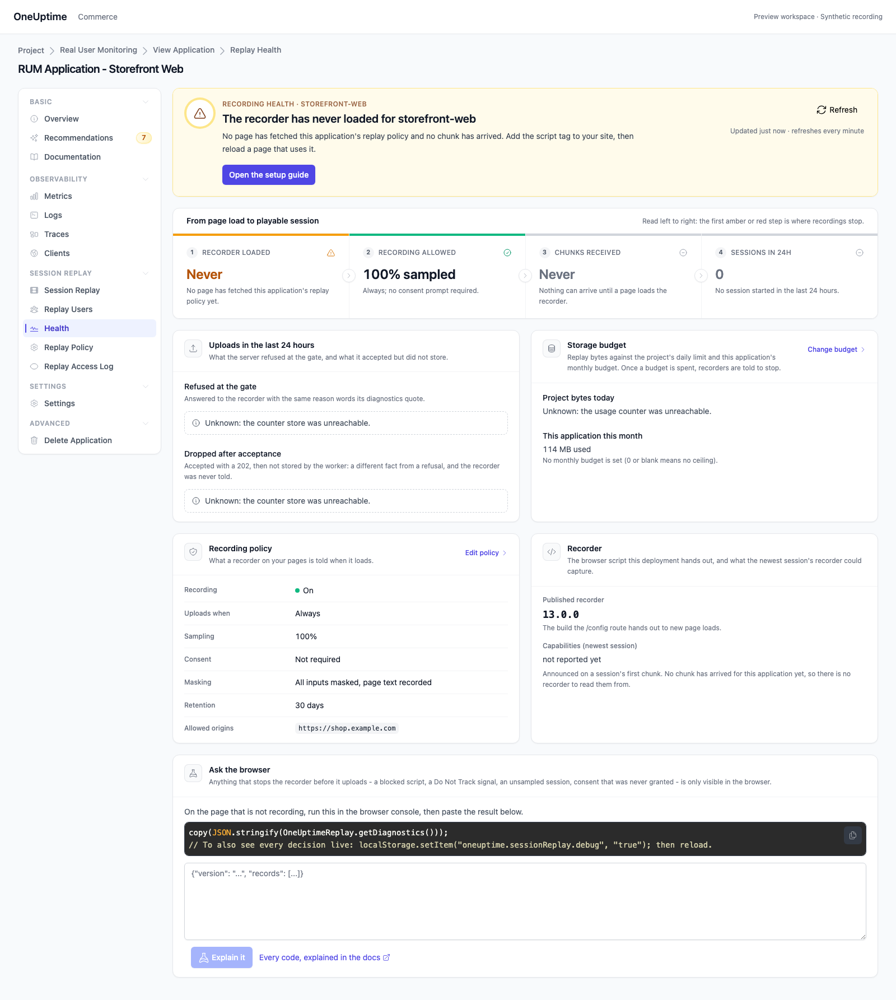
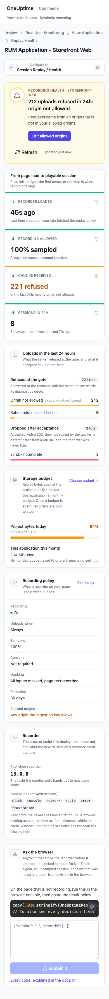
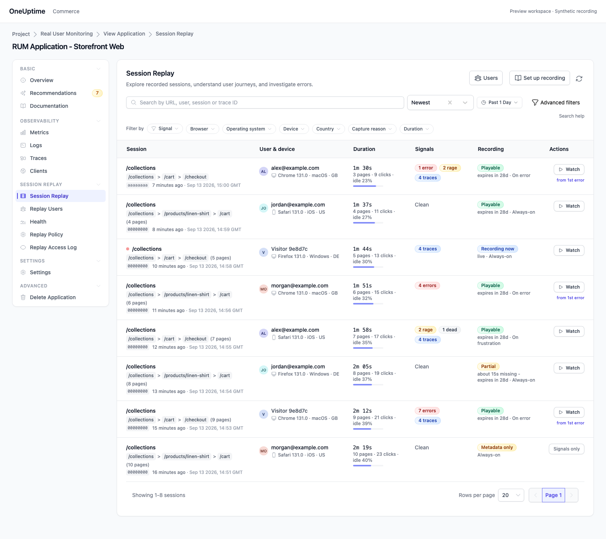

# Replay Health page visual QA

Production UI rendered by the offline session replay fixture
(`npm run test-session-replay-ui` in `E2E`) with synthetic ingest-status data.

## Healthy

## Uploads being refused

The hero names the top refusal reason and its fix; the pipeline marks the
Chunks received stage amber; the storage meter turns amber past 80%.

## Recorder never loaded

Counters the server could not read say "unknown" instead of zero.

## Narrow viewport

## Session list, without the health strip

