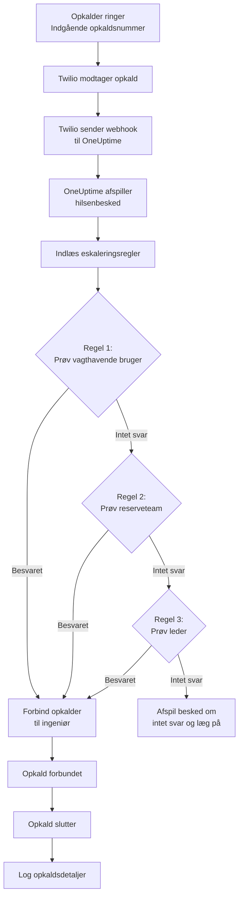
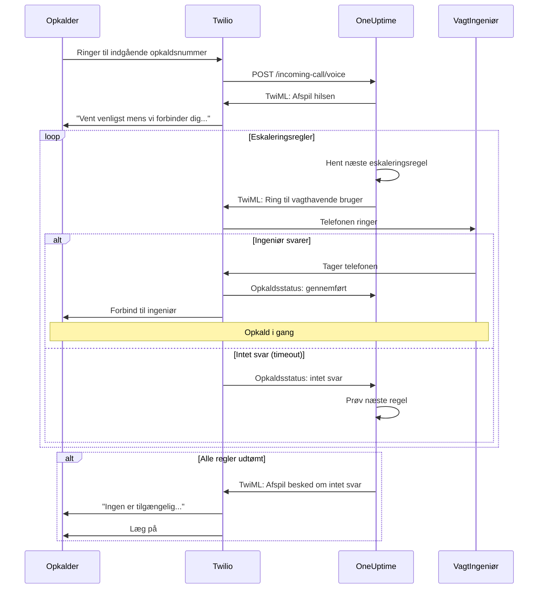
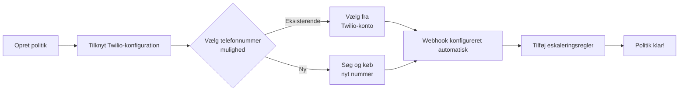
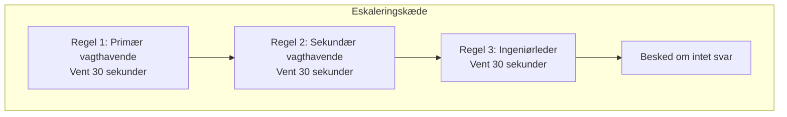
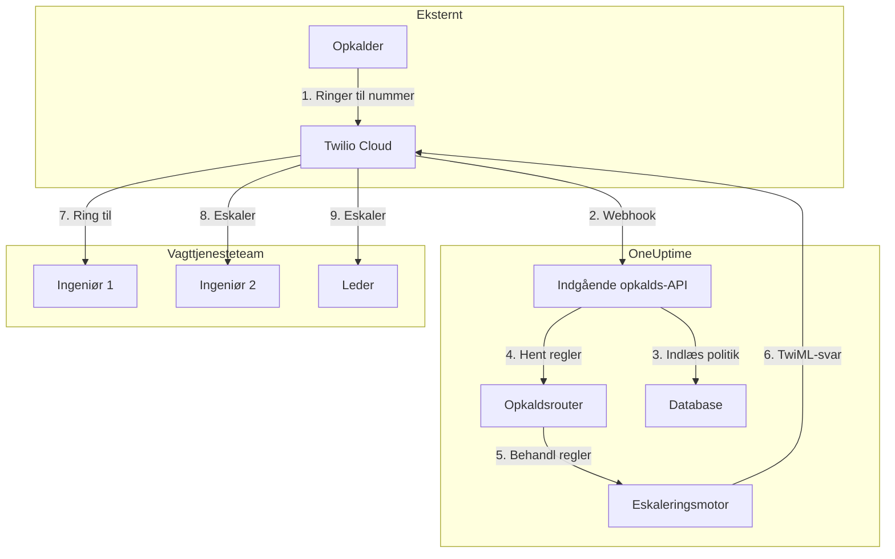

# Indgående opkaldspolitik (Twilio-integration)

Indgående opkaldspolitikker giver eksterne opkaldere mulighed for at nå dine vagtingeniører ved at ringe til et dedikeret telefonnummer. Når nogen ringer, dirigerer OneUptime opkaldet gennem dine konfigurerede eskaleringsregler, indtil en ingeniør svarer.

## Sådan fungerer det

## Opkaldsdirigieringsflow

## Forudsætninger

- En Twilio-konto – Opret en på [https://www.twilio.com](https://www.twilio.com)
- Dit Twilio-konto-SID og Auth Token
- Adgang til din OneUptime selvhostede instans

## Oversigt

Funktionen Indgående opkaldspolitik fungerer ved at:

1. Modtage indgående opkald på et Twilio-telefonnummer
2. Afspille en tilpasselig hilsenbesked
3. Dirigere opkaldet gennem eskaleringsregler (teams, planer eller brugere)
4. Forbinde opkalderen til den første tilgængelige vagthavende ingeniør
5. Eskalere til den næste regel, hvis ingen svarer

Da du selvhoster OneUptime, skal du konfigurere din egen Twilio-konto. Dette giver dig fuld kontrol over dine telefonnumre og fakturering.

## Trin 1: Opret en Twilio-konto

1. Gå til [https://www.twilio.com](https://www.twilio.com) og opret en konto
2. Fuldfør verifikationsprocessen
3. Notér dit **Konto-SID** og **Auth Token** fra Twilio Console-dashboardet

## Trin 2: Konfigurer opkalds-/SMS-konfiguration i OneUptime

1. Log ind på dit OneUptime-dashboard
2. Gå til **Projektindstillinger** > **Opkald og SMS** > **Brugerdefineret opkalds-/SMS-konfiguration**
3. Klik på **Opret brugerdefineret opkalds-/SMS-konfiguration**
4. Udfyld følgende felter:
   - **Navn**: Et brugervenligt navn (f.eks. "Produktions-Twilio-konfiguration")
   - **Beskrivelse**: Valgfri beskrivelse
   - **Twilio Konto-SID**: Dit Twilio-konto-SID (starter med `AC`)
   - **Twilio Auth Token**: Dit Twilio Auth Token
   - **Twilio primære telefonnummer**: Et telefonnummer fra din Twilio-konto til udgående opkald
5. Klik på **Gem**

## Trin 3: Opret en indgående opkaldspolitik

1. Gå til **Vagttjeneste** > **Indgående opkaldspolitikker**
2. Klik på **Opret indgående opkaldspolitik**
3. Udfyld følgende felter:
   - **Navn**: Et brugervenligt navn (f.eks. "Support-hotline")
   - **Beskrivelse**: Valgfri beskrivelse
4. Klik på **Gem**

## Trin 4: Tilknyt Twilio-konfiguration til politik

1. Åbn din nyoprettede indgående opkaldspolitik
2. Find **Trin 2: Tilknyt Twilio-konfiguration** i kortet **Telefonnummerdirigering**
3. Klik på **Vælg Twilio-konfiguration** og vælg den konfiguration, du oprettede i trin 2
4. Gem valget

## Trin 5: Konfigurer et telefonnummer

Du har to muligheder for at opsætte et telefonnummer:

### Mulighed A: Brug et eksisterende Twilio-telefonnummer

Hvis du allerede har telefonnumre i din Twilio-konto:

1. Klik på **Brug eksisterende nummer** i kortet **Telefonnummer**
2. OneUptime henter alle telefonnumre fra din Twilio-konto
3. Vælg det telefonnummer, du vil bruge
4. Klik på **Brug dette** for at tildele det til politikken

> **Bemærk**: Hvis telefonnummeret allerede har en webhook konfigureret, opdateres den til at pege på OneUptime.

### Mulighed B: Køb et nyt telefonnummer

For at købe et nyt telefonnummer direkte fra OneUptime:

1. Klik på **Køb nyt nummer** i kortet **Telefonnummer**
2. Vælg et **Land** fra rullelisten
3. Angiv valgfrit et **Retningsnummer** (f.eks. 45 for Danmark)
4. Angiv valgfrit cifre, som nummeret skal **Indeholde** (f.eks. 555)
5. Klik på **Søg** for at finde tilgængelige numre
6. Vælg et telefonnummer fra resultaterne
7. Klik på **Køb** for at købe nummeret

Telefonnummeret købes fra din Twilio-konto, og webhook'en **konfigureres automatisk** – ingen manuel opsætning er nødvendig!

## Trin 6: Konfigurer eskaleringsregler

Eskaleringsregler bestemmer, hvordan opkald dirigeres:

1. Åbn din indgående opkaldspolitik
2. Gå til fanen **Eskaleringsregler**
3. Klik på **Tilføj eskaleringsregel**
4. Konfigurer reglen:
   - **Rækkefølge**: Prioritetsrækkefølgen (lavere tal prøves først)
   - **Eskaler efter (sekunder)**: Tid at vente, inden der eskaleres
   - **Vagtplan**: Vælg en plan for at dirigere til den, der er på vagt
   - **Teams**: Vælg specifikke teams
   - **Brugere**: Vælg specifikke brugere
5. Tilføj yderligere eskaleringsregler efter behov

### Eksempel på eskaleringsregel

| Rækkefølge | Eskaler efter | Mål |
|-------|----------------|--------|
| 1 | 30 sekunder | Primær vagtplan |
| 2 | 30 sekunder | Sekundær vagtplan |
| 3 | 30 sekunder | Ingeniørteamets leder |

## Trin 7: Konfigurer stemmebeskeder (valgfrit)

Tilpas de beskeder, opkaldere hører:

1. Åbn din indgående opkaldspolitik
2. Gå til **Indstillinger**
3. Konfigurer:
   - **Hilsenbesked**: Afspilles, når opkaldet besvares
   - **Besked om intet svar**: Afspilles, når alle eskaleringsregler fejler
   - **Ingen tilgængelig-besked**: Afspilles, når ingen er på vagt

## Konfigurationsindstillinger

### Politikindstillinger

| Indstilling | Beskrivelse | Standard |
|---------|-------------|---------|
| Hilsenbesked | TTS-besked afspillet, når opkaldet besvares | "Vent venligst mens vi forbinder dig til vagthavende ingeniør." |
| Besked om intet svar | Besked, når alle eskaleringsregler fejler | "Ingen er tilgængelig. Prøv venligst igen senere." |
| Ingen vagthavende ingeniør tilgængelig-besked | Besked, når ingen er på vagt | "Vi beklager, men ingen vagthavende ingeniør er i øjeblikket tilgængelig." |
| Gentag politik, hvis ingen svarer | Genstart fra første regel, hvis alle fejler | Deaktiveret |
| Gentag politik antal gange | Maks. antal genforsøg | 1 |

### Eskaleringsregel-indstillinger

| Indstilling | Beskrivelse |
|---------|-------------|
| Rækkefølge | Prioritetsrækkefølge (1 = højeste prioritet) |
| Eskaler efter sekunder | Ventetid, inden næste regel prøves (standard: 30 s) |
| Vagtplan | Diriger til den, der i øjeblikket er på vagt |
| Teams | Diriger til alle medlemmer af valgte teams |
| Brugere | Diriger til specifikke brugere |

## Visning af opkaldslogge

For at se historikken for indgående opkald:

1. Gå til **Vagttjeneste** > **Indgående opkaldspolitikker**
2. Klik på din politik
3. Gå til fanen **Opkaldslogge**

Loggene viser:
- Opkalderens telefonnummer
- Opkaldsstatus (Gennemført, Intet svar, Mislykket osv.)
- Hvem der besvarede opkaldet
- Opkaldsvarighed
- Tidsstempel

## Konfiguration af brugertelefonnummer

For at brugere kan modtage indgående opkald, skal de have et bekræftet telefonnummer:

1. Brugere går til **Brugerindstillinger** > **Notifikationsmetoder**
2. Tilføj et telefonnummer under **Indgående opkaldsnumre**
3. Bekræft telefonnummeret via SMS-kode

Kun brugere med bekræftede telefonnumre kan ringes op via eskaleringsregler.

## Frigørelse af et telefonnummer

Hvis du ikke længere har brug for et telefonnummer:

1. Åbn din indgående opkaldspolitik
2. Klik på **Frigiv nummer** i kortet **Telefonnummer**
3. Bekræft frigørelsen

> **Advarsel**: Frigivne numre returneres til Twilio og er muligvis ikke tilgængelige til genkøb.

## Fejlfinding

### Opkald modtages ikke

- Bekræft, at Twilio-konfigurationen er korrekt tilknyttet politikken
- Kontroller, at din OneUptime-instans er tilgængelig fra internettet
- Bekræft, at Twilio-konto-SID og Auth Token er korrekte
- Kontroller Twilio Console for fejllogge

### Opkald opretter ikke forbindelse til ingeniører

- Bekræft, at brugere har bekræftede telefonnumre i deres notifikationsindstillinger
- Kontroller, at eskaleringsregler er korrekt konfigureret
- Sørg for, at vagtplaner har brugere tildelt for den aktuelle tid
- Bekræft, at politikken er aktiveret

### Lydkvalitetsproblemer

- Sørg for, at din server har stabil internetforbindels
- Kontroller Twilios statusside for eventuelle igangværende problemer
- Bekræft, at telefonnumre er i det korrekte format (E.164-format: +4511223344)

## Sikkerhedsovervejelser

- Hold dit Twilio Auth Token sikkert og eksponér det aldrig offentligt
- Brug HTTPS til din OneUptime-instans
- OneUptime validerer webhook-signaturer for at sikre, at anmodninger kommer fra Twilio
- Overvej at begrænse, hvilke telefonnumre der kan ringe til dine indgående opkaldspolitikker

## Arkitekturoversigt

## Support

For problemer med funktionen Indgående opkaldspolitik:

1. Kontroller Twilio Console for fejllogge
2. Gennemgå OneUptime-serverlogge
3. Kontakt support på [hello@oneuptime.com](mailto:hello@oneuptime.com)
