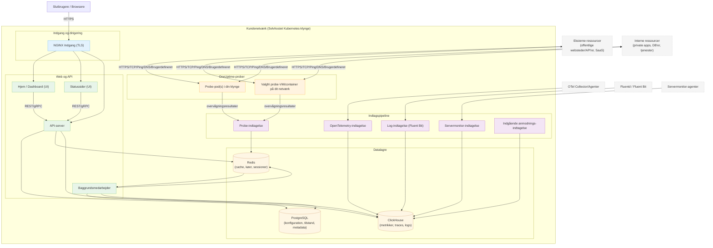

# OneUptime selvhostet arkitektur

Dette diagram viser, hvordan OneUptime typisk ser ud, når det selvhostes i dit miljø (f.eks. i din Kubernetes-klynge), herunder hvordan prober overvåger både interne og eksterne ressourcer.

## Hvad dette viser
- Slutbrugere tilgår OneUptime via din klynges indgang (NGINX), som dirigerer til UI'en og API'en.
- Kernetjenester læser/skriver tilstand til PostgreSQL, Redis og ClickHouse.
- Prober kan køre inde i din klynge (anbefalet) og/eller andre steder på dit netværk. De kan overvåge:
  - Interne/private tjenester bag din firewall.
  - Eksterne/offentlige ressourcer på internettet.
- Probe-resultater sendes til Probe-indtagelse inde i din klynge, sættes i kø via Redis og behandles af Baggrundsmedarbejderen til dine datalagre.
- Telemetri (metrikker/traces/logs) og server-/agentdata kan indsamles via dedikerede indtagelsestjenester og gemmes i ClickHouse.

> Bemærk: Hvis du bruger ekstern PostgreSQL, Redis eller ClickHouse i stedet for de indbyggede, peger forbindelserne fra API/Worker/Ingest på dine eksterne endpoints. Det logiske flow forbliver det samme.
