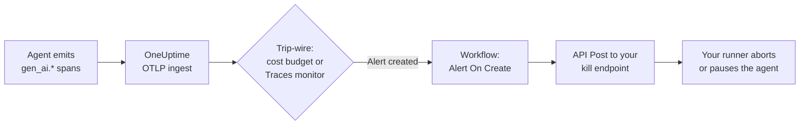

# Circuit-Breaking Runaway AI Agents

AI agents rarely fail by crashing. They fail by _continuing_ — retrying a broken tool in a loop, re-planning the same step forever, or fanning out sub-agents — while every iteration bills more tokens. This guide shows how to build an **async circuit breaker** with pieces OneUptime already gives you:

1. A **trip-wire signal** — an [LLM cost budget](/docs/telemetry/ai-llm-observability) alert or a [Traces monitor](/docs/monitor/traces-monitor) that recognizes loop behavior in your `gen_ai.*` spans.
2. A **Workflow** triggered by that alert.
3. An **outbound webhook** from the workflow to a kill endpoint _you_ own, which stops the runaway runner.



## Why async instead of an inline gateway?

Inline guardrails put a proxy in the request path: every LLM call detours through a gateway that can veto request N+1. That works, but it couples you to one gateway, adds latency to every call, and becomes a single point of failure for all AI traffic.

The circuit breaker here is **gateway-agnostic**. It watches the OpenTelemetry traces your app already sends (directly, or [through a gateway](/docs/telemetry/ai-gateways) — both work), and reacts out-of-band. Nothing sits in your hot path, and switching providers, SDKs or gateways doesn't break it. The trade-off is honesty about latency: this is a **backstop that stops a runaway in minutes, not milliseconds**. Keep per-run step limits and timeouts in your agent code as the first line of defense; use this to catch what slips through.

## Prerequisites

- Your agent emits GenAI spans to OneUptime — see [AI / LLM Observability](/docs/telemetry/ai-llm-observability) or [Observing AI Gateways](/docs/telemetry/ai-gateways).
- An HTTP endpoint in your infrastructure that can stop or pause your agent runner (built in Step 2).

## Step 1 — Pick a trip-wire signal

Both options end the same way: an **alert** is created in OneUptime, which is what triggers the workflow. You can wire up both at once — the workflow doesn't care which one fired.

### Option A: LLM cost budget alert

A runaway agent's most reliable symptom is spend. The **AI / LLM → Budgets** tab lets you set a daily USD limit with a warning alert (default 80%) and a breach alert (100%). Budgets are evaluated every 15 minutes against the day's LLM span cost — SDK-reported or [computed at ingest](/docs/telemetry/ai-llm-observability), so it works even if your instrumentation doesn't report cost.

For circuit breaking, scope the budget so the alert identifies _what to kill_:

- Create one budget **per agent's telemetry service** (for example `agent-support-bot`), not just a project-wide one.
- Name the budget after the runner it guards — the budget name is embedded in the alert title, and your kill endpoint can route on it.

The alerts arrive with predictable titles you can filter on in the workflow:

- Warning: `LLM cost budget warning: <budget name>`
- Breach: `LLM cost budget exceeded: <budget name>`

A good pattern is warning → page a human (via the alert's on-call policy), breach → trip the breaker.

### Option B: Traces monitor on loop behavior

Cost catches slow burns; a [Traces monitor](/docs/monitor/traces-monitor) catches loops faster. A stuck agent produces a very recognizable trace shape: the **same tool-call span, over and over**. Healthy runs don't call one tool dozens of times in a couple of minutes.

Create a monitor with **Monitors → Create Monitor → Traces**:

- **Telemetry service**: your agent's service.
- **Attributes**: `gen_ai.tool.name` = the tool you expect loops on (for example `search_web`) — or use **Span Name** if your instrumentation names tool spans directly.
- **Time Window**: 120 seconds.
- **Criteria**: Span Count **Greater Than** a threshold no healthy run reaches (say `30`), and have the criteria **create an alert** with an appropriate severity.
- **Monitoring interval**: every minute, so detection lag stays around one to three minutes.

Two variations worth knowing:

- A second criteria filtering **Span Statuses = ERROR** with a lower threshold catches retry storms (tool keeps failing, agent keeps retrying).
- A [Metrics monitor](/docs/monitor/metrics-monitor) on `gen_ai.client.token.usage` gives you a token-rate version of the same idea.

### Detection latency, honestly stated

| Signal                                         | Typical time to alert              |
| ---------------------------------------------- | ---------------------------------- |
| Traces monitor, 1-minute interval, 120s window | ~1–3 minutes                       |
| Budget warning / breach                        | up to ~15 minutes (worker cadence) |

## Step 2 — Build the kill endpoint (your side)

The workflow will `POST` a JSON payload to an endpoint you host. What "kill" means is your call — common blast-radius choices, smallest first:

1. **Stop new work**: flip a flag so the runner picks up no new agent runs.
2. **Abort matching runs**: cancel in-flight runs for the affected agent/service.
3. **Pause the whole pool**: drain every worker until a human resets the breaker.

A minimal Express example that trips a per-runner breaker:

```ts
import express from "express";

const app = express();
app.use(express.json());

const tripped = new Set<string>(); // runner names with an open breaker

app.post("/circuit-breaker", (req, res) => {
  if (req.headers["authorization"] !== `Bearer ${process.env.KILL_TOKEN}`) {
    return res.status(401).end();
  }

  const alertTitle: string = req.body.alertTitle ?? "";

  // Budget names / monitor names map to runners, e.g.
  // "LLM cost budget exceeded: agent-support-bot" -> "agent-support-bot"
  const runner: string = alertTitle.split(": ").pop() ?? "unknown";

  tripped.add(runner); // your run loop checks this set
  abortActiveRuns(runner); // cancel in-flight jobs for that runner

  // Acknowledge fast — do the heavy cleanup async.
  return res.status(200).json({ tripped: runner });
});
```

Design notes:

- **Make it idempotent.** The breaker may be tripped more than once (warning then breach, or budget plus traces monitor firing together). Tripping an already-tripped breaker must be harmless.
- **Acknowledge quickly** and do slow cleanup in the background; the workflow's API component treats any 2xx as success.
- **Require a secret.** Anyone who can call this endpoint can stop your agents. Check a bearer token (stored as a secret OneUptime [global variable](/docs/workflows/variables) on the sending side).
- **Human reset.** A tripped breaker should stay tripped until someone looks at the run — auto-resetting defeats the purpose. Investigate with **AI / LLM → LLM Calls**, filtering by the conversation/session id to see exactly what the agent was doing.

## Step 3 — The workflow

Open **Workflows** in the left navigation, click **Create Workflow**, and build these blocks on the canvas. See [Authoring a Workflow](/docs/workflows/authoring) for canvas basics.

### 1. Trigger: Alert → On Create

Add the **On Create Alert** trigger ([OneUptime event triggers](/docs/workflows/triggers)). Every new alert in the project starts the workflow and passes the full alert record as `model`. Give the trigger a stable ID — the examples below assume `alert-on-create-1`.

### 2. Filter: If / Else on the alert title

You only want the breaker tripped by your trip-wire alerts, not every alert in the project. Add an **If / Else** block (Conditions category):

- **Left**: the trigger's `model.title` — inserted with the picker, it reads `{{local.components.alert-on-create-1.returnValues.model.title}}`
- **Operator**: `contains`
- **Right**: `LLM cost budget exceeded` (Option A) — or your Traces monitor's alert title (Option B)

To react to several trip-wires, chain If / Else blocks from the **No** branch, or standardize your alert titles so one `contains` match covers them all.

### 3. Act: API Post to your kill endpoint

From the **Yes** branch, add an **API Post (JSON)** component ([Components](/docs/workflows/components)):

- **URL**: `https://your-infra.example.com/circuit-breaker`
- **Request Headers**:

```json
{
  "Authorization": "Bearer {{global.variables.AGENT_KILL_TOKEN}}",
  "Content-Type": "application/json"
}
```

- **Request Body**:

```json
{
  "source": "oneuptime-circuit-breaker",
  "alertId": "{{local.components.alert-on-create-1.returnValues.model._id}}",
  "alertTitle": "{{local.components.alert-on-create-1.returnValues.model.title}}",
  "alertDescription": "{{local.components.alert-on-create-1.returnValues.model.description}}"
}
```

Store the token as a **secret global variable** (`AGENT_KILL_TOKEN`) under **Workflows → Global Variables** so it stays out of run logs. The simpler outbound **Webhook** component also works for fire-and-forget posts, but the API component lets you set the auth header and branch on the response — use it here.

### 4. Don't fail silently

Connect the API block's **Error** port to a **Slack** (or Email) block: a circuit breaker that fails to trip is exactly the alert you want a human to see. Optionally connect **Success** to a Slack message too — "breaker tripped for `<runner>`" is a message your on-call will appreciate.

## Step 4 — Test it

1. **Dry-run the workflow**: alerts can be created by hand (**Alerts → Create Alert**). Create one titled `LLM cost budget exceeded: test`, then check the workflow fired under **Workflows → Runs & Logs**, and that your endpoint received the post.
2. **Test the real signal**: create a scoped budget with a tiny limit (for example $0.01) against a dev service and let your agent run — you should see the alert, the workflow run, and the breaker trip end-to-end. For Option B, point a test agent at a stubbed failing tool and watch the loop trip the traces monitor.
3. **Verify idempotency** by firing the alert twice.

## Alert lifecycle caveats

- Budget alerts fire **at most once per UTC day** per budget and kind (one warning, one breach), and only if no matching alert is still open — so the breaker trips once per bad day, not continuously. Resetting is a human decision on both sides: resolve the alert in OneUptime _and_ reset your breaker.
- A Traces monitor keeps its alert open while the criteria stay met; the workflow triggers on **creation**, so you get one trip per episode.
- The workflow trigger fires for **every** new alert in the project — the If / Else filter is what keeps unrelated alerts from tripping the breaker. Don't skip it.

## Where to read next

- [AI / LLM Observability](/docs/telemetry/ai-llm-observability) — GenAI spans, cost computation, and daily budgets.
- [Observing AI Gateways](/docs/telemetry/ai-gateways) — get gateway-level traces in with one config change.
- [Traces Monitor](/docs/monitor/traces-monitor) — span filters and criteria in detail.
- [Workflows](/docs/workflows/index) — triggers, components, variables, runs.
