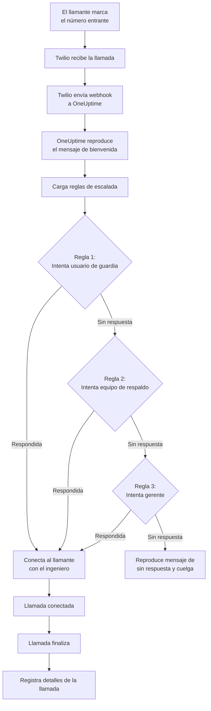
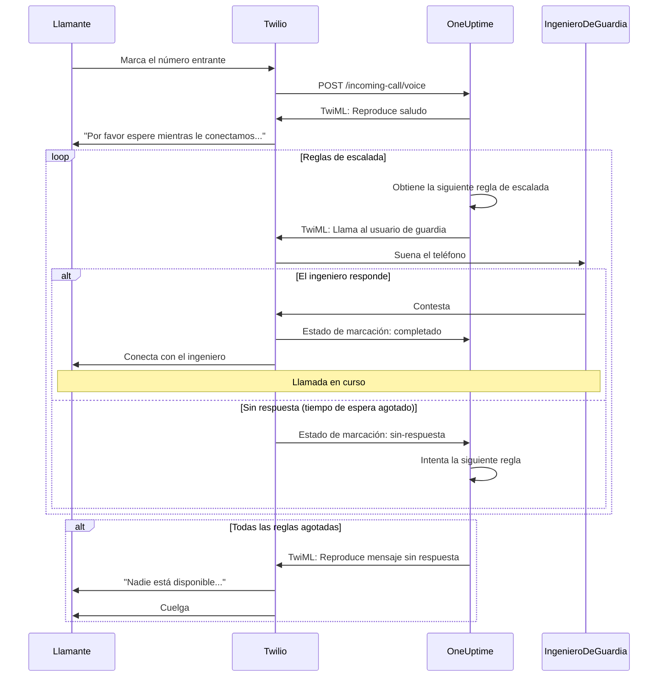
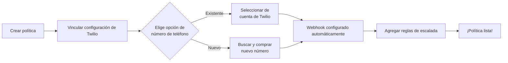
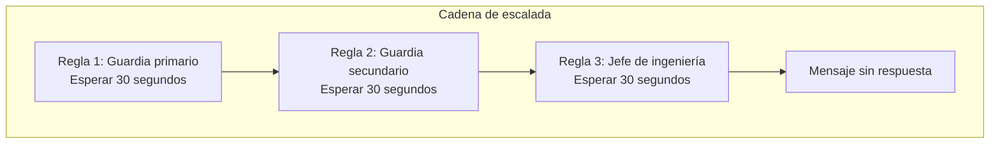

# Política de llamadas entrantes (Integración con Twilio)

Las Políticas de llamadas entrantes permiten que los llamantes externos lleguen a tus ingenieros de guardia marcando un número de teléfono dedicado. Cuando alguien llama, OneUptime enruta la llamada a través de tus reglas de escalada configuradas hasta que un ingeniero responde.

## Cómo funciona

## Flujo de enrutamiento de llamadas

## Prerrequisitos

- Una cuenta de Twilio: créala en [https://www.twilio.com](https://www.twilio.com)
- Tu SID de cuenta y token de autenticación de Twilio
- Acceso a tu instancia auto-alojada de OneUptime

## Información general

La función de Política de llamadas entrantes funciona mediante:

1. Recibir llamadas entrantes en un número de teléfono de Twilio
2. Reproducir un mensaje de bienvenida personalizable
3. Enrutar la llamada a través de reglas de escalada (equipos, horarios o usuarios)
4. Conectar al llamante con el primer ingeniero de guardia disponible
5. Escalar a la siguiente regla si nadie responde

Dado que estás auto-alojando OneUptime, necesitarás configurar tu propia cuenta de Twilio. Esto te da control total sobre tus números de teléfono y facturación.

## Paso 1: Crear una cuenta de Twilio

1. Ve a [https://www.twilio.com](https://www.twilio.com) y regístrate para obtener una cuenta
2. Completa el proceso de verificación
3. Anota tu **SID de cuenta** y **Token de autenticación** desde el panel de Twilio

## Paso 2: Configurar la configuración de llamadas/SMS en OneUptime

1. Inicia sesión en tu panel de OneUptime
2. Ve a **Configuración del proyecto** > **Llamadas y SMS** > **Configuración personalizada de llamadas/SMS**
3. Haz clic en **Crear configuración personalizada de llamadas/SMS**
4. Completa los siguientes campos:
   - **Nombre**: Un nombre descriptivo (por ejemplo, "Configuración de Twilio para producción")
   - **Descripción**: Descripción opcional
   - **SID de cuenta de Twilio**: Tu SID de cuenta de Twilio (comienza con `AC`)
   - **Token de autenticación de Twilio**: Tu token de autenticación de Twilio
   - **Número de teléfono principal de Twilio**: Un número de teléfono de tu cuenta de Twilio para llamadas salientes
5. Haz clic en **Guardar**

## Paso 3: Crear una Política de llamadas entrantes

1. Ve a **Guardia** > **Políticas de llamadas entrantes**
2. Haz clic en **Crear política de llamadas entrantes**
3. Completa los siguientes campos:
   - **Nombre**: Un nombre descriptivo (por ejemplo, "Línea de soporte")
   - **Descripción**: Descripción opcional
4. Haz clic en **Guardar**

## Paso 4: Vincular la configuración de Twilio a la política

1. Abre tu Política de llamadas entrantes recién creada
2. En la tarjeta **Enrutamiento de número de teléfono**, busca el **Paso 2: Vincular configuración de Twilio**
3. Haz clic en **Seleccionar configuración de Twilio** y elige la configuración que creaste en el Paso 2
4. Guarda la selección

## Paso 5: Configurar un número de teléfono

Tienes dos opciones para configurar un número de teléfono:

### Opción A: Usar un número de teléfono de Twilio existente

Si ya tienes números de teléfono en tu cuenta de Twilio:

1. En la tarjeta **Número de teléfono**, haz clic en **Usar número existente**
2. OneUptime obtendrá todos los números de teléfono de tu cuenta de Twilio
3. Selecciona el número de teléfono que deseas usar
4. Haz clic en **Usar este** para asignarlo a la política

> **Nota**: Si el número de teléfono ya tiene un webhook configurado, se actualizará para apuntar a OneUptime.

### Opción B: Comprar un nuevo número de teléfono

Para comprar un nuevo número de teléfono directamente desde OneUptime:

1. En la tarjeta **Número de teléfono**, haz clic en **Comprar nuevo número**
2. Selecciona un **País** del menú desplegable
3. Opcionalmente, ingresa un **Código de área** (por ejemplo, 415 para San Francisco)
4. Opcionalmente, ingresa los dígitos que el número debe **Contener** (por ejemplo, 555)
5. Haz clic en **Buscar** para encontrar los números disponibles
6. Selecciona un número de teléfono de los resultados
7. Haz clic en **Comprar** para adquirir el número

¡El número de teléfono se comprará de tu cuenta de Twilio y el webhook se **configurará automáticamente**, sin necesidad de configuración manual!

## Paso 6: Configurar las reglas de escalada

Las reglas de escalada determinan cómo se enrutan las llamadas:

1. Abre tu Política de llamadas entrantes
2. Ve a la pestaña **Reglas de escalada**
3. Haz clic en **Agregar regla de escalada**
4. Configura la regla:
   - **Orden**: El orden de prioridad (los números menores se prueban primero)
   - **Escalar después de (segundos)**: Cuánto tiempo esperar antes de escalar
   - **Horario de guardia**: Selecciona un horario para enrutar a quien esté de guardia
   - **Equipos**: Selecciona equipos específicos
   - **Usuarios**: Selecciona usuarios específicos
5. Agrega reglas de escalada adicionales según sea necesario

### Ejemplo de regla de escalada

| Orden | Escalar después de | Destino |
|-------|----------------|--------|
| 1 | 30 segundos | Horario de guardia primario |
| 2 | 30 segundos | Horario de guardia secundario |
| 3 | 30 segundos | Jefe del equipo de ingeniería |

## Paso 7: Configurar mensajes de voz (opcional)

Personaliza los mensajes que escuchan los llamantes:

1. Abre tu Política de llamadas entrantes
2. Ve a **Configuración**
3. Configura:
   - **Mensaje de bienvenida**: Reproducido cuando se responde la llamada
   - **Mensaje sin respuesta**: Reproducido cuando fallan todas las reglas de escalada
   - **Mensaje sin nadie disponible**: Reproducido cuando nadie está de guardia

## Opciones de configuración

### Ajustes de la política

| Ajuste | Descripción | Predeterminado |
|---------|-------------|---------|
| Mensaje de bienvenida | Mensaje TTS reproducido cuando se responde la llamada | "Por favor espere mientras le conectamos con el ingeniero de guardia." |
| Mensaje sin respuesta | Mensaje cuando fallan todas las reglas de escalada | "Nadie está disponible. Por favor intente de nuevo más tarde." |
| Mensaje sin nadie disponible | Mensaje cuando nadie está de guardia | "Lo sentimos, pero actualmente no hay ningún ingeniero de guardia disponible." |
| Repetir política si nadie responde | Reiniciar desde la primera regla si todas fallan | Deshabilitado |
| Veces de repetición de la política | Número máximo de intentos de repetición | 1 |

### Ajustes de la regla de escalada

| Ajuste | Descripción |
|---------|-------------|
| Orden | Orden de prioridad (1 = prioridad más alta) |
| Escalar después de segundos | Tiempo de espera antes de probar la siguiente regla (predeterminado: 30s) |
| Horario de guardia | Enrutar a quien esté actualmente de guardia |
| Equipos | Enrutar a todos los miembros de los equipos seleccionados |
| Usuarios | Enrutar a usuarios específicos |

## Ver registros de llamadas

Para ver el historial de llamadas entrantes:

1. Ve a **Guardia** > **Políticas de llamadas entrantes**
2. Haz clic en tu política
3. Ve a la pestaña **Registros de llamadas**

Los registros muestran:
- Número de teléfono del llamante
- Estado de la llamada (Completada, Sin respuesta, Fallida, etc.)
- Quién respondió la llamada
- Duración de la llamada
- Marca de tiempo

## Configuración del número de teléfono del usuario

Para que los usuarios puedan recibir llamadas entrantes, deben tener un número de teléfono verificado:

1. Los usuarios van a **Configuración del usuario** > **Métodos de notificación**
2. Agregan un número de teléfono en **Números de llamadas entrantes**
3. Verifican el número de teléfono mediante código SMS

Solo los usuarios con números de teléfono verificados pueden ser contactados a través de las reglas de escalada.

## Liberar un número de teléfono

Si ya no necesitas un número de teléfono:

1. Abre tu Política de llamadas entrantes
2. En la tarjeta **Número de teléfono**, haz clic en **Liberar número**
3. Confirma la liberación

> **Advertencia**: Los números liberados se devuelven a Twilio y puede que no estén disponibles para volver a comprarse.

## Solución de problemas

### Las llamadas no se reciben

- Verifica que la configuración de Twilio esté correctamente vinculada a la política
- Comprueba que tu instancia de OneUptime sea accesible desde internet
- Verifica que el SID de cuenta y el token de autenticación de Twilio sean correctos
- Revisa los registros de errores en la consola de Twilio

### Las llamadas no se conectan con los ingenieros

- Verifica que los usuarios tengan números de teléfono verificados en su configuración de notificaciones
- Comprueba que las reglas de escalada estén correctamente configuradas
- Asegúrate de que los horarios de guardia tengan usuarios asignados para el momento actual
- Verifica que la política esté habilitada

### Problemas de calidad de audio

- Asegúrate de que tu servidor tenga conectividad a internet estable
- Revisa la página de estado de Twilio para ver si hay problemas en curso
- Verifica que los números de teléfono estén en el formato correcto (formato E.164: +15551234567)

## Consideraciones de seguridad

- Mantén tu token de autenticación de Twilio seguro y nunca lo expongas públicamente
- Usa HTTPS para tu instancia de OneUptime
- OneUptime valida las firmas de los webhooks para asegurarse de que las solicitudes vengan de Twilio
- Considera restringir qué números de teléfono pueden llamar a tus políticas de llamadas entrantes

## Soporte

Para problemas con la función de Política de llamadas entrantes, por favor:

1. Revisa los registros de errores en la consola de Twilio
2. Revisa los registros del servidor de OneUptime
3. Contacta con soporte en [hello@oneuptime.com](mailto:hello@oneuptime.com)
