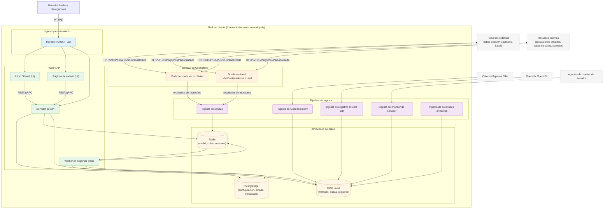

# Arquitectura auto-alojada de OneUptime

Este diagrama muestra el aspecto típico de OneUptime cuando se auto-aloja en tu entorno (por ejemplo, en tu clúster Kubernetes), incluyendo cómo las sondas monitorean tanto los recursos internos como los externos.

## Qué muestra esto
- Los usuarios finales acceden a OneUptime a través del Ingreso de tu clúster (NGINX), que enruta a la UI y la API.
- Los servicios principales leen/escriben el estado en PostgreSQL, Redis y ClickHouse.
- Las sondas pueden ejecutarse dentro de tu clúster (recomendado) y/o en otro lugar de tu red. Pueden monitorear:
  - Servicios internos/privados detrás de tu firewall.
  - Recursos externos/públicos en internet.
- Los resultados de las sondas se envían a la Ingesta de sondas dentro de tu clúster, se ponen en cola a través de Redis y son procesados por el Worker en segundo plano en tus almacenes de datos.
- Los datos de telemetría (métricas/trazas/registros) y los datos de servidor/agente pueden ingerirse a través de servicios de ingesta dedicados y almacenarse en ClickHouse.

> Nota: Si usas PostgreSQL, Redis o ClickHouse externos en lugar de los integrados, las conexiones desde la API/Worker/Ingesta apuntan a tus puntos de conexión externos. El flujo lógico sigue siendo el mismo.
