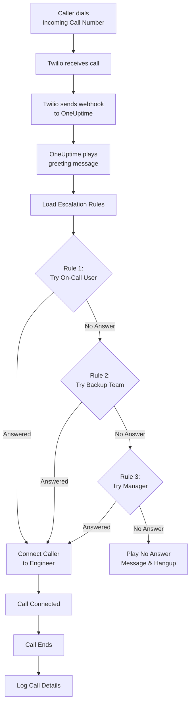
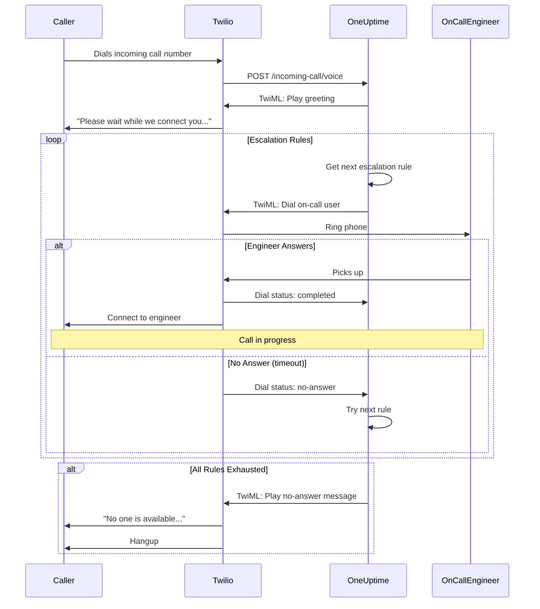
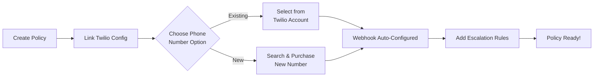
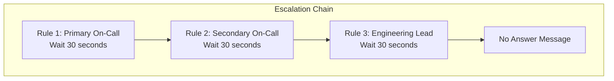
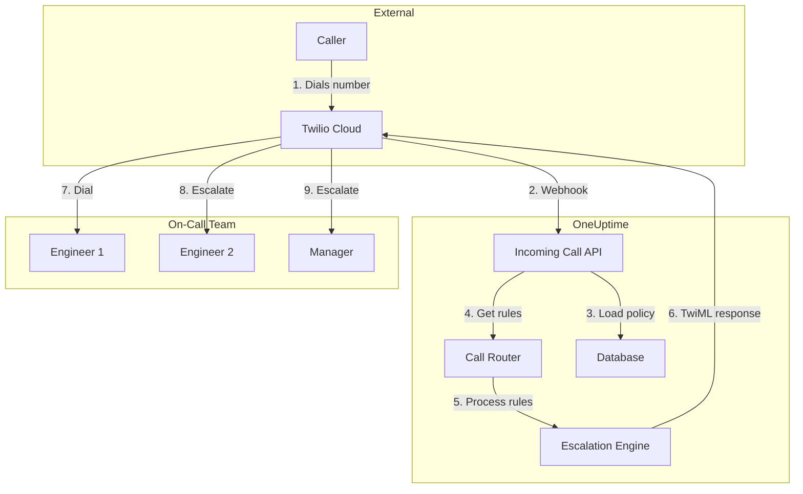

# سیاست تماس ورودی (یکپارچه‌سازی Twilio)

سیاست‌های تماس ورودی به تماس‌گیرندگان بیرونی امکان می‌دهند با شماره‌گیری یک شماره تلفن اختصاصی به مهندسان کشیک شما برسند. وقتی کسی تماس می‌گیرد، OneUptime تماس را از راه قواعد تشدید پیکربندی‌شده شما مسیردهی می‌کند تا مهندسی پاسخ دهد.

## چگونه کار می‌کند

## جریان مسیردهی تماس

## پیش‌نیازها

- حسابی در Twilio — در [https://www.twilio.com](https://www.twilio.com) بسازیدش
- ‏Account SID و Auth Token در Twilio
- دسترسی به نمونه خودمیزبان OneUptime شما

## نمای کلی

قابلیت سیاست تماس ورودی این‌گونه کار می‌کند:

1. دریافت تماس‌های ورودی روی شماره تلفنی از Twilio
2. پخش پیام خوش‌آمدگویی قابل سفارشی‌سازی
3. مسیردهی تماس از راه قواعد تشدید (تیم‌ها، زمان‌بندی‌ها یا کاربران)
4. وصل کردن تماس‌گیرنده به نخستین مهندس کشیک در دسترس
5. تشدید به قاعده بعدی اگر کسی پاسخ ندهد

چون OneUptime را خودمیزبان می‌کنید، باید حساب Twilio خودتان را پیکربندی کنید. این کنترل کامل بر شماره‌های تلفن و صورت‌حسابتان به شما می‌دهد.

## گام ۱: ساخت یک حساب Twilio

1. به [https://www.twilio.com](https://www.twilio.com) بروید و حسابی بسازید
2. فرایند تأیید را کامل کنید
3. **Account SID** و **Auth Token** خود را از داشبورد کنسول Twilio یادداشت کنید

## گام ۲: پیکربندی Call/SMS Config در OneUptime

1. به داشبورد OneUptime خود وارد شوید
2. به **Project Settings** > **Notifications** > **Notification Settings** بروید
3. روی **Create Custom Call/SMS Config** کلیک کنید
4. فیلدهای زیر را پر کنید:
   - **Name**: نامی دوستانه (برای نمونه «Production Twilio Config»)
   - **Description**: توضیح اختیاری
   - **Twilio Account SID**: مقدار Account SID شما در Twilio (با `AC` آغاز می‌شود)
   - **Twilio Auth Token**: مقدار Auth Token شما در Twilio
   - **Twilio Primary Phone Number**: شماره تلفنی از حساب Twilio شما برای تماس‌های خروجی
5. روی **Save** کلیک کنید

## گام ۳: ساخت یک سیاست تماس ورودی

1. به **On-Call Duty** > **Incoming Call Policies** بروید
2. روی **Create Incoming Call Policy** کلیک کنید
3. فیلدهای زیر را پر کنید:
   - **Name**: نامی دوستانه (برای نمونه «Support Hotline»)
   - **Description**: توضیح اختیاری
4. روی **Save** کلیک کنید

## گام ۴: پیوند دادن پیکربندی Twilio به سیاست

1. سیاست تماس ورودی تازه‌ساخته‌تان را باز کنید
2. در کارت **Phone Number Routing**، بخش **Step 2: Link Twilio Configuration** را بیابید
3. روی **Select Twilio Config** کلیک کنید و پیکربندی‌ای را که در گام ۲ ساختید برگزینید
4. انتخاب را ذخیره کنید

## گام ۵: پیکربندی یک شماره تلفن

برای برپا کردن شماره تلفن دو گزینه دارید:

### گزینه الف: استفاده از شماره تلفن موجود در Twilio

اگر از پیش در حساب Twilio خود شماره تلفن دارید:

1. در کارت **Phone Number** روی **Use Existing Number** کلیک کنید
2. ‏OneUptime همه شماره‌های تلفن حساب Twilio شما را می‌گیرد
3. شماره تلفنی را که می‌خواهید به کار ببرید برگزینید
4. برای تخصیصش به سیاست روی **Use This** کلیک کنید

> **توجه**: اگر شماره تلفن از پیش وب‌هوکی پیکربندی‌شده داشته باشد، به‌روزرسانی می‌شود تا به OneUptime اشاره کند.

### گزینه ب: خرید یک شماره تلفن جدید

برای خرید شماره تلفنی تازه مستقیم از OneUptime:

1. در کارت **Phone Number** روی **Buy New Number** کلیک کنید
2. از فهرست کشویی یک **Country** برگزینید
3. اختیاراً یک **Area Code** وارد کنید (برای نمونه ۴۱۵ برای سان‌فرانسیسکو)
4. اختیاراً رقم‌هایی که شماره باید **Contain** کند وارد کنید (برای نمونه ۵۵۵)
5. برای یافتن شماره‌های در دسترس روی **Search** کلیک کنید
6. از نتایج شماره تلفنی برگزینید
7. برای خرید شماره روی **Purchase** کلیک کنید

شماره تلفن از حساب Twilio شما خریده می‌شود و وب‌هوک **به‌طور خودکار پیکربندی می‌شود** — به راه‌اندازی دستی نیازی نیست!

## گام ۶: پیکربندی قواعد تشدید

قواعد تشدید تعیین می‌کنند تماس‌ها چگونه مسیردهی شوند:

1. سیاست تماس ورودی خود را باز کنید
2. به زبانه **Escalation Rules** بروید
3. روی **Add Escalation Rule** کلیک کنید
4. قاعده را پیکربندی کنید:
   - **Order**: ترتیب اولویت (شماره‌های کوچک‌تر زودتر آزموده می‌شوند)
   - **Escalate After (seconds)**: چقدر پیش از تشدید منتظر بماند
   - **On-Call Schedule**: زمان‌بندی‌ای برگزینید تا به هر کسی که کشیک است مسیردهی شود
   - **Teams**: تیم‌های مشخصی برگزینید
   - **Users**: کاربران مشخصی برگزینید
5. به‌فراخور قواعد تشدید بیشتری اضافه کنید

### نمونه قاعده تشدید

| ترتیب | تشدید پس از | هدف |
| ----- | -------------- | -------------------------- |
| ۱ | ۳۰ ثانیه | زمان‌بندی کشیک اصلی |
| ۲ | ۳۰ ثانیه | زمان‌بندی کشیک ثانویه |
| ۳ | ۳۰ ثانیه | سرپرست تیم مهندسی |

## گام ۷: پیکربندی پیام‌های صوتی (اختیاری)

پیام‌هایی را که تماس‌گیرندگان می‌شنوند سفارشی کنید:

1. سیاست تماس ورودی خود را باز کنید
2. به **Settings** بروید
3. پیکربندی کنید:
   - **Greeting Message**: هنگام پاسخ داده شدن تماس پخش می‌شود
   - **No Answer Message**: وقتی همه قواعد تشدید شکست بخورند پخش می‌شود
   - **No One Available Message**: وقتی کسی کشیک نباشد پخش می‌شود

## گزینه‌های پیکربندی

### تنظیمات سیاست

| تنظیم | توضیح | پیش‌فرض |
| ------------------------------- | ---------------------------------------- | -------------------------------------------------------------- |
| Greeting Message | پیام TTS که هنگام پاسخ داده شدن تماس پخش می‌شود | "Please wait while we connect you to the on-call engineer." |
| No Answer Message | پیام وقتی همه قواعد تشدید شکست بخورند | "No one is available. Please try again later." |
| No One Available Message | پیام وقتی کسی کشیک نباشد | "We're sorry, but no on-call engineer is currently available." |
| Repeat Policy If No One Answers | اگر همه شکست خوردند از قاعده نخست دوباره آغاز کن | غیرفعال |
| Repeat Policy Times | بیشینه تلاش‌های تکرار | ۱ |

### تنظیمات قاعده تشدید

| تنظیم | توضیح |
| ---------------------- | ------------------------------------------------ |
| Order | ترتیب اولویت (۱ = بالاترین اولویت) |
| Escalate After Seconds | زمان انتظار پیش از آزمودن قاعده بعدی (پیش‌فرض: ۳۰ ثانیه) |
| On-Call Schedule | مسیردهی به هر کسی که هم‌اکنون کشیک است |
| Teams | مسیردهی به همه اعضای تیم‌های برگزیده |
| Users | مسیردهی به کاربران مشخص |

## دیدن گزارش‌های تماس

برای دیدن تاریخچه تماس‌های ورودی:

1. به **On-Call Duty** > **Incoming Call Policies** بروید
2. روی سیاستتان کلیک کنید
3. به زبانه **Call Logs** بروید

گزارش‌ها این‌ها را نشان می‌دهند:

- شماره تلفن تماس‌گیرنده
- وضعیت تماس (Completed، No Answer، Failed و غیره)
- چه کسی به تماس پاسخ داد
- مدت تماس
- مهر زمانی

## پیکربندی شماره تلفن کاربر

برای اینکه کاربران تماس ورودی بگیرند، باید شماره تلفنی تأییدشده داشته باشند:

1. کاربران به **User Settings** > **Notification Methods** می‌روند
2. زیر **Incoming Call Numbers** شماره تلفنی می‌افزایند
3. شماره تلفن را با کد پیامکی تأیید می‌کنند

فقط کاربران با شماره تلفن تأییدشده می‌توانند از راه قواعد تشدید فراخوانده شوند.

## آزاد کردن یک شماره تلفن

اگر دیگر به شماره تلفنی نیاز ندارید:

1. سیاست تماس ورودی خود را باز کنید
2. در کارت **Phone Number** روی **Release Number** کلیک کنید
3. آزادسازی را تأیید کنید

> **هشدار**: شماره‌های آزادشده به Twilio بازمی‌گردند و ممکن است برای خرید دوباره در دسترس نباشند.

## رفع اشکال

### تماس‌ها دریافت نمی‌شوند

- تأیید کنید پیکربندی Twilio درست به سیاست پیوند خورده است
- بررسی کنید نمونه OneUptime شما از اینترنت دست‌یافتنی باشد
- درست بودن Account SID و Auth Token در Twilio را تأیید کنید
- کنسول Twilio را برای گزارش‌های خطا بررسی کنید

### تماس‌ها به مهندسان وصل نمی‌شوند

- تأیید کنید کاربران در تنظیمات اعلانشان شماره تلفن تأییدشده دارند
- بررسی کنید قواعد تشدید درست پیکربندی شده باشند
- مطمئن شوید زمان‌بندی‌های کشیک برای زمان جاری کاربری تخصیص‌یافته دارند
- تأیید کنید سیاست فعال باشد

### مشکل‌های کیفیت صدا

- مطمئن شوید کارساز شما اتصال اینترنتی پایداری دارد
- صفحه وضعیت Twilio را برای مشکل‌های جاری بررسی کنید
- تأیید کنید شماره‌های تلفن در قالب درست باشند (قالب E.164: ‏+15551234567)

## ملاحظات امنیتی

- ‏Auth Token خود در Twilio را امن نگه دارید و هرگز عمومی افشایش نکنید
- برای نمونه OneUptime خود از HTTPS استفاده کنید
- ‏OneUptime امضای وب‌هوک‌ها را تأیید می‌کند تا مطمئن شود درخواست‌ها از Twilio می‌آیند
- در نظر بگیرید محدود کنید چه شماره‌های تلفنی می‌توانند به سیاست‌های تماس ورودی شما تماس بگیرند

## نمای کلی معماری

## پشتیبانی

برای مشکل‌های مربوط به قابلیت سیاست تماس ورودی، لطفاً:

1. کنسول Twilio را برای گزارش‌های خطا بررسی کنید
2. گزارش‌های کارساز OneUptime را مرور کنید
3. با پشتیبانی در [hello@oneuptime.com](mailto:hello@oneuptime.com) تماس بگیرید
