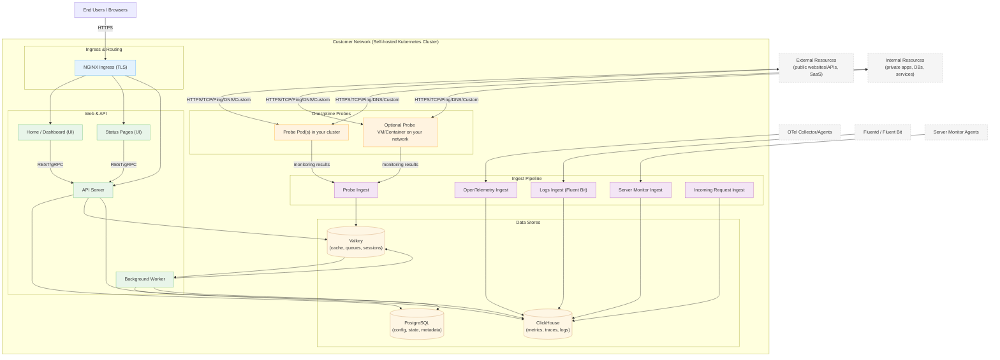

# معماری خودمیزبان OneUptime

این نمودار نشان می‌دهد وقتی OneUptime در محیط شما خودمیزبانی می‌شود (برای نمونه در خوشه Kubernetes شما) معمولاً چه شکلی دارد، از جمله اینکه پراب‌ها چگونه منابع داخلی و بیرونی را پایش می‌کنند.

## این نمودار چه چیزی را نشان می‌دهد

- کاربران نهایی از طریق Ingress خوشه شما (NGINX) به OneUptime دسترسی پیدا می‌کنند، که آن‌ها را به رابط کاربری و API مسیریابی می‌کند.
- سرویس‌های اصلی وضعیت را در PostgreSQL، Valkey (فورک با مجوز BSD از Redis 7.2) و ClickHouse می‌خوانند و می‌نویسند.
- پراب‌ها می‌توانند درون خوشه شما (توصیه‌شده) و/یا جای دیگری در شبکه شما اجرا شوند. آن‌ها می‌توانند این‌ها را پایش کنند:
  - سرویس‌های داخلی/خصوصی پشت دیوار آتش شما.
  - منابع بیرونی/عمومی روی اینترنت.
- نتایج پراب به Probe Ingest درون خوشه شما فرستاده می‌شود، از طریق Valkey در صف قرار می‌گیرد و توسط Background Worker پردازش و در پایگاه‌های داده شما ذخیره می‌شود.
- تله‌متری (متریک/ترِیس/لاگ) و داده سرور/عامل می‌تواند از طریق سرویس‌های اختصاصی دریافت وارد شود و در ClickHouse ذخیره گردد.

> توجه: اگر به‌جای نمونه‌های داخلی از PostgreSQL، Redis یا ClickHouse بیرونی استفاده می‌کنید، اتصال‌های API/Worker/Ingest به نقاط پایانی بیرونی شما اشاره می‌کنند. جریان منطقی همان می‌ماند.
