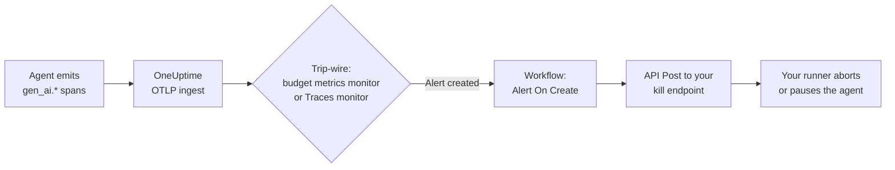

# قطع مدار عامل‌های لگام‌گسیخته هوش مصنوعی

عامل‌های هوش مصنوعی به‌ندرت با فروریختن شکست می‌خورند. با _ادامه دادن_ شکست می‌خورند — تلاش دوباره ابزاری خراب در حلقه، برنامه‌ریزی بی‌پایان همان گام، یا پخش کردن زیرعامل‌ها — در حالی که هر تکراری توکن بیشتری صورت‌حساب می‌کند. این راهنما نشان می‌دهد چگونه با قطعه‌هایی که OneUptime از پیش به شما می‌دهد یک **قطع‌کننده مدار ناهمگام** بسازید:

1. یک **سیگنال سیم‌تله** — [مانیتور سنجه‌ای](/docs/monitor/metrics-monitor) روی سنجه‌های [بودجه هزینه LLM](/docs/telemetry/ai-llm-observability)، یا [مانیتور ردیابی‌ای](/docs/monitor/traces-monitor) که رفتار حلقه‌ای را در اسپن‌های `gen_ai.*` شما می‌شناسد.
2. یک **گردش کاری** که آن هشدار راهش می‌اندازد.
3. یک **وب‌هوک خروجی** از گردش کاری به نقطه پایانی کشتنی که *شما* مالکش هستید، که اجراکننده لگام‌گسیخته را متوقف می‌کند.



## چرا ناهمگام به‌جای دروازه‌ای درون‌خطی؟

نگهبان‌های درون‌خطی پراکسی‌ای در مسیر درخواست می‌گذارند: هر فراخوان LLM از دروازه‌ای می‌گذرد که می‌تواند درخواست N+1 را وتو کند. آن کار می‌کند، اما شما را به یک دروازه گره می‌زند، به هر فراخوانی تأخیر می‌افزاید، و به نقطه شکست منفردی برای همه ترافیک هوش مصنوعی تبدیل می‌شود.

قطع‌کننده مدار اینجا **مستقل از دروازه** است. ردیابی‌های OpenTelemetryای را که برنامه شما از پیش می‌فرستد می‌پاید (مستقیم، یا [از راه دروازه‌ای](/docs/telemetry/ai-gateways) — هر دو کار می‌کنند) و بیرون از باند واکنش نشان می‌دهد. چیزی در مسیر داغ شما نمی‌نشیند، و عوض کردن ارائه‌دهنده، SDK یا دروازه نمی‌شکندش. معامله‌اش صداقت درباره تأخیر است: این **پشتوانه‌ای است که لگام‌گسیخته را در چند دقیقه متوقف می‌کند، نه چند میلی‌ثانیه**. محدودیت گام و مهلت به ازای هر اجرا را در کد عاملتان به‌عنوان خط دفاع نخست نگه دارید؛ از این برای گرفتن آنچه در می‌رود استفاده کنید.

## پیش‌نیازها

- عامل شما اسپن‌های GenAI را به OneUptime منتشر می‌کند — [رصدپذیری هوش مصنوعی/LLM](/docs/telemetry/ai-llm-observability) یا [پاییدن دروازه‌های هوش مصنوعی](/docs/telemetry/ai-gateways) را ببینید.
- نقطه پایانی HTTPای در زیرساخت شما که می‌تواند اجراکننده عاملتان را متوقف یا مکث کند (در گام ۲ ساخته می‌شود).

## گام ۱ — برگزیدن سیگنال سیم‌تله

هر دو گزینه یکسان پایان می‌یابند: **هشداری** در OneUptime ساخته می‌شود، که همان چیزی است که گردش کاری را راه می‌اندازد. می‌توانید هر دو را با هم سیم‌کشی کنید — گردش کاری اهمیتی نمی‌دهد کدام شلیک کرده است.

### گزینه الف: مانیتور سنجه روی سنجه‌های بودجه

قابل اتکاترین نشانه عامل لگام‌گسیخته، خرج است. زبانه **AI / LLM → Budgets** به شما امکان می‌دهد سقفی روزانه بر حسب دلار بگذارید؛ هر ۱۵ دقیقه کارگری هزینه اسپن LLM آن روز را جمع می‌زند — گزارش‌شده توسط SDK یا [محاسبه‌شده هنگام دریافت](/docs/telemetry/ai-llm-observability)، پس حتی اگر ابزارگذاری شما هزینه گزارش نکند کار می‌کند — و آن را به‌صورت دو سنجه گیج منتشر می‌کند:

- `oneuptime.llm.budget.spend.usd` — خرج آن روز بر حسب دلار
- `oneuptime.llm.budget.percent.used` — خرج به‌صورت درصدی از سقف روزانه

روی `oneuptime.llm.budget.percent.used` یک [مانیتور سنجه](/docs/monitor/metrics-monitor) بسازید:

- **پالایه ویژگی**: `oneuptime.llm.budget.id` = شناسه بودجه شما (که در سطر بودجه از راه **View ID** نشان داده می‌شود). شناسه را به کار ببرید، نه نام را — تغییر نام بودجه سری را دوباره برچسب می‌زند و مانیتوری را که بر نام پالوده باشد خاموش جدا می‌کرد.
- **زمان غلتان**: **۳۰ دقیقه**. هر بودجه‌ای هر ۱۵ دقیقه یک نقطه منتشر می‌کند؛ پنجره پیش‌فرض ۱ دقیقه‌ای میان جاروها سری خالی می‌یافت و هشدار را می‌لرزاند — که برای قطع‌کننده یعنی به‌جای یک بار در هر رخداد، یک بار در هر جارو قطع شود.
- **معیار ۱**: مقدار **Greater Than or Equal To** برابر `80` → هشداری با شدت warning بساز.
- **معیار ۲**: مقدار **Greater Than or Equal To** برابر `100` → هشداری بحرانی بساز — همین است که قطع‌کننده را می‌زند.

برای قطع مدار، چیزها را طوری محدود کنید که هشدار مشخص کند _چه چیزی را بکشد_:

- به ازای **سرویس تله‌متری هر عامل** (برای نمونه `agent-support-bot`) یک بودجه بسازید، نه فقط یکی در سطح پروژه، و به ازای هر بودجه یک مانیتور (یا یک مانیتور که بر پایه ویژگی `oneuptime.llm.budget.id` گروه‌بندی شده باشد).
- نام اجراکننده را در **عنوان هشدار** معیار بگذارید (برای نمونه `LLM budget exceeded: agent-support-bot`) — نقطه پایانی کشتن شما بر پایه‌اش مسیردهی می‌کند.

الگویی خوب این است: ۸۰٪ → انسانی را فرا بخوان (از راه سیاست کشیک هشدار)، ۱۰۰٪ → قطع‌کننده را بزن.

### گزینه ب: مانیتور ردیابی روی رفتار حلقه‌ای

هزینه سوختن‌های کند را می‌گیرد؛ [مانیتور ردیابی](/docs/monitor/traces-monitor) حلقه‌ها را سریع‌تر می‌گیرد. عاملی گیرکرده شکل ردیابی بسیار قابل تشخیصی تولید می‌کند: **همان اسپن فراخوان ابزار، بارها و بارها**. اجراهای سالم یک ابزار را در چند دقیقه ده‌ها بار فرا نمی‌خوانند.

با **Monitors → Create Monitor → Traces** مانیتوری بسازید:

- **سرویس تله‌متری**: سرویس عامل شما.
- **ویژگی‌ها**: `gen_ai.tool.name` = ابزاری که انتظار حلقه رویش دارید (برای نمونه `search_web`) — یا اگر ابزارگذاری شما اسپن‌های ابزار را مستقیم نام می‌گذارد از **Span Name** استفاده کنید.
- **پنجره زمانی**: ۱۲۰ ثانیه.
- **معیار**: Span Count **Greater Than** آستانه‌ای که هیچ اجرای سالمی به آن نمی‌رسد (مثلاً `30`)، و بگذارید معیار با شدتی مناسب **هشداری بسازد**.
- **فاصله مانیتورینگ**: هر دقیقه، تا تأخیر تشخیص حدود یک تا سه دقیقه بماند.

دو گونه که دانستنشان می‌ارزد:

- معیار دومی که بر **Span Statuses = ERROR** با آستانه‌ای پایین‌تر بپالاید، طوفان تلاش دوباره را می‌گیرد (ابزار مدام شکست می‌خورد، عامل مدام تلاش می‌کند).
- یک [مانیتور سنجه](/docs/monitor/metrics-monitor) روی `gen_ai.client.token.usage` نسخه نرخ-توکنی همان ایده را به شما می‌دهد.

### تأخیر تشخیص، صادقانه گفته‌شده

| سیگنال | زمان معمول تا هشدار |
| ---------------------------------------------- | --------------------------------------------------- |
| مانیتور ردیابی، فاصله ۱ دقیقه، پنجره ۱۲۰ ثانیه | حدود ۱ تا ۳ دقیقه |
| مانیتور سنجه بودجه | تا حدود ۱۵ دقیقه (آهنگ کارگر) + فاصله مانیتور |

## گام ۲ — ساختن نقطه پایانی کشتن (سمت شما)

گردش کاری محموله‌ای JSON را به نقطه پایانی‌ای که میزبانی‌اش می‌کنید `POST` می‌کند. اینکه «کشتن» چه معنایی دارد با شماست — گزینه‌های رایج شعاع انفجار، از کوچک‌ترین:

1. **متوقف کردن کار تازه**: پرچمی بزنید تا اجراکننده هیچ اجرای عامل تازه‌ای برندارد.
2. **لغو اجراهای مطابق**: اجراهای در جریان عامل/سرویس متأثر را لغو کنید.
3. **مکث کل استخر**: هر کارگری را تخلیه کنید تا انسانی قطع‌کننده را بازنشانی کند.

نمونه‌ای کمینه از Express که قطع‌کننده‌ای به ازای هر اجراکننده را می‌زند:

```ts
import express from "express";

const app = express();
app.use(express.json());

const tripped = new Set<string>(); // runner names with an open breaker

app.post("/circuit-breaker", (req, res) => {
  if (req.headers["authorization"] !== `Bearer ${process.env.KILL_TOKEN}`) {
    return res.status(401).end();
  }

  const alertTitle: string = req.body.alertTitle ?? "";

  // Your monitor criteria's alert titles map to runners, e.g.
  // "LLM budget exceeded: agent-support-bot" -> "agent-support-bot"
  const runner: string = alertTitle.split(": ").pop() ?? "unknown";

  tripped.add(runner); // your run loop checks this set
  abortActiveRuns(runner); // cancel in-flight jobs for that runner

  // Acknowledge fast — do the heavy cleanup async.
  return res.status(200).json({ tripped: runner });
});
```

یادداشت‌های طراحی:

- **خودتوانش کنید.** قطع‌کننده ممکن است بیش از یک بار زده شود (هشدار سپس نقض، یا شلیک هم‌زمان مانیتور بودجه و مانیتور ردیابی). زدن قطع‌کننده‌ای که از پیش زده شده باید بی‌ضرر باشد.
- **سریع تصدیق کنید** و پاک‌سازی کند را در پس‌زمینه انجام دهید؛ مؤلفه API گردش کاری هر ۲xx را موفقیت می‌داند.
- **رازی بخواهید.** هر کسی که بتواند این نقطه پایانی را فرا بخواند می‌تواند عامل‌هایتان را متوقف کند. توکنی bearer بررسی کنید (که در سمت فرستنده به‌عنوان [متغیر سراسری](/docs/workflows/variables) محرمانه OneUptime ذخیره شده است).
- **بازنشانی انسانی.** قطع‌کننده زده‌شده باید زده بماند تا کسی به اجرا نگاه کند — بازنشانی خودکار هدف را نقض می‌کند. با **AI / LLM → LLM Calls** و پالایش بر پایه شناسه گفت‌وگو/نشست بررسی کنید تا دقیقاً ببینید عامل چه می‌کرده است.

## گام ۳ — گردش کاری

در پیمایش سمت چپ **Workflows** را باز کنید، روی **Create Workflow** کلیک کنید، و این بلوک‌ها را روی بوم بسازید. برای مبانی بوم [نوشتن یک گردش کاری](/docs/workflows/authoring) را ببینید.

### ۱. تریگر: Alert → On Create

تریگر **On Create Alert** را بیفزایید ([تریگرهای رویداد OneUptime](/docs/workflows/triggers)). هر هشدار تازه‌ای در پروژه گردش کاری را آغاز می‌کند و رکورد کامل هشدار را به‌عنوان `model` عبور می‌دهد. به تریگر شناسه‌ای پایدار بدهید — نمونه‌های زیر `alert-on-create-1` را فرض می‌گیرند.

### ۲. پالایه: If / Else روی عنوان هشدار

فقط می‌خواهید قطع‌کننده با هشدارهای سیم‌تله شما زده شود، نه با هر هشداری در پروژه. بلوکی از نوع **If / Else** (دسته Conditions) بیفزایید:

- **Left**: مقدار `model.title` تریگر — که با انتخابگر درج می‌شود و می‌خواند `{{local.components.alert-on-create-1.returnValues.model.title}}`
- **Operator**: `contains`
- **Right**: عنوان هشداری که در معیار مانیتور بودجه گذاشته‌اید، برای نمونه `LLM budget exceeded` (گزینه الف) — یا عنوان هشدار مانیتور ردیابی شما (گزینه ب)

برای واکنش به چند سیم‌تله، بلوک‌های If / Else را از شاخه **No** زنجیر کنید، یا عنوان‌های هشدارتان را استاندارد کنید تا یک تطبیق `contains` همه‌شان را پوشش دهد.

### ۳. کنش: API Post به نقطه پایانی کشتن شما

از شاخه **Yes**، مؤلفه‌ای از نوع **API Post (JSON)** بیفزایید ([مؤلفه‌ها](/docs/workflows/components)):

- **URL**: `https://your-infra.example.com/circuit-breaker`
- **Request Headers**:

```json
{
  "Authorization": "Bearer {{global.variables.AGENT_KILL_TOKEN}}",
  "Content-Type": "application/json"
}
```

- **Request Body**:

```json
{
  "source": "oneuptime-circuit-breaker",
  "alertId": "{{local.components.alert-on-create-1.returnValues.model._id}}",
  "alertTitle": "{{local.components.alert-on-create-1.returnValues.model.title}}",
  "alertDescription": "{{local.components.alert-on-create-1.returnValues.model.description}}"
}
```

توکن را به‌عنوان **متغیر سراسری محرمانه** (`AGENT_KILL_TOKEN`) زیر **Workflows → Global Variables** ذخیره کنید تا بیرون از گزارش‌های اجرا بماند. مؤلفه ساده‌تر **Webhook** خروجی هم برای ارسال‌های شلیک‌کن-و-فراموش کار می‌کند، اما مؤلفه API به شما امکان می‌دهد هدر احراز هویت بگذارید و بر پاسخ شاخه بزنید — اینجا از آن استفاده کنید.

### ۴. خاموش شکست نخورید

درگاه **Error** بلوک API را به بلوکی از نوع **Slack** (یا ایمیل) وصل کنید: قطع‌کننده مداری که در زدن شکست بخورد دقیقاً همان هشداری است که می‌خواهید انسانی ببیندش. اختیاراً **Success** را هم به پیامی در Slack وصل کنید — «قطع‌کننده برای `<runner>` زده شد» پیامی است که کشیک شما قدرش را می‌داند.

## گام ۴ — بیازماییدش

1. **گردش کاری را خشک اجرا کنید**: هشدارها را می‌توان دستی ساخت (**Alerts → Create Alert**). یکی با عنوان `LLM budget exceeded: test` بسازید، سپس زیر **Workflows → Runs & Logs** بررسی کنید گردش کاری شلیک کرده باشد، و اینکه نقطه پایانی شما ارسال را گرفته باشد.
2. **سیگنال واقعی را بیازمایید**: بودجه‌ای محدود با سقفی ناچیز (برای نمونه ۰٫۰۱ دلار) روی سرویسی توسعه‌ای بسازید، مانیتورتان را به سری `oneuptime.llm.budget.percent.used` آن نشانه بگیرید، و بگذارید عاملتان اجرا شود — باید ببینید سنجه از ۱۰۰ می‌گذرد، هشدار، اجرای گردش کاری، و زده شدن قطع‌کننده به‌صورت سرتاسری. برای گزینه ب، عاملی آزمایشی را به ابزاری ساختگی و شکست‌خورده نشانه بگیرید و تماشا کنید حلقه مانیتور ردیابی را می‌زند.
3. **خودتوانی را تأیید کنید** با شلیک دوباره هشدار.

## هشدارهای چرخه زندگی هشدار

- سنجه‌های بودجه در **نیمه‌شب UTC** بازنشانی می‌شوند (روزی تازه با ۰٪ مصرف آغاز می‌شود)، پس هشدار مانیتور بودجه طبیعتاً شبانه برطرف می‌شود و می‌تواند روز بد بعدی دوباره شلیک کند. گردش کاری روی **ساخت** هشدار راه می‌افتد، پس به ازای هر رخداد یک بار قطع می‌کنید، نه به ازای هر ارزیابی. بازنشانی در هر دو سو تصمیمی انسانی است: هشدار را در OneUptime برطرف کنید *و* قطع‌کننده‌تان را بازنشانی کنید.
- مانیتور ردیابی تا وقتی معیارها برقرارند هشدارش را باز نگه می‌دارد؛ همان معناشناسی راه‌اندازی-با-ساخت اعمال می‌شود.
- تریگر گردش کاری برای **هر** هشدار تازه‌ای در پروژه شلیک می‌کند — پالایه If / Else همان چیزی است که نمی‌گذارد هشدارهای نامرتبط قطع‌کننده را بزنند. ردش نکنید.

## در ادامه چه بخوانیم

- [رصدپذیری هوش مصنوعی/LLM](/docs/telemetry/ai-llm-observability) — اسپن‌های GenAI، محاسبه هزینه، و بودجه‌های روزانه.
- [پاییدن دروازه‌های هوش مصنوعی](/docs/telemetry/ai-gateways) — گرفتن ردیابی‌های سطح دروازه با یک تغییر پیکربندی.
- [مانیتور ردیابی](/docs/monitor/traces-monitor) — پالایه‌های اسپن و معیارها با جزئیات.
- [گردش‌های کاری](/docs/workflows/index) — تریگرها، مؤلفه‌ها، متغیرها، اجراها.
