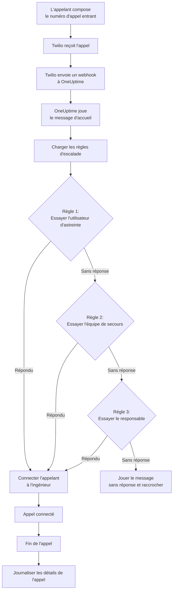
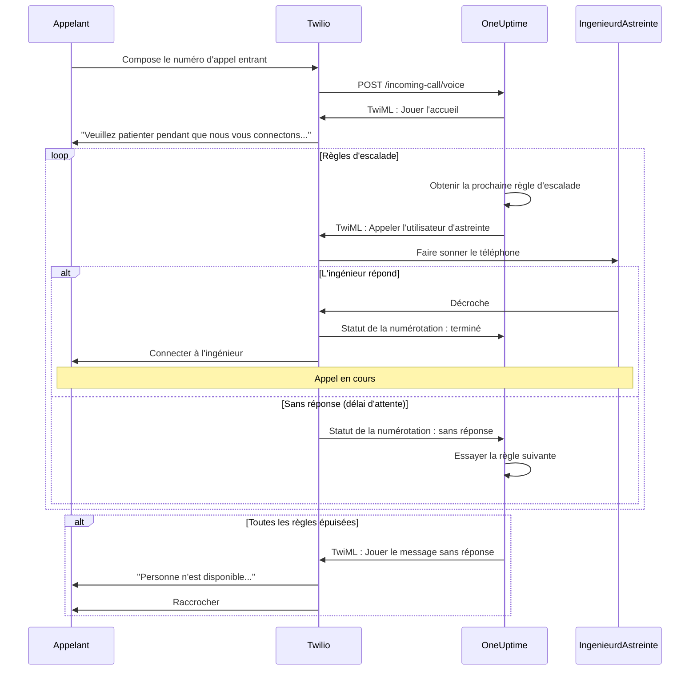
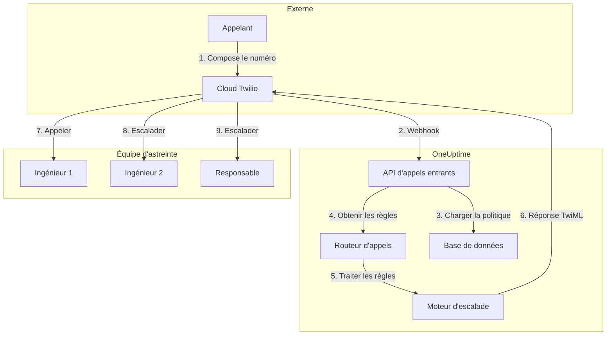

# Politique d'appels entrants (intégration Twilio)

Les politiques d'appels entrants permettent aux appelants externes de joindre vos ingénieurs d'astreinte en composant un numéro de téléphone dédié. Lorsque quelqu'un appelle, OneUptime achemine l'appel via vos règles d'escalade configurées jusqu'à ce qu'un ingénieur réponde.

## Fonctionnement

## Flux d'acheminement des appels

## Prérequis

- Un compte Twilio — Créez-en un sur [https://www.twilio.com](https://www.twilio.com)
- Votre SID de compte Twilio et votre jeton d'authentification
- Accès à votre instance auto-hébergée OneUptime

## Vue d'ensemble

La fonctionnalité de politique d'appels entrants fonctionne en :

1. Recevant les appels entrants sur un numéro de téléphone Twilio
2. Jouant un message d'accueil personnalisable
3. Acheminant l'appel via des règles d'escalade (équipes, plannings ou utilisateurs)
4. Connectant l'appelant au premier ingénieur d'astreinte disponible
5. Escaladant à la règle suivante si personne ne répond

Comme vous auto-hébergez OneUptime, vous devrez configurer votre propre compte Twilio. Cela vous donne un contrôle total sur vos numéros de téléphone et votre facturation.

## Étape 1 : Créer un compte Twilio

1. Allez sur [https://www.twilio.com](https://www.twilio.com) et créez un compte
2. Complétez le processus de vérification
3. Notez votre **SID de compte** et votre **jeton d'authentification** depuis le tableau de bord de la console Twilio

## Étape 2 : Configurer la configuration d'appel/SMS dans OneUptime

1. Connectez-vous à votre tableau de bord OneUptime
2. Allez dans **Paramètres du projet** > **Appel & SMS** > **Configuration d'appel/SMS personnalisée**
3. Cliquez sur **Créer une configuration d'appel/SMS personnalisée**
4. Remplissez les champs suivants :
   - **Nom** : Un nom convivial (ex. : « Configuration Twilio de production »)
   - **Description** : Description optionnelle
   - **SID de compte Twilio** : Votre SID de compte Twilio (commence par `AC`)
   - **Jeton d'authentification Twilio** : Votre jeton d'authentification Twilio
   - **Numéro de téléphone principal Twilio** : Un numéro de téléphone de votre compte Twilio pour les appels sortants
5. Cliquez sur **Enregistrer**

## Étape 3 : Créer une politique d'appels entrants

1. Allez dans **Astreinte** > **Politiques d'appels entrants**
2. Cliquez sur **Créer une politique d'appels entrants**
3. Remplissez les champs suivants :
   - **Nom** : Un nom convivial (ex. : « Hotline de support »)
   - **Description** : Description optionnelle
4. Cliquez sur **Enregistrer**

## Étape 4 : Lier la configuration Twilio à la politique

1. Ouvrez votre politique d'appels entrants nouvellement créée
2. Dans la carte **Routage de numéro de téléphone**, trouvez **Étape 2 : Lier la configuration Twilio**
3. Cliquez sur **Sélectionner la configuration Twilio** et choisissez la configuration créée à l'étape 2
4. Enregistrez la sélection

## Étape 5 : Configurer un numéro de téléphone

Vous avez deux options pour configurer un numéro de téléphone :

### Option A : Utiliser un numéro de téléphone Twilio existant

Si vous avez déjà des numéros de téléphone dans votre compte Twilio :

1. Dans la carte **Numéro de téléphone**, cliquez sur **Utiliser un numéro existant**
2. OneUptime récupérera tous les numéros de téléphone de votre compte Twilio
3. Sélectionnez le numéro de téléphone que vous souhaitez utiliser
4. Cliquez sur **Utiliser ce numéro** pour l'assigner à la politique

> **Remarque** : Si le numéro de téléphone a déjà un webhook configuré, il sera mis à jour pour pointer vers OneUptime.

### Option B : Acheter un nouveau numéro de téléphone

Pour acheter un nouveau numéro de téléphone directement depuis OneUptime :

1. Dans la carte **Numéro de téléphone**, cliquez sur **Acheter un nouveau numéro**
2. Sélectionnez un **Pays** dans la liste déroulante
3. Entrez optionnellement un **Code de région** (ex. : 415 pour San Francisco)
4. Entrez optionnellement les chiffres que le numéro doit **Contenir** (ex. : 555)
5. Cliquez sur **Rechercher** pour trouver les numéros disponibles
6. Sélectionnez un numéro de téléphone dans les résultats
7. Cliquez sur **Acheter** pour acquérir le numéro

Le numéro de téléphone sera acheté depuis votre compte Twilio et le webhook sera **automatiquement configuré** — aucune configuration manuelle requise !

## Étape 6 : Configurer les règles d'escalade

Les règles d'escalade déterminent comment les appels sont acheminés :

1. Ouvrez votre politique d'appels entrants
2. Allez dans l'onglet **Règles d'escalade**
3. Cliquez sur **Ajouter une règle d'escalade**
4. Configurez la règle :
   - **Ordre** : L'ordre de priorité (les numéros plus petits sont essayés en premier)
   - **Escalader après (secondes)** : Combien de temps attendre avant d'escalader
   - **Planning d'astreinte** : Sélectionner un planning pour acheminer vers la personne d'astreinte
   - **Équipes** : Sélectionner des équipes spécifiques
   - **Utilisateurs** : Sélectionner des utilisateurs spécifiques
5. Ajoutez des règles d'escalade supplémentaires si nécessaire

### Exemple de règle d'escalade

| Ordre | Escalader après | Cible                              |
| ----- | --------------- | ---------------------------------- |
| 1     | 30 secondes     | Planning d'astreinte principal     |
| 2     | 30 secondes     | Planning d'astreinte secondaire    |
| 3     | 30 secondes     | Responsable de l'équipe ingénierie |

## Étape 7 : Configurer les messages vocaux (optionnel)

Personnalisez les messages entendus par les appelants :

1. Ouvrez votre politique d'appels entrants
2. Allez dans **Paramètres**
3. Configurez :
   - **Message d'accueil** : Joué lorsque l'appel est répondu
   - **Message sans réponse** : Joué lorsque toutes les règles d'escalade échouent
   - **Message aucune personne disponible** : Joué lorsque personne n'est d'astreinte

## Options de configuration

### Paramètres de la politique

| Paramètre                                  | Description                                            | Par défaut                                                                               |
| ------------------------------------------ | ------------------------------------------------------ | ---------------------------------------------------------------------------------------- |
| Message d'accueil                          | Message TTS joué lors de la réponse à l'appel          | « Veuillez patienter pendant que nous vous connectons à l'ingénieur d'astreinte. »       |
| Message sans réponse                       | Message quand toutes les règles d'escalade échouent    | « Personne n'est disponible. Veuillez réessayer plus tard. »                             |
| Message aucune personne disponible         | Message quand personne n'est d'astreinte               | « Nous sommes désolés, mais aucun ingénieur d'astreinte n'est actuellement disponible. » |
| Répéter la politique si personne ne répond | Redémarrer depuis la première règle si toutes échouent | Désactivé                                                                                |
| Nombre de répétitions de la politique      | Nombre maximum de tentatives de répétition             | 1                                                                                        |

### Paramètres des règles d'escalade

| Paramètre                  | Description                                                          |
| -------------------------- | -------------------------------------------------------------------- |
| Ordre                      | Ordre de priorité (1 = priorité la plus élevée)                      |
| Escalader après (secondes) | Temps d'attente avant d'essayer la règle suivante (par défaut : 30s) |
| Planning d'astreinte       | Acheminer vers la personne actuellement d'astreinte                  |
| Équipes                    | Acheminer vers tous les membres des équipes sélectionnées            |
| Utilisateurs               | Acheminer vers des utilisateurs spécifiques                          |

## Consultation des journaux d'appels

Pour consulter l'historique des appels entrants :

1. Allez dans **Astreinte** > **Politiques d'appels entrants**
2. Cliquez sur votre politique
3. Allez dans l'onglet **Journaux d'appels**

Les journaux affichent :

- Numéro de téléphone de l'appelant
- Statut de l'appel (Terminé, Sans réponse, Échoué, etc.)
- Qui a répondu à l'appel
- Durée de l'appel
- Horodatage

## Configuration du numéro de téléphone de l'utilisateur

Pour que les utilisateurs reçoivent des appels entrants, ils doivent avoir un numéro de téléphone vérifié :

1. Les utilisateurs vont dans **Paramètres utilisateur** > **Méthodes de notification**
2. Ajoutent un numéro de téléphone sous **Numéros d'appels entrants**
3. Vérifient le numéro de téléphone via un code SMS

Seuls les utilisateurs avec des numéros de téléphone vérifiés peuvent être appelés via les règles d'escalade.

## Libérer un numéro de téléphone

Si vous n'avez plus besoin d'un numéro de téléphone :

1. Ouvrez votre politique d'appels entrants
2. Dans la carte **Numéro de téléphone**, cliquez sur **Libérer le numéro**
3. Confirmez la libération

> **Avertissement** : Les numéros libérés sont retournés à Twilio et peuvent ne pas être disponibles pour un rachat.

## Dépannage

### Les appels ne sont pas reçus

- Vérifiez que la configuration Twilio est correctement liée à la politique
- Vérifiez que votre instance OneUptime est accessible depuis Internet
- Vérifiez que le SID de compte Twilio et le jeton d'authentification sont corrects
- Consultez la console Twilio pour les journaux d'erreurs

### Les appels ne se connectent pas aux ingénieurs

- Vérifiez que les utilisateurs ont des numéros de téléphone vérifiés dans leurs paramètres de notification
- Vérifiez que les règles d'escalade sont correctement configurées
- Assurez-vous que les plannings d'astreinte ont des utilisateurs assignés pour l'heure actuelle
- Vérifiez que la politique est activée

### Problèmes de qualité audio

- Assurez-vous que votre serveur dispose d'une connectivité Internet stable
- Consultez la page de statut de Twilio pour tout problème en cours
- Vérifiez que les numéros de téléphone sont au bon format (format E.164 : +15551234567)

## Considérations de sécurité

- Gardez votre jeton d'authentification Twilio sécurisé et ne l'exposez jamais publiquement
- Utilisez HTTPS pour votre instance OneUptime
- OneUptime valide les signatures de webhook pour s'assurer que les requêtes proviennent de Twilio
- Envisagez de restreindre les numéros de téléphone pouvant appeler vos politiques d'appels entrants

## Aperçu de l'architecture

## Support

Pour les problèmes avec la fonctionnalité de politique d'appels entrants, veuillez :

1. Consulter la console Twilio pour les journaux d'erreurs
2. Examiner les journaux du serveur OneUptime
3. Contacter le support à [hello@oneuptime.com](mailto:hello@oneuptime.com)
