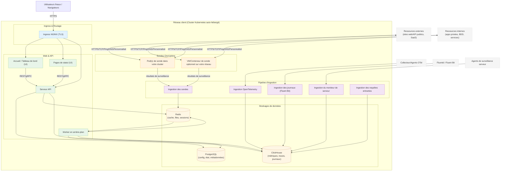

# Architecture auto-hébergée de OneUptime

Ce diagramme montre à quoi ressemble généralement OneUptime lorsqu'il est auto-hébergé dans votre environnement (par exemple, dans votre cluster Kubernetes), y compris comment les sondes surveillent les ressources internes et externes.

## Ce que cela montre
- Les utilisateurs finaux accèdent à OneUptime via l'Ingress de votre cluster (NGINX), qui achemine vers l'UI et l'API.
- Les services core lisent/écrivent l'état dans PostgreSQL, Redis et ClickHouse.
- Les sondes peuvent s'exécuter dans votre cluster (recommandé) et/ou ailleurs sur votre réseau. Elles peuvent surveiller :
  - Les services internes/privés derrière votre pare-feu.
  - Les ressources externes/publiques sur Internet.
- Les résultats des sondes sont envoyés à l'ingestion des sondes dans votre cluster, mis en file d'attente via Redis, et traités par le worker en arrière-plan dans vos stockages de données.
- La télémétrie (métriques/traces/journaux) et les données de serveur/agent peuvent être ingérées via des services d'ingestion dédiés et stockées dans ClickHouse.

> Remarque : Si vous utilisez PostgreSQL, Redis ou ClickHouse externes au lieu des versions intégrées, les connexions depuis API/Worker/Ingest pointent vers vos points d'accès externes. Le flux logique reste le même.
