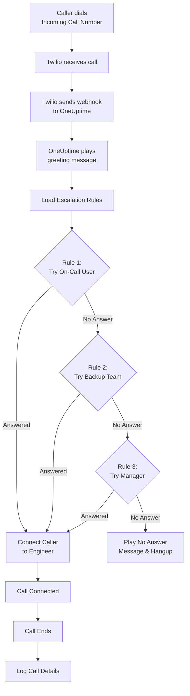
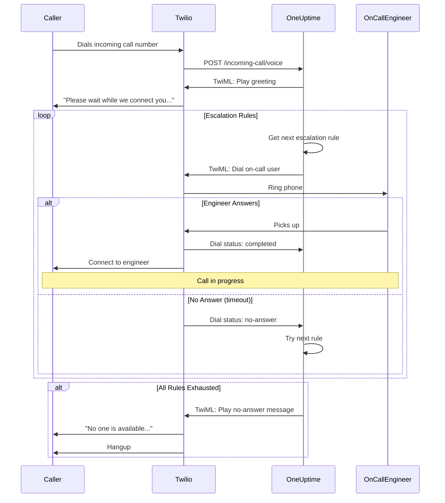

# Incoming Call Policy (Twilio Integration)

Incoming Call Policies बाहरी callers को एक dedicated phone number dial करके आपके on-call engineers तक पहुंचने की अनुमति देती हैं। जब कोई call करता है, OneUptime आपके configured escalation rules के माध्यम से call route करता है जब तक कोई engineer answer नहीं करता।

## यह कैसे काम करता है

## Call Routing Flow

## पूर्व आवश्यकताएं

- एक Twilio account - [https://www.twilio.com](https://www.twilio.com) पर बनाएं
- आपका Twilio Account SID और Auth Token
- आपके OneUptime self-hosted instance तक पहुंच

## Overview

Incoming Call Policy feature इस तरह काम करता है:

1. Twilio phone number पर incoming calls receive करना
2. एक customizable greeting message play करना
3. escalation rules (teams, schedules, या users) के माध्यम से call route करना
4. caller को पहले available on-call engineer से connect करना
5. कोई answer नहीं होने पर अगले rule पर escalate करना

चूंकि आप OneUptime self-host कर रहे हैं, आपको अपना खुद का Twilio account configure करना होगा। यह आपको अपने phone numbers और billing पर पूर्ण नियंत्रण देता है।

## चरण 1: Twilio Account बनाएं

1. [https://www.twilio.com](https://www.twilio.com) पर जाएं और account के लिए sign up करें
2. verification process पूरी करें
3. Twilio Console dashboard से अपना **Account SID** और **Auth Token** नोट करें

## चरण 2: OneUptime में Call/SMS Config Configure करें

1. अपने OneUptime Dashboard में log in करें
2. **Project Settings** > **Call & SMS** > **Custom Call/SMS Config** पर जाएं
3. **Create Custom Call/SMS Config** पर क्लिक करें
4. निम्नलिखित fields भरें:
   - **Name**: एक friendly name (जैसे "Production Twilio Config")
   - **Description**: वैकल्पिक description
   - **Twilio Account SID**: आपका Twilio Account SID (`AC` से शुरू होता है)
   - **Twilio Auth Token**: आपका Twilio Auth Token
   - **Twilio Primary Phone Number**: outbound calls के लिए आपके Twilio account का phone number
5. **Save** पर क्लिक करें

## चरण 3: Incoming Call Policy बनाएं

1. **On-Call Duty** > **Incoming Call Policies** पर जाएं
2. **Create Incoming Call Policy** पर क्लिक करें
3. निम्नलिखित fields भरें:
   - **Name**: एक friendly name (जैसे "Support Hotline")
   - **Description**: वैकल्पिक description
4. **Save** पर क्लिक करें

## चरण 4: Twilio Configuration को Policy से Link करें

1. अपनी नई बनाई Incoming Call Policy खोलें
2. **Phone Number Routing** card में, **Step 2: Link Twilio Configuration** खोजें
3. **Select Twilio Config** पर क्लिक करें और चरण 2 में बनाई configuration चुनें
4. selection save करें

## चरण 5: Phone Number Configure करें

Phone number सेट अप करने के लिए आपके पास दो options हैं:

### Option A: मौजूदा Twilio Phone Number उपयोग करें

यदि आपके Twilio account में पहले से phone numbers हैं:

1. **Phone Number** card में, **Use Existing Number** पर क्लिक करें
2. OneUptime आपके Twilio account से सभी phone numbers fetch करेगा
3. वह phone number चुनें जिसे आप उपयोग करना चाहते हैं
4. इसे policy assign करने के लिए **Use This** पर क्लिक करें

> **नोट**: यदि phone number में पहले से webhook configured है, तो इसे OneUptime की ओर point करने के लिए update किया जाएगा।

### Option B: एक नया Phone Number खरीदें

OneUptime से directly नया phone number खरीदने के लिए:

1. **Phone Number** card में, **Buy New Number** पर क्लिक करें
2. dropdown से एक **Country** चुनें
3. वैकल्पिक रूप से एक **Area Code** दर्ज करें (जैसे San Francisco के लिए 415)
4. वैकल्पिक रूप से वे digits दर्ज करें जो number में **Contain** होने चाहिए (जैसे 555)
5. उपलब्ध numbers खोजने के लिए **Search** पर क्लिक करें
6. results से एक phone number चुनें
7. number खरीदने के लिए **Purchase** पर क्लिक करें

Phone number आपके Twilio account से खरीदा जाएगा और webhook **automatically configured** होगा — कोई manual setup आवश्यक नहीं!

## चरण 6: Escalation Rules Configure करें

Escalation rules यह निर्धारित करते हैं कि calls कैसे route होती हैं:

1. अपनी Incoming Call Policy खोलें
2. **Escalation Rules** tab पर जाएं
3. **Add Escalation Rule** पर क्लिक करें
4. rule configure करें:
   - **Order**: priority order (कम numbers पहले try किए जाते हैं)
   - **Escalate After (seconds)**: escalate करने से पहले कितना इंतज़ार करें
   - **On-Call Schedule**: whoever is on-call पर route करने के लिए schedule चुनें
   - **Teams**: specific teams चुनें
   - **Users**: specific users चुनें
5. आवश्यकतानुसार additional escalation rules जोड़ें

| Order | Escalate After | Target                     |
| ----- | -------------- | -------------------------- |
| 1     | 30 seconds     | Primary On-Call Schedule   |
| 2     | 30 seconds     | Secondary On-Call Schedule |
| 3     | 30 seconds     | Engineering Team Lead      |

## चरण 7: Voice Messages Configure करें (वैकल्पिक)

callers जो messages सुनते हैं उन्हें customize करें:

1. अपनी Incoming Call Policy खोलें
2. **Settings** पर जाएं
3. Configure करें:
   - **Greeting Message**: call answer होने पर play होता है
   - **No Answer Message**: सभी escalation rules fail होने पर play होता है
   - **No One Available Message**: कोई on-call नहीं होने पर play होता है

## Configuration Options

### Policy Settings

| Setting                         | विवरण                                          | Default                                                        |
| ------------------------------- | ---------------------------------------------- | -------------------------------------------------------------- |
| Greeting Message                | call answer होने पर play होने वाला TTS message | "Please wait while we connect you to the on-call engineer."    |
| No Answer Message               | सभी escalation rules fail होने पर message      | "No one is available. Please try again later."                 |
| No One Available Message        | कोई on-call नहीं होने पर message               | "We're sorry, but no on-call engineer is currently available." |
| Repeat Policy If No One Answers | सभी fail होने पर first rule से restart करें    | Disabled                                                       |
| Repeat Policy Times             | maximum repeat attempts                        | 1                                                              |

### Escalation Rule Settings

| Setting                | विवरण                                               |
| ---------------------- | --------------------------------------------------- |
| Order                  | Priority order (1 = highest priority)               |
| Escalate After Seconds | अगला rule try करने से पहले wait time (default: 30s) |
| On-Call Schedule       | currently on-call को route करें                     |
| Teams                  | selected teams के सभी members को route करें         |
| Users                  | specific users को route करें                        |

## Call Logs देखना

Incoming call history देखने के लिए:

1. **On-Call Duty** > **Incoming Call Policies** पर जाएं
2. अपनी policy पर क्लिक करें
3. **Call Logs** tab पर जाएं

Logs दिखाते हैं:

- Caller phone number
- Call status (Completed, No Answer, Failed, आदि)
- Call किसने answer किया
- Call duration
- Timestamp

## User Phone Number Configuration

Users को incoming calls receive करने के लिए, उनके पास verified phone number होना चाहिए:

1. Users **User Settings** > **Notification Methods** पर जाते हैं
2. **Incoming Call Numbers** के अंतर्गत phone number जोड़ें
3. SMS code के माध्यम से phone number verify करें

केवल verified phone numbers वाले users को escalation rules के माध्यम से call किया जा सकता है।

## Phone Number Release करना

यदि आपको phone number की अब आवश्यकता नहीं है:

1. अपनी Incoming Call Policy खोलें
2. **Phone Number** card में, **Release Number** पर क्लिक करें
3. release confirm करें

> **चेतावनी**: Released numbers Twilio को वापस कर दिए जाते हैं और re-purchase के लिए उपलब्ध नहीं हो सकते।

## समस्या निवारण

### Calls receive नहीं हो रहीं

- सत्यापित करें कि Twilio configuration policy से सही तरीके से linked है
- जांचें कि आपका OneUptime instance internet से accessible है
- सत्यापित करें कि Twilio Account SID और Auth Token सही हैं
- Twilio Console में error logs जांचें

### Calls engineers से connect नहीं हो रहीं

- सत्यापित करें कि users के notification settings में verified phone numbers हैं
- जांचें कि escalation rules ठीक से configured हैं
- सुनिश्चित करें कि on-call schedules में वर्तमान समय के लिए users assigned हैं
- सत्यापित करें कि policy enabled है

### Audio quality issues

- सुनिश्चित करें कि आपके server में stable internet connectivity है
- ongoing issues के लिए Twilio की status page जांचें
- सत्यापित करें कि phone numbers सही format में हैं (E.164 format: +15551234567)

## Security Considerations

- अपना Twilio Auth Token secure रखें और इसे publicly कभी expose न करें
- अपने OneUptime instance के लिए HTTPS उपयोग करें
- OneUptime webhook signatures validate करता है ताकि requests Twilio से आती हैं
- Consider करें कि कौन से phone numbers आपकी incoming call policies को call कर सकते हैं

## Support

Incoming Call Policy feature में issues के लिए, कृपया:

1. Twilio Console में error logs जांचें
2. OneUptime server logs review करें
3. [hello@oneuptime.com](mailto:hello@oneuptime.com) पर support से संपर्क करें
