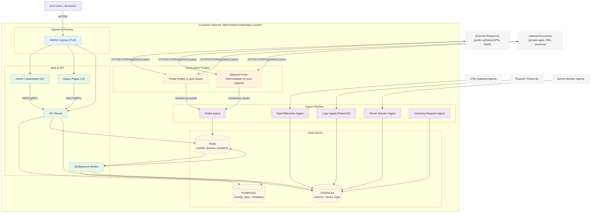

# OneUptime Self-Hosted Architecture

यह diagram दिखाता है कि OneUptime आपके environment में self-hosted होने पर (उदाहरण के लिए, आपके Kubernetes cluster में) आमतौर पर कैसा दिखता है, जिसमें Probes internal और external resources दोनों को कैसे monitor करते हैं।

## यह क्या दिखाता है
- End users आपके cluster के Ingress (NGINX) के माध्यम से OneUptime तक पहुंचते हैं, जो UI और API पर route करता है।
- Core services PostgreSQL, Redis और ClickHouse पर state read/write करती हैं।
- Probes आपके cluster के अंदर (अनुशंसित) और/या आपके network पर अन्यत्र चल सकते हैं। वे monitor कर सकते हैं:
  - आपके firewall के पीछे Internal/private services।
  - Internet पर External/public resources।
- Probe results को आपके cluster के अंदर Probe Ingest को भेजा जाता है, Redis के माध्यम से queue किया जाता है, और Background Worker द्वारा आपके data stores में processed किया जाता है।
- Telemetry (metrics/traces/logs) और server/agent data dedicated ingest services के माध्यम से ingested हो सकते हैं और ClickHouse में stored हो सकते हैं।

> नोट: यदि आप built-in ones के बजाय external PostgreSQL, Redis, या ClickHouse उपयोग करते हैं, तो API/Worker/Ingest से connections आपके external endpoints की ओर point करते हैं। Logical flow same रहता है।
