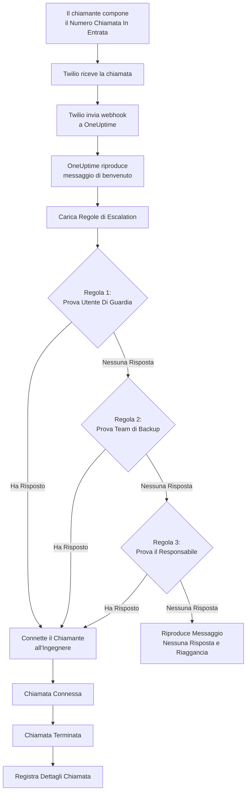
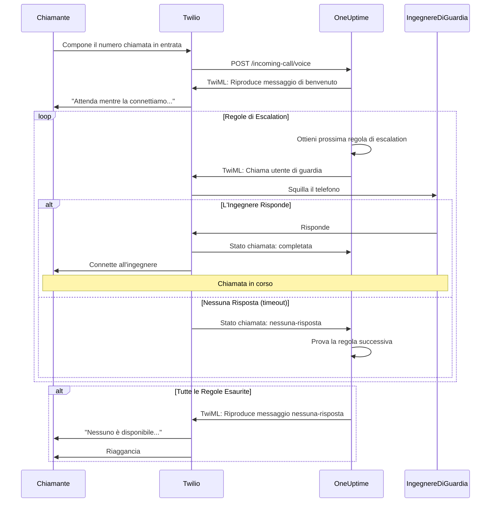
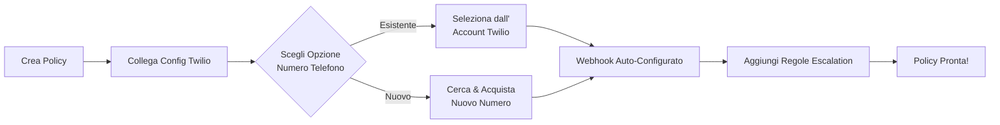
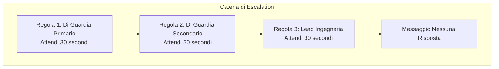
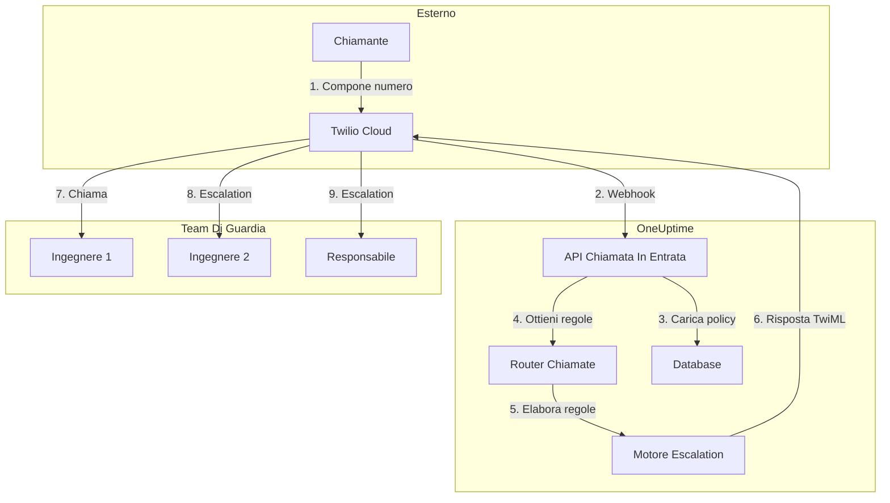

# Policy di Chiamata In Entrata (Integrazione Twilio)

Le Policy di Chiamata In Entrata consentono ai chiamanti esterni di raggiungere i propri ingegneri di guardia componendo un numero di telefono dedicato. Quando qualcuno chiama, OneUptime instrada la chiamata attraverso le regole di escalation configurate finché un ingegnere non risponde.

## Come Funziona

## Flusso di Instradamento Chiamata

## Prerequisiti

- Un account Twilio - Crearne uno su [https://www.twilio.com](https://www.twilio.com)
- Il proprio Twilio Account SID e Auth Token
- Accesso alla propria istanza self-hosted di OneUptime

## Panoramica

La funzionalità Policy di Chiamata In Entrata funziona:

1. Ricevendo le chiamate in entrata su un numero di telefono Twilio
2. Riproducendo un messaggio di benvenuto personalizzabile
3. Instradando la chiamata attraverso le regole di escalation (team, pianificazioni o utenti)
4. Connettendo il chiamante al primo ingegnere di guardia disponibile
5. Escalando alla regola successiva se nessuno risponde

Poiché si ospita OneUptime autonomamente, sarà necessario configurare il proprio account Twilio. Questo fornisce il pieno controllo sui propri numeri di telefono e sulla fatturazione.

## Fase 1: Creare un Account Twilio

1. Accedere a [https://www.twilio.com](https://www.twilio.com) e registrarsi
2. Completare il processo di verifica
3. Annotare il proprio **Account SID** e **Auth Token** dalla dashboard della Console Twilio

## Fase 2: Configurare la Config Chiamata/SMS in OneUptime

1. Accedere al Dashboard di OneUptime
2. Accedere a **Impostazioni Progetto** > **Chiamata & SMS** > **Config Chiamata/SMS Personalizzata**
3. Fare clic su **Crea Config Chiamata/SMS Personalizzata**
4. Compilare i seguenti campi:
   - **Nome**: Un nome descrittivo (ad es. "Config Twilio Produzione")
   - **Descrizione**: Descrizione opzionale
   - **Twilio Account SID**: Il proprio Twilio Account SID (inizia con `AC`)
   - **Twilio Auth Token**: Il proprio Twilio Auth Token
   - **Numero Telefono Primario Twilio**: Un numero di telefono dal proprio account Twilio per le chiamate in uscita
5. Fare clic su **Salva**

## Fase 3: Creare una Policy di Chiamata In Entrata

1. Accedere a **Turno Di Guardia** > **Policy Chiamata In Entrata**
2. Fare clic su **Crea Policy Chiamata In Entrata**
3. Compilare i seguenti campi:
   - **Nome**: Un nome descrittivo (ad es. "Hotline Supporto")
   - **Descrizione**: Descrizione opzionale
4. Fare clic su **Salva**

## Fase 4: Collegare la Configurazione Twilio alla Policy

1. Aprire la Policy di Chiamata In Entrata appena creata
2. Nella scheda **Instradamento Numero Telefono**, trovare **Fase 2: Collega Configurazione Twilio**
3. Fare clic su **Seleziona Config Twilio** e scegliere la configurazione creata nella Fase 2
4. Salvare la selezione

## Fase 5: Configurare un Numero di Telefono

Esistono due opzioni per configurare un numero di telefono:

### Opzione A: Usare un Numero Twilio Esistente

Se si hanno già numeri di telefono nel proprio account Twilio:

1. Nella scheda **Numero Telefono**, fare clic su **Usa Numero Esistente**
2. OneUptime recupererà tutti i numeri di telefono dall'account Twilio
3. Selezionare il numero di telefono da usare
4. Fare clic su **Usa Questo** per assegnarlo alla policy

> **Nota**: Se il numero di telefono ha già un webhook configurato, verrà aggiornato per puntare a OneUptime.

### Opzione B: Acquistare un Nuovo Numero di Telefono

Per acquistare un nuovo numero di telefono direttamente da OneUptime:

1. Nella scheda **Numero Telefono**, fare clic su **Acquista Nuovo Numero**
2. Selezionare un **Paese** dal menu a discesa
3. Inserire opzionalmente un **Prefisso** (ad es. 02 per Milano)
4. Inserire opzionalmente le cifre che il numero deve **Contenere**
5. Fare clic su **Cerca** per trovare i numeri disponibili
6. Selezionare un numero di telefono dai risultati
7. Fare clic su **Acquista** per comprare il numero

Il numero di telefono verrà acquistato dall'account Twilio e il webhook verrà **configurato automaticamente** — nessuna configurazione manuale necessaria!

## Fase 6: Configurare le Regole di Escalation

Le regole di escalation determinano come vengono instradate le chiamate:

1. Aprire la Policy di Chiamata In Entrata
2. Accedere alla scheda **Regole Escalation**
3. Fare clic su **Aggiungi Regola Escalation**
4. Configurare la regola:
   - **Ordine**: L'ordine di priorità (i numeri più bassi vengono provati prima)
   - **Escalation Dopo (secondi)**: Quanto tempo attendere prima di eseguire l'escalation
   - **Pianificazione Di Guardia**: Selezionare una pianificazione per instradare a chi è di guardia
   - **Team**: Selezionare team specifici
   - **Utenti**: Selezionare utenti specifici
5. Aggiungere ulteriori regole di escalation secondo necessità

### Esempio di Regola di Escalation

| Ordine | Escalation Dopo | Target                               |
| ------ | --------------- | ------------------------------------ |
| 1      | 30 secondi      | Pianificazione Di Guardia Primario   |
| 2      | 30 secondi      | Pianificazione Di Guardia Secondario |
| 3      | 30 secondi      | Lead Team Ingegneria                 |

## Fase 7: Configurare i Messaggi Vocali (Opzionale)

Personalizzare i messaggi che i chiamanti sentono:

1. Aprire la Policy di Chiamata In Entrata
2. Accedere a **Impostazioni**
3. Configurare:
   - **Messaggio di Benvenuto**: Riprodotto quando la chiamata viene risposta
   - **Messaggio Nessuna Risposta**: Riprodotto quando tutte le regole di escalation falliscono
   - **Messaggio Nessuno Disponibile**: Riprodotto quando nessuno è di guardia

## Opzioni di Configurazione

### Impostazioni Policy

| Impostazione                      | Descrizione                                                | Predefinito                                                                  |
| --------------------------------- | ---------------------------------------------------------- | ---------------------------------------------------------------------------- |
| Messaggio di Benvenuto            | Messaggio TTS riprodotto quando la chiamata viene risposta | "Attenda mentre la connettiamo all'ingegnere di guardia."                    |
| Messaggio Nessuna Risposta        | Messaggio quando tutte le regole di escalation falliscono  | "Nessuno è disponibile. Si prega di riprovare più tardi."                    |
| Messaggio Nessuno Disponibile     | Messaggio quando nessuno è di guardia                      | "Siamo spiacenti, ma nessun ingegnere di guardia è attualmente disponibile." |
| Ripeti Policy Se Nessuno Risponde | Ricominciare dalla prima regola se tutte falliscono        | Disabilitato                                                                 |
| Volte Ripetizione Policy          | Numero massimo di tentativi di ripetizione                 | 1                                                                            |

### Impostazioni Regola Escalation

| Impostazione              | Descrizione                                                              |
| ------------------------- | ------------------------------------------------------------------------ |
| Ordine                    | Ordine di priorità (1 = priorità più alta)                               |
| Escalation Dopo Secondi   | Tempo di attesa prima di provare la regola successiva (predefinito: 30s) |
| Pianificazione Di Guardia | Instrada a chi è attualmente di guardia                                  |
| Team                      | Instrada a tutti i membri dei team selezionati                           |
| Utenti                    | Instrada a utenti specifici                                              |

## Visualizzazione dei Log delle Chiamate

Per visualizzare la cronologia delle chiamate in entrata:

1. Accedere a **Turno Di Guardia** > **Policy Chiamata In Entrata**
2. Fare clic sulla propria policy
3. Accedere alla scheda **Log Chiamate**

I log mostrano:

- Numero di telefono del chiamante
- Stato della chiamata (Completata, Nessuna Risposta, Fallita, ecc.)
- Chi ha risposto alla chiamata
- Durata della chiamata
- Timestamp

## Configurazione del Numero di Telefono degli Utenti

Affinché gli utenti possano ricevere chiamate in entrata, devono avere un numero di telefono verificato:

1. Gli utenti accedono a **Impostazioni Utente** > **Metodi di Notifica**
2. Aggiungono un numero di telefono sotto **Numeri Chiamata In Entrata**
3. Verificano il numero di telefono tramite codice SMS

Solo gli utenti con numeri di telefono verificati possono essere chiamati attraverso le regole di escalation.

## Rilascio di un Numero di Telefono

Se non si ha più bisogno di un numero di telefono:

1. Aprire la Policy di Chiamata In Entrata
2. Nella scheda **Numero Telefono**, fare clic su **Rilascia Numero**
3. Confermare il rilascio

> **Attenzione**: I numeri rilasciati vengono restituiti a Twilio e potrebbero non essere disponibili per il riacquisto.

## Risoluzione dei Problemi

### Le chiamate non vengono ricevute

- Verificare che la configurazione Twilio sia correttamente collegata alla policy
- Verificare che la propria istanza OneUptime sia accessibile da Internet
- Verificare che Twilio Account SID e Auth Token siano corretti
- Controllare la Console Twilio per i log degli errori

### Le chiamate non si connettono agli ingegneri

- Verificare che gli utenti abbiano numeri di telefono verificati nelle impostazioni di notifica
- Verificare che le regole di escalation siano configurate correttamente
- Assicurarsi che le pianificazioni di guardia abbiano utenti assegnati per l'orario corrente
- Verificare che la policy sia abilitata

### Problemi di qualità audio

- Assicurarsi che il server abbia una connessione internet stabile
- Controllare la pagina di stato di Twilio per eventuali problemi in corso
- Verificare che i numeri di telefono siano nel formato corretto (formato E.164: +390276543210)

## Considerazioni sulla Sicurezza

- Mantenere il proprio Twilio Auth Token sicuro e non esporlo pubblicamente
- Usare HTTPS per la propria istanza OneUptime
- OneUptime valida le firme dei webhook per garantire che le richieste provengano da Twilio
- Considerare di limitare i numeri di telefono che possono chiamare le proprie policy di chiamata in entrata

## Panoramica dell'Architettura

## Supporto

Per problemi con la funzionalità Policy di Chiamata In Entrata, si prega di:

1. Controllare la Console Twilio per i log degli errori
2. Esaminare i log del server OneUptime
3. Contattare il supporto all'indirizzo [hello@oneuptime.com](mailto:hello@oneuptime.com)
