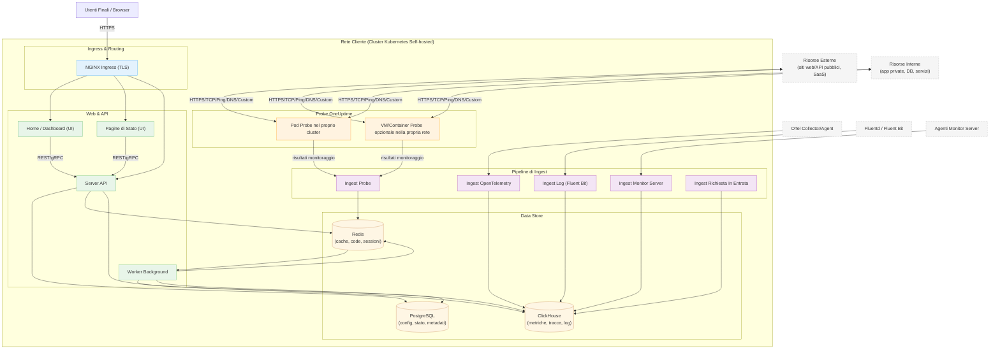

# Architettura Self-Hosted di OneUptime

Questo diagramma mostra come OneUptime appare tipicamente quando viene ospitato autonomamente nel proprio ambiente (ad esempio, nel proprio cluster Kubernetes), incluso come i Probe monitorano sia le risorse interne che quelle esterne.

## Cosa Mostra
- Gli utenti finali accedono a OneUptime tramite l'Ingress del cluster (NGINX), che instrada verso l'UI e l'API.
- I servizi core leggono/scrivono lo stato su PostgreSQL, Redis e ClickHouse.
- I Probe possono essere eseguiti all'interno del cluster (consigliato) e/o altrove nella propria rete. Possono monitorare:
  - Servizi interni/privati protetti dal proprio firewall.
  - Risorse esterne/pubbliche su Internet.
- I risultati del Probe vengono inviati all'Ingest Probe all'interno del cluster, accodati tramite Redis ed elaborati dal Worker Background nei propri data store.
- I dati di telemetria (metriche/tracce/log) e i dati del server/agente possono essere acquisiti tramite servizi di ingest dedicati e archiviati in ClickHouse.

> Nota: Se si usa PostgreSQL, Redis o ClickHouse esterno invece di quelli integrati, le connessioni da API/Worker/Ingest puntano ai propri endpoint esterni. Il flusso logico rimane lo stesso.
