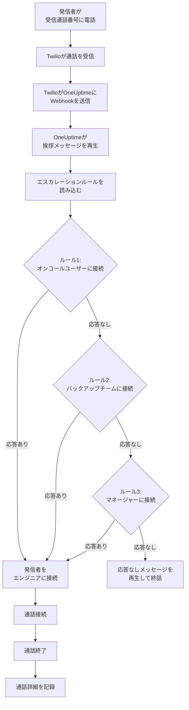
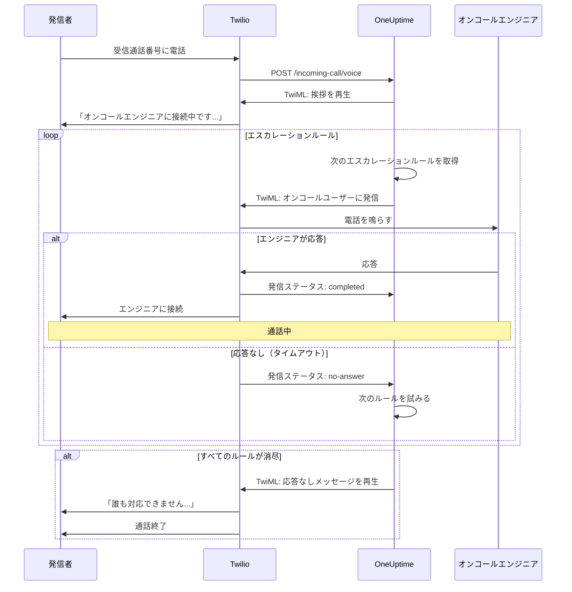
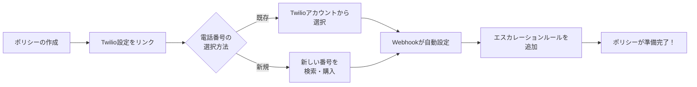
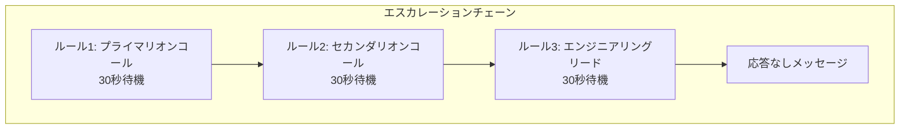
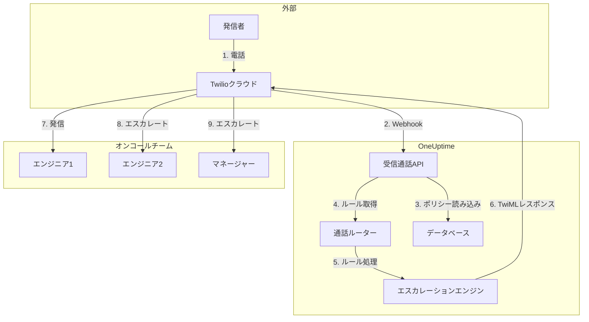

# 受信通話ポリシー（Twilio統合）

受信通話ポリシーを使用すると、外部の発信者が専用の電話番号に電話することでオンコールのエンジニアに連絡できます。電話がかかると、OneUptimeはエンジニアが応答するまで設定したエスカレーションルールに従って通話をルーティングします。

## 仕組み

## 通話ルーティングフロー

## 前提条件

- Twilioアカウント — [https://www.twilio.com](https://www.twilio.com) でアカウントを作成
- TwilioのアカウントSIDと認証トークン
- OneUptimeのセルフホストインスタンスへのアクセス

## 概要

受信通話ポリシー機能は以下のように動作します。

1. Twilioの電話番号で受信通話を受け取る
2. カスタマイズ可能な挨拶メッセージを再生する
3. エスカレーションルール（チーム、スケジュール、またはユーザー）を通じて通話をルーティングする
4. 最初に応答可能なオンコールエンジニアに発信者を接続する
5. 誰も応答しない場合は次のルールにエスカレートする

OneUptimeをセルフホストしているため、独自のTwilioアカウントを設定する必要があります。これにより、電話番号と請求を完全に管理できます。

## ステップ1：Twilioアカウントの作成

1. [https://www.twilio.com](https://www.twilio.com) にアクセスしてアカウントを登録します
2. 認証プロセスを完了します
3. Twilioコンソールのダッシュボードから **アカウントSID** と **認証トークン** をメモしてください

## ステップ2：OneUptimeでの通話/SMS設定

1. OneUptime ダッシュボードにログインします
2. **プロジェクト設定** > **通話とSMS** > **カスタム通話/SMS設定** に移動します
3. **カスタム通話/SMS設定の作成** をクリックします
4. 以下のフィールドを入力します：
   - **名前**：わかりやすい名前（例：「本番Twilio設定」）
   - **説明**：オプションの説明
   - **TwilioアカウントのアカウントSID**：TwilioのアカウントSID（`AC` で始まる）
   - **Twilioアカウントの認証トークン**：TwilioのAuthトークン
   - **Twilioプライマリ電話番号**：アウトバウンド通話用のTwilioアカウントの電話番号
5. **保存** をクリックします

## ステップ3：受信通話ポリシーの作成

1. **オンコール** > **受信通話ポリシー** に移動します
2. **受信通話ポリシーの作成** をクリックします
3. 以下のフィールドを入力します：
   - **名前**：わかりやすい名前（例：「サポートホットライン」）
   - **説明**：オプションの説明
4. **保存** をクリックします

## ステップ4：Twilio設定をポリシーにリンク

1. 作成したばかりの受信通話ポリシーを開きます
2. **電話番号のルーティング** カードで **ステップ2：Twilio設定をリンク** を探します
3. **Twilio設定を選択** をクリックして、ステップ2で作成した設定を選択します
4. 選択を保存します

## ステップ5：電話番号の設定

電話番号の設定には2つの方法があります。

### オプションA：既存のTwilio電話番号を使用

Twilioアカウントに既存の電話番号がある場合：

1. **電話番号** カードで **既存の番号を使用** をクリックします
2. OneUptimeがTwilioアカウントのすべての電話番号を取得します
3. 使用したい電話番号を選択します
4. **この番号を使用** をクリックしてポリシーに割り当てます

> **注意**：電話番号にWebhookが既に設定されている場合、OneUptimeを指すように更新されます。

### オプションB：新しい電話番号を購入

OneUptimeから直接新しい電話番号を購入するには：

1. **電話番号** カードで **新しい番号を購入** をクリックします
2. ドロップダウンから **国** を選択します
3. オプションで **市外局番** を入力します（例：415 for サンフランシスコ）
4. オプションで番号に含まれる桁数を入力します（例：555）
5. **検索** をクリックして利用可能な番号を見つけます
6. 結果から電話番号を選択します
7. **購入** をクリックして番号を購入します

電話番号はTwilioアカウントから購入され、Webhookが **自動的に設定** されます。手動での設定は不要です。

## ステップ6：エスカレーションルールの設定

エスカレーションルールは通話のルーティング方法を決定します。

1. 受信通話ポリシーを開きます
2. **エスカレーションルール** タブに移動します
3. **エスカレーションルールを追加** をクリックします
4. ルールを設定します：
   - **順序**：優先順位（数字が小さいほど先に試みられる）
   - **エスカレートするまでの時間（秒）**：エスカレートするまでの待機時間
   - **オンコールスケジュール**：現在オンコール中のユーザーにルーティングするスケジュールを選択
   - **チーム**：特定のチームを選択
   - **ユーザー**：特定のユーザーを選択
5. 必要に応じて追加のエスカレーションルールを追加します

### エスカレーションルールの例

| 順序 | エスカレートまで | 対象 |
|-------|----------------|--------|
| 1 | 30秒 | プライマリオンコールスケジュール |
| 2 | 30秒 | セカンダリオンコールスケジュール |
| 3 | 30秒 | エンジニアリングチームリード |

## ステップ7：音声メッセージの設定（オプション）

発信者に聞こえるメッセージをカスタマイズします。

1. 受信通話ポリシーを開きます
2. **設定** に移動します
3. 以下を設定します：
   - **挨拶メッセージ**：通話に応答したときに再生されるメッセージ
   - **応答なしメッセージ**：すべてのエスカレーションルールが失敗したときに再生されるメッセージ
   - **利用不可メッセージ**：オンコール中のユーザーがいないときに再生されるメッセージ

## 設定オプション

### ポリシー設定

| 設定 | 説明 | デフォルト |
|---------|-------------|---------|
| 挨拶メッセージ | 通話応答時に再生されるTTSメッセージ | 「オンコールエンジニアに接続中です」 |
| 応答なしメッセージ | すべてのエスカレーションルールが失敗した場合のメッセージ | 「誰も対応できません。後でもう一度お試しください。」 |
| 利用不可メッセージ | オンコール中のエンジニアがいない場合のメッセージ | 「現在、対応可能なオンコールエンジニアがいません。」 |
| 応答なしの場合にポリシーを繰り返す | すべて失敗した場合に最初のルールから再開する | 無効 |
| ポリシーの繰り返し回数 | 最大繰り返し試行回数 | 1 |

### エスカレーションルール設定

| 設定 | 説明 |
|---------|-------------|
| 順序 | 優先順位（1 = 最高優先度） |
| エスカレートするまでの秒数 | 次のルールを試みるまでの待機時間（デフォルト：30秒） |
| オンコールスケジュール | 現在オンコール中のユーザーにルーティング |
| チーム | 選択したチームの全メンバーにルーティング |
| ユーザー | 特定のユーザーにルーティング |

## 通話ログの確認

受信通話の履歴を確認するには：

1. **オンコール** > **受信通話ポリシー** に移動します
2. ポリシーをクリックします
3. **通話ログ** タブに移動します

ログには以下が表示されます：
- 発信者の電話番号
- 通話ステータス（完了、応答なし、失敗など）
- 誰が通話に応答したか
- 通話時間
- タイムスタンプ

## ユーザーの電話番号設定

ユーザーが受信通話を受け取るには、認証済みの電話番号が必要です。

1. ユーザーは **ユーザー設定** > **通知方法** に移動します
2. **受信通話番号** の下に電話番号を追加します
3. SMSコードで電話番号を認証します

認証済みの電話番号を持つユーザーのみ、エスカレーションルールを通じて電話を受け取ることができます。

## 電話番号の解放

電話番号が不要になった場合：

1. 受信通話ポリシーを開きます
2. **電話番号** カードで **番号を解放** をクリックします
3. 解放を確認します

> **警告**：解放された番号はTwilioに返却され、再購入できない場合があります。

## トラブルシューティング

### 通話が受信されない場合

- Twilio設定がポリシーに正しくリンクされているか確認します
- OneUptimeインスタンスがインターネットからアクセス可能か確認します
- TwilioのアカウントSIDと認証トークンが正しいか確認します
- TwilioコンソールでエラーログをN確認します

### エンジニアに通話が接続されない場合

- ユーザーが通知設定に認証済みの電話番号を持っているか確認します
- エスカレーションルールが正しく設定されているか確認します
- 現在の時刻にオンコールスケジュールにユーザーが割り当てられているか確認します
- ポリシーが有効になっているか確認します

### 音質の問題

- サーバーが安定したインターネット接続を持っていることを確認します
- 進行中の問題についてTwilioのステータスページを確認します
- 電話番号が正しい形式（E.164形式：+15551234567）であることを確認します

## セキュリティに関する考慮事項

- TwilioのAuth Tokenを安全に保管し、公開しないでください
- OneUptimeインスタンスにHTTPSを使用してください
- OneUptimeはTwilioからのリクエストを検証するためにWebhook署名を確認します
- 受信通話ポリシーに電話できる番号を制限することを検討してください

## アーキテクチャの概要

## サポート

受信通話ポリシー機能に関する問題は、以下の手順で対応してください：

1. TwilioコンソールでエラーログをN確認する
2. OneUptimeのサーバーログを確認する
3. [hello@oneuptime.com](mailto:hello@oneuptime.com) にサポートを依頼する
