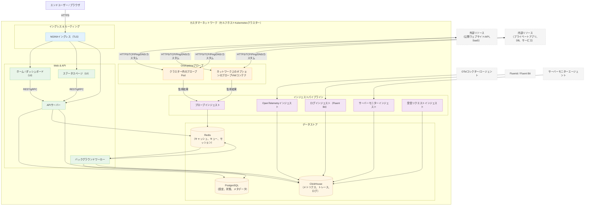

# OneUptimeセルフホストのアーキテクチャ

以下の図は、OneUptimeが自社環境（例：Kubernetesクラスター）にセルフホストされる場合の一般的な構成と、プローブが内部・外部リソースを監視する方法を示しています。

## 図の説明

- エンドユーザーはクラスターのイングレス（NGINX）経由でOneUptimeにアクセスし、UIとAPIにルーティングされます。
- コアサービスはPostgreSQL、Redis、ClickHouseで状態を読み書きします。
- プローブはクラスター内（推奨）や、ネットワーク上の別の場所でも実行できます。プローブは以下を監視できます：
  - ファイアウォールの内側にある内部/プライベートサービス。
  - インターネット上の外部/公開リソース。
- プローブの結果はクラスター内のプローブインジェストに送信され、Redisを通じてキューに入れられ、バックグラウンドワーカーによってデータストアに処理されます。
- テレメトリー（メトリクス/トレース/ログ）とサーバー/エージェントデータは専用のインジェストサービス経由で取り込まれ、ClickHouseに保存されます。

> 注意：内蔵のPostgreSQL、Redis、ClickHouseの代わりに外部のものを使用する場合、API/ワーカー/インジェストからの接続は外部エンドポイントを指します。論理的なフローは同じです。
