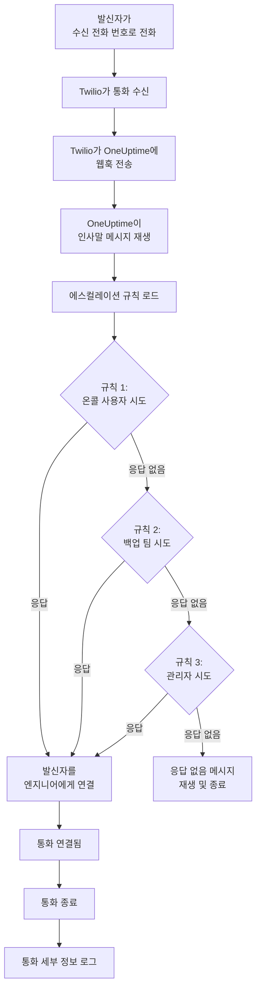
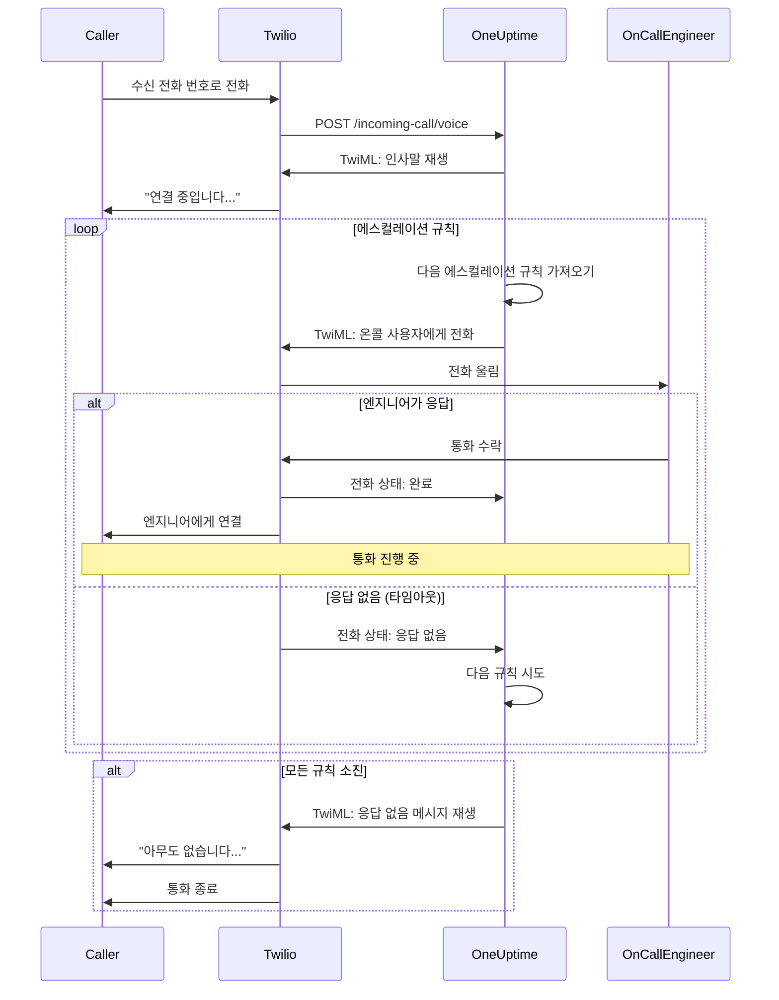
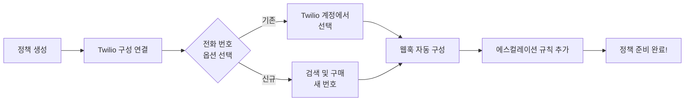
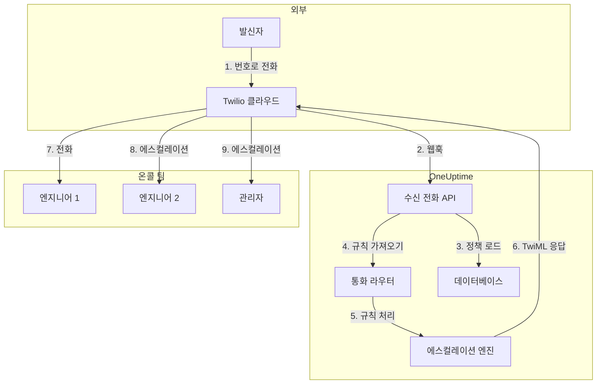

# 수신 전화 정책 (Twilio 통합)

수신 전화 정책을 통해 외부 발신자가 전용 전화번호로 전화를 걸어 온콜 엔지니어에게 연결될 수 있습니다. 누군가가 전화를 걸면 OneUptime은 엔지니어가 응답할 때까지 구성된 에스컬레이션 규칙을 통해 통화를 라우팅합니다.

## 작동 방식

## 전화 라우팅 흐름

## 전제 조건

- Twilio 계정 - [https://www.twilio.com](https://www.twilio.com)에서 생성합니다
- Twilio 계정 SID 및 인증 토큰
- OneUptime 자체 호스팅 인스턴스에 대한 액세스

## 개요

수신 전화 정책 기능은 다음과 같이 작동합니다:

1. Twilio 전화 번호로 수신 전화를 받습니다
2. 커스터마이징 가능한 인사말 메시지를 재생합니다
3. 에스컬레이션 규칙을 통해 통화를 라우팅합니다 (팀, 일정 또는 사용자)
4. 발신자를 첫 번째 가용한 온콜 엔지니어에게 연결합니다
5. 아무도 응답하지 않으면 다음 규칙으로 에스컬레이션합니다

OneUptime을 자체 호스팅하므로 자체 Twilio 계정을 구성해야 합니다. 이를 통해 전화번호 및 청구에 대한 완전한 제어가 가능합니다.

## 1단계: Twilio 계정 생성

1. [https://www.twilio.com](https://www.twilio.com)으로 이동하여 계정에 가입합니다
2. 확인 프로세스를 완료합니다
3. Twilio 콘솔 대시보드에서 **계정 SID** 및 **인증 토큰**을 기록합니다

## 2단계: OneUptime에서 Call/SMS 구성 설정

1. OneUptime 대시보드에 로그인합니다
2. **프로젝트 설정** > **Call & SMS** > **커스텀 Call/SMS 구성**으로 이동합니다
3. **커스텀 Call/SMS 구성 생성**을 클릭합니다
4. 다음 항목을 입력합니다:
   - **이름**: 친숙한 이름 (예: "프로덕션 Twilio 구성")
   - **설명**: 선택적 설명
   - **Twilio 계정 SID**: Twilio 계정 SID (`AC`로 시작)
   - **Twilio 인증 토큰**: Twilio 인증 토큰
   - **Twilio 기본 전화 번호**: 발신 전화에 사용할 Twilio 계정의 전화 번호
5. **저장**을 클릭합니다

## 3단계: 수신 전화 정책 생성

1. **온콜 듀티** > **수신 전화 정책**으로 이동합니다
2. **수신 전화 정책 생성**을 클릭합니다
3. 다음 항목을 입력합니다:
   - **이름**: 친숙한 이름 (예: "지원 핫라인")
   - **설명**: 선택적 설명
4. **저장**을 클릭합니다

## 4단계: 정책에 Twilio 구성 연결

1. 새로 생성된 수신 전화 정책을 엽니다
2. **전화 번호 라우팅** 카드에서 **2단계: Twilio 구성 연결**을 찾습니다
3. **Twilio 구성 선택**을 클릭하고 2단계에서 생성한 구성을 선택합니다
4. 선택을 저장합니다

## 5단계: 전화 번호 구성

전화 번호를 설정하는 두 가지 옵션이 있습니다:

### 옵션 A: 기존 Twilio 전화 번호 사용

Twilio 계정에 이미 전화 번호가 있는 경우:

1. **전화 번호** 카드에서 **기존 번호 사용**을 클릭합니다
2. OneUptime이 Twilio 계정의 모든 전화 번호를 가져옵니다
3. 사용할 전화 번호를 선택합니다
4. **이것을 사용**을 클릭하여 정책에 할당합니다

> **참고**: 전화 번호에 이미 웹훅이 구성되어 있는 경우 OneUptime을 가리키도록 업데이트됩니다.

### 옵션 B: 새 전화 번호 구입

OneUptime에서 직접 새 전화 번호를 구매하려면:

1. **전화 번호** 카드에서 **새 번호 구매**를 클릭합니다
2. 드롭다운에서 **국가**를 선택합니다
3. 선택적으로 **지역 코드**를 입력합니다 (예: 샌프란시스코의 경우 415)
4. 선택적으로 번호에 포함할 **숫자**를 입력합니다 (예: 555)
5. **검색**을 클릭하여 사용 가능한 번호를 찾습니다
6. 결과에서 전화 번호를 선택합니다
7. **구매**를 클릭하여 번호를 구매합니다

전화 번호는 Twilio 계정에서 구매되며 웹훅이 **자동으로 구성**됩니다 — 수동 설정이 필요하지 않습니다!

## 6단계: 에스컬레이션 규칙 구성

에스컬레이션 규칙은 통화가 라우팅되는 방법을 결정합니다:

1. 수신 전화 정책을 엽니다
2. **에스컬레이션 규칙** 탭으로 이동합니다
3. **에스컬레이션 규칙 추가**를 클릭합니다
4. 규칙을 구성합니다:
   - **순서**: 우선 순위 순서 (낮은 숫자가 먼저 시도됨)
   - **에스컬레이션 후 (초)**: 에스컬레이션 전 대기 시간
   - **온콜 일정**: 현재 온콜인 사람에게 라우팅할 일정 선택
   - **팀**: 특정 팀 선택
   - **사용자**: 특정 사용자 선택
5. 필요에 따라 추가 에스컬레이션 규칙을 추가합니다

### 에스컬레이션 규칙 예시

| 순서 | 에스컬레이션 후 | 대상 |
|-------|----------------|--------|
| 1 | 30초 | 기본 온콜 일정 |
| 2 | 30초 | 보조 온콜 일정 |
| 3 | 30초 | 엔지니어링 팀 리드 |

## 7단계: 음성 메시지 구성 (선택 사항)

발신자가 듣는 메시지를 커스터마이징합니다:

1. 수신 전화 정책을 엽니다
2. **설정**으로 이동합니다
3. 다음을 구성합니다:
   - **인사말 메시지**: 통화가 응답될 때 재생됨
   - **응답 없음 메시지**: 모든 에스컬레이션 규칙이 실패할 때 재생됨
   - **아무도 없음 메시지**: 온콜 중인 사람이 없을 때 재생됨

## 구성 옵션

### 정책 설정

| 설정 | 설명 | 기본값 |
|---------|-------------|---------|
| 인사말 메시지 | 통화가 응답될 때 재생되는 TTS 메시지 | "연결 중입니다..." |
| 응답 없음 메시지 | 모든 에스컬레이션 규칙이 실패할 때의 메시지 | "아무도 없습니다. 나중에 다시 시도하십시오." |
| 아무도 없음 메시지 | 온콜 엔지니어가 없을 때의 메시지 | "죄송합니다. 현재 가용한 온콜 엔지니어가 없습니다." |
| 응답 없으면 정책 반복 | 모두 실패하면 첫 번째 규칙부터 재시작 | 비활성화 |
| 정책 반복 횟수 | 최대 반복 시도 횟수 | 1 |

### 에스컬레이션 규칙 설정

| 설정 | 설명 |
|---------|-------------|
| 순서 | 우선 순위 순서 (1 = 최고 우선 순위) |
| 에스컬레이션 전 대기 시간(초) | 다음 규칙을 시도하기 전 대기 시간 (기본값: 30초) |
| 온콜 일정 | 현재 온콜인 사람에게 라우팅 |
| 팀 | 선택된 팀의 모든 구성원에게 라우팅 |
| 사용자 | 특정 사용자에게 라우팅 |

## 통화 로그 보기

수신 통화 기록을 보려면:

1. **온콜 듀티** > **수신 전화 정책**으로 이동합니다
2. 정책을 클릭합니다
3. **통화 로그** 탭으로 이동합니다

로그에는 다음이 표시됩니다:
- 발신자 전화 번호
- 통화 상태 (완료, 응답 없음, 실패 등)
- 통화를 받은 사람
- 통화 시간
- 타임스탬프

## 사용자 전화 번호 구성

사용자가 수신 전화를 받으려면 인증된 전화 번호가 있어야 합니다:

1. 사용자가 **사용자 설정** > **알림 방법**으로 이동합니다
2. **수신 전화 번호** 아래에 전화 번호를 추가합니다
3. SMS 코드를 통해 전화 번호를 인증합니다

인증된 전화 번호가 있는 사용자만 에스컬레이션 규칙을 통해 전화를 받을 수 있습니다.

## 전화 번호 해제

전화 번호가 더 이상 필요하지 않은 경우:

1. 수신 전화 정책을 엽니다
2. **전화 번호** 카드에서 **번호 해제**를 클릭합니다
3. 해제를 확인합니다

> **경고**: 해제된 번호는 Twilio로 반환되며 재구매가 불가능할 수 있습니다.

## 문제 해결

### 전화가 수신되지 않는 경우

- Twilio 구성이 정책에 올바르게 연결되어 있는지 확인합니다
- OneUptime 인스턴스가 인터넷에서 액세스 가능한지 확인합니다
- Twilio 계정 SID와 인증 토큰이 올바른지 확인합니다
- Twilio 콘솔에서 오류 로그를 확인합니다

### 전화가 엔지니어에게 연결되지 않는 경우

- 사용자가 알림 설정에 인증된 전화 번호가 있는지 확인합니다
- 에스컬레이션 규칙이 올바르게 구성되어 있는지 확인합니다
- 온콜 일정에 현재 시간에 사용자가 할당되어 있는지 확인합니다
- 정책이 활성화되어 있는지 확인합니다

### 음질 문제

- 서버에 안정적인 인터넷 연결이 있는지 확인합니다
- 진행 중인 문제가 있는지 Twilio 상태 페이지를 확인합니다
- 전화 번호가 올바른 형식인지 확인합니다 (E.164 형식: +15551234567)

## 보안 고려 사항

- Twilio 인증 토큰을 안전하게 보관하고 공개적으로 노출하지 마십시오
- OneUptime 인스턴스에 HTTPS를 사용합니다
- OneUptime은 요청이 Twilio에서 온 것임을 확인하기 위해 웹훅 서명을 검증합니다
- 수신 전화 정책에 전화를 걸 수 있는 전화 번호를 제한하는 것을 고려합니다

## 아키텍처 개요

## 지원

수신 전화 정책 기능에 문제가 있는 경우:

1. Twilio 콘솔에서 오류 로그를 확인합니다
2. OneUptime 서버 로그를 검토합니다
3. [hello@oneuptime.com](mailto:hello@oneuptime.com)으로 지원팀에 문의합니다
