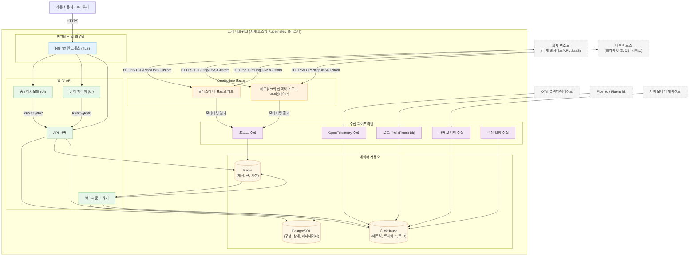

# OneUptime 자체 호스팅 아키텍처

이 다이어그램은 자체 호스팅 환경에서 OneUptime이 일반적으로 어떻게 보이는지를 보여줍니다 (예: Kubernetes 클러스터), 프로브가 내부 및 외부 리소스를 모니터링하는 방법을 포함합니다.

## 이 다이어그램이 보여주는 것
- 최종 사용자는 클러스터의 인그레스 (NGINX)를 통해 OneUptime에 액세스하며, UI와 API로 라우팅됩니다.
- 핵심 서비스는 PostgreSQL, Redis 및 ClickHouse에 상태를 읽고 씁니다.
- 프로브는 클러스터 내부 (권장) 및/또는 네트워크의 다른 곳에서 실행될 수 있습니다. 다음을 모니터링할 수 있습니다:
  - 방화벽 뒤의 내부/프라이빗 서비스.
  - 인터넷의 외부/공개 리소스.
- 프로브 결과는 클러스터 내의 프로브 수집으로 전송되고, Redis를 통해 대기열에 들어가며, 백그라운드 워커에 의해 데이터 저장소로 처리됩니다.
- 텔레메트리 (메트릭/트레이스/로그) 및 서버/에이전트 데이터는 전용 수집 서비스를 통해 수집되고 ClickHouse에 저장될 수 있습니다.

> 참고: 내장된 것 대신 외부 PostgreSQL, Redis 또는 ClickHouse를 사용하는 경우 API/워커/수집에서의 연결이 외부 엔드포인트를 가리킵니다. 논리적 흐름은 동일하게 유지됩니다.
