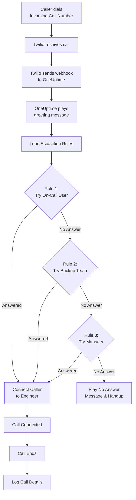
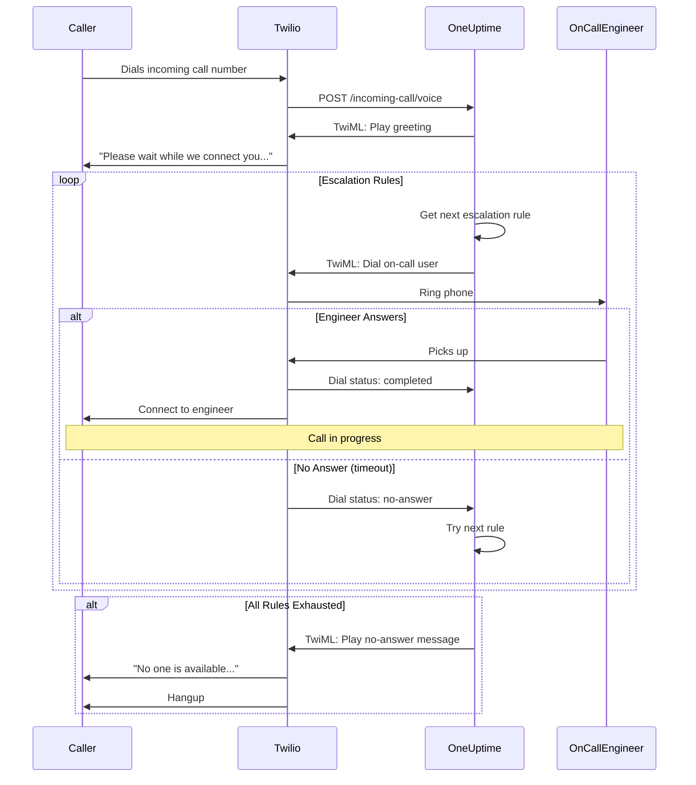
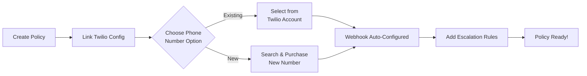
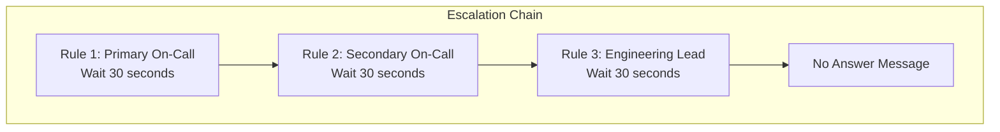
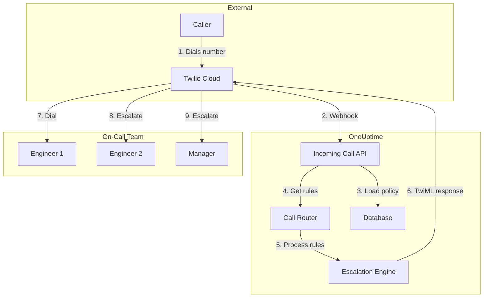

# Inkomend belbeleid (Twilio-integratie)

Inkomend belbeleid stelt externe bellers in staat uw piket-engineers te bereiken door een speciaal telefoonnummer te bellen. Wanneer iemand belt, routeert OneUptime het gesprek via uw geconfigureerde escalatieregels totdat een engineer opneemt.

## Hoe het werkt

## Gesprekrouteringsverloop

## Vereisten

- Een Twilio-account — Maak er een aan op [https://www.twilio.com](https://www.twilio.com)
- Uw Twilio Account SID en Auth Token
- Toegang tot uw zelf-gehoste OneUptime-instantie

## Overzicht

De functie Inkomend belbeleid werkt door:

1. Inkomende gesprekken te ontvangen op een Twilio-telefoonnummer
2. Een aanpasbaar begroetingsbericht af te spelen
3. Het gesprek te routeren via escalatieregels (teams, schema's of gebruikers)
4. De beller te verbinden met de eerste beschikbare piket-engineer
5. Te escaleren naar de volgende regel als niemand opneemt

Omdat u OneUptime zelf host, moet u uw eigen Twilio-account configureren. Dit geeft u volledige controle over uw telefoonnummers en facturering.

## Stap 1: Een Twilio-account aanmaken

1. Ga naar [https://www.twilio.com](https://www.twilio.com) en maak een account aan
2. Voltooi het verificatieproces
3. Noteer uw **Account SID** en **Auth Token** van het Twilio Console-dashboard

## Stap 2: Bel/SMS-configuratie instellen in OneUptime

1. Log in op uw OneUptime-dashboard
2. Ga naar **Projectinstellingen** > **Bel & SMS** > **Aangepaste bel/SMS-configuratie**
3. Klik op **Aangepaste bel/SMS-configuratie aanmaken**
4. Vul de volgende velden in:
   - **Naam**: Een beschrijvende naam (bijv. "Productie Twilio-configuratie")
   - **Beschrijving**: Optionele beschrijving
   - **Twilio Account SID**: Uw Twilio Account SID (begint met `AC`)
   - **Twilio Auth Token**: Uw Twilio Auth Token
   - **Twilio primair telefoonnummer**: Een telefoonnummer van uw Twilio-account voor uitgaande gesprekken
5. Klik op **Opslaan**

## Stap 3: Een inkomend belbeleid aanmaken

1. Ga naar **Piketdienst** > **Inkomend belbeleid**
2. Klik op **Inkomend belbeleid aanmaken**
3. Vul de volgende velden in:
   - **Naam**: Een beschrijvende naam (bijv. "Ondersteuningshotline")
   - **Beschrijving**: Optionele beschrijving
4. Klik op **Opslaan**

## Stap 4: Twilio-configuratie koppelen aan beleid

1. Open uw nieuw aangemaakte inkomend belbeleid
2. Klik in de kaart **Telefoonnummerroutering** op **Stap 2: Twilio-configuratie koppelen**
3. Klik op **Twilio-configuratie selecteren** en kies de configuratie die u in stap 2 hebt aangemaakt
4. Sla de selectie op

## Stap 5: Een telefoonnummer configureren

U heeft twee opties voor het instellen van een telefoonnummer:

### Optie A: Een bestaand Twilio-telefoonnummer gebruiken

Als u al telefoonnummers heeft in uw Twilio-account:

1. Klik in de kaart **Telefoonnummer** op **Bestaand nummer gebruiken**
2. OneUptime haalt alle telefoonnummers op van uw Twilio-account
3. Selecteer het telefoonnummer dat u wilt gebruiken
4. Klik op **Dit gebruiken** om het toe te wijzen aan het beleid

> **Opmerking**: Als het telefoonnummer al een webhook heeft geconfigureerd, wordt dit bijgewerkt om naar OneUptime te wijzen.

### Optie B: Een nieuw telefoonnummer kopen

Om een nieuw telefoonnummer rechtstreeks via OneUptime te kopen:

1. Klik in de kaart **Telefoonnummer** op **Nieuw nummer kopen**
2. Selecteer een **Land** uit de vervolgkeuzelijst
3. Voer optioneel een **Netnummer** in (bijv. 415 voor San Francisco)
4. Voer optioneel in welke cijfers het nummer moet **Bevatten** (bijv. 555)
5. Klik op **Zoeken** om beschikbare nummers te vinden
6. Selecteer een telefoonnummer uit de resultaten
7. Klik op **Kopen** om het nummer te kopen

Het telefoonnummer wordt gekocht van uw Twilio-account en de webhook wordt **automatisch geconfigureerd** — geen handmatige instelling vereist!

## Stap 6: Escalatieregels configureren

Escalatieregels bepalen hoe gesprekken worden gerouteerd:

1. Open uw inkomend belbeleid
2. Ga naar het tabblad **Escalatieregels**
3. Klik op **Escalatieregel toevoegen**
4. Configureer de regel:
   - **Volgorde**: De prioriteitsvolgorde (lagere nummers worden eerst geprobeerd)
   - **Escaleren na (seconden)**: Hoe lang te wachten voordat er wordt geëscaleerd
   - **Piketschema**: Selecteer een schema om te routeren naar wie er op dat moment piket heeft
   - **Teams**: Selecteer specifieke teams
   - **Gebruikers**: Selecteer specifieke gebruikers
5. Voeg indien nodig aanvullende escalatieregels toe

### Voorbeeld van escalatieregel

| Volgorde | Escaleren na | Doel                  |
| -------- | ------------ | --------------------- |
| 1        | 30 seconden  | Primair piketschema   |
| 2        | 30 seconden  | Secundair piketschema |
| 3        | 30 seconden  | Technisch teamleider  |

## Stap 7: Gespreksberichten configureren (optioneel)

Pas de berichten aan die bellers horen:

1. Open uw inkomend belbeleid
2. Ga naar **Instellingen**
3. Configureer:
   - **Begroetingsbericht**: Wordt afgespeeld wanneer het gesprek wordt beantwoord
   - **Geen antwoordbericht**: Wordt afgespeeld wanneer alle escalatieregels mislukken
   - **Niemand beschikbaar-bericht**: Wordt afgespeeld wanneer niemand piket heeft

## Configuratie-opties

### Beleidinstellingen

| Instelling                            | Beschrijving                                                      | Standaard                                                      |
| ------------------------------------- | ----------------------------------------------------------------- | -------------------------------------------------------------- |
| Begroetingsbericht                    | TTS-bericht dat wordt afgespeeld wanneer gesprek wordt beantwoord | "Please wait while we connect you to the on-call engineer."    |
| Geen antwoordbericht                  | Bericht wanneer alle escalatieregels mislukken                    | "No one is available. Please try again later."                 |
| Niemand beschikbaar-bericht           | Bericht wanneer niemand piket heeft                               | "We're sorry, but no on-call engineer is currently available." |
| Beleid herhalen als niemand antwoordt | Opnieuw starten vanaf eerste regel als alle mislukken             | Uitgeschakeld                                                  |
| Beleid herhalingstijden               | Maximum aantal herhaalattempts                                    | 1                                                              |

### Escalatieregelinstellingen

| Instelling              | Beschrijving                                                          |
| ----------------------- | --------------------------------------------------------------------- |
| Volgorde                | Prioriteitsvolgorde (1 = hoogste prioriteit)                          |
| Escaleren na (seconden) | Wachttijd voordat de volgende regel wordt geprobeerd (standaard: 30s) |
| Piketschema             | Routeren naar wie op dat moment piket heeft                           |
| Teams                   | Routeren naar alle leden van geselecteerde teams                      |
| Gebruikers              | Routeren naar specifieke gebruikers                                   |

## Gesprekslogboeken bekijken

Om de geschiedenis van inkomende gesprekken te bekijken:

1. Ga naar **Piketdienst** > **Inkomend belbeleid**
2. Klik op uw beleid
3. Ga naar het tabblad **Gesprekslogboeken**

De logboeken tonen:

- Telefoonnummer van de beller
- Gespreksstatus (Voltooid, Geen antwoord, Mislukt, enz.)
- Wie het gesprek heeft beantwoord
- Gespreksduur
- Tijdstempel

## Configuratie van telefoonnummer voor gebruikers

Gebruikers moeten een geverifieerd telefoonnummer hebben om inkomende gesprekken te ontvangen:

1. Gebruikers gaan naar **Gebruikersinstellingen** > **Meldingsmethoden**
2. Voeg een telefoonnummer toe onder **Inkomende gespreksnummers**
3. Verifieer het telefoonnummer via sms-code

Alleen gebruikers met geverifieerde telefoonnummers kunnen worden gebeld via escalatieregels.

## Een telefoonnummer vrijgeven

Als u een telefoonnummer niet meer nodig heeft:

1. Open uw inkomend belbeleid
2. Klik in de kaart **Telefoonnummer** op **Nummer vrijgeven**
3. Bevestig de vrijgave

> **Waarschuwing**: Vrijgegeven nummers worden teruggegeven aan Twilio en zijn mogelijk niet beschikbaar voor heraankoop.

## Probleemoplossing

### Gesprekken worden niet ontvangen

- Verifieer dat de Twilio-configuratie correct is gekoppeld aan het beleid
- Controleer of uw OneUptime-instantie bereikbaar is vanaf het internet
- Verifieer dat het Twilio Account SID en Auth Token correct zijn
- Controleer de Twilio Console op foutlogboeken

### Gesprekken verbinden niet met engineers

- Verifieer dat gebruikers geverifieerde telefoonnummers hebben in hun meldingsinstellingen
- Controleer of escalatieregels correct zijn geconfigureerd
- Zorg dat piketschema's gebruikers hebben toegewezen voor het huidige tijdstip
- Verifieer dat het beleid is ingeschakeld

### Audiokwaliteitsproblemen

- Zorg dat uw server stabiele internetconnectiviteit heeft
- Controleer de statuspagina van Twilio op eventuele lopende problemen
- Verifieer dat telefoonnummers in het juiste formaat zijn (E.164-formaat: +15551234567)

## Beveiligingsoverwegingen

- Houd uw Twilio Auth Token veilig en stel hem nooit openbaar bloot
- Gebruik HTTPS voor uw OneUptime-instantie
- OneUptime valideert webhook-handtekeningen om te zorgen dat verzoeken van Twilio komen
- Overweeg te beperken welke telefoonnummers uw inkomend belbeleid kunnen bellen

## Architectuuroverzicht

## Ondersteuning

Bij problemen met de functie Inkomend belbeleid:

1. Controleer de Twilio Console op foutlogboeken
2. Bekijk de OneUptime-serverlogboeken
3. Neem contact op met ondersteuning via [hello@oneuptime.com](mailto:hello@oneuptime.com)
