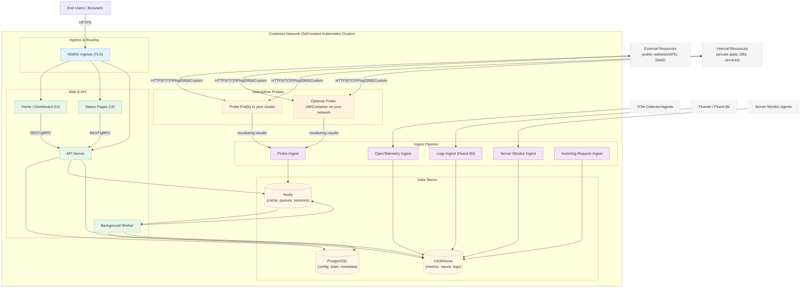

# OneUptime Zelf-gehoste architectuur

Dit diagram toont hoe OneUptime er doorgaans uitziet wanneer het zelf wordt gehost in uw omgeving (bijvoorbeeld in uw Kubernetes-cluster), inclusief hoe probes zowel interne als externe resources bewaken.

## Wat dit toont
- Eindgebruikers krijgen toegang tot OneUptime via de Ingress (NGINX) van uw cluster, die routeert naar de UI en API.
- Kerndiensten lezen/schrijven status naar PostgreSQL, Redis en ClickHouse.
- Probes kunnen draaien binnen uw cluster (aanbevolen) en/of elders op uw netwerk. Ze kunnen het volgende bewaken:
  - Interne/privédiensten achter uw firewall.
  - Externe/openbare resources op het internet.
- Probe-resultaten worden verzonden naar Probe Ingest binnen uw cluster, in de wachtrij geplaatst via Redis en verwerkt door de Achtergrondwerker in uw dataopslag.
- Telemetrie (metrics/traces/logs) en server-/agentgegevens kunnen worden verwerkt via speciale ingest-diensten en opgeslagen in ClickHouse.

> Opmerking: Als u externe PostgreSQL, Redis of ClickHouse gebruikt in plaats van de ingebouwde, wijzen de verbindingen van API/Worker/Ingest naar uw externe eindpunten. De logische stroom blijft hetzelfde.
