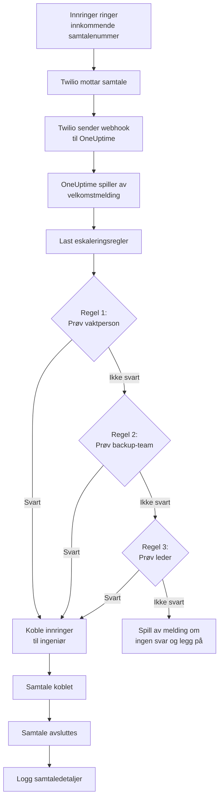
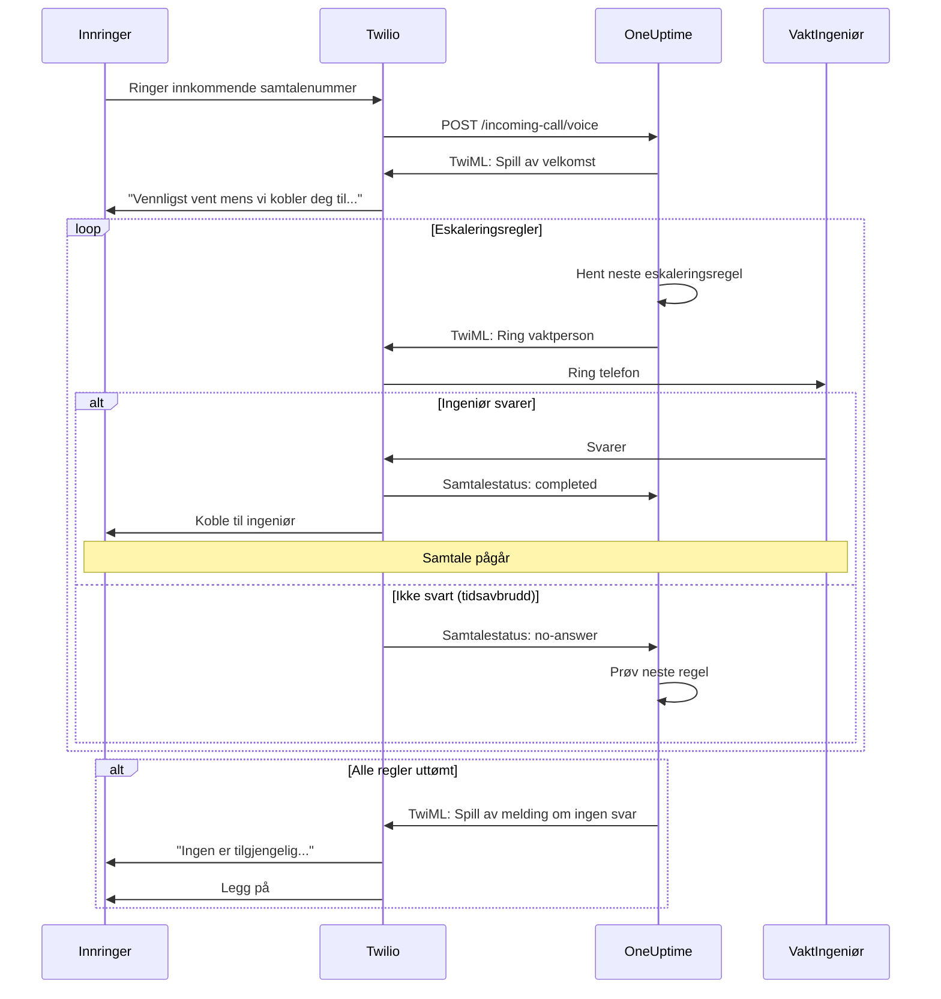
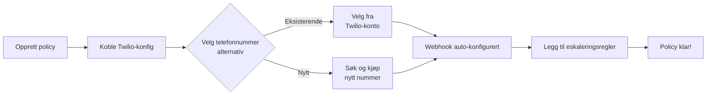
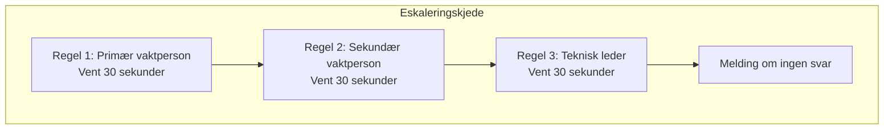
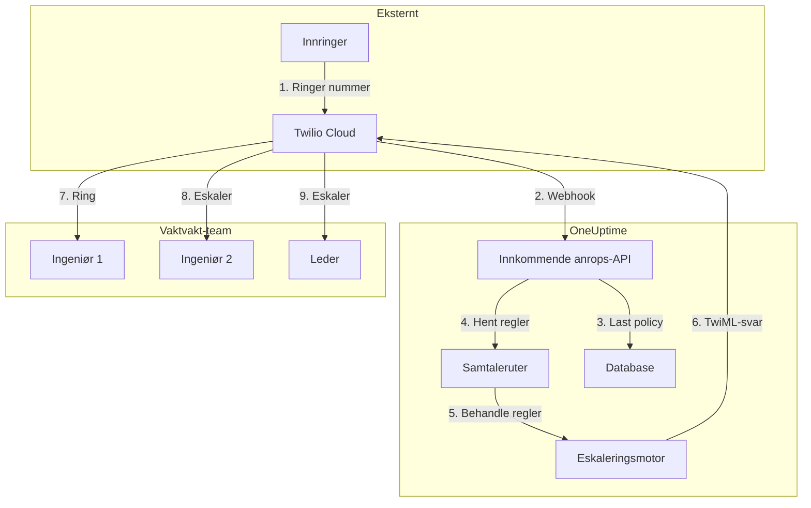

# Innkommende samtalepolicy (Twilio-integrasjon)

Innkommende samtalepolicyer lar eksterne innringere nå vakthavende ingeniører ved å ringe et dedikert telefonnummer. Når noen ringer, ruter OneUptime samtalen gjennom de konfigurerte eskaleringssreglene til en ingeniør svarer.

## Slik fungerer det

## Samtalerutingsflyt

## Forutsetninger

- En Twilio-konto – Opprett en på [https://www.twilio.com](https://www.twilio.com)
- Din Twilio Account SID og Auth Token
- Tilgang til din selvhostede OneUptime-instans

## Oversikt

Funksjonen for innkommende samtalepolicy fungerer ved å:

1. Motta innkommende samtaler på et Twilio-telefonnummer
2. Spille av en tilpassbar velkomstmelding
3. Rute samtalen gjennom eskaleringsregler (team, vakter eller brukere)
4. Koble innringeren til den første tilgjengelige vakthavende ingeniøren
5. Eskalere til neste regel hvis ingen svarer

Siden du selvhoster OneUptime, må du konfigurere din egen Twilio-konto. Dette gir deg full kontroll over telefonnummerne dine og faktureringen.

## Trinn 1: Opprett en Twilio-konto

1. Gå til [https://www.twilio.com](https://www.twilio.com) og registrer deg for en konto
2. Fullfør verifiseringsprosessen
3. Noter ned **Account SID** og **Auth Token** fra Twilio Console-dashbordet

## Trinn 2: Konfigurer anrop/SMS-konfigurasjon i OneUptime

1. Logg inn på OneUptime-dashbordet ditt
2. Gå til **Project Settings** > **Call & SMS** > **Custom Call/SMS Config**
3. Klikk **Create Custom Call/SMS Config**
4. Fyll inn følgende felt:
   - **Name**: Et vennlig navn (f.eks. "Production Twilio Config")
   - **Description**: Valgfri beskrivelse
   - **Twilio Account SID**: Din Twilio Account SID (starter med `AC`)
   - **Twilio Auth Token**: Din Twilio Auth Token
   - **Twilio Primary Phone Number**: Et telefonnummer fra din Twilio-konto for utgående anrop
5. Klikk **Save**

## Trinn 3: Opprett en innkommende samtalepolicy

1. Gå til **On-Call Duty** > **Incoming Call Policies**
2. Klikk **Create Incoming Call Policy**
3. Fyll inn følgende felt:
   - **Name**: Et vennlig navn (f.eks. "Support Hotline")
   - **Description**: Valgfri beskrivelse
4. Klikk **Save**

## Trinn 4: Koble Twilio-konfigurasjon til policy

1. Åpne den nylig opprettede innkommende samtalepolicyen
2. I kortet **Phone Number Routing**, finn **Trinn 2: Link Twilio Configuration**
3. Klikk **Select Twilio Config** og velg konfigurasjonen du opprettet i trinn 2
4. Lagre valget

## Trinn 5: Konfigurer et telefonnummer

Du har to alternativer for å sette opp et telefonnummer:

### Alternativ A: Bruk et eksisterende Twilio-telefonnummer

Hvis du allerede har telefonnumre i Twilio-kontoen din:

1. I kortet **Phone Number**, klikk **Use Existing Number**
2. OneUptime vil hente alle telefonnumre fra Twilio-kontoen din
3. Velg telefonnummeret du ønsker å bruke
4. Klikk **Use This** for å tilordne det til policyen

> **Merk**: Hvis telefonnummeret allerede har en webhook konfigurert, vil den bli oppdatert til å peke til OneUptime.

### Alternativ B: Kjøp et nytt telefonnummer

For å kjøpe et nytt telefonnummer direkte fra OneUptime:

1. I kortet **Phone Number**, klikk **Buy New Number**
2. Velg et **Land** fra rullegardinmenyen
3. Skriv eventuelt inn et **retningsnummer** (f.eks. 47 for Norge)
4. Skriv eventuelt inn sifre nummeret skal **inneholde** (f.eks. 555)
5. Klikk **Search** for å finne tilgjengelige numre
6. Velg et telefonnummer fra resultatene
7. Klikk **Purchase** for å kjøpe nummeret

Telefonnummeret vil bli kjøpt fra Twilio-kontoen din og webhook vil bli **automatisk konfigurert** – ingen manuell oppsett kreves!

## Trinn 6: Konfigurer eskaleringsregler

Eskaleringsregler bestemmer hvordan samtaler rutes:

1. Åpne innkommende samtalepolicyen
2. Gå til fanen **Escalation Rules**
3. Klikk **Add Escalation Rule**
4. Konfigurer regelen:
   - **Order**: Prioritetsrekkefølge (lavere tall prøves først)
   - **Escalate After (seconds)**: Hvor lenge det ventes før eskalering
   - **On-Call Schedule**: Velg en vakt for å rute til den som er vakthavende
   - **Teams**: Velg spesifikke team
   - **Users**: Velg spesifikke brukere
5. Legg til ytterligere eskaleringsregler etter behov

### Eksempel på eskaleringsregel

| Rekkefølge | Eskaler etter | Mål |
|------------|---------------|-----|
| 1 | 30 sekunder | Primær vaktplan |
| 2 | 30 sekunder | Sekundær vaktplan |
| 3 | 30 sekunder | Teknisk teamleder |

## Trinn 7: Konfigurer talemeldinger (valgfritt)

Tilpass meldingene innringere hører:

1. Åpne innkommende samtalepolicyen
2. Gå til **Settings**
3. Konfigurer:
   - **Greeting Message**: Spilles av når samtalen besvares
   - **No Answer Message**: Spilles av når alle eskaleringsregler feiler
   - **No One Available Message**: Spilles av når ingen er på vakt

## Konfigurasjonsalternativer

### Policyinnstillinger

| Innstilling | Beskrivelse | Standard |
|-------------|-------------|---------|
| Greeting Message | TTS-melding spilt av når samtalen besvares | "Please wait while we connect you to the on-call engineer." |
| No Answer Message | Melding når alle eskaleringsregler feiler | "No one is available. Please try again later." |
| No One Available Message | Melding når ingen er på vakt | "We're sorry, but no on-call engineer is currently available." |
| Repeat Policy If No One Answers | Start på nytt fra første regel hvis alle feiler | Deaktivert |
| Repeat Policy Times | Maksimalt antall gjentaksforsøk | 1 |

### Innstillinger for eskaleringsregel

| Innstilling | Beskrivelse |
|-------------|-------------|
| Order | Prioritetsrekkefølge (1 = høyest prioritet) |
| Escalate After Seconds | Ventetid før neste regel prøves (standard: 30 s) |
| On-Call Schedule | Rute til den som for øyeblikket er vakthavende |
| Teams | Rute til alle medlemmer av valgte team |
| Users | Rute til spesifikke brukere |

## Vise samtalelogger

For å se historikk over innkommende samtaler:

1. Gå til **On-Call Duty** > **Incoming Call Policies**
2. Klikk på policyen din
3. Gå til fanen **Call Logs**

Loggene viser:
- Innringerens telefonnummer
- Samtalestatus (Completed, No Answer, Failed, osv.)
- Hvem som svarte samtalen
- Samtalevarighet
- Tidsstempel

## Konfigurasjon av brukertelefotnummer

For at brukere skal motta innkommende samtaler, må de ha et verifisert telefonnummer:

1. Brukere går til **User Settings** > **Notification Methods**
2. Legg til et telefonnummer under **Incoming Call Numbers**
3. Verifiser telefonnummeret via SMS-kode

Bare brukere med verifiserte telefonnumre kan ringes opp gjennom eskaleringsregler.

## Frigjøre et telefonnummer

Hvis du ikke lenger trenger et telefonnummer:

1. Åpne innkommende samtalepolicyen
2. I kortet **Phone Number**, klikk **Release Number**
3. Bekreft frigjøringen

> **Advarsel**: Frigjorte numre returneres til Twilio og er kanskje ikke tilgjengelige for ny kjøp.

## Feilsøking

### Samtaler mottas ikke

- Verifiser at Twilio-konfigurasjonen er korrekt koblet til policyen
- Sjekk at OneUptime-instansen er tilgjengelig fra internett
- Verifiser at Twilio Account SID og Auth Token er korrekte
- Sjekk Twilio Console for feillogger

### Samtaler kobles ikke til ingeniører

- Verifiser at brukere har verifiserte telefonnumre i varselsinnstillingene sine
- Sjekk at eskaleringsregler er korrekt konfigurert
- Sørg for at vaktplaner har brukere tildelt for gjeldende tid
- Verifiser at policyen er aktivert

### Lydkvalitetsproblemer

- Sørg for at serveren har stabil internettilkobling
- Sjekk Twilios statusside for eventuelle pågående problemer
- Verifiser at telefonnumre er i korrekt format (E.164-format: +4712345678)

## Sikkerhetshensyn

- Hold Twilio Auth Token sikker og eksponer den aldri offentlig
- Bruk HTTPS for OneUptime-instansen din
- OneUptime validerer webhook-signaturer for å sikre at forespørsler kommer fra Twilio
- Vurder å begrense hvilke telefonnumre som kan ringe innkommende samtalepolicyer

## Arkitekturoversikt

## Støtte

For problemer med innkommende samtalepolicy-funksjonen, vennligst:

1. Sjekk Twilio Console for feillogger
2. Se gjennom OneUptime-serverloggene
3. Kontakt støtte på [hello@oneuptime.com](mailto:hello@oneuptime.com)
