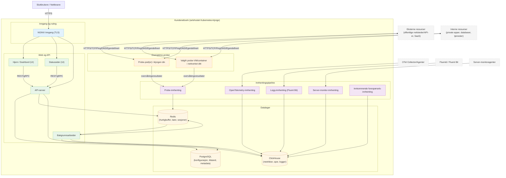

# OneUptime selvhostet arkitektur

Dette diagrammet viser hvordan OneUptime vanligvis ser ut når det selvhostes i ditt miljø (for eksempel i Kubernetes-klyngen din), inkludert hvordan prober overvåker både interne og eksterne ressurser.

## Hva dette viser

- Sluttbrukere får tilgang til OneUptime gjennom klyngens inngang (NGINX), som ruter til UI og API.
- Kjernetjenester leser/skriver tilstand til PostgreSQL, Redis og ClickHouse.
- Prober kan kjøre inne i klyngen din (anbefalt) og/eller andre steder i nettverket ditt. De kan overvåke:
  - Interne/private tjenester bak brannmuren din.
  - Eksterne/offentlige ressurser på internett.
- Probe-resultater sendes til Probe-innhenting inne i klyngen, settes i kø via Redis og behandles av bakgrunnsarbeideren inn i datalagerne.
- Telemetri (metrikker/spor/logger) og server-/agentdata kan hentes inn via dedikerte innhentingstjenester og lagres i ClickHouse.

> Merk: Hvis du bruker ekstern PostgreSQL, Redis eller ClickHouse i stedet for de innebygde, peker tilkoblingene fra API/Worker/Ingest til de eksterne endepunktene. Den logiske flyten forblir den samme.
