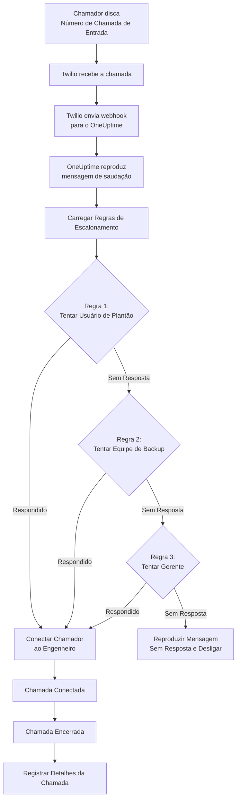

# Política de Chamadas de Entrada (Integração com Twilio)

As Políticas de Chamadas de Entrada permitem que chamadores externos alcancem seus engenheiros de plantão discando um número de telefone dedicado. Quando alguém liga, o OneUptime roteia a chamada através das suas regras de escalonamento configuradas até que um engenheiro atenda.

## Como Funciona

## Pré-requisitos

- Uma conta Twilio - Crie uma em [https://www.twilio.com](https://www.twilio.com)
- Seu Account SID e Auth Token do Twilio
- Acesso à sua instância auto-hospedada do OneUptime

## Visão Geral

O recurso de Política de Chamadas de Entrada funciona:

1. Recebendo chamadas de entrada em um número de telefone do Twilio
2. Reproduzindo uma mensagem de saudação personalizável
3. Roteando a chamada através de regras de escalonamento (equipes, escalas ou usuários)
4. Conectando o chamador ao primeiro engenheiro de plantão disponível
5. Escalonando para a próxima regra se ninguém atender

Como você está auto-hospedando o OneUptime, precisará configurar sua própria conta Twilio. Isso lhe dá controle total sobre seus números de telefone e cobrança.

## Passo 1: Criar uma Conta Twilio

1. Vá para [https://www.twilio.com](https://www.twilio.com) e registre-se para uma conta
2. Conclua o processo de verificação
3. Anote seu **Account SID** e **Auth Token** no painel do Console do Twilio

## Passo 2: Configurar Call/SMS Config no OneUptime

1. Faça login no seu Painel do OneUptime
2. Vá para **Project Settings** > **Call & SMS** > **Custom Call/SMS Config**
3. Clique em **Create Custom Call/SMS Config**
4. Preencha os seguintes campos:
   - **Name**: Um nome amigável (ex.: "Configuração Twilio de Produção")
   - **Description**: Descrição opcional
   - **Twilio Account SID**: Seu Account SID do Twilio (começa com `AC`)
   - **Twilio Auth Token**: Seu Auth Token do Twilio
   - **Twilio Primary Phone Number**: Um número de telefone da sua conta Twilio para chamadas de saída
5. Clique em **Save**

## Passo 3: Criar uma Política de Chamadas de Entrada

1. Vá para **On-Call Duty** > **Incoming Call Policies**
2. Clique em **Create Incoming Call Policy**
3. Preencha os seguintes campos:
   - **Name**: Um nome amigável (ex.: "Linha de Suporte")
   - **Description**: Descrição opcional
4. Clique em **Save**

## Passo 4: Vincular Configuração do Twilio à Política

1. Abra sua Política de Chamadas de Entrada recém-criada
2. No cartão **Phone Number Routing**, encontre **Step 2: Link Twilio Configuration**
3. Clique em **Select Twilio Config** e escolha a configuração que você criou no Passo 2
4. Salve a seleção

## Passo 5: Configurar um Número de Telefone

Você tem duas opções para configurar um número de telefone:

### Opção A: Usar um Número de Telefone Twilio Existente

Se você já tem números de telefone na sua conta Twilio:

1. No cartão **Phone Number**, clique em **Use Existing Number**
2. O OneUptime buscará todos os números de telefone da sua conta Twilio
3. Selecione o número de telefone que deseja usar
4. Clique em **Use This** para atribuí-lo à política

> **Nota**: Se o número de telefone já tiver um webhook configurado, ele será atualizado para apontar para o OneUptime.

### Opção B: Comprar um Novo Número de Telefone

Para comprar um novo número de telefone diretamente do OneUptime:

1. No cartão **Phone Number**, clique em **Buy New Number**
2. Selecione um **Country** no menu suspenso
3. Opcionalmente insira um **Area Code** (ex.: 415 para São Francisco)
4. Opcionalmente insira os dígitos que o número deve **Contain** (ex.: 555)
5. Clique em **Search** para encontrar números disponíveis
6. Selecione um número de telefone nos resultados
7. Clique em **Purchase** para comprar o número

O número de telefone será comprado da sua conta Twilio e o webhook será **configurado automaticamente** — sem configuração manual necessária!

## Passo 6: Configurar Regras de Escalonamento

As regras de escalonamento determinam como as chamadas são roteadas:

1. Abra sua Política de Chamadas de Entrada
2. Vá para a aba **Escalation Rules**
3. Clique em **Add Escalation Rule**
4. Configure a regra:
   - **Order**: A ordem de prioridade (números menores são tentados primeiro)
   - **Escalate After (seconds)**: Quanto tempo aguardar antes de escalonar
   - **On-Call Schedule**: Selecione uma escala para rotear para quem está de plantão
   - **Teams**: Selecione equipes específicas
   - **Users**: Selecione usuários específicos
5. Adicione regras de escalonamento adicionais conforme necessário

### Exemplo de Regra de Escalonamento

| Ordem | Escalonar Após | Alvo |
|-------|----------------|--------|
| 1 | 30 segundos | Escala de Plantão Primária |
| 2 | 30 segundos | Escala de Plantão Secundária |
| 3 | 30 segundos | Líder de Engenharia |

## Passo 7: Configurar Mensagens de Voz (Opcional)

Personalize as mensagens que os chamadores ouvem:

1. Abra sua Política de Chamadas de Entrada
2. Vá para **Settings**
3. Configure:
   - **Greeting Message**: Reproduzida quando a chamada é atendida
   - **No Answer Message**: Reproduzida quando todas as regras de escalonamento falham
   - **No One Available Message**: Reproduzida quando ninguém está de plantão

## Opções de Configuração

### Configurações da Política

| Configuração | Descrição | Padrão |
|---------|-------------|---------|
| Greeting Message | Mensagem TTS reproduzida quando a chamada é atendida | "Por favor, aguarde enquanto o conectamos ao engenheiro de plantão." |
| No Answer Message | Mensagem quando todas as regras de escalonamento falham | "Ninguém está disponível. Por favor, tente novamente mais tarde." |
| No One Available Message | Mensagem quando ninguém está de plantão | "Lamentamos, mas nenhum engenheiro de plantão está disponível no momento." |
| Repeat Policy If No One Answers | Reiniciar da primeira regra se todas falharem | Desabilitado |
| Repeat Policy Times | Tentativas de repetição máximas | 1 |

### Configurações de Regra de Escalonamento

| Configuração | Descrição |
|---------|-------------|
| Order | Ordem de prioridade (1 = maior prioridade) |
| Escalate After Seconds | Tempo de espera antes de tentar a próxima regra (padrão: 30s) |
| On-Call Schedule | Rotear para quem está de plantão no momento |
| Teams | Rotear para todos os membros das equipes selecionadas |
| Users | Rotear para usuários específicos |

## Visualizando Logs de Chamadas

Para visualizar o histórico de chamadas de entrada:

1. Vá para **On-Call Duty** > **Incoming Call Policies**
2. Clique na sua política
3. Vá para a aba **Call Logs**

Os logs mostram:
- Número de telefone do chamador
- Status da chamada (Completada, Sem Resposta, Falhou, etc.)
- Quem atendeu a chamada
- Duração da chamada
- Timestamp

## Configuração de Número de Telefone do Usuário

Para que os usuários recebam chamadas de entrada, eles devem ter um número de telefone verificado:

1. Os usuários vão para **User Settings** > **Notification Methods**
2. Adicionam um número de telefone em **Incoming Call Numbers**
3. Verificam o número de telefone via código SMS

Apenas usuários com números de telefone verificados podem ser chamados através de regras de escalonamento.

## Liberando um Número de Telefone

Se você não precisar mais de um número de telefone:

1. Abra sua Política de Chamadas de Entrada
2. No cartão **Phone Number**, clique em **Release Number**
3. Confirme a liberação

> **Aviso**: Os números liberados são devolvidos ao Twilio e podem não estar disponíveis para recompra.

## Solução de Problemas

### Chamadas não estão sendo recebidas

- Verifique se a configuração do Twilio está corretamente vinculada à política
- Verifique se sua instância do OneUptime está acessível pela internet
- Verifique se o Account SID e Auth Token do Twilio estão corretos
- Verifique o Console do Twilio para logs de erro

### Chamadas não estão conectando aos engenheiros

- Verifique se os usuários têm números de telefone verificados nas configurações de notificação
- Verifique se as regras de escalonamento estão adequadamente configuradas
- Certifique-se de que as escalas de plantão têm usuários atribuídos para o horário atual
- Verifique se a política está habilitada

### Problemas de qualidade de áudio

- Certifique-se de que seu servidor tem conectividade estável com a internet
- Verifique a página de status do Twilio para quaisquer problemas em andamento
- Verifique se os números de telefone estão no formato correto (formato E.164: +15551234567)

## Considerações de Segurança

- Mantenha seu Auth Token do Twilio seguro e nunca o exponha publicamente
- Use HTTPS para sua instância do OneUptime
- O OneUptime valida assinaturas de webhook para garantir que as requisições vêm do Twilio
- Considere restringir quais números de telefone podem ligar para suas políticas de chamadas de entrada
