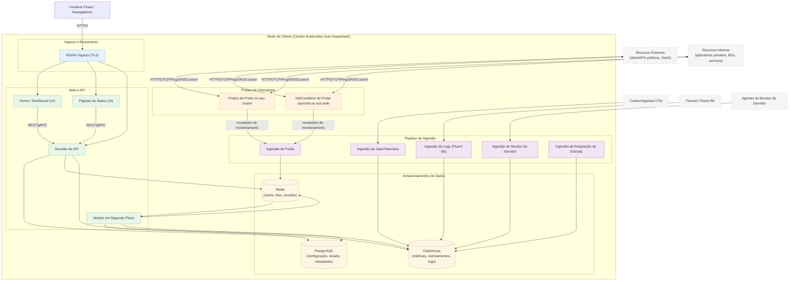

# Arquitetura Auto-Hospedada do OneUptime

Este diagrama mostra como o OneUptime normalmente se parece quando auto-hospedado no seu ambiente (por exemplo, no seu cluster Kubernetes), incluindo como as Probes monitoram recursos internos e externos.

## O que isso mostra
- Os usuários finais acessam o OneUptime através do Ingress do seu cluster (NGINX), que roteia para a UI e API.
- Os serviços principais leem/escrevem estado no PostgreSQL, Redis e ClickHouse.
- As Probes podem ser executadas dentro do seu cluster (recomendado) e/ou em outros lugares da sua rede. Elas podem monitorar:
  - Serviços internos/privados atrás do seu firewall.
  - Recursos externos/públicos na internet.
- Os resultados das Probes são enviados para a Ingestão de Probe dentro do seu cluster, enfileirados via Redis e processados pelo Worker em Segundo Plano em seus armazenamentos de dados.
- Telemetria (métricas/rastreamentos/logs) e dados de servidor/agente podem ser ingeridos via serviços dedicados de ingestão e armazenados no ClickHouse.

> Nota: Se você usar PostgreSQL, Redis ou ClickHouse externos em vez dos integrados, as conexões de API/Worker/Ingest apontam para seus endpoints externos. O fluxo lógico permanece o mesmo.
