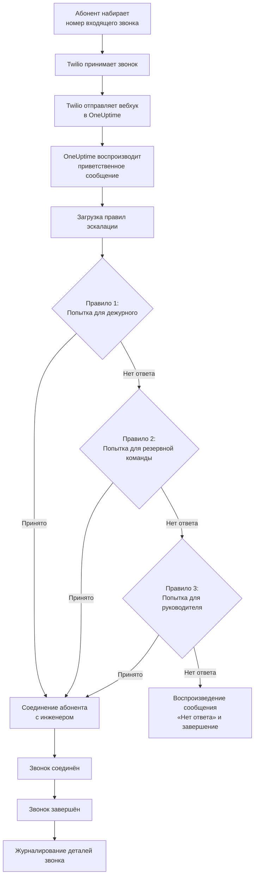
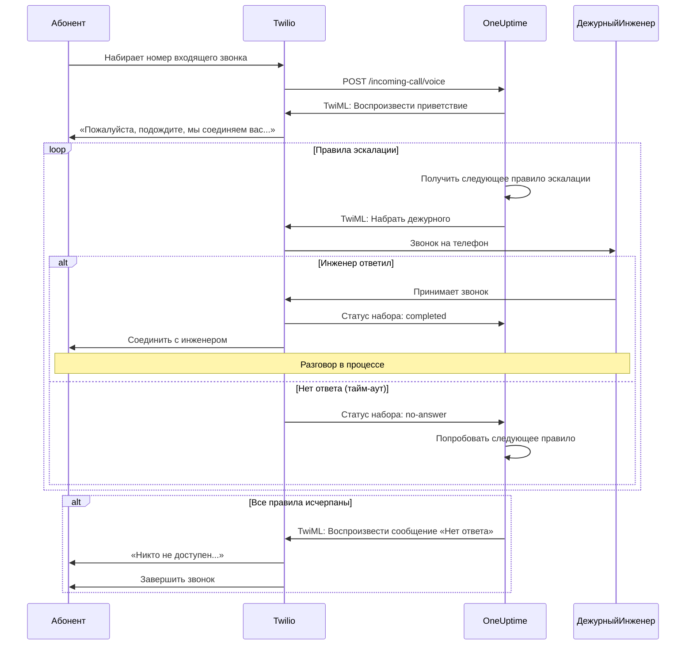
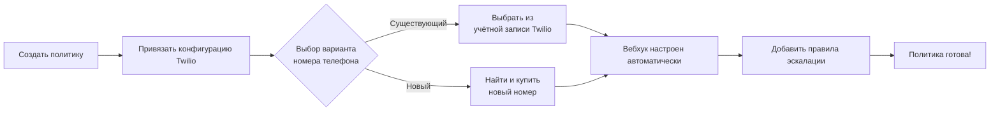
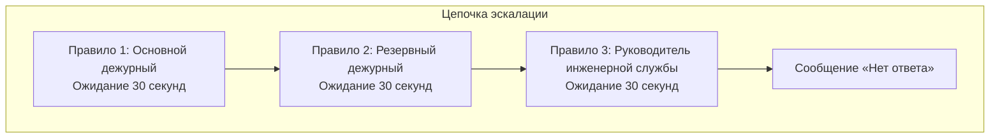
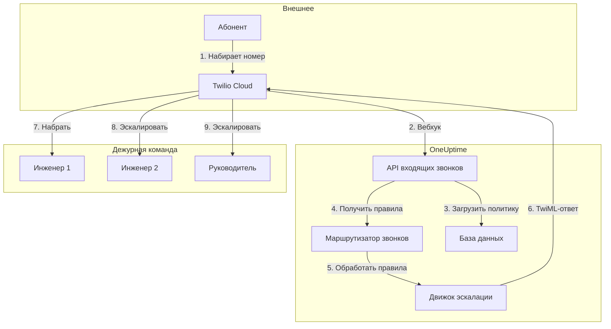

# Политика входящих звонков (интеграция с Twilio)

Политики входящих звонков позволяют внешним абонентам связываться с дежурными инженерами, набирая выделенный номер телефона. При поступлении звонка OneUptime маршрутизирует его через настроенные правила эскалации до тех пор, пока инженер не ответит.

## Принцип работы

## Маршрутизация звонков

## Предварительные требования

- Учётная запись Twilio — создайте на [https://www.twilio.com](https://www.twilio.com)
- SID учётной записи Twilio и токен аутентификации
- Доступ к вашему самостоятельно размещённому экземпляру OneUptime

## Обзор

Функция политики входящих звонков работает следующим образом:

1. Приём входящих звонков на номер телефона Twilio
2. Воспроизведение настраиваемого приветственного сообщения
3. Маршрутизация звонка через правила эскалации (команды, расписания или пользователи)
4. Соединение абонента с первым доступным дежурным инженером
5. Эскалация к следующему правилу при отсутствии ответа

Поскольку вы самостоятельно размещаете OneUptime, необходимо настроить собственную учётную запись Twilio. Это даёт вам полный контроль над телефонными номерами и выставлением счетов.

## Шаг 1: Создание учётной записи Twilio

1. Перейдите на [https://www.twilio.com](https://www.twilio.com) и зарегистрируйтесь
2. Завершите процесс верификации
3. Запишите **SID учётной записи** и **токен аутентификации** из панели управления Twilio Console

## Шаг 2: Настройка конфигурации Call/SMS в OneUptime

1. Войдите в панель управления OneUptime
2. Перейдите в **Настройки проекта** > **Звонки и SMS** > **Пользовательская конфигурация Call/SMS**
3. Нажмите **Создать пользовательскую конфигурацию Call/SMS**
4. Заполните следующие поля:
   - **Имя**: удобное название (например, «Production Twilio Config»)
   - **Описание**: необязательное описание
   - **SID учётной записи Twilio**: ваш SID (начинается с `AC`)
   - **Токен аутентификации Twilio**: ваш токен аутентификации Twilio
   - **Основной номер телефона Twilio**: номер телефона из вашей учётной записи Twilio для исходящих звонков
5. Нажмите **Сохранить**

## Шаг 3: Создание политики входящих звонков

1. Перейдите в **Дежурство** > **Политики входящих звонков**
2. Нажмите **Создать политику входящих звонков**
3. Заполните следующие поля:
   - **Имя**: удобное название (например, «Горячая линия поддержки»)
   - **Описание**: необязательное описание
4. Нажмите **Сохранить**

## Шаг 4: Привязка конфигурации Twilio к политике

1. Откройте только что созданную политику входящих звонков
2. В карточке **Маршрутизация номера телефона** найдите **Шаг 2: Привязать конфигурацию Twilio**
3. Нажмите **Выбрать конфигурацию Twilio** и выберите конфигурацию, созданную на шаге 2
4. Сохраните выбор

## Шаг 5: Настройка номера телефона

Для настройки номера телефона доступны два варианта:

### Вариант A: Использование существующего номера Twilio

Если в вашей учётной записи Twilio уже есть номера телефонов:

1. В карточке **Номер телефона** нажмите **Использовать существующий номер**
2. OneUptime получит все номера телефонов из вашей учётной записи Twilio
3. Выберите нужный номер
4. Нажмите **Использовать этот номер** для привязки к политике

> **Примечание**: Если у номера телефона уже настроен вебхук, он будет обновлён для указания на OneUptime.

### Вариант B: Покупка нового номера телефона

Для покупки нового номера непосредственно из OneUptime:

1. В карточке **Номер телефона** нажмите **Купить новый номер**
2. Выберите **Страну** из выпадающего списка
3. Необязательно введите **Код города** (например, 495 для Москвы)
4. Необязательно введите цифры, которые должен **Содержать** номер
5. Нажмите **Поиск** для поиска доступных номеров
6. Выберите номер из результатов
7. Нажмите **Купить** для приобретения

Номер телефона будет приобретён в вашей учётной записи Twilio, а вебхук будет **автоматически настроен** — ручная настройка не требуется!

## Шаг 6: Настройка правил эскалации

Правила эскалации определяют маршрутизацию звонков:

1. Откройте политику входящих звонков
2. Перейдите на вкладку **Правила эскалации**
3. Нажмите **Добавить правило эскалации**
4. Настройте правило:
   - **Порядок**: приоритет (меньшие числа проверяются первыми)
   - **Эскалировать через (секунд)**: время ожидания перед эскалацией
   - **Расписание дежурства**: выберите расписание для маршрутизации к текущему дежурному
   - **Команды**: выберите конкретные команды
   - **Пользователи**: выберите конкретных пользователей
5. При необходимости добавьте дополнительные правила эскалации

### Пример правила эскалации

| Порядок | Эскалировать через | Цель |
|---------|-------------------|------|
| 1 | 30 секунд | Расписание основного дежурного |
| 2 | 30 секунд | Расписание резервного дежурного |
| 3 | 30 секунд | Руководитель инженерной службы |

## Шаг 7: Настройка голосовых сообщений (необязательно)

Настройте сообщения, которые слышат абоненты:

1. Откройте политику входящих звонков
2. Перейдите в **Настройки**
3. Настройте:
   - **Приветственное сообщение**: воспроизводится при приёме звонка
   - **Сообщение «Нет ответа»**: воспроизводится при исчерпании всех правил
   - **Сообщение «Никто не доступен»**: воспроизводится, когда никто не дежурит

## Параметры конфигурации

### Настройки политики

| Настройка | Описание | По умолчанию |
|-----------|----------|--------------|
| Приветственное сообщение | TTS-сообщение при приёме звонка | «Пожалуйста, подождите, мы соединяем вас с дежурным инженером.» |
| Сообщение «Нет ответа» | Сообщение при исчерпании всех правил | «Никто не доступен. Пожалуйста, попробуйте позже.» |
| Сообщение «Никто не доступен» | Сообщение при отсутствии дежурных | «Извините, но в настоящее время ни один дежурный инженер недоступен.» |
| Повторять политику при отсутствии ответа | Перезапуск с первого правила при исчерпании всех | Отключено |
| Количество повторений | Максимальное число повторных попыток | 1 |

### Настройки правил эскалации

| Настройка | Описание |
|-----------|----------|
| Порядок | Приоритет (1 = наивысший) |
| Эскалировать через (секунд) | Время ожидания перед переходом к следующему правилу (по умолчанию: 30 с) |
| Расписание дежурства | Маршрутизация к текущему дежурному |
| Команды | Маршрутизация ко всем участникам выбранных команд |
| Пользователи | Маршрутизация к конкретным пользователям |

## Просмотр журналов звонков

Для просмотра истории входящих звонков:

1. Перейдите в **Дежурство** > **Политики входящих звонков**
2. Нажмите на вашу политику
3. Перейдите на вкладку **Журналы звонков**

В журналах отображается:
- Номер телефона абонента
- Статус звонка (Завершён, Нет ответа, Сбой и др.)
- Кто принял звонок
- Продолжительность звонка
- Временная метка

## Настройка телефонных номеров пользователей

Для получения входящих звонков пользователи должны иметь верифицированный номер телефона:

1. Пользователи переходят в **Настройки пользователя** > **Методы уведомления**
2. Добавляют номер телефона в разделе **Номера для входящих звонков**
3. Верифицируют номер через SMS-код

Только пользователи с верифицированными номерами могут получать звонки через правила эскалации.

## Освобождение номера телефона

Если номер телефона больше не нужен:

1. Откройте политику входящих звонков
2. В карточке **Номер телефона** нажмите **Освободить номер**
3. Подтвердите освобождение

> **Предупреждение**: Освобождённые номера возвращаются в Twilio и могут быть недоступны для повторной покупки.

## Устранение неполадок

### Звонки не поступают

- Убедитесь, что конфигурация Twilio правильно привязана к политике
- Убедитесь, что ваш экземпляр OneUptime доступен из интернета
- Проверьте правильность SID учётной записи Twilio и токена аутентификации
- Проверьте журналы ошибок в Twilio Console

### Звонки не соединяются с инженерами

- Убедитесь, что пользователи имеют верифицированные номера в настройках уведомлений
- Убедитесь в правильности настройки правил эскалации
- Убедитесь, что расписания дежурства содержат пользователей для текущего времени
- Убедитесь, что политика включена

### Проблемы с качеством звука

- Убедитесь в стабильном интернет-соединении сервера
- Проверьте страницу статуса Twilio на наличие текущих проблем
- Убедитесь, что номера телефонов указаны в правильном формате (E.164: +79161234567)

## Соображения безопасности

- Надёжно храните токен аутентификации Twilio и никогда не раскрывайте его публично
- Используйте HTTPS для вашего экземпляра OneUptime
- OneUptime проверяет подписи вебхуков для подтверждения того, что запросы приходят от Twilio
- Рассмотрите возможность ограничения номеров телефонов, которым разрешено звонить по вашим политикам

## Обзор архитектуры

## Поддержка

При возникновении проблем с функцией политики входящих звонков:

1. Проверьте журналы ошибок в Twilio Console
2. Просмотрите серверные журналы OneUptime
3. Обратитесь в поддержку по адресу [hello@oneuptime.com](mailto:hello@oneuptime.com)
