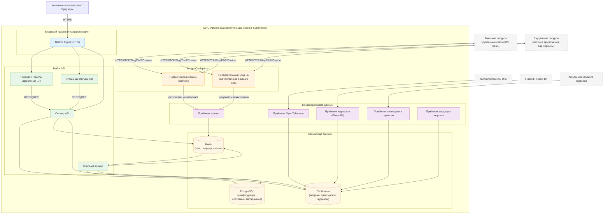

# Архитектура OneUptime при самостоятельном хостинге

Данная диаграмма показывает типичный вид OneUptime при самостоятельном хостинге в вашей среде (например, в кластере Kubernetes), включая то, как зонды отслеживают как внутренние, так и внешние ресурсы.

## Что показывает эта диаграмма
- Конечные пользователи получают доступ к OneUptime через Ingress вашего кластера (NGINX), который маршрутизирует трафик на UI и API.
- Основные сервисы читают/записывают состояние в PostgreSQL, Redis и ClickHouse.
- Зонды могут работать внутри вашего кластера (рекомендуется) и/или в другом месте вашей сети. Они могут отслеживать:
  - Внутренние/частные сервисы за брандмауэром.
  - Внешние/публичные ресурсы в интернете.
- Результаты зондов отправляются в приёмник зондов внутри вашего кластера, помещаются в очередь через Redis и обрабатываются фоновым воркером в ваших хранилищах данных.
- Телеметрия (метрики/трассировки/журналы) и данные серверов/агентов могут приниматься через специализированные сервисы приёма и храниться в ClickHouse.

> Примечание: Если вы используете внешние PostgreSQL, Redis или ClickHouse вместо встроенных, соединения от API/Worker/Ingest указывают на ваши внешние конечные точки. Логический поток остаётся тем же.
