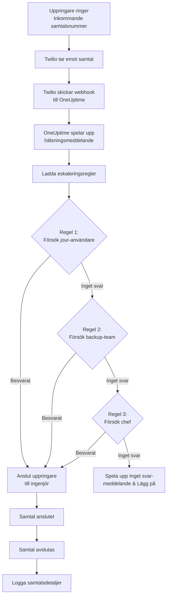

# Policy för inkommande samtal (Twilio-integration)

Policyer för inkommande samtal gör det möjligt för externa uppringare att nå dina jour-ingenjörer genom att ringa ett dedikerat telefonnummer. När någon ringer dirigerar OneUptime samtalet genom dina konfigurerade eskaleringsregler tills en ingenjör svarar.

## Hur det fungerar

## Förutsättningar

- Ett Twilio-konto – Skapa ett på [https://www.twilio.com](https://www.twilio.com)
- Ditt Twilio Account SID och Auth Token
- Åtkomst till din egeninstallerade OneUptime-instans

## Översikt

Funktionen för inkommande samtalspolicy fungerar genom att:

1. Ta emot inkommande samtal på ett Twilio-telefonnummer
2. Spela upp ett anpassningsbart hälsningsmeddelande
3. Dirigera samtalet genom eskaleringsregler (team, scheman eller användare)
4. Ansluta uppringaren till den första tillgängliga jouringenjören
5. Eskalera till nästa regel om ingen svarar

Eftersom du egeninstallerar OneUptime behöver du konfigurera ditt eget Twilio-konto. Det ger dig full kontroll över dina telefonnummer och fakturering.

## Steg 1: Skapa ett Twilio-konto

1. Gå till [https://www.twilio.com](https://www.twilio.com) och registrera ett konto
2. Slutför verifieringsprocessen
3. Anteckna ditt **Account SID** och **Auth Token** från Twilio-konsolens instrumentpanel

## Steg 2: Konfigurera Samtal/SMS-konfiguration i OneUptime

1. Logga in på din OneUptime-instrumentpanel
2. Gå till **Projektinställningar** > **Samtal och SMS** > **Anpassad Samtal/SMS-konfiguration**
3. Klicka på **Skapa anpassad Samtal/SMS-konfiguration**
4. Fyll i följande fält:
   - **Namn**: Ett beskrivande namn (t.ex. "Produktion Twilio-konfiguration")
   - **Beskrivning**: Valfri beskrivning
   - **Twilio Account SID**: Ditt Twilio Account SID (börjar med `AC`)
   - **Twilio Auth Token**: Ditt Twilio Auth Token
   - **Twilio primärt telefonnummer**: Ett telefonnummer från ditt Twilio-konto för utgående samtal
5. Klicka på **Spara**

## Steg 3: Skapa en policy för inkommande samtal

1. Gå till **Jour** > **Policyer för inkommande samtal**
2. Klicka på **Skapa policy för inkommande samtal**
3. Fyll i följande fält:
   - **Namn**: Ett beskrivande namn (t.ex. "Support Hotline")
   - **Beskrivning**: Valfri beskrivning
4. Klicka på **Spara**

## Steg 4: Länka Twilio-konfiguration till policy

1. Öppna din nyskapade policy för inkommande samtal
2. I kortet **Telefonnummerdirigering**, hitta **Steg 2: Länka Twilio-konfiguration**
3. Klicka på **Välj Twilio-konfiguration** och välj konfigurationen du skapade i Steg 2
4. Spara valet

## Steg 5: Konfigurera ett telefonnummer

Du har två alternativ för att konfigurera ett telefonnummer:

### Alternativ A: Använd ett befintligt Twilio-telefonnummer

Om du redan har telefonnummer i ditt Twilio-konto:

1. I kortet **Telefonnummer**, klicka på **Använd befintligt nummer**
2. OneUptime hämtar alla telefonnummer från ditt Twilio-konto
3. Välj det telefonnummer du vill använda
4. Klicka på **Använd detta** för att tilldela det till policyn

> **Observera**: Om telefonnumret redan har en webhook konfigurerad uppdateras den för att peka på OneUptime.

### Alternativ B: Köp ett nytt telefonnummer

För att köpa ett nytt telefonnummer direkt från OneUptime:

1. I kortet **Telefonnummer**, klicka på **Köp nytt nummer**
2. Välj ett **Land** från rullgardinsmenyn
3. Ange valfritt ett **Riktnummer** (t.ex. 415 för San Francisco)
4. Ange valfritt siffror som numret ska **innehålla** (t.ex. 555)
5. Klicka på **Sök** för att hitta tillgängliga nummer
6. Välj ett telefonnummer från resultaten
7. Klicka på **Köp** för att köpa numret

Telefonnumret köps från ditt Twilio-konto och webhooken **konfigureras automatiskt** – ingen manuell konfiguration krävs!

## Steg 6: Konfigurera eskaleringsregler

Eskaleringsregler avgör hur samtal dirigeras:

1. Öppna din policy för inkommande samtal
2. Gå till fliken **Eskaleringsregler**
3. Klicka på **Lägg till eskaleringsregel**
4. Konfigurera regeln:
   - **Ordning**: Prioritetsordning (lägre nummer prövas först)
   - **Eskalera efter (sekunder)**: Hur länge man väntar innan eskalering
   - **Jourschemat**: Välj ett schema för att dirigera till vem som är i jour
   - **Team**: Välj specifika team
   - **Användare**: Välj specifika användare
5. Lägg till ytterligare eskaleringsregler efter behov

## Steg 7: Konfigurera röstmeddelanden (valfritt)

Anpassa meddelandena som uppringare hör:

1. Öppna din policy för inkommande samtal
2. Gå till **Inställningar**
3. Konfigurera:
   - **Hälsningsmeddelande**: Spelas upp när samtalet besvaras
   - **Inget svar-meddelande**: Spelas upp när alla eskaleringsregler misslyckas
   - **Ingen tillgänglig-meddelande**: Spelas upp när ingen är i jour

## Konfigurationsalternativ

### Policyinställningar

| Inställning                    | Beskrivning                                       | Standard                                                       |
| ------------------------------ | ------------------------------------------------- | -------------------------------------------------------------- |
| Hälsningsmeddelande            | TTS-meddelande som spelas upp när samtal besvaras | "Please wait while we connect you to the on-call engineer."    |
| Inget svar-meddelande          | Meddelande när alla eskaleringsregler misslyckas  | "No one is available. Please try again later."                 |
| Ingen tillgänglig-meddelande   | Meddelande när ingen är i jour                    | "We're sorry, but no on-call engineer is currently available." |
| Upprepa policy om ingen svarar | Starta om från första regeln om alla misslyckas   | Inaktiverat                                                    |
| Antal upprepningar             | Maximalt antal upprepningsförsök                  | 1                                                              |

### Inställningar för eskaleringsregel

| Inställning             | Beskrivning                                        |
| ----------------------- | -------------------------------------------------- |
| Ordning                 | Prioritetsordning (1 = högst prioritet)            |
| Eskalera efter sekunder | Väntetid innan nästa regel prövas (standard: 30 s) |
| Jourschemat             | Dirigera till vem som för närvarande är i jour     |
| Team                    | Dirigera till alla medlemmar i valda team          |
| Användare               | Dirigera till specifika användare                  |

## Visa samtalsloggar

För att visa historik över inkommande samtal:

1. Gå till **Jour** > **Policyer för inkommande samtal**
2. Klicka på din policy
3. Gå till fliken **Samtalsloggar**

Loggarna visar:

- Uppringarens telefonnummer
- Samtalsstatus (Slutfört, Inget svar, Misslyckat etc.)
- Vem som besvarade samtalet
- Samtalsduration
- Tidsstämpel

## Konfiguration av användartelefonnummer

För att användare ska kunna ta emot inkommande samtal måste de ha ett verifierat telefonnummer:

1. Användare går till **Användarinställningar** > **Aviseringsmetoder**
2. Lägg till ett telefonnummer under **Inkommande samtalsnummer**
3. Verifiera telefonnumret via SMS-kod

Bara användare med verifierade telefonnummer kan ringas via eskaleringsregler.

## Felsökning

### Samtal tas inte emot

- Verifiera att Twilio-konfigurationen är korrekt länkad till policyn
- Kontrollera att din OneUptime-instans är tillgänglig från internet
- Verifiera att Twilio Account SID och Auth Token är korrekta
- Kontrollera Twilio-konsolen för felloggar

### Samtal ansluts inte till ingenjörer

- Verifiera att användare har verifierade telefonnummer i sina aviseringsinställningar
- Kontrollera att eskaleringsregler är korrekt konfigurerade
- Se till att jourschemana har användare tilldelade för den aktuella tiden
- Verifiera att policyn är aktiverad

## Säkerhetsöverväganden

- Håll ditt Twilio Auth Token säkert och exponera det aldrig offentligt
- Använd HTTPS för din OneUptime-instans
- OneUptime validerar webhook-signaturer för att säkerställa att förfrågningar kommer från Twilio
- Överväg att begränsa vilka telefonnummer som kan ringa dina policyer för inkommande samtal
