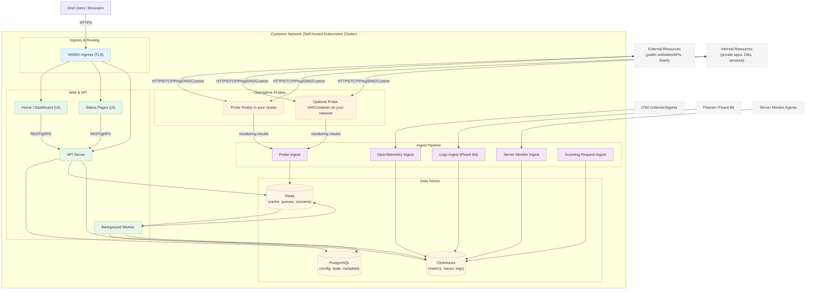

# OneUptime-arkitektur för egeninstallation

Det här diagrammet visar hur OneUptime vanligtvis ser ut när det egeninstalleras i din miljö (till exempel i ditt Kubernetes-kluster), inklusive hur sonder övervakar både interna och externa resurser.

## Vad detta visar
- Slutanvändare når OneUptime via klustrets Ingress (NGINX), som dirigerar till UI och API.
- Kärntjänster läser/skriver tillstånd till PostgreSQL, Redis och ClickHouse.
- Sonder kan köras inuti ditt kluster (rekommenderas) och/eller på annan plats i ditt nätverk. De kan övervaka:
  - Interna/privata tjänster bakom din brandvägg.
  - Externa/offentliga resurser på internet.
- Sondresultat skickas till Probe Ingest inuti ditt kluster, köas via Redis och bearbetas av bakgrundsarbetaren till dina datalager.
- Telemetri (mätvärden/spårningar/loggar) och server-/agentdata kan matas in via dedikerade ingest-tjänster och lagras i ClickHouse.

> Observera: Om du använder extern PostgreSQL, Redis eller ClickHouse istället för de inbyggda, pekar anslutningarna från API/Worker/Ingest till dina externa slutpunkter. Det logiska flödet förblir detsamma.
