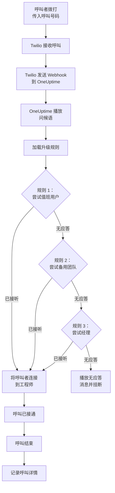
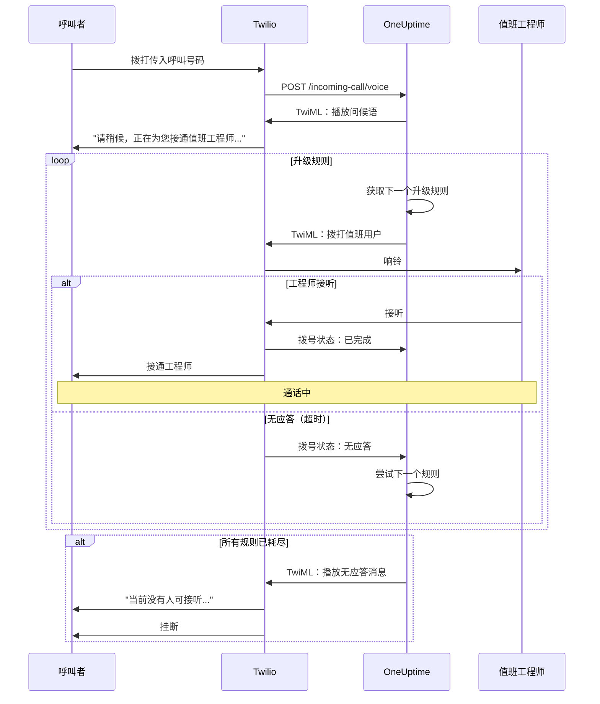
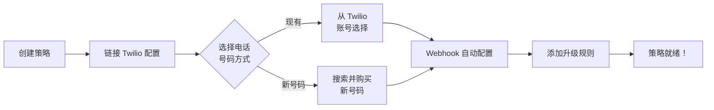
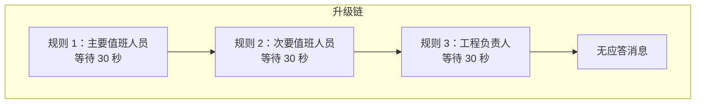
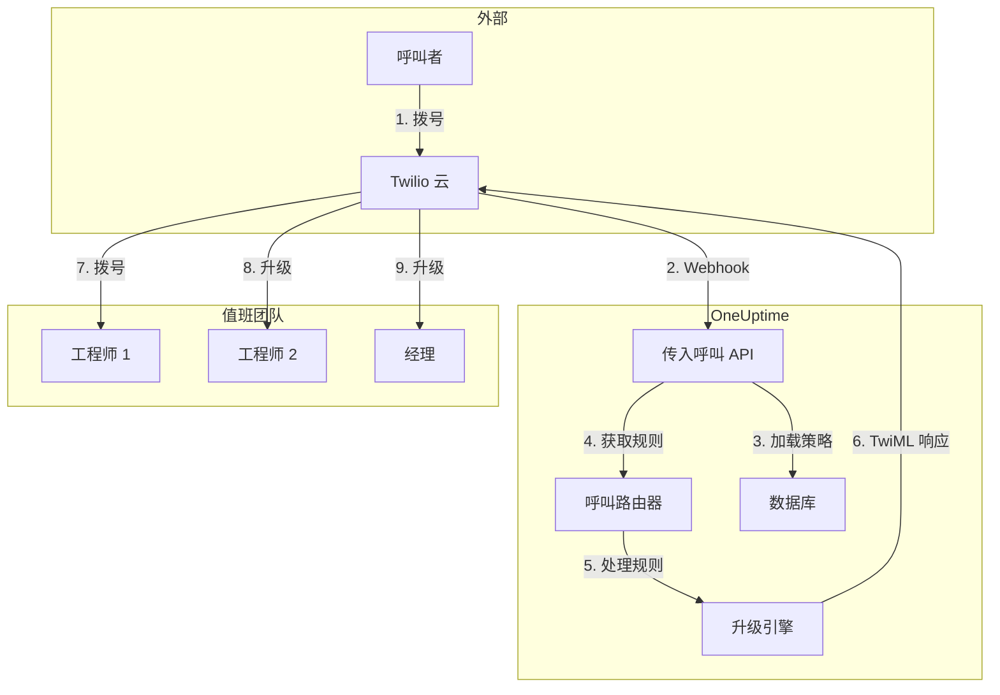

# 传入呼叫策略（Twilio 集成）

传入呼叫策略允许外部呼叫者通过拨打专用电话号码联系到值班工程师。当有人致电时，OneUptime 会通过配置的升级规则路由呼叫，直到工程师接听。

## 工作原理

## 呼叫路由流程

## 前提条件

- Twilio 账号 - 在 [https://www.twilio.com](https://www.twilio.com) 创建
- 您的 Twilio Account SID 和 Auth Token
- 访问您的 OneUptime 自托管实例

## 概述

传入呼叫策略功能的工作方式：

1. 在 Twilio 电话号码上接收传入呼叫
2. 播放可自定义的问候语
3. 通过升级规则（团队、排班或用户）路由呼叫
4. 将呼叫者连接到第一个可用的值班工程师
5. 如果无人接听，升级到下一个规则

由于您是自托管 OneUptime，您需要配置自己的 Twilio 账号。这让您完全控制您的电话号码和账单。

## 第一步：创建 Twilio 账号

1. 前往 [https://www.twilio.com](https://www.twilio.com) 注册账号
2. 完成验证流程
3. 从 Twilio 控制台仪表板记录您的 **Account SID** 和 **Auth Token**

## 第二步：在 OneUptime 中配置呼叫/SMS 配置

1. 登录您的 OneUptime 控制台
2. 前往 **项目设置** > **通话和短信** > **自定义通话/短信配置**
3. 点击 **创建自定义通话/短信配置**
4. 填写以下字段：
   - **名称**：友好名称（例如"生产 Twilio 配置"）
   - **描述**：可选描述
   - **Twilio Account SID**：您的 Twilio Account SID（以 `AC` 开头）
   - **Twilio Auth Token**：您的 Twilio Auth Token
   - **Twilio 主电话号码**：您 Twilio 账号中用于出站呼叫的电话号码
5. 点击 **保存**

## 第三步：创建传入呼叫策略

1. 前往 **值班管理** > **传入呼叫策略**
2. 点击 **创建传入呼叫策略**
3. 填写以下字段：
   - **名称**：友好名称（例如"支持热线"）
   - **描述**：可选描述
4. 点击 **保存**

## 第四步：将 Twilio 配置链接到策略

1. 打开您新创建的传入呼叫策略
2. 在 **电话号码路由** 卡片中，找到 **第二步：链接 Twilio 配置**
3. 点击 **选择 Twilio 配置** 并选择您在第二步中创建的配置
4. 保存选择

## 第五步：配置电话号码

您有两种设置电话号码的方式：

### 选项 A：使用现有的 Twilio 电话号码

如果您的 Twilio 账号中已有电话号码：

1. 在 **电话号码** 卡片中，点击 **使用现有号码**
2. OneUptime 将从您的 Twilio 账号中获取所有电话号码
3. 选择您要使用的电话号码
4. 点击 **使用此号码** 将其分配给策略

> **注意**：如果电话号码已配置 Webhook，它将被更新以指向 OneUptime。

### 选项 B：购买新电话号码

直接从 OneUptime 购买新电话号码：

1. 在 **电话号码** 卡片中，点击 **购买新号码**
2. 从下拉菜单中选择 **国家/地区**
3. 可选地输入 **区号**（例如 415 代表旧金山）
4. 可选地输入号码应 **包含** 的数字（例如 555）
5. 点击 **搜索** 查找可用号码
6. 从结果中选择一个电话号码
7. 点击 **购买** 以购买号码

该电话号码将从您的 Twilio 账号中购买，Webhook 将 **自动配置**——无需手动设置！

## 第六步：配置升级规则

升级规则决定呼叫的路由方式：

1. 打开您的传入呼叫策略
2. 前往 **升级规则** 选项卡
3. 点击 **添加升级规则**
4. 配置规则：
   - **顺序**：优先级顺序（数字越小优先级越高）
   - **升级等待时间（秒）**：升级前等待多长时间
   - **值班排班**：选择排班以路由到当前值班人员
   - **团队**：选择特定团队
   - **用户**：选择特定用户
5. 根据需要添加其他升级规则

### 升级规则示例

| 顺序 | 升级等待时间 | 目标           |
| ---- | ------------ | -------------- |
| 1    | 30 秒        | 主要值班排班   |
| 2    | 30 秒        | 次要值班排班   |
| 3    | 30 秒        | 工程团队负责人 |

## 第七步：配置语音消息（可选）

自定义呼叫者听到的消息：

1. 打开您的传入呼叫策略
2. 前往 **设置**
3. 配置：
   - **问候语**：接听呼叫时播放
   - **无应答消息**：所有升级规则失败时播放
   - **无人可接消息**：无人值班时播放

## 配置选项

### 策略设置

| 设置               | 描述                                   | 默认值                               |
| ------------------ | -------------------------------------- | ------------------------------------ |
| 问候语             | 接听呼叫时播放的 TTS 消息              | "请稍候，正在为您接通值班工程师。"   |
| 无应答消息         | 所有升级规则失败时的消息               | "当前没有人可接听，请稍后重试。"     |
| 无人可接消息       | 无人值班时的消息                       | "很抱歉，当前没有可用的值班工程师。" |
| 无人应答时重复策略 | 如果所有规则失败，从第一个规则重新开始 | 已禁用                               |
| 策略重复次数       | 最大重复尝试次数                       | 1                                    |

### 升级规则设置

| 设置         | 描述                                      |
| ------------ | ----------------------------------------- |
| 顺序         | 优先级顺序（1 = 最高优先级）              |
| 升级等待秒数 | 尝试下一个规则前的等待时间（默认：30 秒） |
| 值班排班     | 路由到当前值班人员                        |
| 团队         | 路由到所选团队的所有成员                  |
| 用户         | 路由到特定用户                            |

## 查看呼叫日志

查看传入呼叫历史：

1. 前往 **值班管理** > **传入呼叫策略**
2. 点击您的策略
3. 前往 **呼叫日志** 选项卡

日志显示：

- 呼叫者电话号码
- 呼叫状态（已完成、无应答、失败等）
- 接听者
- 通话时长
- 时间戳

## 用户电话号码配置

要使用户能够接收传入呼叫，他们必须有已验证的电话号码：

1. 用户前往 **用户设置** > **通知方式**
2. 在 **传入呼叫号码** 下添加电话号码
3. 通过短信验证码验证电话号码

只有拥有已验证电话号码的用户才能通过升级规则接收呼叫。

## 释放电话号码

如果您不再需要某个电话号码：

1. 打开您的传入呼叫策略
2. 在 **电话号码** 卡片中，点击 **释放号码**
3. 确认释放

> **警告**：释放的号码将归还给 Twilio，可能无法重新购买。

## 故障排查

### 未收到呼叫

- 验证 Twilio 配置是否正确链接到策略
- 检查您的 OneUptime 实例是否可以从互联网访问
- 验证 Twilio Account SID 和 Auth Token 是否正确
- 检查 Twilio 控制台的错误日志

### 呼叫未连接到工程师

- 验证用户在通知设置中是否有已验证的电话号码
- 检查升级规则是否正确配置
- 确保当前时间的值班排班中有用户分配
- 验证策略是否已启用

### 音频质量问题

- 确保您的服务器有稳定的互联网连接
- 检查 Twilio 状态页面是否有任何正在进行的问题
- 验证电话号码的格式是否正确（E.164 格式：+15551234567）

## 安全注意事项

- 保护您的 Twilio Auth Token 安全，切勿公开暴露
- 为您的 OneUptime 实例使用 HTTPS
- OneUptime 验证 Webhook 签名以确保请求来自 Twilio
- 考虑限制哪些电话号码可以拨打您的传入呼叫策略

## 架构概览

## 支持

如果遇到传入呼叫策略功能的问题，请：

1. 检查 Twilio 控制台的错误日志
2. 查看 OneUptime 服务器日志
3. 发送邮件至 [hello@oneuptime.com](mailto:hello@oneuptime.com) 联系支持
