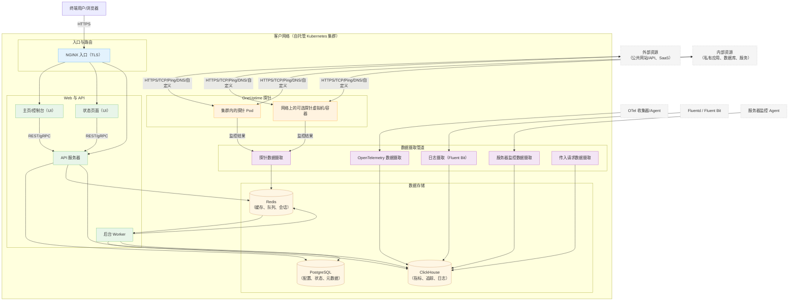

# OneUptime 自托管架构

此图展示了 OneUptime 在您的环境（例如 Kubernetes 集群）中自托管时的典型架构，包括探针如何监控内部和外部资源。

## 图示说明
- 终端用户通过集群的入口（NGINX）访问 OneUptime，该入口将请求路由到 UI 和 API。
- 核心服务从 PostgreSQL、Redis 和 ClickHouse 读写状态。
- 探针可以在集群内（推荐）和/或网络其他地方运行。它们可以监控：
  - 防火墙后面的内部/私有服务。
  - 互联网上的外部/公共资源。
- 探针结果发送到集群内的探针数据摄取，通过 Redis 排队，并由后台 Worker 处理到数据存储中。
- 遥测数据（指标/追踪/日志）和服务器/Agent 数据可以通过专用数据摄取服务摄取，存储在 ClickHouse 中。

> 注意：如果您使用外部 PostgreSQL、Redis 或 ClickHouse 而非内置的，API/Worker/数据摄取的连接将指向您的外部端点。逻辑流程保持不变。
