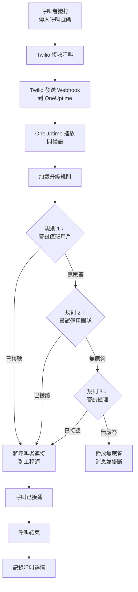
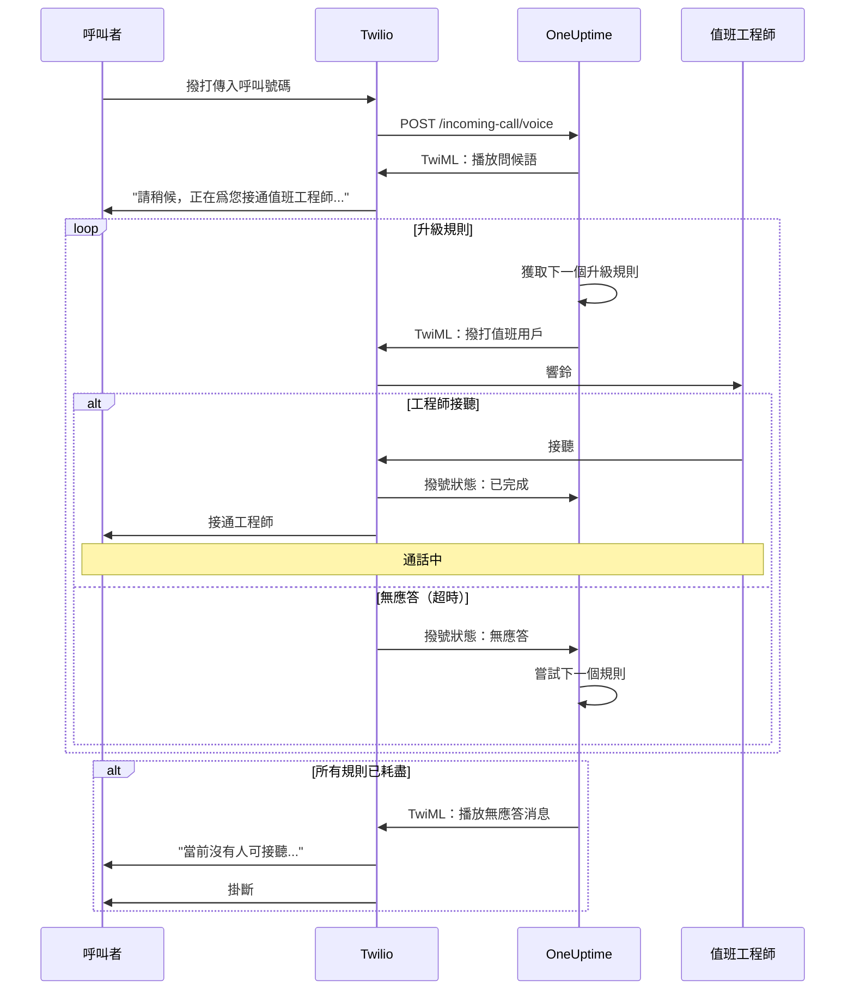
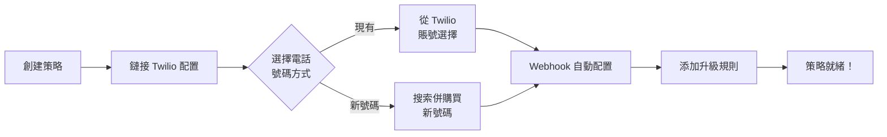
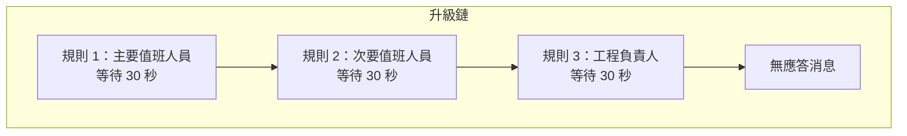
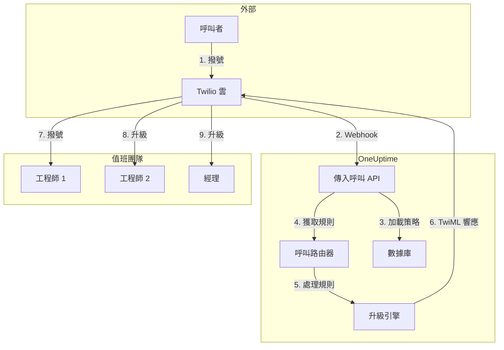

# 傳入呼叫策略（Twilio 集成）

傳入呼叫策略允許外部呼叫者通過撥打專用電話號碼聯繫到值班工程師。當有人致電時，OneUptime 會通過配置的升級規則路由呼叫，直到工程師接聽。

## 工作原理

## 呼叫路由流程

## 前提條件

- Twilio 賬號 - 在 [https://www.twilio.com](https://www.twilio.com) 創建
- 您的 Twilio Account SID 和 Auth Token
- 訪問您的 OneUptime 自託管實例

## 概述

傳入呼叫策略功能的工作方式：

1. 在 Twilio 電話號碼上接收傳入呼叫
2. 播放可自定義的問候語
3. 通過升級規則（團隊、排班或用戶）路由呼叫
4. 將呼叫者連接到第一個可用的值班工程師
5. 如果無人接聽，升級到下一個規則

由於您是自託管 OneUptime，您需要配置自己的 Twilio 賬號。這讓您完全控制您的電話號碼和賬單。

## 第一步：創建 Twilio 賬號

1. 前往 [https://www.twilio.com](https://www.twilio.com) 註冊賬號
2. 完成驗證流程
3. 從 Twilio 控制台儀表板記錄您的 **Account SID** 和 **Auth Token**

## 第二步：在 OneUptime 中配置呼叫/SMS 配置

1. 登錄您的 OneUptime 控制台
2. 前往 **項目設置** > **通話和短信** > **自定義通話/短信配置**
3. 點擊 **創建自定義通話/短信配置**
4. 填寫以下字段：
   - **名稱**：友好名稱（例如"生產 Twilio 配置"）
   - **描述**：可選描述
   - **Twilio Account SID**：您的 Twilio Account SID（以 `AC` 開頭）
   - **Twilio Auth Token**：您的 Twilio Auth Token
   - **Twilio 主電話號碼**：您 Twilio 賬號中用於出站呼叫的電話號碼
5. 點擊 **保存**

## 第三步：創建傳入呼叫策略

1. 前往 **值班管理** > **傳入呼叫策略**
2. 點擊 **創建傳入呼叫策略**
3. 填寫以下字段：
   - **名稱**：友好名稱（例如"支持熱線"）
   - **描述**：可選描述
4. 點擊 **保存**

## 第四步：將 Twilio 配置鏈接到策略

1. 打開您新創建的傳入呼叫策略
2. 在 **電話號碼路由** 卡片中，找到 **第二步：鏈接 Twilio 配置**
3. 點擊 **選擇 Twilio 配置** 並選擇您在第二步中創建的配置
4. 保存選擇

## 第五步：配置電話號碼

您有兩種設置電話號碼的方式：

### 選項 A：使用現有的 Twilio 電話號碼

如果您的 Twilio 賬號中已有電話號碼：

1. 在 **電話號碼** 卡片中，點擊 **使用現有號碼**
2. OneUptime 將從您的 Twilio 賬號中獲取所有電話號碼
3. 選擇您要使用的電話號碼
4. 點擊 **使用此號碼** 將其分配給策略

> **注意**：如果電話號碼已配置 Webhook，它將被更新以指向 OneUptime。

### 選項 B：購買新電話號碼

直接從 OneUptime 購買新電話號碼：

1. 在 **電話號碼** 卡片中，點擊 **購買新號碼**
2. 從下拉菜單中選擇 **國家/地區**
3. 可選地輸入 **區號**（例如 415 代表舊金山）
4. 可選地輸入號碼應 **包含** 的數字（例如 555）
5. 點擊 **搜索** 查找可用號碼
6. 從結果中選擇一個電話號碼
7. 點擊 **購買** 以購買號碼

該電話號碼將從您的 Twilio 賬號中購買，Webhook 將 **自動配置**——無需手動設置！

## 第六步：配置升級規則

升級規則決定呼叫的路由方式：

1. 打開您的傳入呼叫策略
2. 前往 **升級規則** 選項卡
3. 點擊 **添加升級規則**
4. 配置規則：
   - **順序**：優先級順序（數字越小優先級越高）
   - **升級等待時間（秒）**：升級前等待多長時間
   - **值班排班**：選擇排班以路由到當前值班人員
   - **團隊**：選擇特定團隊
   - **用戶**：選擇特定用戶
5. 根據需要添加其他升級規則

### 升級規則示例

| 順序 | 升級等待時間 | 目標 |
|------|------------|------|
| 1 | 30 秒 | 主要值班排班 |
| 2 | 30 秒 | 次要值班排班 |
| 3 | 30 秒 | 工程團隊負責人 |

## 第七步：配置語音消息（可選）

自定義呼叫者聽到的消息：

1. 打開您的傳入呼叫策略
2. 前往 **設置**
3. 配置：
   - **問候語**：接聽呼叫時播放
   - **無應答消息**：所有升級規則失敗時播放
   - **無人可接消息**：無人值班時播放

## 配置選項

### 策略設置

| 設置 | 描述 | 默認值 |
|------|------|--------|
| 問候語 | 接聽呼叫時播放的 TTS 消息 | "請稍候，正在爲您接通值班工程師。" |
| 無應答消息 | 所有升級規則失敗時的消息 | "當前沒有人可接聽，請稍後重試。" |
| 無人可接消息 | 無人值班時的消息 | "很抱歉，當前沒有可用的值班工程師。" |
| 無人應答時重複策略 | 如果所有規則失敗，從第一個規則重新開始 | 已禁用 |
| 策略重複次數 | 最大重複嘗試次數 | 1 |

### 升級規則設置

| 設置 | 描述 |
|------|------|
| 順序 | 優先級順序（1 = 最高優先級） |
| 升級等待秒數 | 嘗試下一個規則前的等待時間（默認：30 秒） |
| 值班排班 | 路由到當前值班人員 |
| 團隊 | 路由到所選團隊的所有成員 |
| 用戶 | 路由到特定用戶 |

## 查看呼叫日誌

查看傳入呼叫歷史：

1. 前往 **值班管理** > **傳入呼叫策略**
2. 點擊您的策略
3. 前往 **呼叫日誌** 選項卡

日誌顯示：
- 呼叫者電話號碼
- 呼叫狀態（已完成、無應答、失敗等）
- 接聽者
- 通話時長
- 時間戳

## 用戶電話號碼配置

要使用戶能夠接收傳入呼叫，他們必須有已驗證的電話號碼：

1. 用戶前往 **用戶設置** > **通知方式**
2. 在 **傳入呼叫號碼** 下添加電話號碼
3. 通過短信驗證碼驗證電話號碼

只有擁有已驗證電話號碼的用戶才能通過升級規則接收呼叫。

## 釋放電話號碼

如果您不再需要某個電話號碼：

1. 打開您的傳入呼叫策略
2. 在 **電話號碼** 卡片中，點擊 **釋放號碼**
3. 確認釋放

> **警告**：釋放的號碼將歸還給 Twilio，可能無法重新購買。

## 故障排查

### 未收到呼叫

- 驗證 Twilio 配置是否正確鏈接到策略
- 檢查您的 OneUptime 實例是否可以從互聯網訪問
- 驗證 Twilio Account SID 和 Auth Token 是否正確
- 檢查 Twilio 控制台的錯誤日誌

### 呼叫未連接到工程師

- 驗證用戶在通知設置中是否有已驗證的電話號碼
- 檢查升級規則是否正確配置
- 確保當前時間的值班排班中有用戶分配
- 驗證策略是否已啓用

### 音頻質量問題

- 確保您的服務器有穩定的互聯網連接
- 檢查 Twilio 狀態頁面是否有任何正在進行的問題
- 驗證電話號碼的格式是否正確（E.164 格式：+15551234567）

## 安全注意事項

- 保護您的 Twilio Auth Token 安全，切勿公開暴露
- 爲您的 OneUptime 實例使用 HTTPS
- OneUptime 驗證 Webhook 簽名以確保請求來自 Twilio
- 考慮限制哪些電話號碼可以撥打您的傳入呼叫策略

## 架構概覽

## 支持

如果遇到傳入呼叫策略功能的問題，請：

1. 檢查 Twilio 控制台的錯誤日誌
2. 查看 OneUptime 服務器日誌
3. 發送郵件至 [hello@oneuptime.com](mailto:hello@oneuptime.com) 聯繫支持
