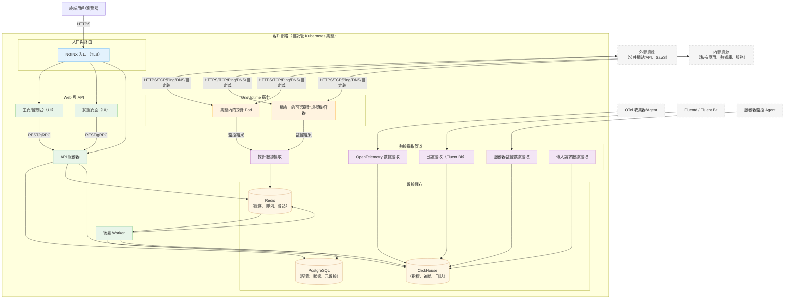

# OneUptime 自託管架構

此圖展示了 OneUptime 在您的環境（例如 Kubernetes 集羣）中自託管時的典型架構，包括探針如何監控內部和外部資源。

## 圖示說明
- 終端用戶通過集羣的入口（NGINX）訪問 OneUptime，該入口將請求路由到 UI 和 API。
- 核心服務從 PostgreSQL、Redis 和 ClickHouse 讀寫狀態。
- 探針可以在集羣內（推薦）和/或網絡其他地方運行。它們可以監控：
  - 防火牆後面的內部/私有服務。
  - 互聯網上的外部/公共資源。
- 探針結果發送到集羣內的探針數據攝取，通過 Redis 排隊，並由後臺 Worker 處理到數據儲存中。
- 遙測數據（指標/追蹤/日誌）和服務器/Agent 數據可以通過專用數據攝取服務攝取，儲存在 ClickHouse 中。

> 注意：如果您使用外部 PostgreSQL、Redis 或 ClickHouse 而非內置的，API/Worker/數據攝取的連接將指向您的外部端點。邏輯流程保持不變。
