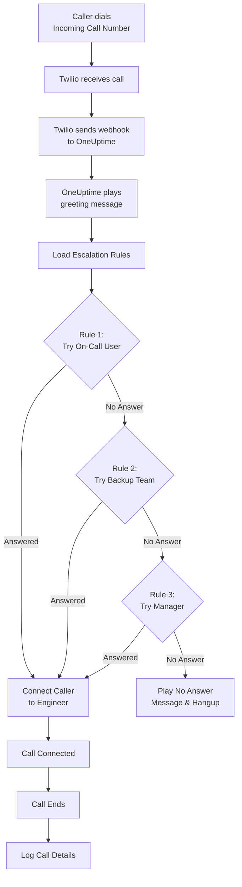
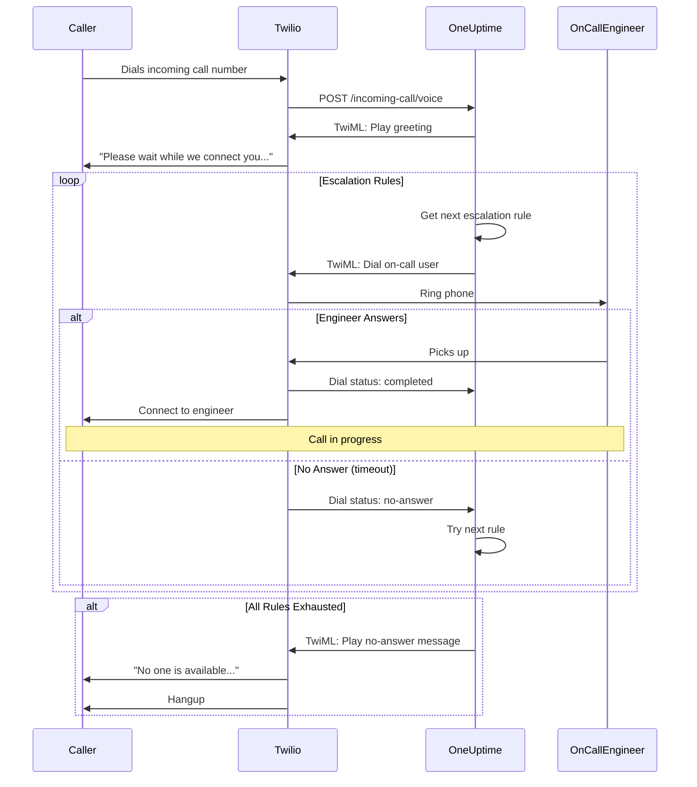
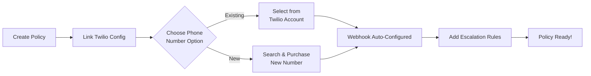
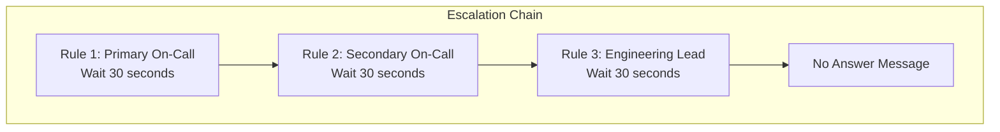
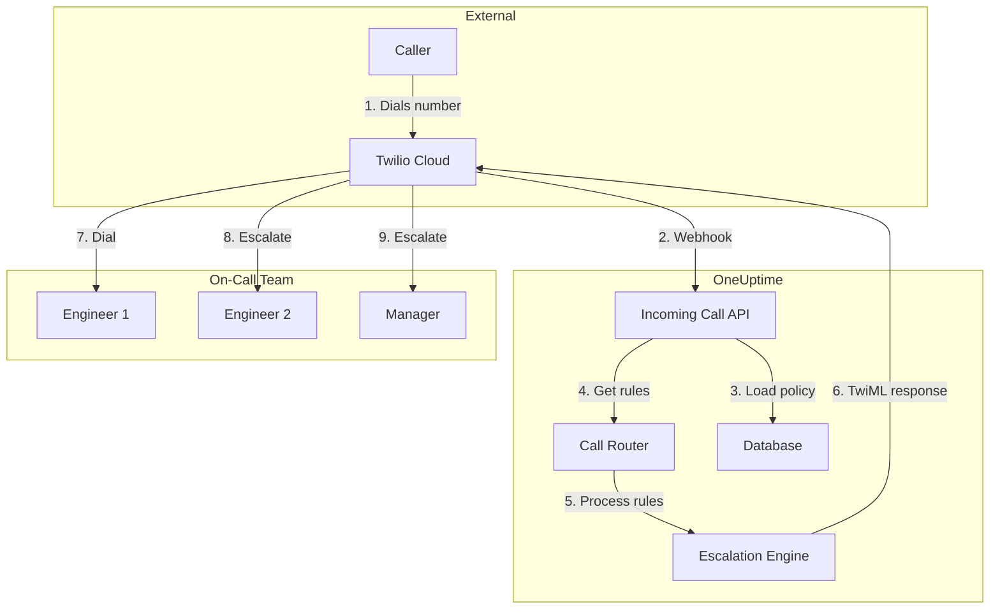

# 來電政策（Twilio 整合）

來電政策（Incoming Call Policy）讓外部來電者可以透過撥打專屬電話號碼聯繫到您的待命工程師。當有人來電時，OneUptime 會依據您所設定的升級規則路由該通電話，直到有工程師接聽為止。

## 運作方式

## 通話路由流程

## 先決條件

- 一個 Twilio 帳戶 - 請於 [https://www.twilio.com](https://www.twilio.com) 建立帳戶
- 您的 Twilio Account SID 與 Auth Token
- 可存取您自架的 OneUptime 執行個體

## 概覽

來電政策功能的運作方式如下：

1. 在 Twilio 電話號碼上接收來電
2. 播放可自訂的問候訊息
3. 透過升級規則（團隊、排程或使用者）路由通話
4. 將來電者連接到第一位有空的待命工程師
5. 若無人接聽，則升級到下一條規則

由於您是自架 OneUptime，您需要設定自己的 Twilio 帳戶。如此一來您即可完全掌控自己的電話號碼與帳單。

## 步驟 1：建立 Twilio 帳戶

1. 前往 [https://www.twilio.com](https://www.twilio.com) 並註冊一個帳戶
2. 完成驗證流程
3. 在 Twilio Console 儀表板上記下您的 **Account SID** 與 **Auth Token**

## 步驟 2：在 OneUptime 中設定 Call/SMS Config

1. 登入您的 OneUptime 儀表板
2. 前往 **Project Settings** > **Call & SMS** > **Custom Call/SMS Config**
3. 點選 **Create Custom Call/SMS Config**
4. 填寫以下欄位：
   - **Name**：易於辨識的名稱（例如「Production Twilio Config」）
   - **Description**：選填的描述
   - **Twilio Account SID**：您的 Twilio Account SID（以 `AC` 開頭）
   - **Twilio Auth Token**：您的 Twilio Auth Token
   - **Twilio Primary Phone Number**：您 Twilio 帳戶中用於外撥通話的電話號碼
5. 點選 **Save**

## 步驟 3：建立來電政策

1. 前往 **On-Call Duty** > **Incoming Call Policies**
2. 點選 **Create Incoming Call Policy**
3. 填寫以下欄位：
   - **Name**：易於辨識的名稱（例如「Support Hotline」）
   - **Description**：選填的描述
4. 點選 **Save**

## 步驟 4：將 Twilio 設定連結至政策

1. 開啟您剛建立的來電政策
2. 在 **Phone Number Routing** 卡片中，找到 **Step 2: Link Twilio Configuration**
3. 點選 **Select Twilio Config**，並選擇您在步驟 2 所建立的設定
4. 儲存該選擇

## 步驟 5：設定電話號碼

設定電話號碼有兩種選項可供選擇：

### 選項 A：使用既有的 Twilio 電話號碼

如果您的 Twilio 帳戶中已有電話號碼：

1. 在 **Phone Number** 卡片中，點選 **Use Existing Number**
2. OneUptime 會從您的 Twilio 帳戶擷取所有電話號碼
3. 選擇您要使用的電話號碼
4. 點選 **Use This** 將其指派給該政策

> **注意**：如果該電話號碼已設定 webhook，則該設定會被更新為指向 OneUptime。

### 選項 B：購買新的電話號碼

若要直接從 OneUptime 購買新的電話號碼：

1. 在 **Phone Number** 卡片中，點選 **Buy New Number**
2. 從下拉選單中選擇一個 **Country**
3. 選填輸入 **Area Code**（例如：415 代表舊金山）
4. 選填輸入號碼應 **Contain** 的數字（例如：555）
5. 點選 **Search** 以尋找可用的號碼
6. 從結果中選擇一個電話號碼
7. 點選 **Purchase** 以購買該號碼

該電話號碼將從您的 Twilio 帳戶購買，且 webhook 會 **自動設定** - 無需手動設定！

## 步驟 6：設定升級規則

升級規則決定通話如何被路由：

1. 開啟您的來電政策
2. 前往 **Escalation Rules** 分頁
3. 點選 **Add Escalation Rule**
4. 設定該規則：
   - **Order**：優先順序（數字越小者越先嘗試）
   - **Escalate After (seconds)**：在升級之前要等待多久
   - **On-Call Schedule**：選擇一個排程，以路由給當下待命的人
   - **Teams**：選擇特定的團隊
   - **Users**：選擇特定的使用者
5. 視需要新增其他升級規則

### 升級規則範例

| 順序 | 升級等待時間 | 目標對象 |
|-------|----------------|--------|
| 1 | 30 秒 | 主要待命排程 |
| 2 | 30 秒 | 次要待命排程 |
| 3 | 30 秒 | 工程團隊主管 |

## 步驟 7：設定語音訊息（選填）

自訂來電者所聽到的訊息：

1. 開啟您的來電政策
2. 前往 **Settings**
3. 進行設定：
   - **Greeting Message**：通話被接通時所播放的訊息
   - **No Answer Message**：所有升級規則都失敗時所播放的訊息
   - **No One Available Message**：無人待命時所播放的訊息

## 設定選項

### 政策設定

| 設定 | 描述 | 預設值 |
|---------|-------------|---------|
| Greeting Message | 通話被接通時所播放的 TTS 訊息 | "Please wait while we connect you to the on-call engineer." |
| No Answer Message | 所有升級規則都失敗時的訊息 | "No one is available. Please try again later." |
| No One Available Message | 無人待命時的訊息 | "We're sorry, but no on-call engineer is currently available." |
| Repeat Policy If No One Answers | 若全部失敗則從第一條規則重新開始 | 停用 |
| Repeat Policy Times | 最大重複嘗試次數 | 1 |

### 升級規則設定

| 設定 | 描述 |
|---------|-------------|
| Order | 優先順序（1 = 最高優先） |
| Escalate After Seconds | 嘗試下一條規則前的等待時間（預設：30 秒） |
| On-Call Schedule | 路由給當下待命的人 |
| Teams | 路由給所選團隊的所有成員 |
| Users | 路由給特定的使用者 |

## 檢視通話記錄

若要檢視來電歷史記錄：

1. 前往 **On-Call Duty** > **Incoming Call Policies**
2. 點選您的政策
3. 前往 **Call Logs** 分頁

記錄會顯示：
- 來電者的電話號碼
- 通話狀態（Completed、No Answer、Failed 等）
- 接聽該通電話的人
- 通話時長
- 時間戳記

## 使用者電話號碼設定

使用者必須擁有經過驗證的電話號碼，才能接收來電：

1. 使用者前往 **User Settings** > **Notification Methods**
2. 在 **Incoming Call Numbers** 之下新增一個電話號碼
3. 透過 SMS 驗證碼驗證該電話號碼

只有擁有經過驗證電話號碼的使用者，才能透過升級規則被撥打。

## 釋出電話號碼

如果您不再需要某個電話號碼：

1. 開啟您的來電政策
2. 在 **Phone Number** 卡片中，點選 **Release Number**
3. 確認釋出

> **警告**：已釋出的號碼會被退還給 Twilio，且可能無法再次購買。

## 疑難排解

### 未接收到來電

- 確認 Twilio 設定已正確連結至該政策
- 檢查您的 OneUptime 執行個體可從網際網路存取
- 確認 Twilio Account SID 與 Auth Token 正確無誤
- 檢查 Twilio Console 中的錯誤記錄

### 通話未連接到工程師

- 確認使用者在其通知設定中已驗證電話號碼
- 檢查升級規則是否已正確設定
- 確保待命排程在當下時段有指派使用者
- 確認該政策已啟用

### 音質問題

- 確保您的伺服器具備穩定的網際網路連線
- 檢查 Twilio 的狀態頁面是否有任何進行中的問題
- 確認電話號碼格式正確（E.164 格式：+15551234567）

## 安全性考量

- 妥善保管您的 Twilio Auth Token，切勿公開洩漏
- 為您的 OneUptime 執行個體使用 HTTPS
- OneUptime 會驗證 webhook 簽章，以確保請求確實來自 Twilio
- 請考慮限制哪些電話號碼可以撥打您的來電政策

## 架構概覽

## 支援

如有來電政策功能的相關問題，請：

1. 檢查 Twilio Console 中的錯誤記錄
2. 檢視 OneUptime 伺服器記錄
3. 透過 [hello@oneuptime.com](mailto:hello@oneuptime.com) 聯繫支援團隊
