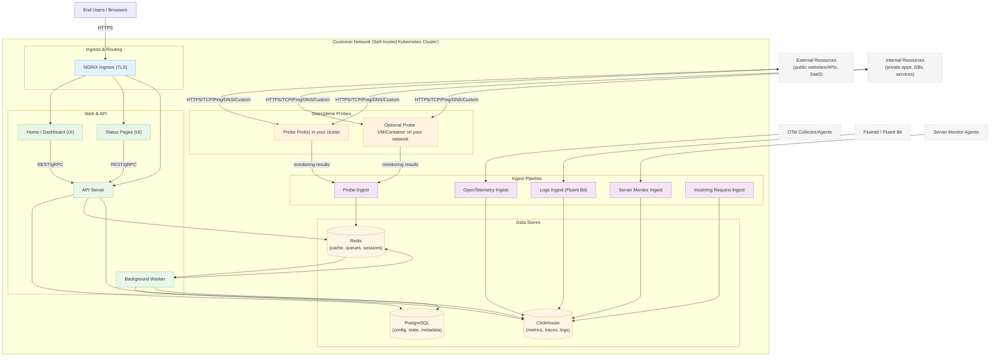

# OneUptime 自架架構

此圖表展示了 OneUptime 在您的環境中自架時（例如在您的 Kubernetes 叢集中）通常的樣貌，包括 Probe 如何監控內部與外部資源。

## 此圖表展示的內容

- 終端使用者透過您叢集的 Ingress（NGINX）存取 OneUptime，由其路由至 UI 與 API。
- 核心服務會讀取/寫入狀態至 PostgreSQL、Redis 與 ClickHouse。
- Probe 可以在您的叢集內執行（建議）以及／或在您網路的其他位置執行。它們可以監控：
  - 您防火牆後方的內部／私有服務。
  - 網際網路上的外部／公開資源。
- Probe 結果會傳送至您叢集內的 Probe Ingest，透過 Redis 排入佇列，並由 Background Worker 處理後寫入您的資料儲存區。
- 遙測資料（指標／追蹤／日誌）以及伺服器／代理程式資料可透過專用的擷取服務進行擷取，並儲存於 ClickHouse 中。

> 注意：如果您使用外部的 PostgreSQL、Redis 或 ClickHouse 而非內建的版本，則來自 API／Worker／Ingest 的連線會指向您的外部端點。邏輯流程維持不變。
