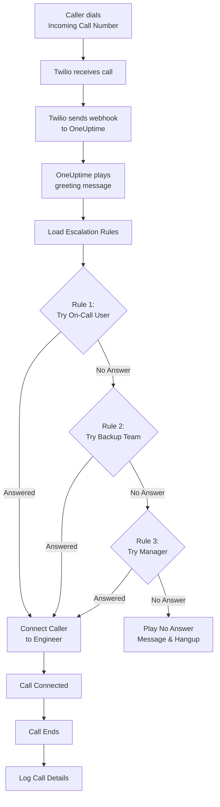
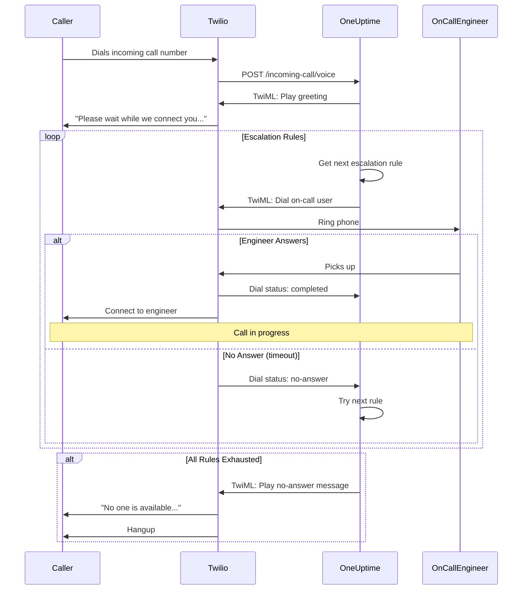
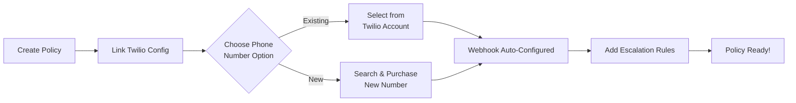
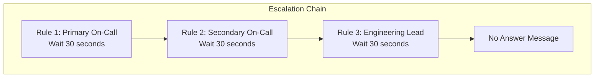
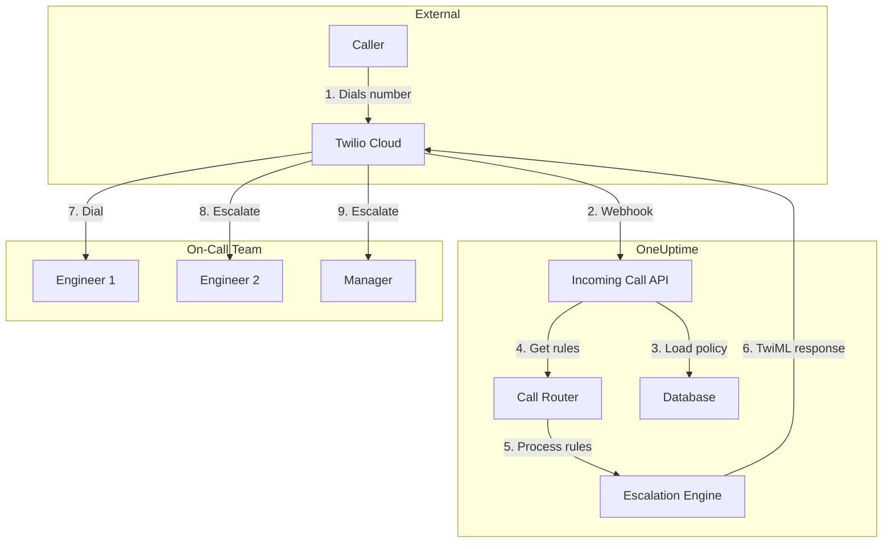

# Incoming Call Policy (Twilio Integration)

Incoming Call Policies allow external callers to reach your on-call engineers by dialing a dedicated phone number. When someone calls, OneUptime routes the call through your configured escalation rules until an engineer answers.

## How It Works

## Call Routing Flow

## Prerequisites

- A Twilio account - Create one at [https://www.twilio.com](https://www.twilio.com)
- Your Twilio Account SID and Auth Token
- Access to your OneUptime self-hosted instance

## Overview

The Incoming Call Policy feature works by:

1. Receiving incoming calls on a Twilio phone number
2. Playing a customizable greeting message
3. Routing the call through escalation rules (teams, schedules, or users)
4. Connecting the caller to the first available on-call engineer
5. Escalating to the next rule if no one answers

Since you're self-hosting OneUptime, you'll need to configure your own Twilio account. This gives you full control over your phone numbers and billing.

## Step 1: Create a Twilio Account

1. Go to [https://www.twilio.com](https://www.twilio.com) and sign up for an account
2. Complete the verification process
3. Note down your **Account SID** and **Auth Token** from the Twilio Console dashboard

## Step 2: Configure Call/SMS Config in OneUptime

1. Log in to your OneUptime Dashboard
2. Go to **Project Settings** > **Call & SMS** > **Custom Call/SMS Config**
3. Click **Create Custom Call/SMS Config**
4. Fill in the following fields:
   - **Name**: A friendly name (e.g., "Production Twilio Config")
   - **Description**: Optional description
   - **Twilio Account SID**: Your Twilio Account SID (starts with `AC`)
   - **Twilio Auth Token**: Your Twilio Auth Token
   - **Twilio Primary Phone Number**: A phone number from your Twilio account for outbound calls
5. Click **Save**

## Step 3: Create an Incoming Call Policy

1. Go to **On-Call Duty** > **Incoming Call Policies**
2. Click **Create Incoming Call Policy**
3. Fill in the following fields:
   - **Name**: A friendly name (e.g., "Support Hotline")
   - **Description**: Optional description
4. Click **Save**

## Step 4: Link Twilio Configuration to Policy

1. Open your newly created Incoming Call Policy
2. In the **Phone Number Routing** card, find **Step 2: Link Twilio Configuration**
3. Click **Select Twilio Config** and choose the configuration you created in Step 2
4. Save the selection

## Step 5: Configure a Phone Number

You have two options for setting up a phone number:

### Option A: Use an Existing Twilio Phone Number

If you already have phone numbers in your Twilio account:

1. In the **Phone Number** card, click **Use Existing Number**
2. OneUptime will fetch all phone numbers from your Twilio account
3. Select the phone number you want to use
4. Click **Use This** to assign it to the policy

> **Note**: If the phone number already has a webhook configured, it will be updated to point to OneUptime.

### Option B: Purchase a New Phone Number

To buy a new phone number directly from OneUptime:

1. In the **Phone Number** card, click **Buy New Number**
2. Select a **Country** from the dropdown
3. Optionally enter an **Area Code** (e.g., 415 for San Francisco)
4. Optionally enter digits the number should **Contain** (e.g., 555)
5. Click **Search** to find available numbers
6. Select a phone number from the results
7. Click **Purchase** to buy the number

The phone number will be purchased from your Twilio account and the webhook will be **automatically configured** - no manual setup required!

## Step 6: Configure Escalation Rules

Escalation rules determine how calls are routed:

1. Open your Incoming Call Policy
2. Go to the **Escalation Rules** tab
3. Click **Add Escalation Rule**
4. Configure the rule:
   - **Order**: The priority order (lower numbers are tried first)
   - **Escalate After (seconds)**: How long to wait before escalating
   - **On-Call Schedule**: Select a schedule to route to whoever is on-call
   - **Teams**: Select specific teams
   - **Users**: Select specific users
5. Add additional escalation rules as needed

### Escalation Rule Example

| Order | Escalate After | Target |
|-------|----------------|--------|
| 1 | 30 seconds | Primary On-Call Schedule |
| 2 | 30 seconds | Secondary On-Call Schedule |
| 3 | 30 seconds | Engineering Team Lead |

## Step 7: Configure Voice Messages (Optional)

Customize the messages callers hear:

1. Open your Incoming Call Policy
2. Go to **Settings**
3. Configure:
   - **Greeting Message**: Played when the call is answered
   - **No Answer Message**: Played when all escalation rules fail
   - **No One Available Message**: Played when no one is on-call

## Configuration Options

### Policy Settings

| Setting | Description | Default |
|---------|-------------|---------|
| Greeting Message | TTS message played when call is answered | "Please wait while we connect you to the on-call engineer." |
| No Answer Message | Message when all escalation rules fail | "No one is available. Please try again later." |
| No One Available Message | Message when no one is on-call | "We're sorry, but no on-call engineer is currently available." |
| Repeat Policy If No One Answers | Restart from first rule if all fail | Disabled |
| Repeat Policy Times | Maximum repeat attempts | 1 |

### Escalation Rule Settings

| Setting | Description |
|---------|-------------|
| Order | Priority order (1 = highest priority) |
| Escalate After Seconds | Wait time before trying next rule (default: 30s) |
| On-Call Schedule | Route to whoever is currently on-call |
| Teams | Route to all members of selected teams |
| Users | Route to specific users |

## Viewing Call Logs

To view incoming call history:

1. Go to **On-Call Duty** > **Incoming Call Policies**
2. Click on your policy
3. Go to the **Call Logs** tab

The logs show:
- Caller phone number
- Call status (Completed, No Answer, Failed, etc.)
- Who answered the call
- Call duration
- Timestamp

## User Phone Number Configuration

For users to receive incoming calls, they must have a verified phone number:

1. Users go to **User Settings** > **Notification Methods**
2. Add a phone number under **Incoming Call Numbers**
3. Verify the phone number via SMS code

Only users with verified phone numbers can be called through escalation rules.

## Releasing a Phone Number

If you no longer need a phone number:

1. Open your Incoming Call Policy
2. In the **Phone Number** card, click **Release Number**
3. Confirm the release

> **Warning**: Released numbers are returned to Twilio and may not be available for re-purchase.

## Troubleshooting

### Calls not being received

- Verify the Twilio configuration is correctly linked to the policy
- Check that your OneUptime instance is accessible from the internet
- Verify the Twilio Account SID and Auth Token are correct
- Check the Twilio Console for error logs

### Calls not connecting to engineers

- Verify users have verified phone numbers in their notification settings
- Check that escalation rules are properly configured
- Ensure on-call schedules have users assigned for the current time
- Verify the policy is enabled

### Audio quality issues

- Ensure your server has stable internet connectivity
- Check Twilio's status page for any ongoing issues
- Verify phone numbers are in the correct format (E.164 format: +15551234567)

## Security Considerations

- Keep your Twilio Auth Token secure and never expose it publicly
- Use HTTPS for your OneUptime instance
- OneUptime validates webhook signatures to ensure requests come from Twilio
- Consider restricting which phone numbers can call your incoming call policies

## Architecture Overview

## Support

For issues with the Incoming Call Policy feature, please:

1. Check the Twilio Console for error logs
2. Review the OneUptime server logs
3. Contact support at [hello@oneuptime.com](mailto:hello@oneuptime.com)
