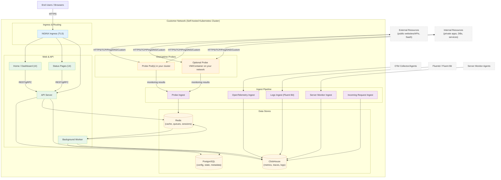

# OneUptime Self-Hosted Architecture

This diagram shows how OneUptime typically looks when self-hosted in your environment (for example, in your Kubernetes cluster), including how Probes monitor both internal and external resources.

## What this shows
- End users access OneUptime through your cluster’s Ingress (NGINX), which routes to the UI and API.
- Core services read/write state to PostgreSQL, Redis, and ClickHouse.
- Probes can run inside your cluster (recommended) and/or elsewhere on your network. They can monitor:
  - Internal/private services behind your firewall.
  - External/public resources on the internet.
- Probe results are sent to Probe Ingest inside your cluster, queued via Redis, and processed by the Background Worker into your data stores.
- Telemetry (metrics/traces/logs) and server/agent data can be ingested via dedicated ingest services and stored in ClickHouse.

> Note: If you use external PostgreSQL, Redis, or ClickHouse instead of the built-in ones, the connections from API/Worker/Ingest point to your external endpoints. The logical flow remains the same.
