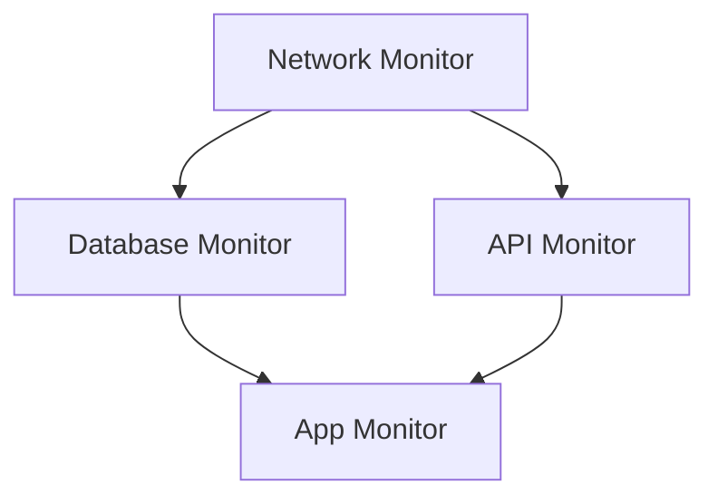

# Alert Suppression Feature Design for OneUptime

## Executive Summary

This document outlines the design and implementation plan for an **Alert Suppression** feature in OneUptime to help reduce alert noise and fatigue. Based on analysis of the current codebase, OneUptime has basic alert deduplication but significant opportunity exists to add comprehensive suppression features.

---

## Current State Analysis

### What OneUptime Already Has

| Feature | Location | Description |
|---------|----------|-------------|
| **Basic Alert Deduplication** | `Common/Server/Utils/Monitor/MonitorAlert.ts` | Skips creating new alerts if an open alert exists for the same `createdCriteriaId` |
| **Auto-Resolve Alerts** | `Common/Server/Utils/Monitor/MonitorAlert.ts` | Automatically resolves alerts when criteria no longer match |
| **Exception Fingerprinting** | `Telemetry/Utils/Exception.ts` | Groups similar exceptions using fingerprint (normalizes dynamic values like IDs, timestamps, etc.) |
| **Exception Resolution/Archive** | `Common/Models/DatabaseModels/TelemetryException.ts` | Has `isResolved`, `isArchived`, `markedAsResolvedAt` fields |
| **Scheduled Maintenance** | `Common/Server/Services/ScheduledMaintenanceService.ts` | Planned maintenance windows (but no alert suppression integration) |
| **On-Call Escalation Policies** | `Common/Models/DatabaseModels/OnCallDutyPolicy.ts` | Routing, schedules, escalation rules |
| **User Notification Preferences** | `Common/Types/NotificationSetting/NotificationSettingEventType.ts` | User-level control over notification types |

### Current Deduplication Logic

Located in `MonitorAlert.ts`:

```typescript
const alreadyOpenAlert: Alert | undefined = openAlerts.find(
  (alert: Alert) => {
    return (
      alert.createdCriteriaId ===
      input.criteriaInstance.data?.id.toString()
    );
  },
);

const hasAlreadyOpenAlert: boolean = Boolean(alreadyOpenAlert);

if (hasAlreadyOpenAlert) {
  // Skip creating new alert
  continue;
}
```

---

## Recommended Alert Suppression Features

### 1. Time-Based Suppression (Alert Throttling)

**What:** Limit how frequently the same alert type can fire.

**Schema additions to MonitorCriteriaInstance:**

```typescript
interface CriteriaAlert {
  // ... existing fields
  suppressionConfig?: {
    enabled: boolean;
    windowMinutes: number;        // Suppress duplicates within this window
    maxAlertsPerWindow: number;   // Max alerts allowed in window (default: 1)
  };
}
```

**Implementation locations:**
- Modify `Common/Types/Monitor/MonitorCriteriaInstance.ts` to add suppression config
- Update `Common/Server/Utils/Monitor/MonitorAlert.ts` `criteriaMetCreateAlertsAndUpdateMonitorStatus` to check last alert time

**Example Use Case:**
- CPU alert fires → suppress additional CPU alerts for same monitor for 15 minutes
- Prevents alert storms during incident escalation

---

### 2. Maintenance Window Integration

**What:** Suppress alerts during scheduled maintenance.

**Schema:**

```typescript
interface MaintenanceSuppressionConfig {
  suppressAlertsForMonitorsInMaintenance: boolean;
  suppressNotificationsOnly: boolean;  // Create alert but don't notify
}
```

**Implementation:**
- Modify `Common/Server/Services/AlertService.ts` `onBeforeCreate` to check if monitor is in active maintenance
- Link with existing `Common/Models/DatabaseModels/ScheduledMaintenance.ts` which already has `monitors` relation

**Logic:**

```typescript
// In AlertService.onBeforeCreate
const activeMaintenances = await ScheduledMaintenanceService.findBy({
  query: {
    monitors: { _id: alert.monitorId },
    startsAt: QueryHelper.lessThanOrEqual(currentDate),
    endsAt: QueryHelper.greaterThanOrEqual(currentDate),
  }
});

if (activeMaintenances.length > 0) {
  // Either suppress alert creation or mark as suppressed
  alert.isSuppressed = true;
  alert.suppressedReason = `Monitor in scheduled maintenance: ${activeMaintenances[0].title}`;
}
```

---

### 3. Alert Grouping / Clustering

**What:** Group related alerts into a single notification (similar to exception fingerprinting).

**New Model: AlertGroup**

```typescript
interface AlertGroup {
  id: ObjectID;
  projectId: ObjectID;
  fingerprint: string;              // Hash of grouping key
  groupingKey: string;              // monitor_id + criteria_id + severity
  alerts: Array<Alert>;             // Child alerts
  alertCount: number;
  firstAlertAt: Date;
  lastAlertAt: Date;
  groupWindowMinutes: number;       // How long to group (default: 15min)
  status: 'open' | 'acknowledged' | 'resolved';
}
```

**Fingerprint strategy** (based on existing exception fingerprinting):

```typescript
function getAlertGroupFingerprint(alert: Alert): string {
  const key = [
    alert.projectId,
    alert.monitorId,
    alert.createdCriteriaId,
    alert.alertSeverityId
  ].join('-');
  return Crypto.getSha256Hash(key);
}
```

**Benefits:**
- Single notification for 100 related alerts
- Cleaner alert dashboard
- Faster triage

---

### 4. Dependency-Based Suppression

**What:** Suppress downstream alerts when upstream dependency is down.

**New Model: MonitorDependency**

```typescript
interface MonitorDependency {
  monitorId: ObjectID;
  dependsOnMonitorId: ObjectID;
  suppressWhenDependencyDown: boolean;
}
```

**Logic:**



1. Before creating alert, check if monitor has dependencies
2. If dependency monitor has active alert/incident, suppress child alerts
3. Mark suppressed alerts with `suppressedReason: "Dependency {name} is down"`

**Example:**
- Network goes down → Only alert for Network
- Suppress Database, API, App alerts (they're just symptoms)

---

### 5. Intelligent Flapping Detection

**What:** Detect and suppress alerts from unstable monitors.

**Schema:**

```typescript
interface FlappingDetection {
  enabled: boolean;
  evaluationWindowMinutes: number;   // e.g., 10 minutes
  stateChangeThreshold: number;      // e.g., 5 state changes
  cooldownMinutes: number;           // Stop alerting for this long
}
```

**Implementation:**
- Track state change count per monitor in `MonitorAlert.ts`
- If threshold exceeded, suppress new alerts and notify once: "Monitor X is flapping"
- After cooldown, resume normal alerting

**Example:**
- Monitor goes: UP → DOWN → UP → DOWN → UP → DOWN (6 changes in 5 min)
- Detected as flapping
- Single alert: "Production API is flapping (6 state changes in 5 minutes)"
- Suppress further alerts for 30 minutes

---

### 6. Notification-Level Suppression (Snooze)

**What:** Snooze notifications for a specific alert or monitor without closing the alert.

**Schema additions:**

```typescript
// Add to Alert model
interface AlertSnooze {
  snoozedUntil?: Date;
  snoozedByUserId?: ObjectID;
  snoozeReason?: string;
}

// Add to Monitor model  
interface MonitorSnooze {
  notificationsSnoozedUntil?: Date;
  snoozedByUserId?: ObjectID;
}
```

**UI Actions:**
- "Snooze for 1 hour"
- "Snooze for 4 hours"
- "Snooze until tomorrow 9 AM"
- "Snooze until resolved"

**Implementation:**
- In notification sending logic, check if alert/monitor is snoozed
- If snoozed, skip notification but keep alert open
- Send notification when snooze expires if alert still active

---

### 7. Suppression Rules Engine

**What:** Flexible rule-based suppression at project level.

**New Model: AlertSuppressionRule**

```typescript
@Entity({ name: "AlertSuppressionRule" })
export default class AlertSuppressionRule extends BaseModel {
  @Column() projectId: ObjectID;
  @Column() name: string;
  @Column() description: string;
  @Column() enabled: boolean;
  
  // Conditions (when to suppress)
  @Column() conditions: {
    monitorLabels?: Array<ObjectID>;     // Match monitors with these labels
    alertSeverities?: Array<ObjectID>;   // Match these severities
    timeWindow?: {                        // Time-based rules
      days: Array<DayOfWeek>;            // ['Saturday', 'Sunday']
      startTime: string;                  // "22:00"
      endTime: string;                    // "06:00"
      timezone: string;
    };
    monitorIds?: Array<ObjectID>;
    monitorTypes?: Array<MonitorType>;
  };
  
  // Actions
  @Column() action: 'suppress_all' | 'suppress_notifications' | 'reduce_severity' | 'group';
  @Column() startsAt?: Date;
  @Column() endsAt?: Date;
  @Column() createdByUserId: ObjectID;
}
```

**Example Rules:**

| Rule Name | Condition | Action |
|-----------|-----------|--------|
| Weekend Quiet Hours | Saturday-Sunday, all monitors | Suppress notifications |
| Dev Environment Silence | Label: "environment:dev" | Suppress all |
| Low Priority Throttle | Severity: Low | Group (1 notification per hour) |
| After Hours | 10 PM - 6 AM weekdays | Reduce severity by 1 level |

---

## Industry Comparison

### How Modern Incident/Alert Management Systems Handle This

| Platform | Key Features |
|----------|--------------|
| **PagerDuty** | Event Intelligence (ML-based grouping), Alert Grouping by time/content, Suppression Rules, Snooze, Maintenance Windows |
| **Opsgenie** | Alert Deduplication, Heartbeat Monitoring, Quiet Hours, Maintenance Windows, Flapping Detection |
| **Datadog** | Downtime Scheduling, Composite Monitors (dependency), Multi-alert Monitors, Renotify intervals |
| **Grafana Alerting** | Grouped Notifications, Silences (time-based), Inhibition Rules (dependency) |
| **Splunk On-Call** | Transient Alerts, Maintenance Mode, Alert Rules Engine |

### Industry Best Practices

1. **Deduplication** - Same alert = same incident (already partially implemented)
2. **Grouping** - Related alerts bundle into single notification (by service, by time window)
3. **Throttling** - Rate limiting on same alert type
4. **Dependency awareness** - Don't page for DB when network is down
5. **Maintenance mode** - Suppress during known work
6. **Flapping protection** - Don't alert on unstable services
7. **Snooze/Acknowledge** - Temporary silence without resolution
8. **Smart routing** - Severity-based escalation delays

---

## Implementation Priority

| Priority | Feature | Effort | Impact | Dependencies |
|----------|---------|--------|--------|--------------|
| **P0** | Maintenance Window Alert Suppression | Low | High | Existing ScheduledMaintenance model |
| **P0** | Alert Snooze (per alert) | Low | High | Alert model update |
| **P1** | Time-Based Throttling | Medium | High | New suppression config in criteria |
| **P1** | Alert Grouping | Medium | High | New AlertGroup model |
| **P2** | Suppression Rules Engine | High | Very High | New AlertSuppressionRule model |
| **P2** | Dependency-Based Suppression | Medium | Medium | New MonitorDependency model |
| **P3** | Flapping Detection | Medium | Medium | State tracking enhancement |
| **P3** | ML-Based Alert Correlation | Very High | Very High | Data collection, ML infrastructure |

---

## Data Model Changes

### New Fields on Alert Model

File: `Common/Models/DatabaseModels/Alert.ts`

```typescript
// Suppression tracking
@Column() public isSuppressed?: boolean;
@Column() public suppressedReason?: string;
@Column() public suppressedByRuleId?: ObjectID;

// Snooze
@Column() public snoozedUntil?: Date;
@Column() public snoozedByUserId?: ObjectID;

// Grouping
@Column() public alertGroupId?: ObjectID;
@Column() public isGroupParent?: boolean;
```

### New Fields on Monitor Model

File: `Common/Models/DatabaseModels/Monitor.ts`

```typescript
// Snooze
@Column() public notificationsSnoozedUntil?: Date;
@Column() public snoozedByUserId?: ObjectID;

// Flapping detection
@Column() public flappingDetectionEnabled?: boolean;
@Column() public flappingStateChangeThreshold?: number;
@Column() public flappingEvaluationWindowMinutes?: number;
```

### New Models Required

1. **AlertGroup** - For grouping related alerts
2. **AlertSuppressionRule** - For flexible suppression rules
3. **MonitorDependency** - For dependency-based suppression

---

## API Endpoints

### Alert Snooze

```
POST /api/alert/{alertId}/snooze
Body: { 
  snoozeDurationMinutes: number,
  reason?: string 
}

DELETE /api/alert/{alertId}/snooze
```

### Suppression Rules

```
GET    /api/alert-suppression-rule
POST   /api/alert-suppression-rule
GET    /api/alert-suppression-rule/{id}
PUT    /api/alert-suppression-rule/{id}
DELETE /api/alert-suppression-rule/{id}
```

### Monitor Snooze

```
POST /api/monitor/{monitorId}/snooze
Body: { 
  snoozeDurationMinutes: number,
  reason?: string 
}

DELETE /api/monitor/{monitorId}/snooze
```

---

## UI/UX Considerations

### Alert List View

- Add "Suppressed" filter option
- Show snooze indicator (🔕) on snoozed alerts
- Group indicator for grouped alerts (e.g., "3 related alerts")

### Alert Detail View

- Snooze button with duration picker
- Show suppression reason if suppressed
- Link to related alerts in group

### Monitor Settings

- Snooze toggle with duration
- Dependency configuration
- Flapping detection settings

### Project Settings

- Suppression rules management
- Global maintenance window integration toggle
- Default throttling configuration

---

## Metrics & Observability

Track suppression effectiveness:

```typescript
// Metrics to collect
alertsSuppressionMetrics = {
  totalAlertsCreated: number,
  alertsSuppressedByMaintenance: number,
  alertsSuppressedByThrottling: number,
  alertsSuppressedByDependency: number,
  alertsSuppressedByRules: number,
  alertsGrouped: number,
  snoozeActions: number,
  avgTimeToAcknowledge: number,  // Should decrease with better suppression
  alertsPerIncident: number,      // Should decrease with grouping
}
```

---

## Migration Strategy

1. **Phase 1**: Add new fields to Alert model (backward compatible)
2. **Phase 2**: Implement maintenance window integration
3. **Phase 3**: Add snooze functionality
4. **Phase 4**: Implement throttling in monitor criteria
5. **Phase 5**: Build suppression rules engine
6. **Phase 6**: Add alert grouping
7. **Phase 7**: Implement dependency-based suppression

---

## Summary

OneUptime has a solid foundation with basic alert deduplication and exception fingerprinting. This roadmap provides a path to significantly reduce alert noise and fatigue through:

1. **Quick Wins**: Integrate alert suppression with existing Scheduled Maintenance, add Snooze functionality
2. **Medium Term**: Implement time-based throttling and alert grouping
3. **Long Term**: Build a flexible suppression rules engine and explore dependency-aware alerting

The exception fingerprinting pattern in `Telemetry/Utils/Exception.ts` provides an excellent template for implementing alert grouping and deduplication at scale.

---

## References

- [PagerDuty Event Intelligence](https://www.pagerduty.com/platform/event-intelligence/)
- [Opsgenie Alert Deduplication](https://support.atlassian.com/opsgenie/docs/what-is-alert-deduplication/)
- [Prometheus Alertmanager Inhibition](https://prometheus.io/docs/alerting/latest/alertmanager/#inhibition)
- [Grafana Alerting Silences](https://grafana.com/docs/grafana/latest/alerting/manage-notifications/create-silence/)
