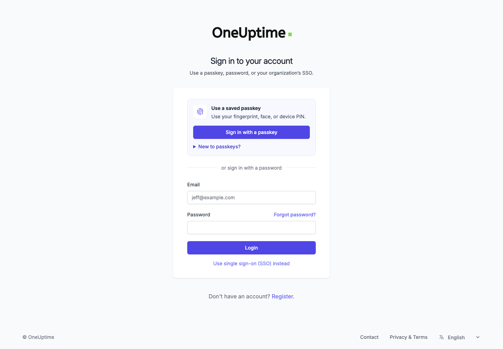
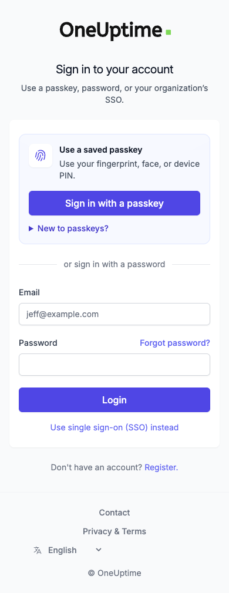
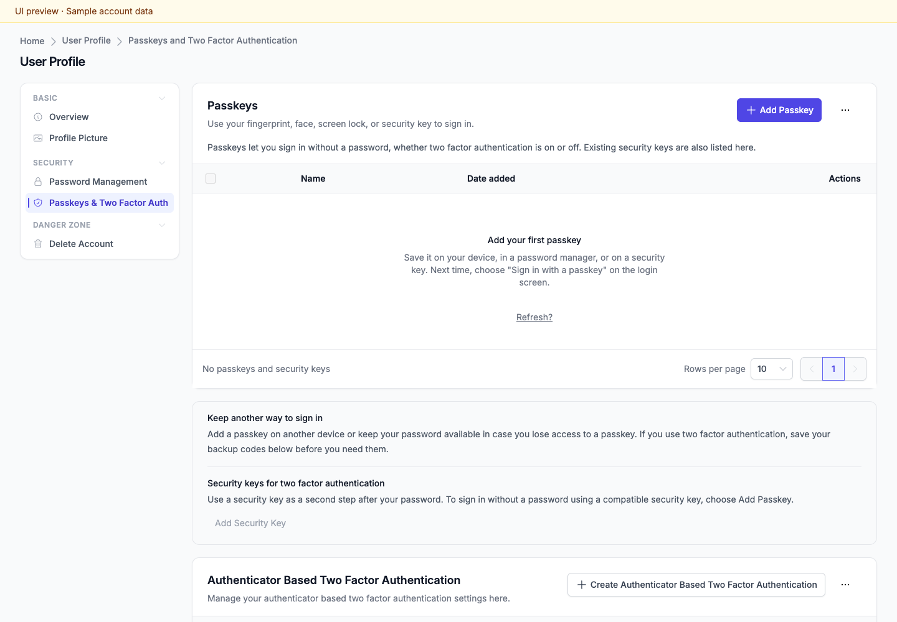
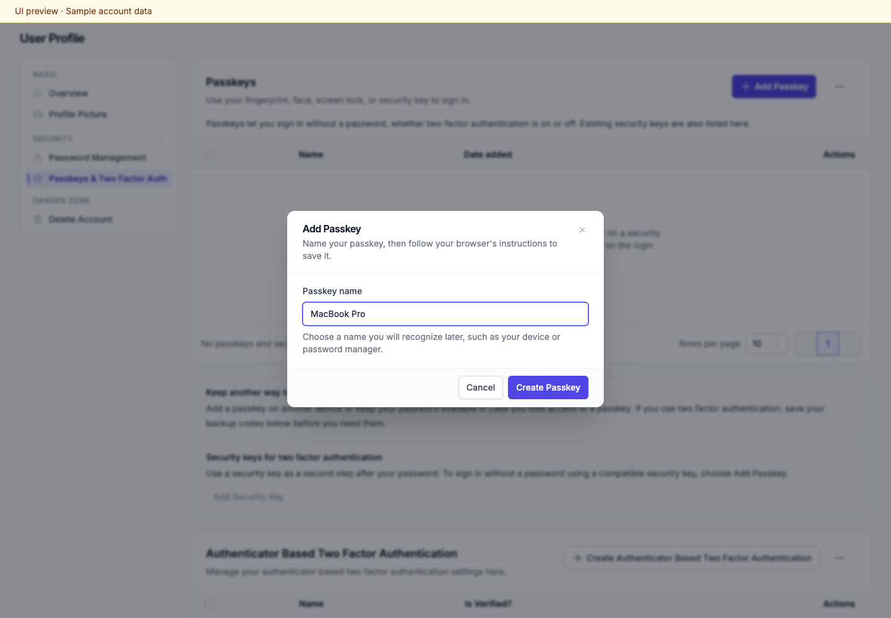
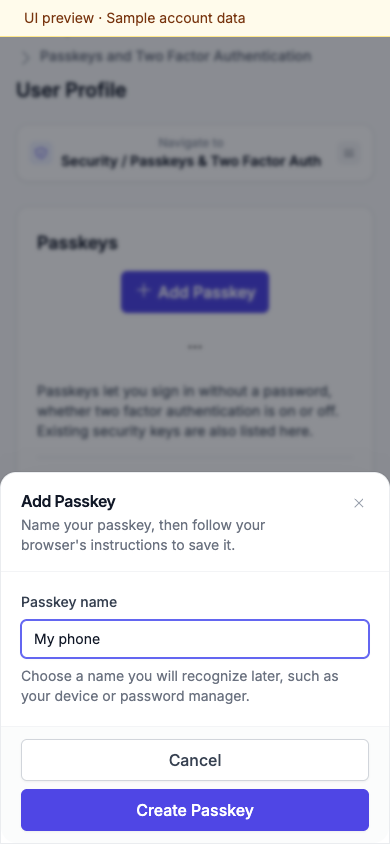
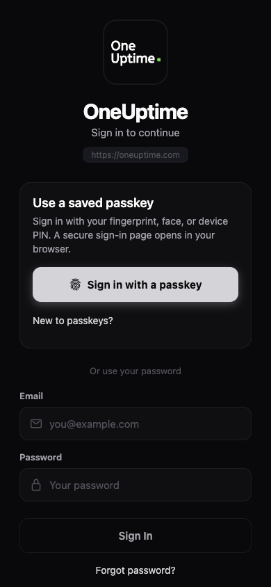
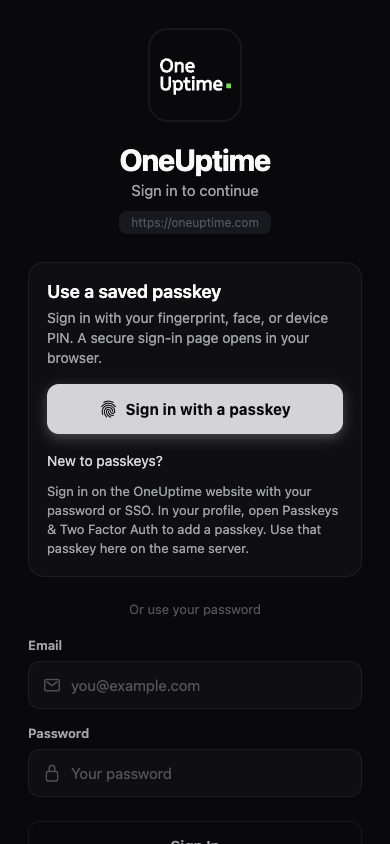
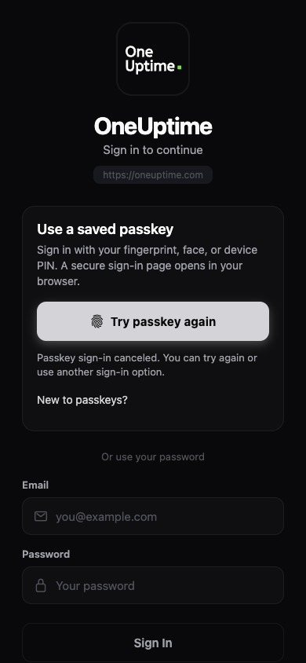
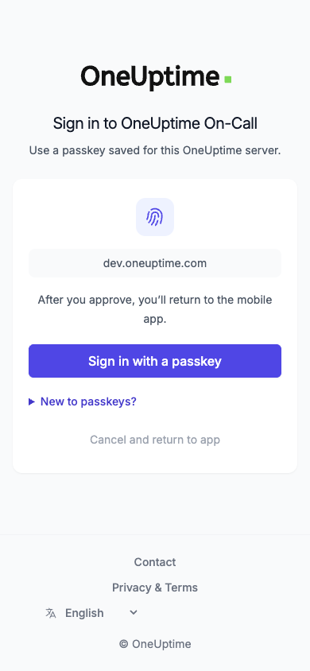

# Passkeys

OneUptime supports signing in with a passkey without entering an email address or password. Your device or password manager verifies the sign-in using your fingerprint, face, device PIN, or a compatible security key. You can use a saved passkey on the website and in the iOS and Android apps.

## Set up a passkey

Sign in to the web dashboard and open **User Profile → Passkeys & Two Factor Auth → Add Passkey**. Give it a recognizable name, choose **Create Passkey**, and follow your device's prompt. Save any recovery codes OneUptime offers before continuing. To use the passkey from your phone, save it with a device or password manager available on that phone.

You can rename or remove a passkey from the same profile page and see when it was added. If you dismiss your device's registration prompt, the setup dialog keeps the name you entered so you can retry. An existing security key registered for two factor authentication may still require your password; use **Add Passkey** to create a credential for passwordless sign-in.

## Sign in on the website

On the login page, choose **Sign in with a passkey** and select the passkey for your account. The page shows when it is waiting for your device and when it is completing sign-in. Choose **Cancel** while the device prompt is open to try again or use your password. If you are new to passkeys, expand **New to passkeys?** for setup instructions.

Web passkeys require HTTPS, or localhost during development, and a browser that supports WebAuthn. The login page explains when passkeys are unavailable. Password and SSO sign-in remain available.

## Sign in on iOS or Android

1. Open the OneUptime app and check the server address shown on the login screen. Use **Change Server** if needed.
2. Choose **Sign in with a passkey**. The app opens a secure sign-in page for that server in your system browser.
3. On that page, choose **Sign in with a passkey** and approve your device's prompt.
4. Return to OneUptime to finish signing in. If the browser remains open after confirmation, use **Return to app**.

Passkey setup and management are available in the web dashboard. The app's **New to passkeys?** help explains where to create one. The existing biometric unlock setting continues to protect an already signed-in app session.

You can cancel while preparing sign-in or choosing your passkey and then retry, use your password, or choose SSO. If you change servers or leave the sign-in screen, the abandoned attempt cannot sign you in later. If the app was closed by the operating system while the browser was open, start a new passkey attempt. If the return to the app expires, choose **Try passkey again**.

## Recovery

Keep another way to access your account, such as your password, your organization's SSO, or another passkey. If your device or password manager cannot provide the saved passkey, use one of those sign-in options. When password sign-in asks for a second factor, saved recovery codes can be used in place of that factor. Removing a passkey from OneUptime revokes that credential's access; you can also remove its saved copy from your device or password manager.

Passkey sign-in requires device verification and does not bypass your organization's SSO requirements.

## Deploying mobile support

Mobile passkey sign-in requires both the updated OneUptime server and an iOS or Android app build that includes this feature. Deploying the server alone does not add the option to an older app. Existing password and SSO sign-in continue to work while users update their apps.

The mobile flow supports OneUptime Cloud and self-hosted servers with HTTPS. Configure the app with the server's HTTPS origin, including its port when using a non-default port. The address must agree with the server's configured public origin. The phone's browser must trust the server's TLS certificate and support passkeys. HTTP development addresses are not supported by the mobile flow.

Authentication happens in the system browser on the selected server, using the same origin and browser-cookie checks as web passkey sign-in. The browser returns a single-use authorization code to the app. That code expires after two minutes and is bound to the originating server, the app's request state, and an S256 PKCE verifier held only by the app. Access and refresh tokens are issued during the app's code exchange and never appear in the callback URL. This browser flow supports self-hosted domains without requiring a separate native app build or domain association file for each server.

## Screenshots

The following screenshots show the actual settings components with sample account data.

The app screenshots below render the actual mobile login components with React Native Web and a simulated authentication session. They are UI previews, not native iOS or Android system-prompt captures.

The secure browser handoff page used by the mobile app:

