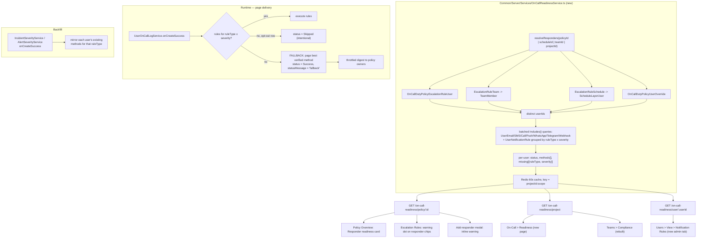

# On-Call Notification Readiness — Implementation Plan

**Problem:** users are added to an on-call policy, have no notification rules or no notification
methods, and silently miss every page routed to them. Nobody — not the user, not the policy
author, not the project owner — finds out until an incident is missed.

Every file path and line number below was verified in this worktree.

---

## 1. Recommendation

Treat "can this responder actually be reached?" as a **first-class, computed property of an
on-call policy**, not as an opt-in compliance report buried under Teams.

Three bets, in priority order:

1. **Never drop a page silently.** Today a responder with no matching rule dead-ends at
   `UserOnCallLogService.ts:329` with a status message nobody reads. Replace that with a
   **verified-method fallback** (page them on whatever verified method they *do* have) and an
   explicit **"Never notify me"** opt-out row so deliberate silence stays possible. This one
   change converts most missed pages into delivered pages, and it ships without any UI.
2. **Compute readiness once, render it everywhere.** One `OnCallReadinessService` that resolves a
   policy's *effective responder set* (direct users + team members + schedule-layer users +
   overrides) and returns per-user readiness. Surface it on the policy overview, inline on
   escalation-rule responder chips, in the add-responder modal, and on a new project-wide
   readiness page.
3. **Let admins fix rules, not identities.** Admins get full CRUD on another user's
   *notification rules* and **read-only, masked** access to their *notification methods*. Admins
   must not be able to add a phone number to someone else's account — that is a paging-hijack
   vector, and it does not solve the "user has no methods at all" case anyway. For that case the
   admin action is **"Send setup reminder"**, not "type in their number".

Non-goal: rebuilding the four per-severity on-call rule pages. They stay; they gain a coverage
summary above them.

---

## 2. Root cause analysis

### 2.1 What already works

Defaults *are* created, in two places:

- `UserNotificationRuleService.addDefaultNotificationRuleForUser()`
  (`Common/Server/Services/UserNotificationRuleService.ts:3083`) — creates a verified `UserEmail`
  and then default rules. Called from `TeamMemberService.ts:367`, `ProjectService.ts:1951`,
  `UserService.ts:444`, and the `MigrateDefaultUserNotificationRule` data migration.
- `addDefaultNotificationRulesForVerifiedMethod()` (`:2845`) — called from `UserEmailAPI.ts:103`,
  `UserSmsAPI.ts:100`, `UserCallAPI.ts:104`, `UserPushAPI.ts:124,342`, `UserWhatsAppAPI.ts:109`,
  `UserWebhookService.ts:78`, `Notification/API/Telegram.ts:266` when a method is verified.

So a user who joins a project today gets an email rule at `notifyAfterMinutes: 0` for every
severity that exists **at that moment**. That last clause is the whole problem.

### 2.2 Gap A — new severities are never backfilled

`createIncidentOnCallRules()` (`:2935`) and `createAlertOnCallRules()` (`:2990`) iterate the
severities that exist *when they run*. Neither `IncidentSeverityService` nor `AlertSeverityService`
has an `onCreateSuccess` hook (confirmed: `IncidentSeverityService.ts` is 176 lines and never
references `UserNotificationRule`).

**Consequence:** add a "Sev4" severity a year into a project and *every existing user* has zero
rules for it. Every Sev4 incident pages nobody. This is the highest-frequency cause.

### 2.3 Gap B — users can delete themselves into silence

The four rule pages (`Pages/UserSettings/{Incident,Alert,IncidentEpisode,Episode}OnCallRules.tsx`)
set `isDeleteable={true}` with no guard. Separately, every method relation on
`UserNotificationRule` is `onDelete: "CASCADE"` — deleting a `UserEmail` silently destroys every
rule pointing at it. Nothing warns "you are a responder on 3 active policies and this was your
last rule."

### 2.4 Gap C — the failure is silent

`UserOnCallLogService.ts:329-357`:

```ts
if (ruleCount.toNumber() === 0) {
  await this.updateOneById({ ... status: UserNotificationExecutionStatus.Error,
    statusMessage: "No notification rules found for this user. ..." });
  await OnCallDutyPolicyExecutionLogTimelineService.updateOneById({ ... });
  return createdItem;
}
```

It writes to the execution log and returns. No email, no banner, no owner notification.
Escalation proceeds on its timer as if the responder had simply not acknowledged — so a
single-level policy pages literally nobody, and a multi-level policy burns its full escalation
delay before reaching someone reachable.

### 2.5 Gap D — admins are blind and powerless

`UserNotificationRule.ts:31-36` and `:48`:

```ts
@TableAccessControl({ create: [Permission.CurrentUser], read: [Permission.CurrentUser],
                      delete: [Permission.CurrentUser], update: [Permission.CurrentUser] })
@CurrentUserCanAccessRecordBy("userId")
```

`TenantPermission.isAccessGrantedOnlyByCurrentUser()`
(`Common/Server/Types/Database/Permissions/TenantPermission.ts:256`) returns true whenever
`CurrentUser` is the *only* permission the caller holds that appears in the model's list, and
`addCurrentUserScopeToQuery()` (`:220`) then force-scopes the query to `userId = me` — and
*throws* `NotAuthorizedException` if the caller explicitly targeted anyone else. Same shape on
`UserEmail`, `UserSMS`, `UserCall`, `UserPush`, `UserWhatsApp`, `UserTelegram`, `UserWebhook`.

There is currently **no API by which an admin can read another user's rules**, let alone edit them.

The precedent for fixing this is `TeamMember`, which carries *both* `@CurrentUserCanAccessRecordBy("userId")`
*and* `ProjectOwner`/`ProjectAdmin` in its `@TableAccessControl` — admins see all rows, plain
members see only their own. That is exactly the shape we want.

### 2.6 Gap E — the one existing surface is too weak to rely on

`TeamComplianceService` + `Pages/Teams/View/Compliance.tsx` + `Components/Team/TeamComplianceStatusTable.tsx`
already exist. They are not enough:

| Limitation | Where |
|---|---|
| Opt-in per team via `TeamComplianceSetting`, **off by default**; table hides itself entirely when unconfigured | `TeamComplianceStatusTable.tsx:176` |
| **Team-scoped only** — a user attached directly to an escalation rule, or via a schedule layer, is never checked | `TeamComplianceService.ts:85` |
| Hard `limit: 100` on members *and* users — silently truncates | `:96`, `:119` |
| **Read-only** — names the problem, offers no fix | `TeamComplianceStatusTable.tsx` |
| Ignores `ruleType` — a rule for `WHEN_USER_GOES_ON_CALL` counts as incident coverage | `:395` |
| Only counts `userCallId/userSmsId/userEmailId/userPushId` — a user whose only method is **Telegram, WhatsApp, or Webhook** is falsely reported non-compliant | `:416`, `:517` |
| N+1: one `findBy` per severity per user | `:388` |

Keep the feature and the page; rebuild it on the shared readiness service below.

---

## 3. Architecture



---

## 4. Phase 1 — Stop the bleeding (backend only, no UI)

Ship this first. It is the only phase that directly stops missed pages, and it is independently
releasable.

### 4.1 Verified-method fallback

`Common/Server/Services/UserOnCallLogService.ts` — replace the `ruleCount === 0` dead-end at
`:329`:

```
if no rules match (ruleType x severity):
  if an explicit opt-out row exists for this ruleType x severity  -> status = Skipped, done
  if project.disableOnCallNotificationFallback                    -> status = Error (today's behaviour)
  else:
    pick fallback method by preference: Push > Email > SMS > Call > WhatsApp > Telegram > Webhook
      (respect Project.enableSmsNotifications / enableCallNotifications / enableWhatsApp /
       enableTelegram — do not attempt a channel the project has disabled)
    if a verified method exists -> send immediately, status = Success,
        statusMessage = "No notification rule configured for <Severity>; notified via fallback (<method>)."
    else                        -> status = Error, statusMessage names the user and links to setup
    either way -> enqueue an owner-notification event (4.3)
```

**Why a fallback and not just louder logging:** the zero-row state is indistinguishable between
"never configured" (the common case, should page) and "deliberately muted" (rare, should not).
The opt-out row makes muting explicit, so the fallback can safely assume the common case.

New nullable column on `UserNotificationRule`: `isOptOut: boolean` (default false). An opt-out row
carries `ruleType` + severity + `isOptOut: true` and no method FK. Requires a Postgres migration
(`npm run generate-postgres-migration`, then register in
`Common/Server/Infrastructure/Postgres/SchemaMigrations/Index.ts` — CI's schema-drift job enforces
this).

New nullable boolean on `Project`: `disableOnCallNotificationFallback` (default false → fallback on).

### 4.2 Backfill on severity creation

Add `onCreateSuccess` to `IncidentSeverityService` and `AlertSeverityService`. For every user in
the project with ≥1 verified notification method:

- Read the distinct set of methods they use for the *same* `ruleType` across *other* severities.
- Create one rule per method for the new severity, at the same `notifyAfterMinutes`.
- If they have no rules for that `ruleType` at all, fall back to their verified email (today's
  `addDefaultNotificationRuleForUser` behaviour).

Mirroring intent matters: a user who deliberately set "Sev1 → call immediately, Sev3 → email after
15 min" gets a sensible Sev4 rule, not a surprise phone call.

Run this as a queued job, not inline — a large project can have thousands of users.

### 4.3 Tell someone

New throttled notification: when an on-call execution records a "no rules" or "fallback used"
outcome, notify the **policy owners** (`OnCallDutyPolicyOwnerUser` / `OnCallDutyPolicyOwnerTeam`),
falling back to project owners. Throttle per `(projectId, userId, ruleType)` to at most one per
24h — an incident storm must not produce a mail storm. Reuse the existing owner-notification
pattern in `ProjectService` (`lowCallAndSMSBalanceNotificationSentToOwners` et al.).

Also notify **the user themselves**: "You were paged for INCIDENT-142 but have no notification rule
for Sev4. We used your verified email. Set up your rules →".

### 4.4 Optional: skip ahead instead of waiting

When *every* responder at an escalation level is unreachable, escalate to the next level
immediately rather than burning the full `escalateAfterInMinutes`. Flag this behind a project
setting and ship it after 4.1 lands — it changes escalation timing semantics and deserves its own
release note.

**Tests:** extend `App/Tests/Workers/Jobs/UserOnCallLog/ExecutePendingExecutions.test.ts` (it
already covers the empty-rule loop at `:157`); add
`Common/Tests/Server/Services/OnCallNotificationFallback.test.ts` and
`SeverityRuleBackfill.test.ts`.

---

## 5. Phase 2 — `OnCallReadinessService` + read surfaces

### 5.1 The service

`Common/Server/Services/OnCallReadinessService.ts` (new), `Common/Server/API/OnCallReadinessAPI.ts`
(new, modelled on `Common/Server/API/TeamComplianceAPI.ts`).

```ts
type ReadinessStatus = "Ready" | "PartiallyReady" | "NotReachable";

interface UserReadiness {
  userId: ObjectID;
  userName: string;
  userEmail: string;          // the login email, already admin-readable
  userProfilePictureId?: ObjectID;
  status: ReadinessStatus;
  methods: Array<{ type: NotificationMethodType; maskedIdentifier: string; isVerified: boolean }>;
  coverage: Array<{ ruleType: NotificationRuleType; severityId?: ObjectID; severityName?: string;
                    hasRule: boolean; isOptOut: boolean }>;
  reasons: Array<string>;
  reachedVia: Array<"direct" | "team" | "schedule" | "override">;  // why they are on this policy
}
```

Rules for the status:

- `NotReachable` — zero verified notification methods. Red. Nothing will reach this person.
- `PartiallyReady` — has methods, but ≥1 `(ruleType, severity)` cell has no rule and no opt-out.
  Amber. Some pages land, some fall back.
- `Ready` — every cell covered or explicitly opted out. Green.

Implementation requirements, learned from `TeamComplianceService`'s mistakes:

- **Batch, don't loop.** One query per method model using `Includes(userIds)`; one grouped query
  over `UserNotificationRule`. No per-user, per-severity `findBy`.
- **`LIMIT_PER_PROJECT`**, never a bare `limit: 100`.
- **All seven channels** count, including Telegram, WhatsApp and Webhook.
- **Match on `ruleType`**, not just severity.
- **Never select `UserWebhook.url`** — it is a bearer credential; `NotificationMethodUtil.ts:77-82`
  already documents this and only reads `name`. Follow it.
- **Mask identifiers server-side.** `j•••@example.com`, `+1 ••• ••• 4821`, `@ja•••`. The unmasked
  value never leaves the server for a non-self request.
- Redis cache, 60s TTL, keyed on `projectId:scope`, invalidated on rule/method/escalation-rule
  writes.

Reuse it from `TeamComplianceService` so both surfaces agree; keep the existing
`/team/compliance-status/:teamId` route and response shape so the current page keeps working
during the transition.

### 5.2 Read surfaces

| # | Surface | File | What it shows |
|---|---|---|---|
| 1 | **Policy → Overview** | `Pages/OnCallDuty/OnCallDutyPolicy/Index.tsx` (append after `OnCallPolicySummary` at `:134`) | "Responder readiness" card: stat tiles (Ready / Needs setup / Unreachable) + the list of non-ready responders with a fix action each |
| 2 | **Policy → Escalation Rules** | `Components/OnCallPolicy/EscalationRule/EscalationSummary.tsx` (`getResponderChips`, `:127`) and the rule cards in `EscalationRules.tsx` | A coloured dot on each responder chip; tooltip explains why. The amber "No responders" chip at `:130` already establishes this exact pattern |
| 3 | **Add-responder modal** | `EscalationRules.tsx` | Inline warning the moment an unreachable user is selected, with "Send setup reminder" — catches the mistake at the point it is made |
| 4 | **On-Call → Readiness** (new page) | `Pages/OnCallDuty/Readiness.tsx`, new `PageMap.ON_CALL_DUTY_READINESS`, sits beside `UserOverrides` in `Pages/OnCallDuty/SideMenu.tsx` | Project-wide table: every user on any policy × status × methods × coverage; filter by status/policy/team; bulk "Send setup reminder" |
| 5 | **Teams → Compliance** | `Components/Team/TeamComplianceStatusTable.tsx` | Rebuilt on the shared service; chips instead of prose; fix actions |
| 6 | **On-Call section banner** | `Pages/OnCallDuty/Layout.tsx` | Dismissible amber bar when ≥1 responder on any enabled policy is `NotReachable` |

---

## 6. Phase 3 — Admin visibility and editing

### 6.1 Permissions

Add to `Common/Types/Permission.ts` (naming follows the existing `*ProjectTeam` family at `:246-251`):

```ts
ReadProjectUserNotificationRule = "ReadProjectUserNotificationRule",
EditProjectUserNotificationRule = "EditProjectUserNotificationRule",
```

Register both in the permission-description array (`~:4900`) with
`group: PermissionGroup.Team`, `isAssignableToTenant: true`, `isRolePermission: false`.

Then on `Common/Models/DatabaseModels/UserNotificationRule.ts`:

```ts
@TableAccessControl({
  create: [Permission.CurrentUser, Permission.ProjectOwner, Permission.ProjectAdmin,
           Permission.EditProjectUserNotificationRule],
  read:   [Permission.CurrentUser, Permission.ProjectOwner, Permission.ProjectAdmin,
           Permission.ReadProjectUserNotificationRule],
  update: [...same as create],
  delete: [...same as create],
})
```

`@CurrentUserCanAccessRecordBy("userId")` **stays**. That is the whole trick: with an admin
permission present in the list, `isAccessGrantedOnlyByCurrentUser()` returns false for admins so
the row scope lifts, while plain members still hold only `CurrentUser` and stay scoped to their own
rows. Mirror the same permission lists onto the per-column `@ColumnAccessControl` blocks —
note that most columns currently have `update: []`, which is why the rules table is
`isEditable={false}`; opening `notifyAfterMinutes` and the method FKs to update is part of this
work.

On the seven method models (`UserEmail`, `UserSMS`, `UserCall`, `UserPush`, `UserWhatsApp`,
`UserTelegram`, `UserWebhook`): **widen `read` only**, to
`[Permission.CurrentUser, ProjectOwner, ProjectAdmin, ReadProjectUserNotificationRule]`. Leave
`create`/`update`/`delete` as `CurrentUser`-only.

> **Decision — why admins cannot add a method for someone else.** Writing a phone number onto
> another user's account means an admin (or a compromised admin session) can redirect that user's
> pages to a device they control. It is also useless for the actual problem: a user with no methods
> needs to verify a device they own. The admin's lever is the reminder, not the keyboard.

`UserWebhook.url` stays `CurrentUser`-only at the column level regardless.

### 6.2 Audit + notify

- Every admin write to another user's rules emits an audit-log row (the project already has
  `Settings > Audit Logs` and per-resource audit pages).
- The affected user is emailed: "*<Admin>* changed your on-call notification rules for *<Project>*"
  with a diff and a link. Non-negotiable — silent third-party edits to who pages you are a trust
  problem.

### 6.3 New admin page: Users → View → Notification Rules

`App/FeatureSet/Dashboard/src/Pages/Users/View/NotificationRules.tsx`, registered as
`PageMap.USER_VIEW_NOTIFICATION_RULES` (`Utils/PageMap.ts:804-807` is where the `USER_VIEW_*`
family lives) and added to `Pages/Users/View/SideMenu.tsx` under a new "On-Call" section.

Contents, top to bottom:

1. **Readiness header** — status pill, "reachable via N methods", "covers N of M severities",
   `Send setup reminder` button.
2. **Notification methods** (read-only) — one row per method: channel icon, masked identifier,
   verified badge, "added on". Empty state: "Jane has no verified notification methods. Only Jane
   can add these — send a reminder."
3. **Coverage matrix** — severities down, rule types across, ✓ / — / muted per cell. One glance
   shows the gap.
4. **Rules, editable** — the same four `ModelTable`s the user sees in their own settings, scoped to
   `userId = <target>`, now with `isEditable={true}` and an "Editing on behalf of Jane Doe" banner.
   Extract the shared table config out of the four `Pages/UserSettings/*OnCallRules.tsx` files
   (they are near-identical, ~130 lines each) into
   `Components/NotificationRule/OnCallRulesTable.tsx` and have both the self-serve and admin pages
   render it with a `userId` prop.

---

## 7. Phase 4 — Prevention

| Guard | Where | Behaviour |
|---|---|---|
| Last-rule delete warning | the shared `OnCallRulesTable` | "You are a responder on **3 active on-call policies**. Deleting this leaves *Sev4 incidents* with no rule." Confirm to proceed |
| Last-method delete warning | `Components/NotificationMethods/*` | Same, plus the count of rules that will cascade away (`onDelete: "CASCADE"` on every method FK) |
| Add-responder gate | `EscalationRules.tsx` | Warn by default when adding a `NotReachable` user; new project setting `blockUnreachableOnCallResponders` upgrades warn → block |
| Onboarding checklist | existing project onboarding | "Set up how you want to be paged" item, complete when readiness is `Ready` |
| Weekly digest | new worker job | To project owners: responders who are still not ready, with a one-click reminder |
| Setup reminder | new API + email/push template | Deep-links straight to *that user's* on-call rules page |

---

## 8. UI design

The codebase already has a coherent visual language —
`Components/OnCallPolicy/EscalationRule/EscalationSummary.tsx` is the reference implementation.
Match it rather than inventing:

- Cards: `rounded-xl border border-gray-200 bg-white shadow-sm`, header block with
  `text-lg font-semibold text-gray-900` + `mt-1.5 text-sm text-gray-500` description.
- Stat tiles: `EscalationSummary.tsx:103-125` (`getStatTile`) — lift it into
  `Common/UI/Components/StatTile/StatTile.tsx` and reuse; four tiles read well at
  `grid-cols-2 lg:grid-cols-4`.
- Chips: `inline-flex items-center gap-1 rounded-md px-2 py-0.5 text-xs font-medium ring-1 ring-inset`,
  colour-swapped per state. The amber "No responders" chip at `:130` is the exact template for the
  warning states.
- `Common/UI/Components/Pill/Pill.tsx` with `Green`/`Red` from `Common/Types/BrandColors` is what
  `TeamComplianceStatusTable.tsx:138` already uses for binary status.

Specific choices for this feature:

**Status colour semantics — three states, not two.** Today's Compliant/Non-Compliant binary is
what makes the existing page feel punitive and uninformative. Use:

| State | Colour | Chip text | Means |
|---|---|---|---|
| Ready | emerald | "Ready" | every severity covered or muted |
| Needs setup | amber | "3 gaps" | reachable, but some severities fall back |
| Not reachable | red | "Unreachable" | zero verified methods — this person cannot be paged |

Red is reserved for the state that actually loses pages. Amber gaps are now *degraded*, not
*broken*, because Phase 1's fallback catches them — the UI should say so.

**Coverage matrix beats prose.** Replace
`"Missing notification rules for incident severities: Sev1, Sev2"` with a compact grid:

```
                 Incident   Alert   Inc.Episode   Alert Episode
  Sev 1 (Critical)   ✓        ✓          ✓              ✓
  Sev 2 (Major)      ✓        ✓          —              ✓
  Sev 3 (Minor)      ✓        ✓          ✓              ✓
  Sev 4 (Low)        —        —          —              —        <- the gap, obvious
```

Cells: `✓` emerald, `—` amber, muted rows in gray with a bell-slash icon. Row/column hover
highlights. On mobile, collapse to a per-severity accordion.

**Channel meter.** A small segmented bar per user showing which of the seven channels are
configured — seven 4px segments, filled = configured, gray = not. Reads at a glance in a table
row and needs no legend once you have seen it twice.

**Every warning carries its fix.** No dead-end warnings. Each non-ready row has the appropriate
action inline: `Add rules` (admin can fix), `Send reminder` (only the user can fix), `Mute Sev4`
(intentional).

**Responder chips gain a dot, not a badge.** In `EscalationSummary`, a 6px coloured dot before the
name keeps the chip compact; the tooltip carries the detail. Do not let readiness state make the
escalation timeline noisy — it is the summary view, and green dots should be invisible in practice
(render the dot only for amber/red).

**States.** Every new surface needs loading (skeleton rows, not a full-page spinner —
`TeamComplianceStatusTable.tsx:182` currently blanks the whole card), empty ("No responders on this
policy yet"), and error (`ErrorMessage`) treatments.

**Masking with intent.** Show `+1 ••• ••• 4821`. No reveal control for admins; if an admin needs to
confirm a number, they ask the person. The last four digits are enough to answer "is this the phone
they still use?".

---

## 9. Data model and migrations

| Change | Model | Migration |
|---|---|---|
| `isOptOut: boolean` (nullable, default false) | `UserNotificationRule` | yes |
| `disableOnCallNotificationFallback: boolean` | `Project` | yes |
| `blockUnreachableOnCallResponders: boolean` | `Project` | yes |
| `onCallReadinessDigestSentAt: Date` | `Project` | yes |
| Two new `Permission` enum values | — | no (enum is a TS type, stored as string) |

Generate with `npm run generate-postgres-migration`, **register in
`Common/Server/Infrastructure/Postgres/SchemaMigrations/Index.ts`** (import + append to the default
export array), and verify with `npm run check-postgres-schema-drift` — the "Postgres Schema Drift"
CI job fails otherwise.

A one-off data migration in `App/FeatureSet/Workers/DataMigrations/` (alongside the existing
`MigrateDefaultUserNotificationRule.ts`) should backfill rules for severity/user pairs that Gap A
already stranded.

---

## 10. Tests

| Area | File |
|---|---|
| Fallback selection, opt-out, project-disabled channels | `Common/Tests/Server/Services/OnCallNotificationFallback.test.ts` (new) |
| Severity-create backfill mirrors existing intent | `Common/Tests/Server/Services/SeverityRuleBackfill.test.ts` (new) |
| Readiness status calculation, all seven channels, ruleType matching | `Common/Tests/Server/Services/OnCallReadinessService.test.ts` (new) |
| Responder resolution across direct / team / schedule / override | same file |
| Admin can read+write another user's rules; member cannot; admin cannot write another user's methods | `Common/Tests/Server/Services/UserNotificationRulePermissions.test.ts` (new) — this is the security-critical one |
| Worker path with zero rules | extend `App/Tests/Workers/Jobs/UserOnCallLog/ExecutePendingExecutions.test.ts` |

---

## 11. Sequencing

| Phase | Scope | Ships independently? |
|---|---|---|
| 1 | Fallback, backfill, owner+user notification | **Yes** — stops missed pages with zero UI |
| 2 | `OnCallReadinessService` + read surfaces (1, 2, 3, 4) | Yes |
| 3 | Permissions, admin edit page, audit | Yes |
| 4 | Delete guards, add-responder gate, digest, onboarding | Yes |

Phase 1 is the one that matters. If nothing else ships, missed pages stop.

---

## 12. Open decisions

1. **Is the fallback on by default for existing projects?** Recommend yes — the current behaviour
   is data loss, and the opt-out row plus the project setting give anyone who wants silence a way
   to ask for it explicitly. Needs a release note.
2. **Should `Ready` require *every* severity, or only the severities a policy can actually
   trigger?** Per-severity coverage is noisy in projects with eight severities where only two are
   used. Option: compute "severities seen in the last 90 days" and grey out the rest. Recommend
   shipping all-severities first and revisiting with usage data.
3. **Does `NotReachable` block the escalation-rule save, or only warn?** Recommend warn by default,
   `blockUnreachableOnCallResponders` for teams that want the hard gate.
4. **Keep `Teams > View > Compliance` as its own page, or fold it into the new readiness page?**
   Recommend keeping both — team leads and on-call admins are different audiences — but backing
   both with one service.
