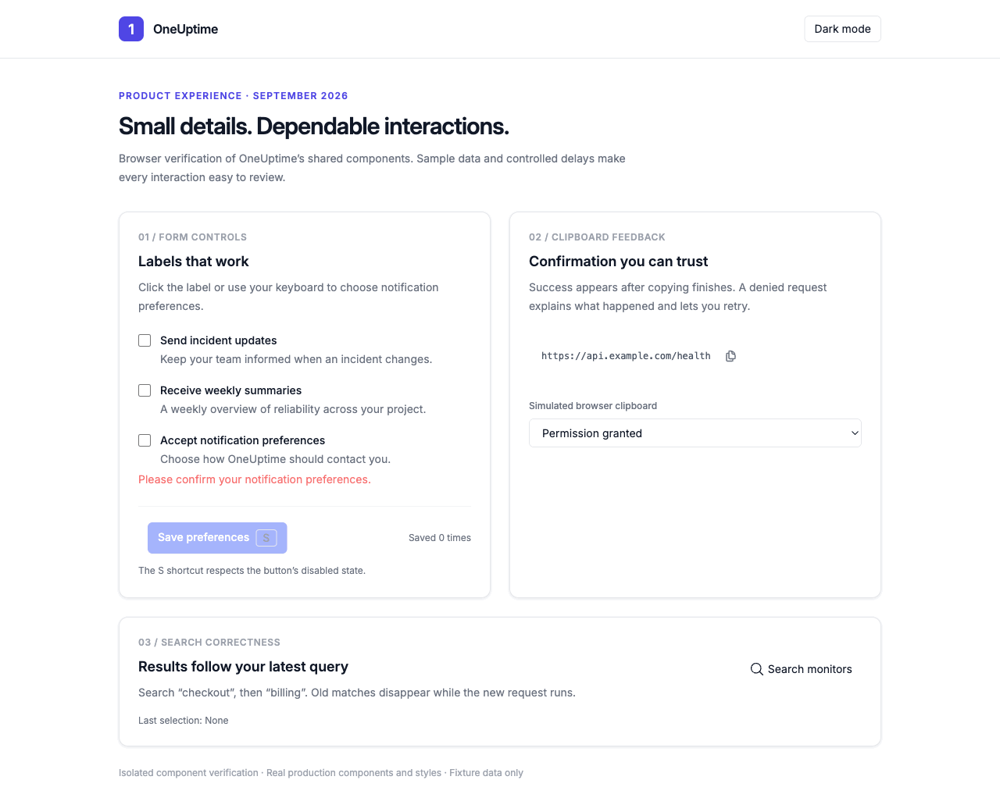
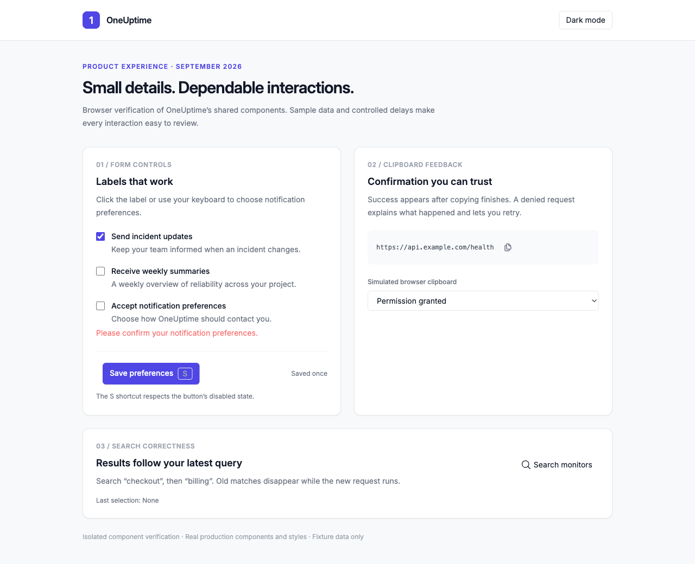
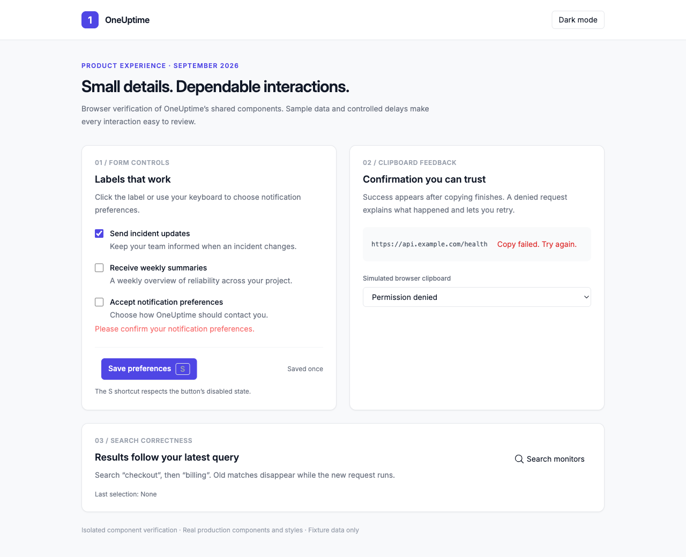
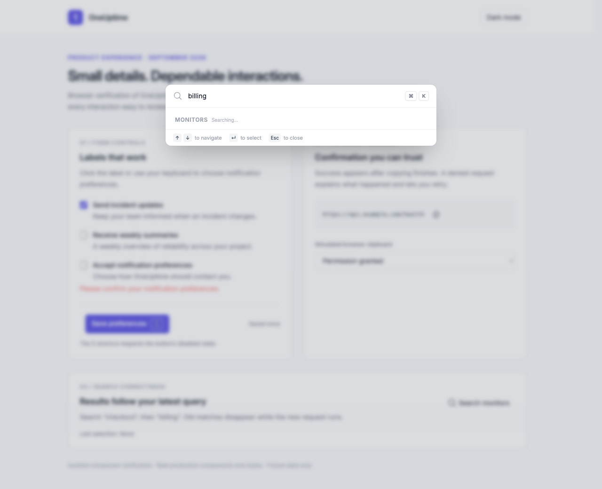
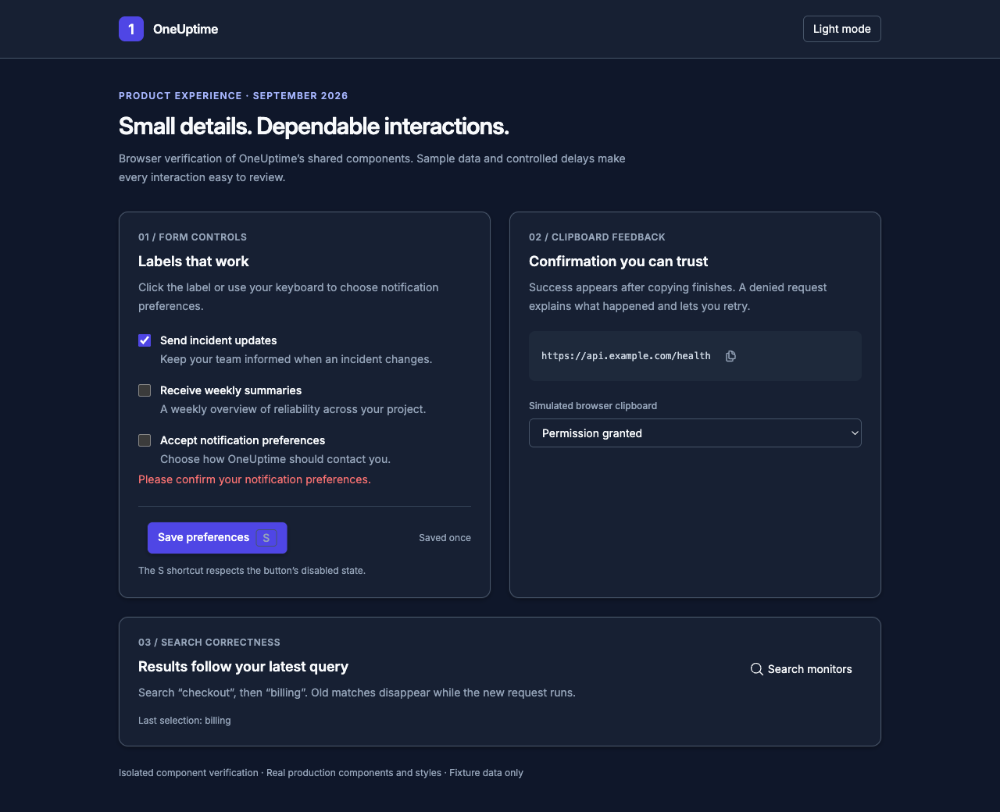
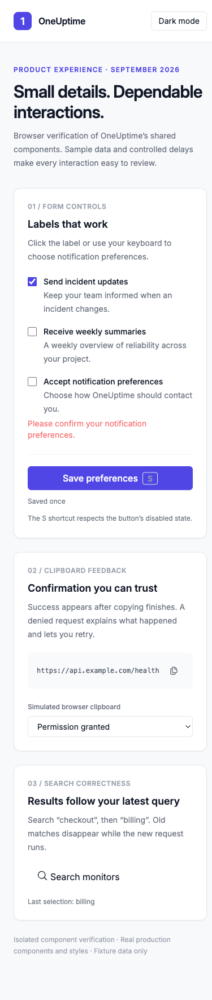

# Product experience polish: browser evidence

Captured 7 September 2026 in Chromium. These are **isolated browser fixtures
using the actual changed shared components and OneUptime's styles**, with
synthetic data. The preview layout is review scaffolding, not a new product
screen. Clipboard permissions and provider latency were controlled to exercise
failure and loading states. The GIF sequences screenshots of those interactions;
its frame timing is illustrative, not a performance measurement.

The configured development app timed out, so these captures do not establish
that authenticated dashboard journeys or backend integrations passed. The
390px screenshot is a desktop-browser viewport check, not native mobile-app or
mobile-browser certification.

## Verified interactions

1. Pressing S with Save disabled leaves the save count unchanged.
2. Clicking the visible checkbox label checks the input and enables Save;
   the enabled S shortcut then saves once.
3. Copy first reports pending, then failure when denied. Retrying with permission
   succeeds and reports completion only after the write settles.
4. Replacing “checkout” with “billing” immediately removes Checkout API from the
   selectable rows and displays Searching until Billing API arrives.
5. Enter selects the current result. The fixture also renders in the existing
   dark theme and at 390px without horizontal document overflow.

These behaviors are also covered by the focused Checkbox, ButtonShortcutAvailability,
CopyableButton and CommandPaletteProviders automated suites. The PR records test
counts and strict type-check/lint outcomes.

## Walkthrough

## Screenshots

### Desktop: label activation and a successful save

### Clipboard: recoverable failure

### Search: pending results for the current query

### Existing dark theme

### Narrow viewport

