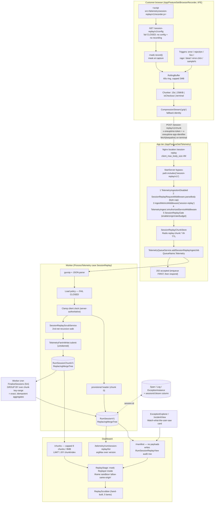

# Session Replay for OneUptime — Authoritative Implementation Plan

Tech-lead synthesis of three architect designs + six critique passes. Every path below was verified to exist in this worktree. Where reviewers disagreed, the decision and the one-line reason are inline.

---

## 1. Recommendation

Build session replay as **error-triggered, masked-at-capture rrweb recording, stored as opaque compressed chunks in two new ClickHouse tables hanging off the existing `RumApplication` row, surfaced primarily from the exception explorer and incident pages** — not as an always-on session feed with a browsable list. The one key bet: **replay is evidence attached to a failure, so the recorder keeps a rolling in-memory buffer and uploads only when something actually goes wrong** (uncaught error, unhandled rejection, 5xx from an instrumented fetch, rage/dead/error click, or an explicit deterministic sample). That single decision cuts default storage ~15x, makes the default privacy exposure ~15x smaller, converts "10% chance the recording exists when an engineer looks" into "~100% for sessions that failed", and means we never need object storage — which is load-bearing, because this deployment has none (verified: `docker-compose.base.yml` declares only `postgres` and `clickhouse` volumes; no `minio`/`@aws-sdk`/`S3Client` outside docs prose and locale JSON).

---

## 2. Architecture



**Prose.** Nothing about replay invents a parallel identity: `primaryEntityId = RumApplication._id` with `primaryEntityType = ServiceType.RealUserMonitor`, the same discriminator `OtelIngestBaseService.selectPrimaryEntity` already stamps on every RUM span/log/metric/profile (verified at `App/FeatureSet/Telemetry/Services/OtelIngestBaseService.ts`, the `data.rumApplicationId` branch). That gives us free ownership scoping (`Common/Server/Types/Database/Permissions/OwnerTableRegistry.ts` already registers `RumApplication` with `fkColumn: "rumApplicationId"`, `canOwnTelemetry: true`), free per-app retention config (`RumApplication.retainTelemetryDataForDays` + `telemetryRetentionConfig` already exist), and free correlation with the app's other telemetry.

Three deliberate inversions of surrounding conventions, each because replay data is categorically more sensitive and less re-derivable than a span:

1. **Ingest fails CLOSED.** `OtelLogsIngestService` and `OtelTracesIngestService` both catch scrub-rule load errors and continue with empty rule arrays. Replay drops the chunk instead.
2. **Enqueue before responding.** `OtelTracesIngestService.ingestTraces` sends 200 *then* awaits the enqueue; if Redis is down the payload is lost behind a 200 (`StartServer.ts:435` `if (res.headersSent) return next(err)`). Replay returns 202 only after staging succeeds, 503 otherwise, so the recorder can retry.
3. **Aggregates are derived, never accumulated.** All three source designs wrote per-chunk read-modify-write increments onto a `ReplacingMergeTree` header. That is a lost-update bug at `TELEMETRY_CONCURRENCY = 100`: `ClusterConfig.getStorageEngine` returns `ReplicatedReplacingMergeTree(version)` — pure last-write-wins, no accumulation. Instead the header carries only chunk-invariant identity, and a 5-minute finalizer computes every aggregate with one `GROUP BY` over the chunk table's own key range. Exact, idempotent, race-free, no new engine.

---

## 3. Recording layer

**Library: `rrweb`, exact pin, record-only entry.** `import { record } from "rrweb"`.

| item | value |
|---|---|
| version | pin the newest published **stable** (2.1.x at time of writing). Run `npm view rrweb dist-tags` before committing; **no caret**. Do not pin `2.0.0-alpha.4` — it is 3 years and ~17 releases stale, and several options this plan relies on postdate it. |
| record-only bundle | ~47 KB gzip / ~165 KB raw |
| Replayer (Dashboard only) | ~34 KB gzip / ~450 KB raw — never in the customer bundle |
| transitive | `rrweb-snapshot`, `@rrweb/types` — do not declare |
| compression | native `CompressionStream("gzip")`, `identity` fallback. **No `fflate` on web.** rrweb declares `fflate` itself, but we do not use its packer: the entire server decode vocabulary is `OtelPayloadEncoding = "gzip" \| "none"`, and raw DEFLATE would be stored and parsed as garbage. |
| total shippable recorder | **~52 KB gzip** |

**Rejected: video** (`MediaRecorder`/`getDisplayMedia`). ~500x the bytes, needs a per-tab permission prompt, no selective masking, no text search, no DOM inspection, and would require a transcoding tier and object store neither of which exists here.

**Rejected: `rrweb-player`.** It is a Svelte component shipping its own stylesheet against an esbuild pipeline that turns CSS imports into runtime `<style>` injection (`Common/UI/esbuild-config.js`). We must hand-build the scrubber anyway — there is no slider, timeline, scrubber, player, or video component in `Common/UI/Components`. Adding a Svelte runtime for zero used functionality is pure risk.

### rrweb configuration (v1 defaults)

```ts
record({
  emit: (event, isCheckout) => buffer.push(event, isCheckout),  // isCheckout drives chunk boundaries
  checkoutEveryNms: 60_000,                    // one seek anchor per minute
  maskAllInputs: true,
  maskAllText: policy.maskingMode === "MaskAllText",   // DEFAULT: true
  maskInputOptions: { password: true, email: true, tel: true, number: true, text: true,
                      textarea: true, select: true, date: true, "datetime-local": true,
                      month: true, week: true, time: true, url: true, search: true,
                      file: true, checkbox: true, radio: true },
  maskInputFn: fixedLengthMask,                // NOT length-preserving — see §4
  maskTextFn: fixedLengthMask,
  blockSelector: policy.blockSelectors.join(","),
  blockClass: "oneuptime-block",
  ignoreClass: "oneuptime-ignore",
  maskTextClass: "oneuptime-mask",
  inlineStylesheet: true,
  inlineImages: false,
  collectFonts: false,
  recordCanvas: false,
  recordCrossOriginIframes: false,
  slimDOMOptions: { script: true, comment: true, headFavicon: true, headWhitespace: true,
                    headMetaSocial: true, headMetaRobots: true, headMetaHttpEquiv: true,
                    headMetaVerification: true },
  sampling: { mousemove: 100, mouseInteraction: true, scroll: 150, input: "last" },
});
```

Two details that all three designs got wrong and that matter:

- **`checkoutEveryNms` and the chunk window are independent timers.** Aligning both to 30s does *not* guarantee every chunk opens with a FullSnapshot. The correct construction is to read rrweb's second `emit` argument: **close the chunk when `isCheckout === true`**, and set `hasFullSnapshot` from that flag rather than inferring it. Seek granularity is then exactly one checkout interval.
- **`maskInputOptions` has no `creditcard` key.** rrweb keys on HTML input *types*. Card fields are `type="text"` or a cross-origin PSP iframe. Card protection comes from `maskAllText` + `autocomplete` heuristics (§4), not from a fictional option. Pin the shipped options object in a snapshot test so a fictional key fails CI.

### What it captures, and the exact limits

Captured: DOM structure and mutations, same-origin iframes (rrweb child recorders), open shadow roots, input focus/blur/change (values masked), scroll, mouse position and interactions, viewport resizes, and our own custom type-5 events (errors, network, console, route changes, frustration signals — §10).

Not captured in v1, each surfaced to the viewer as a machine-readable `fidelityNotices` code rather than a silent blank rectangle:

| gap | code | why |
|---|---|---|
| Canvas / WebGL | `canvas-not-recorded` | rrweb serializes 2D commands or per-frame `toDataURL`; the WebGL path is enormous and leaks rendered user data. Opt-in per app, `sampling.canvas: 2`, `image/webp` q0.6, with a cost warning in the UI. |
| Cross-origin iframes | `cross-origin-iframe` | requires injecting the recorder into the child frame. Keeping Stripe/Adyen/Plaid frames black boxes is a **feature**. |
| Closed shadow roots | `closed-shadow-root` | untraversable. Also: **block any subtree we cannot prove we masked** rather than recording it unmasked. |
| Cross-origin stylesheets | `stylesheet-inaccessible` | `cssRules` throws; rrweb keeps the `<link href>`, which the player's CSP will refuse. Record the URL and show a banner. |
| Adopted stylesheets in shadow roots | `adopted-stylesheet` | version-dependent in rrweb. **Verify with a checked-in fixture page before Phase 3 closes** — this is a privacy issue, not a fidelity one, because mask/block selectors written against the host document may not reach shadow content. |
| Web fonts | `fonts-omitted` | font files are 100s of KB. Fallback stack at playback. |
| `<video>` / `<audio>` | `media-not-replayable` | signed URLs 404, playback would fetch end-user media from a third-party origin, and there is no play-position sync. Render a labelled placeholder; keep `media-src 'none'`. |
| Native crashes (mobile) | — | see §13. |

### Build and serve

**Location: `App/FeatureSet/BrowserRecorder/`** — not a repo-root package. `App/scripts/frontend-run.sh` already resolves `FeatureSet/<X>` and the Dockerfile already has a per-FeatureSet `npm ci` + `COPY` pattern, so this needs exactly three one-line edits instead of a new root COPY layer.

It gets **its own** `esbuild.config.js` and must not call `createConfig` from `Common/UI/esbuild-config.js`, which hardcodes `format: "esm"` (:278), `splitting: true` (:284), `minify: false` (:282) and only accepts `entryPoint/outdir/additionalDefines/additionalExternal/additionalAlias`. An ESM+split bundle cannot be loaded by a plain `<script src>`. The recorder config is ~30 lines: `format: "iife"`, `globalName: "OneUptimeReplay"`, `minify: true`, `splitting: false`, `target: "es2019"`, no React/i18next aliases, no CSS plugin, no mermaid plugin.

**It must not import from `Common`.** `Common/UI/Config.ts` reads `window.process.env`, which exists only because the server injects `/env.js` (`App/FeatureSet/Frontend/Index.ts`), and `Common/package.json` pulls express/typeorm/stripe/playwright/monaco/mermaid. Shared *pure* logic (masking functions, sampling hash, chunk math, URL scrubber, session identity) lives in `Common/Utils/Rum/*` and is copied in at build time via the bundler — which is also what makes it testable (§12).

**Two-stage load, so a bad release is recoverable.** `GET /telemetry/session-replay/v1/recorder.js` is a ~1 KB **loader stub**, `Cache-Control: public, max-age=300`. Its only jobs: fetch config, honour `enabled`/consent/DNT/GPC, then `import()` the pinned artifact named in the config response at `/telemetry/session-replay/v1.2.3/recorder.js` (`max-age=31536000, immutable`, published SHA-384 for SRI). This gives staged rollout, instant rollback by changing one config field, and a kill switch that stops *recording* rather than only stopping ingest. Without it, a masking regression is live in customer browsers for the full cache TTL with no remedy.

Served under `/telemetry` deliberately: `App/FeatureSet/Frontend/Index.ts`'s `DashboardFallbackRoutePrefixesToSkip` already contains `/telemetry`, and `FrontendRoutes.init()` runs **before** `TelemetryRoutes.init()`, so a root-level `/recorder.js` would be served as Dashboard SPA HTML on self-hosted installs. With `BILLING_ENABLED=true` the nginx catch-all `location /` proxies to the marketing Home app instead. We still add `/session-replay` to the skip list for the ingest routes.

---

## 4. Privacy model

**Posture: mask at capture, in the browser, before compression, with the recorder failing closed and the server failing closed.** Client-first is not a preference — it is structural. The server never decompresses on the HTTP path, and the existing scrubbers cannot help anyway: `LogScrubRuleService` and `TraceScrubRuleService` both `continue` on any non-string attribute value and never walk nested structures, and an rrweb event stream is a deep tree.

> **The defaults in this table are the original design proposal and several have since been changed.** They were already stale before `SessionReplayDefaultToSensitiveInputMasking` — `isSessionReplayAllowed` and `isSessionReplayEnabled` were flipped on by `EnableSessionReplayByDefault`, and the masking default is now `MaskSensitiveInputsOnly`. Treat the `@TableColumn` decorators in `Common/Models/DatabaseModels/RumApplication.ts` as authoritative, with `Common/Tests/Models/DatabaseModels/SessionReplayModels.test.ts` pinning them; the rows below are kept for the *reasoning*, not the values.

| control | default | where it applies | notes |
|---|---|---|---|
| `Project.isSessionReplayAllowed` | **false** | ingest gate + config endpoint | org-wide hard off, pattern of `Project.enableAuditLogs` |
| `RumApplication.isSessionReplayEnabled` | **false** | config endpoint + ingest gate | per-app opt-in |
| `SESSION_REPLAY_INGEST_ENABLED` | true | `App/FeatureSet/Telemetry/Config.ts`, `!== "false"` idiom | instance kill switch |
| `SESSION_REPLAY_ENABLED_BY_DEFAULT` | **false on self-hosted** | config endpoint | see §9 — plan gating is a no-op when `BILLING_ENABLED=false` |
| `sessionReplayMaskingMode` | **`MaskAllText`** | recorder `maskAllText` | `MaskInputsOnly` is offered and labelled *less safe* in the UI, with an audit-log entry on change |
| `maskInputFn` / `maskTextFn` | **fixed-length placeholder** | recorder, pre-emit | rrweb's default is `'*'.repeat(value.length)` — a length oracle for passwords, PANs, OTPs. Fixed 3-char block, or short/medium/long buckets. Unit-tested in `Common/Tests`. |
| sticky password masking | on | recorder, per-node `WeakSet` | a "show password" toggle mutates `type` to `text`; once a node was ever `type=password` or `autocomplete=current-password/new-password/one-time-code/cc-number`, it stays masked and the `type` mutation itself is suppressed |
| file inputs | value always blanked | recorder | `value` is `C:\fakepath\<real filename>`; filenames are routinely PII. Record that a file was chosen, never the name. |
| checkbox / radio / select | masked in `MaskAllText` | recorder | the *selected state* of a sensitive radio group is itself the disclosure |
| input timing quantisation | 250 ms buckets | recorder | masked fields still leak inter-keystroke timing, a published side channel |
| **URL scrubbing** | origin + path only; query and fragment dropped; uuid/email/long-digit path segments replaced | recorder, applied to chunk `url`, `entryUrl`, `exitUrl`, rrweb `Meta` hrefs, and network-event URLs | the one PII channel `maskAllText` does not cover: `?email=`, `/reset-password?token=`, magic links. Worse than a payload leak because `entryUrl`/`exitUrl` sit in the *wider* metadata ACL and render in the list. `urlAllowlist` for params to keep. |
| paste / copy / cut | never recorded | recorder | |
| `.oneuptime-block` / `-mask` / `-ignore` | per-element | customer markup | excluded from DOM / text masked / input events dropped |
| `sessionReplayMaskSelectors` / `BlockSelectors` | `[]` | server policy → recorder | |
| `sessionReplayConsentMode` | **`RequireExplicit`** | recorder buffers but uploads nothing until `grantConsent()`; `revokeConsent()` drops the buffer. Chunks carry `consentState`; worker drops `Unknown` when the app requires explicit. | net-new — there is no consent code in this repo |
| DNT / GPC | honoured | recorder, before rrweb loads | `navigator.doNotTrack === "1"` or `navigator.globalPrivacyControl === true` → no-op. Overridable only by explicit `respectDoNotTrack: false`. Today `DNT` appears only as an allowed CORS header. |
| `sessionReplayAllowedOrigins` | **`[]` = ingest refused** | `SessionReplayGate` middleware, before staging | the only origin allowlist in the codebase. Empty means refused, not allow-all. |
| identity | `identifiedUserKey = HMAC-SHA256(projectSalt, userId)`, 32 hex | worker | raw value stored in `identifiedUserLabel` **only** when `sessionReplayCaptureUserIdentity` is on, behind its own column read ACL. Same one-way-derivation discipline as the exception fingerprint. Server-side hashing UI so support never needs the salt. Salt rotation is explicitly unsupported. |
| geo | country code only, never IP | worker, from `x-forwarded-for` | gated on `sessionReplayCaptureGeo` |
| server-side second net | `SessionReplayScrubService` | worker, post-decode | reuses the *rule vocabulary* of `App/FeatureSet/Telemetry/Services/LogScrubRuleService.ts` (`BUILT_IN_PATTERNS`, `SENSITIVE_KEY_REGEX`, `applyScrubAction` — all need widening from `private`/module-local) with a **new** recursive walker over rrweb text and attribute mutations, depth- and node-capped, yielding via `EventLoop.yieldToEventLoop()` |
| **read audit** | every playback | `/manifest` endpoint writes `RumSessionReplayView` with `props: { isRoot: true }` | see §6. Also shown *on the player*: "3 people have watched this session" with names — inward visibility changes behaviour more than a log nobody reads. |
| `enableMCP` | **unset** on both analytics models | model definition | `App/FeatureSet/MCP/Tools/ToolGenerator.ts` auto-generates tools from it; an LLM agent must not get a tool that reads end-user screen recordings. Assert absence in a test. |
| `crudApiPath` | **omitted** on the chunk model | model definition | the `payload` column is unreachable via generic CRUD. Assert absence in a test. |
| retention | **7 days** | §9 | short retention is itself a privacy control |
| erasure | by sessionId / userKey / date range | `RumSessionErasureRequest` + worker | §12 Phase 5 |

**Cache propagation is the honest weak point.** The gate cache follows the 60 s process-local TTL Map convention. Combined with the config endpoint's 300 s cache, "I turned this off" could take ~6 minutes to reach a live browser. Mitigation: the config response carries a `configEpoch`; a project/app disable bumps a Redis key the gate checks with a 5 s TTL, so the *server* stops accepting within 5 s, and every chunk response carries `{directive: "continue" | "stop" | "throttle"}` so live recorders stop within one chunk window. `RumApplicationService.onUpdateSuccess` must call an actually-wired `clearCache(projectId)` — unlike `MetricPipelineRuleService.clearCache()`, which has zero production callers.

**Customer-side CSP is a first-class docs deliverable, not an afterthought.** A customer with `script-src 'self'` cannot load the recorder; `connect-src 'self'` blocks ingest; and both fail *silently*. Ship the exact directives, the SRI hash, the `crossorigin` fix for their stylesheets (so `cssRules` is readable), and support self-hosting the bundle and proxying `/session-replay/*` through the customer's own domain. Add a Dashboard "Test your installation" panel — server telemetry cannot see a blocked recorder, so the customer needs a diagnostic, not a guess.

---

## 5. Transport & ingest

### Endpoints

All in a new `App/FeatureSet/Telemetry/API/SessionReplayIngest.ts`, structured like `App/FeatureSet/Telemetry/API/KubernetesCostIngest.ts` (85 lines, `Express.getRouter()`, default export, sync validation with a `MAX_*` cap, then `Response.sendEmptySuccessResponse`), mounted `app.use(TELEMETRY_PREFIXES, SessionReplayIngestAPI)` inside `TelemetryFeatureSet.init()` in `App/FeatureSet/Telemetry/Index.ts` alongside the existing mounts. `TELEMETRY_PREFIXES = ["/telemetry", "/"]`, so both `/session-replay/...` and `/telemetry/session-replay/...` are live — which is exactly why the bypass predicate below must use `includes`, not `startsWith`.

| method + path | purpose |
|---|---|
| `POST /session-replay/v1/chunk` | chunk ingest; up to `SESSION_REPLAY_MAX_CHUNKS_PER_REQUEST` (8) concatenated frames for catch-up |
| `GET /session-replay/v1/config` | policy snapshot + pinned artifact version + `directive`. **This endpoint is why the whole feature works** — all three source designs omitted it and thereby made every server-side privacy control unreachable by a live recorder. `Cache-Control: private, max-age=300`. |
| `GET /session-replay/v1/validate` | key-validity probe, copying `OTelIngest.ts`'s `/otlp/v1/validate` so a revoked key fails loudly |
| `GET /telemetry/session-replay/v1/recorder.js` | loader stub |
| `GET /telemetry/session-replay/v<semver>/recorder.js` | pinned immutable artifact |

**No `/beacon` route.** `navigator.sendBeacon` cannot set headers, so it cannot carry `x-oneuptime-token`, and `Common/Server/Middleware/TelemetryIngest.ts` reads the token *only* from headers with no body or query fallback (verified). A body-token route would need bespoke auth, and `application/json` beacons need a preflight browsers drop during unload. The terminal flush therefore uses **`fetch(url, { keepalive: true, headers: {...} })`**, capped at a **single ≤56 KB request** — the keepalive quota is 64 KB *combined* per origin, so the "two 48 KB posts" arithmetic in one source design fails against its own cited limit. Accepted, documented loss: up to one flush interval on hard unload, plus anything over 56 KB in the tail. The 15 s flush cadence keeps that tail tiny, and an IndexedDB outbox (Phase 6) removes it.

### Auth, identity, CORS

Auth is `TelemetryIngest.isAuthorizedServiceMiddleware` **verbatim** — it reads `x-oneuptime-token` / `x-oneuptime-service-token` / `x-oneuptime-ingestion-key`, resolves via `TelemetryIngestionKeyService.getProjectIdFromSecretKey` behind a bounded 60 s-positive / 10 s-negative cache, and stamps `req.projectId`. Never hand-roll key lookup.

**`appIdentifier` travels in an `x-oneuptime-app-identifier` header, not only in the body.** This is a genuine fatal-flaw fix: all three ingest-time gates (per-app enable, origin allowlist, byte budget) need the `RumApplication`, a project can own many with different policies, and at gate time the body is an undecoded gzipped Buffer. Either the gates move to the worker — where the client has already been told 202 and cannot learn it was dropped — or `appIdentifier` is available pre-decode. One extra header on a request that already carries a custom header costs nothing.

CORS works today only because `app.use(cors())` at `StartServer.ts:110` runs before `setDefaultHeaders` at :112, whose hardcoded `Access-Control-Allow-Headers` list omits `x-oneuptime-token` entirely (and pairs `Access-Control-Allow-Origin: *` with `Access-Control-Allow-Credentials: true`, an invalid combination). Three fixes: add `x-oneuptime-token` and `x-oneuptime-app-identifier` to that list explicitly; set `Access-Control-Max-Age` (default `cors()` sets none, and Chrome's 5 s default preflight cache would preflight nearly every flush); and **verify with a real cross-origin browser POST**, not by reading source — a node-environment jest test cannot exercise a preflight and would pass while proving nothing.

### Body handling — two mandatory `StartServer.ts` edits

`Common/Server/Utils/StartServer.ts:143` is `if (req.path.includes("/otlp/v1/")) { return next(); }` and :194 is the urlencoded twin. Extend **both**:

```ts
if (req.path.includes("/otlp/v1/") || req.path.includes("/session-replay/v1/")) { return next(); }
```

`includes`, not `startsWith` — `/telemetry/session-replay/v1/chunk` is equally live and would otherwise fall into the gzip fast-path at :154-180, which has **no size limit and no content-length pre-check** (a zip-bomb vector on a public browser endpoint) and sets `req.body` to the *decompressed* Buffer, which then trips our own middleware's `if (req.body !== undefined) return next()` early-out so the byte cap never runs. That failure is invisible to any test written against the root path.

`SessionReplayRequestMiddleware.parseBody` copies `App/FeatureSet/Telemetry/Middleware/OtelRequestMiddleware.ts:26-64` (data/end/error into `Buffer.concat`, keeping the early-out) and **adds the byte cap the OTLP version lacks**: a running counter, then `res.status(413).end()` **before** ceasing to consume — not `req.destroy()` first, which tears down the socket so the client sees a network error and retries the oversized chunk forever. The recorder treats 413/401/403 as terminal-drop, 5xx/network as retryable, and honours `Retry-After` on 429. It does **not** gunzip; decode happens in the worker.

### Chunk format

`Content-Type: application/vnd.oneuptime.session-replay.v1`, `Content-Encoding: gzip`. Body is `<envelope JSON>\n<compressed rrweb event array>` — envelope in the body, not in eight more headers, because piling custom headers onto a preflight mechanism we already flagged as brittle is bad trade; `indexOf(0x0A)` + a 200-byte `JSON.parse` is ~2 µs.

```ts
// Common/Types/Rum/SessionReplay.ts
export const MAX_SESSION_REPLAY_CHUNK_BYTES = 2 * 1024 * 1024;   // per frame, post-gzip
export const MAX_SESSION_REPLAY_CHUNKS_PER_REQUEST = 8;
export const MAX_SESSION_REPLAY_CHUNKS_PER_SESSION = 480;
export const SESSION_REPLAY_WIRE_VERSION = 1;

export interface SessionReplayChunkEnvelope {
  v: number; appIdentifier: string;
  sessionId: string; tabId: string; chunkIndex: number;
  sessionStartUnixMs: number; clientSendUnixMs: number;    // -> server skew clamp
  chunkStartOffsetMs: number; chunkEndOffsetMs: number;
  eventCount: number; hasFullSnapshot: boolean; isFinal: boolean;
  snapshotPart?: { index: number; total: number };          // a FullSnapshot is indivisible
  recorderKind: "dom" | "rn-view-tree";
  schemaVersion: number; rrwebVersion: string; recorderVersion: string;
  maskingMode: string; consentState: "Granted" | "NotRequired" | "Unknown";
  triggerReason: "error" | "frustration" | "sampled" | "manual";
  payloadEncoding: "gzip" | "identity"; payloadBytes: number;
  url: string;                                              // already scrubbed client-side
  signals: { errorCount: number; rageClickCount: number; deadClickCount: number;
             errorClickCount: number; refreshRageCount: number; routeCount: number };
  fidelityNotices: Array<string>;
  droppedEvents: number; flushFailures: number;             // recorder self-report
  meta?: { entryUrl, browserName, browserVersion, osName, deviceType,
           viewportWidth, viewportHeight, identifiedUserRef? };   // chunk 0 + isFinal only
  traceIds?: Array<string>;
}
```

Note `snapshotPart`: a large-DOM FullSnapshot is one indivisible rrweb event and can exceed the flush threshold, so `hasFullSnapshot` is set only on the **final** part. Without this, seek anchors point mid-snapshot and the player rebuilds a partial DOM. Over the hard cap, return **422 `snapshot-too-large`** — not 413 — so the session is still recorded with a `fidelityNotices` code instead of vanishing.

### Chunking, identity, sampling

- Flush on whichever comes first: **15 s**, **256 KB** pre-compression, **`isCheckout === true`**, or terminal (`visibilitychange:hidden`, or `pagehide` with `persisted === false`).
- `sessionId` in **`localStorage`** with a shared `lastActivityAt`, 30-minute idle rollover, 4-hour hard cap; `previousSessionId`/`rotationReason` on rollover. `tabId` in **`sessionStorage`**, regenerated on every recorder init.
- **`tabId` is in the chunk sort key from commit 1.** `sessionStorage` is *copied* on tab duplication, so two live tabs share one `sessionId` and both mint `chunkIndex` from 0. Without `tabId` the sort key cannot represent both and the player's first-wins dedup silently discards one tab's entire stream.
- **bfcache**: never register `unload` or `beforeunload` (they disqualify the customer's page from bfcache — a RUM vendor degrading its own customer's Core Web Vitals). On `pagehide` with `persisted === true`, flush *without* `isFinal` and stay armed; on `pageshow` with `persisted === true`, re-evaluate the idle rollover, `takeFullSnapshot()`, and emit a `bfcache-restore` custom event. Assert the absence of `unload`/`beforeunload` with a source-level test.
- Sampling is **deterministic on `sessionId`**: `fnv1a32(sessionId) % 10000 < pct * 100`, decided once, in a shared `Common/Utils/Rum/SessionSampling.ts` recomputed identically at the gate. Never per-row `Math.random()` (`LogDropFilterService.ts:100` does exactly that and it would shred a session into unplayable fragments). Note honestly: the gate protects against misconfiguration, not tampering — a client can regenerate ids until it passes. The real anti-abuse controls are the origin allowlist, the rate limit, and the byte budget.

### Rate limit, budget, staging, queue

Rate limiting is net-new. The only precedent, `App/FeatureSet/Notification/API/PushRelay.ts`, is a per-process in-memory per-IP window — useless behind a load balancer. Build `App/FeatureSet/Telemetry/Utils/SessionReplayRateLimiter.ts` on raw `Redis.getClient()` `INCR` + `EXPIRE` (note: `GlobalCache` has no counter primitive, so the `OtelIngestBaseService` "fence idiom" is a get/set fence, not an INCR — do not cite it as a template). Defaults: 20,000 chunks/min/project → 429 with `Retry-After`; `SESSION_REPLAY_MAX_BYTES_PER_PROJECT_PER_DAY` (1 GiB) → 204 with `directive: "stop"`; per-session index cap → 204.

Staging: **inline in job data as base64 when ≤ 64 KiB**, else `App/FeatureSet/Telemetry/Utils/SessionReplayChunkStore.ts` (a fork of `TelemetryBodyStore.ts` with `KEY_PREFIX = "replay:chunk:"`, `TTL_SECONDS = 6h`, preserving read-without-delete). A typical chunk is ~7 KB, so this keeps ~99% of chunks out of Redis entirely and bounds worst-case Redis footprint to tens of MB. That matters: Redis is `redis-server --save "" --appendonly no` in compose and `emptyDir` in Helm, with no configured `maxmemory`. Set the `bodyKey` at **top level** on `TelemetryIngestJobData` (verified: `bodyKey?: string` is top-level and the post-success reclaim at `ProcessTelemetry.ts` tests `jobData.bodyKey`) — nesting it under `sessionReplayIngest` would leave every blob to its full TTL.

Queue: reuse `QueueName.Telemetry` (`Common/Server/Infrastructure/Queue.ts` has exactly four names; a new one means a worker deployment plus a KEDA scaler). Add `SessionReplay = "session-replay"` to `TelemetryType`, a `sessionReplayIngest?: SessionReplayIngestJobData` field, and `addSessionReplayIngestJob()` modelled on `addKubernetesCostIngestJob`. Cap replay's share of the shared 100-slot worker with `Common/Server/Infrastructure/Semaphore` at ~20 slots so a replay backlog cannot starve trace ingest.

**Do NOT add `SessionReplay` to `ProcessTelemetry.ts`'s `useInsertDedup` array.** Verified in `TelemetryFanInWriter.dispatchInsert`: tokened submissions are inserted **individually** under their own token, one statement each — so adding replay would produce one insert statement per chunk on the fattest table in the system. Untokened submissions merge into one fat batch. Idempotency comes instead from `ReplacingMergeTree` on the chunk table plus `LIMIT 1 BY chunkIndex` at read time. Also add `maxBatchRowsByTable` to `FanInWriterOptions` and set `TELEMETRY_FANIN_MAX_BATCH_ROWS_SESSION_REPLAY = 2000` — the batcher counts rows, not bytes, and the global 100,000 default would attempt a ~700 MB insert.

### Nginx — mandatory

`Nginx/nginx.conf` sets **no** global `client_max_body_size`, and neither `/telemetry` (:600), `/otlp` (:631), `/kubernetes-cost` (:652) nor `/pyroscope` (:668) sets one — verified — so nginx's **1 MB default** applies while Express allows 50 MB. Add a block copying the `/kubernetes-cost` shape (whose comment at :647-651 documents the `location /` → Home trap) plus `/probe-ingest`'s explicit size line:

```nginx
location /session-replay {
    resolver ${NGINX_RESOLVER} valid=30s;
    set $backend_app http://${SERVER_APP_HOSTNAME}:${APP_PORT};
    proxy_set_header Host $host;
    proxy_set_header X-Real-IP $remote_addr;
    proxy_set_header X-Forwarded-For $proxy_add_x_forwarded_for;
    proxy_set_header X-Forwarded-Proto $scheme;
    proxy_http_version 1.1;
    proxy_set_header Connection $connection_upgrade;
    proxy_pass ${BACKEND_APP_TARGET};
    client_max_body_size 4M;   # 8 frames x 2MiB would exceed this: cap is per-REQUEST
}
```

`MAX_SESSION_REPLAY_CHUNK_BYTES` is per **request**, not per frame, so the 4 MB ingress and the 2 MiB Express cap are consistent.

---

## 6. Storage & schema

**Decision: ClickHouse only, two new analytics tables (header + chunks), plus three small Postgres models and thirteen config columns on `RumApplication`.** No object storage, no Postgres blobs, no local disk.

Rejected and why, briefly: **S3/MinIO** is the right long-term substrate but is net-new infra (no client library, no bucket config, no storage seam, a `values.schema.json` that may reject new keys, and a from-scratch presigning + tenant ACL layer) — and it *loses* per-row TTL and the metering aggregation. Keep the read/write surface confined to `RumSessionChunkService` plus one endpoint so it can be swapped in later. **Postgres `bytea`** via `File.ts` is non-viable on every axis (`Response.sendFileResponse` buffers the whole blob and `res.send()`s it with `readstream.pipe(res)` commented out; `FileService.onBeforeFind` forces `isPublic: true` for non-root; no per-row TTL). **Local disk** — no App/Worker container has a persistent volume in compose or Helm. **Redis** is RAM with persistence explicitly off.

There is **no binary column type** (verified `Common/Types/AnalyticsDatabase/TableColumnType.ts`: no Binary/Blob/FixedString/Nested; Text/JSON/JSONArray all compile to ClickHouse `String`). We store the **decompressed** rrweb JSON in a `Text` column with `ZSTD(3)` — base64-of-gzip would inflate 33% and hand ZSTD incompressible input. Precedents: `Log.body` (Text + ZSTD(3) + TokenBF), `Span.events` (JSONArray + ZSTD(3)), `ProfileSample.stacktrace` (ArrayText + ZSTD(3)).

Add to `Common/Types/AnalyticsDatabase/AnalyticsTableName.ts` (note: the V-suffix is *not* a universal convention — `SloHistory`, `MutableMetricItem`, `MetricItemAggMV1m` have none — but the telemetry tables do):

```ts
RumSession      = "RumSessionV1",
RumSessionChunk = "RumSessionChunkV1",
```

### `Common/Models/AnalyticsModels/RumSession.ts`

Template: `Common/Models/AnalyticsModels/Profile.ts`. Engine **`ReplacingMergeTree`** → resolves to `ReplicatedReplacingMergeTree(version)` with the column name **hardcoded** in `Common/Server/Utils/AnalyticsDatabase/ClusterConfig.ts:86`, so a column literally named `version` is mandatory (the trap `SloHistory.ts:148-153` documents).

| key | TableColumnType | req | codec / index | notes |
|---|---|---|---|---|
| `projectId` | ObjectID | ✔ | — | `isTenantId: true`, **must be first** |
| `rumApplicationId` | ObjectID | ✔ | Set `[512]` g4 | |
| `primaryEntityId` | ObjectID | ✔ | — | = `rumApplicationId`; present **because metering and retention both key on it** |
| `primaryEntityType` | Text | ✔ | lowCard, Set `[16]` g4 | always `ServiceType.RealUserMonitor` |
| `startTime` | DateTime64 | ✔ | `[DoubleDelta, ZSTD(1)]` | **server-clamped**; partition source; identical on every write |
| `sessionId` | Text | ✔ | bloom `[0.01]` g1 | 32 hex |
| `version` | UInt64 | ✔ | `[T64, ZSTD(1)]` | **unix millis**, not nanos — nanos (~1.75e18) exceed `Number.MAX_SAFE_INTEGER`. `SloHistoryService` uses `now.getTime()` for exactly this reason. |
| `isFinalized` | Boolean | ✔ | Set `[2]` g4 | false = provisional, still recording or lost |
| `sealedReason` | Text | ✔ def `""` | lowCard | `final-chunk` \| `idle-timeout` \| `duration-cap` \| `budget` \| `truncated` |
| `endTime` | DateTime64 | ✔ | `ZSTD(1)` | plain ZSTD — non-monotonic (`Span.ts:152-216` rationale) |
| `durationMs` | LongNumber | ✔ | `[T64, ZSTD(1)]` | |
| `chunkCount` / `maxChunkIndex` | Number | ✔ | `[T64, ZSTD(1)]` | max, not counter — enables gap detection |
| `missingChunkCount` | Number | ✔ | `[T64, ZSTD(1)]` | |
| `eventCount` | LongNumber | ✔ | `[T64, ZSTD(1)]` | |
| `payloadBytes` | LongNumber | ✔ | `[T64, ZSTD(1)]` | **the metering signal** |
| `fullSnapshotChunkIndexes` | ArrayNumber | ✔ def `[]` | `ZSTD(1)` | seek anchors; **derived by the finalizer**, never accumulated |
| `hasError` | Boolean | ✔ | Set `[2]` g4 | the #1 filter |
| `errorCount`, `rageClickCount`, `deadClickCount`, `errorClickCount`, `refreshRageCount`, `pageCount` | Number | ✔ | `[T64, ZSTD(1)]` | |
| `triggerReason` | Text | ✔ | lowCard, Set `[8]` g4 | |
| `samplePercentageAtCapture` | Decimal | ✔ | | needed to un-bias any analytics |
| `entryUrl` / `exitUrl` | Text | ✔ def `""` | `ZSTD(3)` | scrubbed client-side |
| `routes` | ArrayText | ✔ def `[]` | bloom `[0.01]` g1 | "sessions that hit /checkout" |
| `browserName`, `osName`, `deviceType` | Text | ✔ def `""` | lowCard, Set `[64]`/`[64]`/`[8]` g4 | |
| `browserVersion` | Text | ✔ def `""` | lowCard | |
| `viewportWidth` / `viewportHeight` | Number | ✔ | `[T64, ZSTD(1)]` | |
| `countryCode` | Text | ✔ def `""` | lowCard, Set `[256]` g4 | never the IP |
| `identifiedUserKey` | Text | ✔ def `""` | bloom `[0.01]` g1 | HMAC; **the erasure subject key** |
| `identifiedUserLabel` | Text | ✔ def `""` | `ZSTD(1)` | own narrower `accessControl.read` |
| `traceIds` / `exceptionFingerprints` | ArrayText | ✔ def `[]` | bloom `[0.01]` g1 | capped 50, finalizer-derived |
| `fidelityNotices` | ArrayText | ✔ def `[]` | `ZSTD(1)` | honest degradation disclosure |
| `maskingMode`, `consentState`, `recorderKind`, `recorderVersion`, `rrwebVersion` | Text | ✔ | lowCard | policy + version snapshot at capture |
| `schemaVersion`, `wireVersion` | UInt8 | ✔ | `[T64, ZSTD(1)]` | |
| `clockSkewMs` | LongNumber | ✔ | `[T64, ZSTD(1)]` | diagnosable, not invisible |
| `clientReportedStartTime` | DateTime64 | ✔ | `ZSTD(1)` | raw client clock |
| `isLegalHold` | Boolean | ✔ | — | |
| `attributes` | MapStringString | ✔ def `{}` | `ZSTD(3)`, `mapKeysColumn: "attributeKeys"` | |
| `attributeKeys` | ArrayText | ✔ def `[]` | bloom `[0.01]` g1 | **mandatory sibling** — without it `StatementGenerator.appendMapKeyPresenceFilter` emits no pre-filter and every attribute query full-scans |
| `entityKeys` | ArrayText | ✔ def `[]` | bloom `[0.01]` g1 | mirrors `Log.entityKeys` |
| `retentionDate` | Date | ✔ | `[DoubleDelta, ZSTD(1)]` | |

```ts
sortKeys = primaryKeys = ["projectId", "rumApplicationId", "startTime", "sessionId"]
partitionKey  = "toYYYYMMDD(startTime)"
shardingKey   = "cityHash64(projectId, sessionId)"
tableSettings = "ttl_only_drop_parts = 1, non_replicated_deduplication_window = 10000"
ttlExpression = "retentionDate DELETE"
defaultSortColumn = "startTime"
projections = [{ name: "proj_session_recent", query:
  "SELECT projectId, rumApplicationId, startTime, sessionId, version, isFinalized, hasError, " +
  "durationMs, errorCount, rageClickCount, browserName, osName, deviceType, countryCode, " +
  "identifiedUserKey, triggerReason, payloadBytes ORDER BY (projectId, rumApplicationId, startTime)" }]
crudApiPath: undefined       // reads go through a bespoke argMax endpoint — no FINAL support in this repo
enableMCP:   unset
tableBillingAccessControl: { create/read/update/delete: PlanType.Growth }   // AuditLog.ts:263-268 pattern
```

`rumApplicationId` before `startTime` because the list is always app-scoped; `sessionId` is the 4th element so the RMT replace key is unique per session; the projection covers **every** column the list filters on (a projection missing `browserName`/`deviceType`/`countryCode` cannot serve those filters).

### `Common/Models/AnalyticsModels/RumSessionChunk.ts`

Template: `Common/Models/AnalyticsModels/ProfileSample.ts` (its `super()` block is the shape to copy). Engine **`ReplacingMergeTree`** — needs a `version` column — so a retried or duplicated chunk collapses at merge instead of double-inserting into a plain MergeTree.

| key | TableColumnType | req | codec / index |
|---|---|---|---|
| `projectId` | ObjectID | ✔ | `isTenantId: true` |
| `sessionId` | Text | ✔ | `ZSTD(1)` (sort-key element 2 — no index needed) |
| `tabId` | Text | ✔ | `ZSTD(1)` |
| `chunkIndex` | Number | ✔ | `[T64, ZSTD(1)]` |
| `version` | UInt64 | ✔ | `[T64, ZSTD(1)]` — unix millis |
| `rumApplicationId` / `primaryEntityId` | ObjectID | ✔ | Set `[512]` g4 |
| `primaryEntityType` | Text | ✔ | lowCard, Set `[16]` g4 |
| `sessionStartTime` | DateTime64 | ✔ | `[DoubleDelta, ZSTD(1)]` — server-clamped, identical on every chunk of a session |
| `chunkStartOffsetMs` / `chunkEndOffsetMs` | Number | ✔ | `[T64, ZSTD(1)]` |
| `chunkStartTime` / `chunkEndTime` | DateTime64 | ✔ | `ZSTD(1)` |
| `eventCount` | Number | ✔ | `[T64, ZSTD(1)]` |
| `hasFullSnapshot` | Boolean | ✔ | Set `[2]` g4 |
| `isFinal` | Boolean | ✔ | — |
| `snapshotPartIndex` / `snapshotPartTotal` | UInt8 | ✔ def 0 | `[T64, ZSTD(1)]` |
| `recorderKind`, `payloadEncoding` | Text | ✔ | lowCard |
| `schemaVersion` | UInt8 | ✔ | `[T64, ZSTD(1)]` |
| **`payload`** | **Text** | ✔ | **`ZSTD(3)`, NO skip index of any kind** |
| `payloadBytes` | UInt64 | ✔ | `[T64, ZSTD(1)]` |
| `errorCount`, `rageClickCount`, `deadClickCount`, `errorClickCount`, `refreshRageCount`, `routeCount` | Number | ✔ | `[T64, ZSTD(1)]` — per-chunk counters the finalizer sums |
| `retentionDate` | Date | ✔ | `[DoubleDelta, ZSTD(1)]` |

```ts
sortKeys = primaryKeys = ["projectId", "sessionId", "tabId", "chunkIndex"]
partitionKey  = "toYYYYMMDD(retentionDate)"
shardingKey   = "cityHash64(projectId, sessionId)"
tableSettings = "index_granularity = 128, ttl_only_drop_parts = 1, non_replicated_deduplication_window = 10000"
ttlExpression = "retentionDate DELETE"
defaultSortColumn = "chunkIndex"
crudApiPath: undefined   // deliberate: the payload column is unreachable via generic CRUD
enableMCP:   unset
tableBillingAccessControl: { ...: PlanType.Growth }
```

Five decisions that deviate from the house pattern, each on purpose:

1. **`partitionKey = toYYYYMMDD(retentionDate)`, not event time.** Every telemetry model sets `ttl_only_drop_parts = 1`, so a part is removed only when *every* row in it has expired. Partitioned by session date, one day holding a 7-day app and a 90-day app survives 90 days — a ~4x disk multiplier on the fattest table. Partitioned by expiry, each partition is "everything that dies on day X" and TTL drops it whole with zero mutations. Losing time-based pruning costs nothing: the only chunk read is `WHERE projectId AND sessionId AND chunkIndex BETWEEN`, served by the sort key, and metering reads the *header* table instead (§9). **Reviewers split on this**: one argued expiry-partitioning defeats `ClickhouseCapacity`'s active-partition protection — but pruning takes the *smallest* partition id first, which under expiry-partitioning is the soonest-to-expire cohort, i.e. exactly the right victim. Retention must be **clamped to `{1, 7, 14, 30, 90}`** so this yields at most 5 partitions per ingest day rather than one per distinct configured value.
2. **`retentionDate` derived from the server-clamped session start, not the ingest date.** Every other pillar uses `ingestionDate` (`OtelLogsIngestService.ts:906-921`). For replay that means a chunk buffered offline and flushed hours later gets full retention from arrival, so one session's chunks expire on *different days*, TTL-drop mid-session, and leave an unplayable fragment. Session-start derivation makes a session expire atomically and keeps chunk `retentionDate` == header `retentionDate`, which matters because reads silently get `AND retentionDate >= now()` appended (`AnalyticsDatabaseService.ts:1137-1142`) — mismatched dates produce listable-but-unplayable or playable-but-invisible sessions.
3. **`index_granularity = 128`.** At the default 8192 (adaptive-capped ~1,400 rows by `index_granularity_bytes`), one granule of the `payload` column is ~10 MB, so extracting one 500 KB session decompresses ~10 MB — 20x read amplification on the hottest read. At 128 rows a granule is ~700 KB. Marks cost ~4 MB of primary index per month. `ClusterConfig.adaptTableSettingsForStorage` rewrites `non_replicated_deduplication_window` for the `*Local` table and passes `index_granularity` through unchanged.
4. **No skip index on `payload`.** `Log.body` has a TokenBF because logs are full-text searched; chunks are fetched by key and an index would only inflate the part.
5. **Sort key is `(projectId, sessionId, tabId, chunkIndex)` with no timestamp** — the only read that exists is "this session, these indices". A time-first key would scatter one session's ~14 rows across a day of marks. `primaryKeys === sortKeys` because `StatementGenerator` emits both with no prefix validation.

Also: `_id` and `createdAt` are appended at the **end** of `tableColumns` and are **not** auto-filled on the `insertJsonRows` path (`sanitizeCreate` only fires on the ORM path), so the row builder must supply both — `createdAt` via `OneUptimeDate.toClickhouseDateTime`. Every primary-key column must be `required: true` or the constructor throws `BadDataException` at import time.

### Postgres

**Columns added to `Common/Models/DatabaseModels/RumApplication.ts`**, beside `telemetryRetentionConfig`, each with `@ColumnAccessControl` mirroring the existing retention-column block:

`isSessionReplayEnabled` (Boolean, **false**) · `sessionReplayMaskingMode` (ShortText, `"MaskAllText"`) · `sessionReplayMaskSelectors` / `sessionReplayBlockSelectors` (simple-array, `[]`) · `sessionReplayAllowedOrigins` (simple-array, **`[]` = refused**) · `sessionReplayConsentMode` (ShortText, `"RequireExplicit"`) · `sessionReplayCaptureTrigger` (ShortText, `"OnErrorOrFrustration"`) · `sessionReplaySamplePercentage` (Number, 0) · `sessionReplayCaptureUserIdentity` (Boolean, false) · `sessionReplayCaptureGeo` (Boolean, false) · `sessionReplayRecordCanvas` (Boolean, false) · `sessionReplayRetentionInDays` (Number, 7) · `sessionReplayMonthlyBudgetInGB` (Number, nullable) · `sessionReplayLastChunkReceivedAt` / `sessionReplayBudgetExceededAt` (Date, nullable — the two columns that answer most support tickets on their own).

Plus `Project.isSessionReplayAllowed` (Boolean, false), following `Project.enableAuditLogs`.

**`Common/Models/DatabaseModels/RumSessionReplayView.ts`** — the read audit. Template `RumApplicationClient.ts` (`@TenantColumn("projectId")`, `@TableAccessControl({create: [], read: [...], update: [], delete: []})`, `@CrudApiEndpoint`, `@TableMetadata`, ManyToOne `onDelete: "CASCADE"`, **no** `@EnableDocumentation()`). Columns: `projectId` · `rumApplicationId` · `sessionId` · `viewedByUserId` + relation · `viewedByApiKeyId` · `viewedAt` · `ipAddress` (the *viewer's*) · `userAgent` · `secondsWatched` · `accessReason` (LongText, optionally mandatory per project) · `linkedIncidentId` · `linkedExceptionFingerprint`. Indexes `(projectId, sessionId, viewedAt)` and `(projectId, viewedByUserId, viewedAt)`. Deliberately **not** the `AuditLog` analytics table, which is `PlanType.Enterprise`-gated — a privacy control must not be a paid tier.

**`Common/Models/DatabaseModels/RumSessionErasureRequest.ts`** — the first erasure primitive in this repo (verified: no erasure machinery anywhere; only `/legal/gdpr` marketing pages). `projectId` · `rumApplicationId` (**nullable, `ON DELETE SET NULL`** — with CASCADE, deleting the app would delete the request that was supposed to clean up after it) · `requestType` (`BySessionId` \| `ByIdentifiedUserKey` \| `ByDateRange` \| `ByRumApplication`) · `targetValue` (LongText — also holds the app id so the request survives its parent) · `startDate`/`endDate` · `status` · `requestedByUserId` · `requestedAt` · `completedAt` · `sessionsDeleted` · `chunksDeleted` · `failureReason`.

**`Common/Models/DatabaseModels/RumSessionPin.ts`** — pin-to-incident. `projectId` · `rumApplicationId` · `sessionId` · `pinnedByUserId` · `reason` · `incidentId`/`alertId` · `expiresAt` · `materializedAt`. Unique `(projectId, rumApplicationId, sessionId)`.

Each new model needs **four** registrations or it does not exist: `Common/Models/DatabaseModels/Index.ts` (**both** the import block and the export array), a thin `DatabaseService` subclass, a `BaseAPI` router in `App/FeatureSet/BaseAPI/Index.ts` following the `RumApplicationClient` block, and a **generated** migration (`npm run generate-postgres-migration`) imported and appended in `Common/Server/Infrastructure/Postgres/SchemaMigrations/Index.ts`.

### Permissions

Two edits per member in `Common/Types/Permission.ts`: the `enum Permission` block near the RUM entries, and one `PermissionProps` object in `PermissionHelper.getAllPermissionProps()` with `group: PermissionGroup.Telemetry`, `isAssignableToTenant: true`, `isAccessControlPermission: true`. `PermissionsArray` derives from `Object.keys` — no third registry.

```
CreateRumSessionReplay, ReadRumSessionReplay, DeleteRumSessionReplay,
ReadRumSessionReplayPayload,        // watching, separate from listing
ReadRumSessionReplayAudit,
CreateRumSessionErasureRequest, ReadRumSessionErasureRequest,
```

**Do not reuse `Permission.ReadRumApplication`** the way `RumApplicationClient` does. Verified: `RumApplication`'s `@TableAccessControl.read` includes `Permission.Viewer`, the project-wide read-only role — reusing it would let every read-only member watch recordings of real end users. The `ReadRumSessionReplay` / `ReadRumSessionReplayPayload` split lets a support engineer triage "which sessions errored" without watching anyone's screen.

**And the split must be enforced in the handler, not only on the column.** All three designs claimed defence-in-depth via the `payload` column's `accessControl.read` plus `ModelPermission.checkSelectPermission`. That is false on the only path that reads payloads: with `crudApiPath` omitted, the sole reader is a bespoke raw-SQL endpoint, and `ModelPermission` is never invoked. Worse, the obvious helper — `createTelemetryReadAccessGuard` in `Common/Server/API/TelemetryAPI.ts:102-121` — is an OR-list that already contains `ProjectMember`, `Viewer` and `TelemetryViewer`, so copying it produces exactly the outcome we rejected. Write a dedicated `requireSessionReplayPayloadAccess` whose list is only `ProjectOwner`, `ProjectAdmin`, `TelemetryAdmin`, `ReadRumSessionReplayPayload`; derive `projectId` strictly from `databaseProps.tenantId`, never from the body; and resolve `rumApplicationId` from the session header server-side and check it against the caller's accessible app set so label/team scope actually applies.

Decorate both analytics models `@OperationalResource()` and `@OwnedThrough("primaryEntityId", RumApplication, { includeProjectScope: true })`. `OwnedThroughMetadata.parentModels` is an array and `OwnerTableRegistry` already registers `RumApplication`, so this is mechanically valid — but **verify empirically** before shipping, since every existing analytics model lists only `Service` and it is unproven whether label-scoped Owned access resolves for RUM-owned rows at all. If it does not, fall back to project-scope-only for v1 rather than shipping a broken scope.

### Registration checklist (analytics, all mandatory)

1. `Common/Types/AnalyticsDatabase/AnalyticsTableName.ts` — two enum entries.
2. `Common/Server/Services/RumSessionService.ts` and `RumSessionChunkService.ts` — 10-line classes copied verbatim from `Common/Server/Services/ProfileSampleService.ts`.
3. **`Common/Server/Services/Index.ts` `AnalyticsServices`** (18 entries today, ending `AuditLogService`) — **this** is what boot `createTables()` iterates. Omit it and the tables are silently never created.
4. `Common/Models/AnalyticsModels/Index.ts` `AnalyticsModels` — a *separate* registry, for Realtime lookup and name resolution.
5. `Common/Server/Utils/AnalyticsDatabase/ClickhouseCapacity.ts` `PRUNABLE_LOCAL_TABLES` — add **both** local tables, and make replay explicitly the *first* pruning victim so a disk-pressure event never sacrifices `LogItemV3`/`SpanItemV3` for recordings.
6. **No `AddRumSessionReplayTables` data migration.** `AnalyticsTableManagement.createTables()` runs on every boot before data migrations and is `CREATE TABLE IF NOT EXISTS` + additive reconcile. `AddMutableMetricTable.ts` is a marker with no effect; do not copy redundancy.

**Get sort keys, partition key, TTL and table settings right on the first commit.** Reconciliation is purely additive (`TableManegement.ts` — `ADD COLUMN IF NOT EXISTS`, skip indexes, projections; the in-code caveat at :50-56 says ADD COLUMN cannot change ORDER BY or the partition key), `toTableCreateStatement` is `CREATE TABLE IF NOT EXISTS`, nothing ever issues `MODIFY ORDER BY` or `MODIFY TTL`, and `reportColumnDrift` only logs. A later change needs an explicit drop-and-recreate on a multi-TB table.

Insert via `insertJsonRows` (JSONEachRow) only. Never `create`/`createMany` — `StatementGenerator.toCreateStatement` inlines every value into a literal `INSERT ... VALUES` string, and a few hundred KB blows ClickHouse's `max_query_size` (nothing in this repo raises it).

---

## 7. Playback

**Two-phase columnar read — this is the whole trick, and it only works because ClickHouse is columnar.**

New endpoints in `Common/Server/API/TelemetryAPI.ts`, placed with the `/telemetry/profiles/flamegraph` cluster. Note the real mount: `TelemetryAPI` is mounted at `/api`, so paths are `/api/telemetry/rum/session-replay/*`.

| endpoint | behaviour |
|---|---|
| `POST .../list` | bespoke `Statement` with `argMax(col, version) ... GROUP BY (projectId, rumApplicationId, sessionId)`. Required because there is **no `FINAL` support anywhere** in this repo (verified: no `FINAL` in `StatementGenerator.ts` or `AnalyticsDatabaseService.ts`) and RMT duplicates are visible until merge — worst for the newest sessions, which sort first. `SloHistoryService.ts:34-44` documents the `argMax` convention. |
| `POST .../manifest` | header + chunk index, **payload column not selected**, so ClickHouse never touches or decompresses it. A 14-chunk session is one 128-row granule of ~10 narrow columns ≈ 2 KB. Returns `chunkIndexes`, `gaps: [{fromIndex, toIndex, missingMs}]`, `fullSnapshotChunkIndexes`, `fidelityNotices`, `isFinalized`, `sealedReason`, `missingAssets`. **Writes the `RumSessionReplayView` audit row** and rejects without `ReadRumSessionReplayPayload`. |
| `POST .../chunks` | `{sessionId, tabId, chunkIndexes[]}` → concatenated binary `[u32 chunkIndex][u32 len][bytes]…`, `application/octet-stream`. `ORDER BY version DESC LIMIT 1 BY chunkIndex` dedupes RMT. Hard caps 8 chunks / 8 MB via an exported constant, `BadRequestException` past it. |
| `POST .../heartbeat` | updates `secondsWatched`, throttled to 15 s |
| `POST .../for-exception` | `{fingerprint, primaryEntityId}` → recent sessions via `hasAny(exceptionFingerprints, [fp])` |

Not `BaseAnalyticsAPI`: it clamps `limit` to `LIMIT_PER_PROJECT = 10000`, has no cursor or streaming (`toFindStatement` is LIMIT/OFFSET with a 45 s `max_execution_time` in `break` mode that returns **partial results without erroring**), and would JSON-wrap payloads.

**Assembly.** Fetch the manifest (timeline renders instantly, zero payload bytes) → fetch chunk 0 → `new Replayer(events, { root, liveMode: false, mouseTail: false, UNSAFE_replayCanvas: false, blockClass: "oneuptime-block", useVirtualDom: true })` → prefetch 2 pages ahead and feed with `replayer.addEvent(e)` → evict decoded events outside a ±2-page window, LRU 6 (a 30-minute session is ~120 chunks; holding them all parsed is hundreds of MB of heap). **Seek**: binary-search `fullSnapshotChunkIndexes` for the greatest anchor ≤ target, refetch from there, re-instantiate — worst case one checkout interval (60 s), not a replay from t=0. `loadGenerationRef` staleness guard copied from `App/FeatureSet/Dashboard/src/Components/Profiles/ProfileFlamegraph.tsx`.

**Gaps are never crossed silently.** The manifest reports them; `ChunkLoader` jumps forward to the next `hasFullSnapshot` chunk rather than applying mutations across a hole (rrweb resolves mutations by node id, so feeding across a gap throws or — worse — renders a plausible DOM the user never saw); the scrubber draws a labelled "N seconds missing" band. In a tool presenting evidence, a silent jump is the failure that destroys trust in the whole feature.

**Sandboxing — mandatory security-review gate.** A replay is arbitrary, attacker-influenceable HTML authored by a customer's end users, and this repo has no CSP header, no CSP meta tag, and no `<iframe>` in `Common/UI` or the Dashboard except the GTM `<noscript>` block in `index.ejs`. Mount into an iframe with **`sandbox="allow-same-origin"` and nothing else** — no `allow-scripts`, no `allow-forms`, no `allow-popups`, no `allow-top-navigation`. rrweb's `Replayer` runs in the *parent* and writes into `contentDocument`, so it needs same-origin access but **not** script execution inside; `slimDOMOptions.script: true` already neuters `<script>` at capture. Reviewers split here: one proposed `sandbox="allow-scripts"` without `allow-same-origin` plus an inner `default-src 'none'` CSP — that combination is self-blocking (it forbids the Replayer's own bootstrap) and denies the parent DOM access the Replayer requires. Add a `<meta http-equiv="Content-Security-Policy">` inside the replay document with `script-src 'none'; default-src 'none'; img-src data: blob:; style-src 'unsafe-inline'; font-src data:; media-src 'none'; connect-src 'none'` as belt-and-braces. Do **not** attempt a Dashboard-wide CSP in this project: `App/FeatureSet/Dashboard/views/index.ejs` has an inline theme bootstrap, an inline `tailwind.config`, a ~150-line inline service-worker script with `onclick=` handlers, runtime Tailwind, and GTM — a `script-src 'self'` meta tag would break the app outright. That is a separate hardening effort needing nonces or a refactor.

### Dashboard files

**Create:**
- `App/FeatureSet/Dashboard/src/Pages/Rum/View/SessionReplay.tsx` — list page. `Navigation.getLastParamAsObjectID(1)`, per `Pages/Rum/View/Clients.tsx`.
- `.../Pages/Rum/View/SessionReplayView.tsx` — player page. `Navigation.getLastParamAsObjectID(2)` + `Navigation.getLastParamAsString()`, per `Pages/Host/View/ProcessView.tsx:238-239`. Using `(1)` returns the literal string `"session-replay"` — the param helper counts backwards from the URL end.
- `.../Pages/Rum/View/SessionReplayAudit.tsx` — who-watched tab, plain `ModelTable<RumSessionReplayView>` with `query={{ rumApplicationId: modelId } as any}` (the cast is unavoidable; `Clients.tsx` and `Overview.tsx` both carry the same eslint-disable).
- `.../Pages/Rum/Settings/SessionReplay.tsx` — privacy controls, sibling of `Settings/LabelRules.tsx`.
- `.../Components/SessionReplay/SessionReplayTable.tsx` — bespoke table over `/list` (not `AnalyticsModelTable`, per the no-`FINAL` argument). `userPreferencesKey` is a required prop and must be unique.
- `.../Components/SessionReplay/SessionReplayPlayer.tsx` — loader half, per `ProfileFlamegraph.tsx` (`API.post` to `URL.fromString(APP_API_URL).addRoute(...)` with `ModelAPI.getCommonHeaders()`, `PageLoader` / `ErrorMessage(onRefreshClick)`). **The only file that imports rrweb, behind a dynamic `import()`.**
- `.../Components/SessionReplay/ReplayStage.tsx` — sandboxed iframe, Replayer lifecycle, chunk LRU, play/pause/speed/skip-inactive.
- `.../Components/SessionReplay/ChunkLoader.ts` — manifest, paging, prefetch, eviction, gap handling, keyframe seek. Plain TS, unit-testable.
- `.../Components/SessionReplay/ReplayScrubber.tsx` — **hand-built**, 5 lanes (chunk/buffer state · frustration · errors · network 4xx/5xx · route changes). Drag/hover math modelled on `Common/UI/Components/TelemetryViewer/components/TelemetryHistogram.tsx:121-171`; structural model `Components/Profiles/FlamegraphView.tsx` (929 lines of pure div rendering with a keyboard handler). Controls: play/pause, 1/2/4/8x, skip-inactive, jump-to-next-error, Space / ←→ ±10 s / `,.` ±1 s.
- `.../Components/SessionReplay/ReplayCorrelationPanel.tsx` — reuse `TelemetryViewer/components/TelemetryDetailPanel.tsx` (Escape-to-close, tabbed), not a hand-rolled fixed div.
- `.../Components/SessionReplay/ReplayCard.tsx` — the embeddable "Watch what the user saw" card for the exception and incident pages. **This is the primary product surface.**
- `.../Components/SessionReplay/ReplayLink.tsx` — 33-line cross-link, copied verbatim from `Components/Traces/TraceElement.tsx`.

**Modify (six-point route wiring, the shape `App/Tests/Dashboard/MonitorRecommendationRoutes.test.ts` pins):** `Utils/PageMap.ts` · `Utils/RouteMap.ts` (**both** `RumRoutePath` and the absolute `RouteMap` — a route absent from `RouteMap` makes `Navigation.getRoutePath()` return `""` in `Pages/Rum/View/Layout.tsx` and breadcrumbs silently vanish) · `Routes/RumApplicationRoutes.tsx` (**the player must use `RouteUtil.getLastPathForKey(key, 2)`** — the count defaults to 1 and would register the path as just `:subModelId`; precedent `Routes/HostRoutes.tsx:129`) · `Pages/Rum/View/SideMenu.tsx` (one item, `IconProp.Film`, verified implemented) · `Utils/Breadcrumbs/RumBreadcrumbs.ts` (copy the METRICS/LOGS entries — `RUM_APPLICATION_VIEW_CLIENTS` has none and renders trail-less) · `Pages/Rum/View/Overview.tsx` (Sessions tile + quickLink). No `App.tsx` change — the `RUM_ROOT` wildcard already covers `/rum/*`.

**Bundle.** `Common/UI/esbuild-config.js` hardcodes `minify: false`, so the Replayer lands at ~450 KB raw. `splitting: true` + `format: "esm"` means a dynamic `import()` puts it in its own lazily-fetched chunk. Guard with a **metafile assertion**, not a code-review convention — one accidental top-level `import { Replayer } from "rrweb"` pulls 450 KB into the shared chunk for every user who never opens a replay. Add `rrweb` to `App/FeatureSet/Dashboard/package.json` and commit the regenerated `package-lock.json` (`App/Dockerfile.tpl` runs `npm ci`). Baseline with `npm run analyze`.

**Type-checking.** `App/tsconfig.json` excludes `FeatureSet/Dashboard`, so `tsc` in `App` does not check these files — but `.github/workflows/compile.yml` **does** have a `compile-dashboard` job running `npm run compile && npm run dep-check`. Two designs claimed the Dashboard is unchecked in CI; it is checked, just not by App's tsc. The tsconfig is unusually strict (`exactOptionalPropertyTypes`, `noUncheckedIndexedAccess`, `noPropertyAccessFromIndexSignature`, `noImplicitOverride`). Also add the esbuild step (`node esbuild.config.js`) to that job — `tsc` alone missed the two unresolvable imports commit `4c4f682adf` shipped.

**Known cosmetic gap:** `Navigation.isOnThisPage` bails when the segment count differs, so the Session Replay side-menu item will not highlight on the player page — the same pre-existing behaviour as Host → Processes → ProcessView. Accept it.

---

## 8. Correlation

**Join key: `sessionId`, promoted to a first-class bloom-indexed scalar column on `Span`, `Log` and `ExceptionInstance`.**

Column shape: `TableColumnType.Text`, `required: true`, `defaultValue: ""`, `bloom_filter [0.01] GRANULARITY 1`. Non-Nullable with an empty default is the house idiom (`Log.ts:329-374` scalar entity keys, whose comment notes old rows read the type default with no backfill). Nullable is not an option — `StatementGenerator` has to `assumeNotNull`-wrap Nullable columns for indexes, and a reconciled `ADD COLUMN` can never join the sort key anyway.

Migration: `App/FeatureSet/Workers/DataMigrations/AddSessionIdToTelemetryTables.ts`, a direct copy of `AddScalarEntityKeysToTelemetryTables.ts` (`getColumnTypeInDatabase()` guard → `service.addColumnInDatabase(column)`, idempotent, metadata-only, `runsInClusterMode() => false`, no-op rollback, no backfill).

**Stamping it in the browser.** Two designs proposed calling `Telemetry.setGlobalAttributes` from the recorder. That is impossible and would have shipped as a silent no-op: `globalSpanAttributes` is module-private with no window hook, and the recorder must not import `Common`. On a customer site the recorder also has no handle on the customer's independently-initialised OTel SDK. The contract is therefore explicit and documented:

1. The recorder exposes `window.OneUptimeReplay.getSessionId()`, and the docs show wiring it into a `SpanProcessor.onStart` — the same shape `GlobalAttributeSpanProcessor` uses internally.
2. **Better and default: our own `NetworkRecorder` (§10) injects the outgoing `traceparent` and stamps `session.id`**, so a bare script tag gets correlation with no OTel setup at all. This is the single highest-value thing this feature can do in this repo.
3. For OneUptime's own dogfooding, one line in `App/FeatureSet/Dashboard/src/Index.tsx` adds `session.id` to `Telemetry.setGlobalAttributes`.

While here: nothing in this repo generates or parses `traceparent`, and `Common/UI/Utils/Telemetry/Telemetry.ts` passes no `propagateTraceHeaderCorsUrls` to `provider.register()`, so anyone copying the dashboard's config gets no browser→backend stitching. The replay docs must set it, and the two doc snippets that disagree on the ingest path (`/otlp/v1/traces` vs `/v1/traces`) should be reconciled against the actually-registered route.

**Populating it at ingest.** `Span.sessionId` in `buildSpanRow` from `spanAttributes["session.id"]` (which is `{...resourceAttributes, ...span attributes}`); `Log.sessionId` from the same merged object.

**The exception fix — a real bug relative to the feature's promise, verified in full.** `ExceptionInstance.attributes` is **not** the span's attribute bag: `OtelTracesIngestService` builds `exceptionAttributes` from span **event** attributes with every `exception.*` key deleted (`{ ...eventAttributes }` then `delete` — verified at :884-889), and `buildExceptionRow` writes exactly that. Resource attributes (prefixed `resource.`) and span attributes never arrive. On the log path it is worse: `collectExceptionFromLog` hardcodes `exceptionAttributes = { "exception.source": "log", "log.severityText": ... }`, discarding the log's entire attribute map. So a `session.id` resource or span attribute is **invisible** on the exception table, which would kill the highest-value flow in the feature. Fix, precisely:

- Add `sessionId: string;` to `ExceptionEventPayload` (17 fields today).
- Populate it at the construction site from `spanContext`, which already carries `projectId`/`primaryEntityId`/`spanId`/`traceId`/`spanStatusCode`/`spanName`/`serviceMetadata` — a one-field thread-through.
- Emit `sessionId: data.sessionId || ""` from `buildExceptionRow`. Mirror in `collectExceptionFromLog`.
- **Never add `sessionId` to `ExceptionFingerprintInput`.** The fingerprint is `sha256(projectId + primaryEntityId + normalised message/stack/type)` computed pre-scrub and is the `(projectId, primaryEntityId, fingerprint)` unique-index conflict target on `TelemetryException`. Adding a per-session field would re-fingerprint every existing group and orphan its resolved/archived/`occuranceCount` triage state.

**Reverse direction** (everything → session) uses the header's capped, bloom-indexed `traceIds` and `exceptionFingerprints` arrays — populated by the **finalizer**, never incrementally, so they cannot lose updates. `hasAny(exceptionFingerprints, [fp])` on a small table is bloom-pruned. Capped at 50 because unbounded arrays on a rewritten RMT row are a merge-amplification trap.

**Forward direction** (session → telemetry) gets a tight time predicate for free because the header stores exact clamped `startTime`/`endTime`: `WHERE projectId AND primaryEntityId AND time BETWEEN <start> AND <end> AND sessionId = ?`. That prunes to a few daily partitions *and* seeks the `(projectId, time, primaryEntityId)` primary key, then the `sessionId` bloom prunes granules. **No projection in v1.** `Span.proj_trace_by_id` is the precedent for `proj_session_by_id ORDER BY (projectId, sessionId, startTime)`, but a projection is a second physical copy (~+60 GB on a billion-row `SpanItemV3`), `MATERIALIZE` takes hours, and — verified — `TableManegement.reconcileProjections` *does* run on every boot and *does* handle `ALTER ... ADD PROJECTION IF NOT EXISTS` + `MATERIALIZE ... mutations_sync=0` against the `*Local` table, so no separate migration is needed if we later add it to the model. **Reviewers split**; measure the time-bounded query first and add the projection only if it is too slow.

Filters must bind `EqualTo`/`Includes`, never `Search`/`StartsWith`/`EndsWith` — those fall to `arrayExists(... lowerUTF8 ...)` with no key-presence pre-filter, a full scan. `StatementGenerator`'s own comment calls restoring the fast path "the single biggest performance fix" for the detail pages.

Sharding works against us on two tables and cannot be fixed: `Span` shards `cityHash64(traceId)`, `ExceptionInstance` shards `cityHash64(projectId, fingerprint)`, and a session spans many of both, so session-scoped span/exception queries scatter-gather in cluster mode. Changing those keys would break trace and exception-group locality, which matter more. Accepted, documented — and it is exactly why the header carries `traceIds`/`errorCount` summaries, so the common questions are answered from one row.

### UX entry points, in priority order

1. **`ExceptionExplorer.tsx`** — `<ReplayCard>` between `StackFrameViewer` and `BreadcrumbTimeline`, showing a poster frame at `errorTime − 10s`, the frustration signals leading up to it, and "Watch 12 s before the error". `refreshExceptionItem` already loads the latest instance by fingerprint selecting `traceId`/`spanId`/`time`; extend the select with `sessionId`. **This is the flagship** — replay becomes something an engineer stumbles into while debugging, not a product they must remember exists. Limitation to state: the group row (`TelemetryException`) carries no instance pointer, so this yields the most recent session; use `/for-exception` for the set.
2. `ExceptionInstanceTable.tsx` / `OccuranceTable.tsx` — a Replay column beside the existing `SpanStatusElement` / `TraceElement` columns, and `sessionId` in the filters array.
3. `TraceExplorer` — a Replay chip on the root browser span.
4. `LogsViewer.tsx` — add a `sessionIds` prop mirroring the existing `traceIds` → `Includes` conversion; the correlation panel mounts `<DashboardLogsViewer sessionIds={[sessionId]} />`.
5. **Incidents** — add `Replay` to `Common/Types/Telemetry/TelemetryType.ts` (closed 5-member enum) and a branch to the `telemetryType` switch in `Pages/Incidents/View/Index.tsx`, reusing the existing `Incident.telemetryQuery` jsonb envelope. No new Incident column.
6. `IncidentFeedEventType` — add `SessionReplayAttached` (pure enum addition, no schema change). Mirror in `AlertFeed`.
7. **Pin-on-attach extends retention.** Attaching a replay to an incident must not `UPDATE` a MergeTree; instead `RumSessionPin` + a `MaterializePinnedSessions` worker **re-inserts** the chunks with a far-future `retentionDate` (landing in their own partition) keeping the same `sessionId` plus an `isPinnedCopy` flag, so a single `sessionId IN (...)` erasure mutation still catches both. Copy cost ~500 KB/session — the correct move under an append-only, partition-dropping regime.

**Shareable links: not `ShortLink`.** `shortId` is `Text.generateRandomText(8)`, the redirect at `ShortLinkAPI.ts:21-58` has no auth, no rate limit and no signature and resolves with `props.isRoot`, there is no expiry column or revocation, and cleanup is a blanket 3-day `hardDeleteItemsOlderThanInDays` guarded by `if (IsBillingEnabled)` — so on self-hosted installs links live forever. An unauthenticated 8-character bearer token to a recording of a real person is indefensible. v1 sharing is the ordinary authenticated Dashboard URL.

---

## 9. Metering, retention, plan gating

### Retention

Add to `Common/Types/Telemetry/TelemetryRetentionConfig.ts`: `sessionReplay?: { default?: number | null }` on the interface and `"sessionReplay"` on the `TelemetryPillar` union. `getPillarDefault` is generic (`config[pillar]?.default`) and `getBucketValue` correctly returns null for non-logs/traces pillars, so neither needs a change.

**But do not call `resolveTelemetryRetentionInDays` for replay.** Verified candidate order: `service[pillar].default` → **`serviceRetentionInDays`** → `project[pillar].default` → `projectRetentionInDays` → hardcoded 15. `serviceRetentionInDays` is `RumApplication.retainTelemetryDataForDays`, which sits *above* the project pillar — so an app configured for 90-day trace retention would silently get 90-day replay retention, and an unconfigured app would get 15, not 7. Write `Common/Server/Utils/SessionReplay/SessionReplayRetention.ts`:

```
resolveSessionReplayRetentionInDays() =
  clamp(
    RumApplication.sessionReplayRetentionInDays
      ?? telemetryRetentionConfig.sessionReplay?.default
      ?? project.telemetryRetentionConfig.sessionReplay?.default
      ?? HARDCODED_DEFAULT_SESSION_REPLAY_RETENTION_IN_DAYS /* = 7 */,
    to {1, 7, 14, 30, 90})
```

The clamp is load-bearing twice: N distinct values become N partitions per ingest day under expiry-partitioning, and it bounds the cost of a mis-set value. **7 days by default, not 15** — replay is the highest-sensitivity, highest-byte pillar and short retention is itself a privacy control. Three tiers, all just a different `retentionDate` at ingest with zero mutations: hot 7 d (chunks), warm 14/30/90 d opt-in (same table, later partitions, structurally unable to pin the hot cohort), and **metadata-only 90 d** — the header's `retentionDate` is decoupled from and longer than the chunks', at ~600 B/row that is ~120 MB for 90 days of 100k sessions/month, so error rates, frustration counts and funnels survive long after the video is gone, and the UI can say "recording expired" instead of showing a broken player.

Also extend `Common/UI/Components/Telemetry/TelemetryRetentionConfigForm.tsx` and `TelemetryRetentionConfigSummary.tsx`.

### Metering

Verified mechanism: `AnalyticsDatabaseService.groupTelemetryUsageByService` is `sum(byteSize(*))` — ClickHouse's **uncompressed in-memory** row size — under a 120 s cap that *deliberately* omits `timeout_overflow_mode='break'`; `TelemetryMeteredPlan` cost is `dataIngestedInGB × retentionInDays × unitCostInUSD`; all four pillars use `0.1 / 15`.

Two reasons not to reuse it, and one correction to the source designs:

- **The scary number was wrong by 1000x.** Two designs claimed byteSize metering would bill ~$65,000/month for a 100k-session project. The arithmetic gives **~$65**: 1400 GB × 7 d × $0.006667. The *ratio* (~12x over-billing) is real; the absolute figure is not, so "unmetered because metering would be catastrophic" is not a valid premise. We meter for accuracy, not to avoid an apocalypse.
- **The real blocker is the scan, not the price.** Under `toYYYYMMDD(retentionDate)` chunk partitioning, a `WHERE startTime BETWEEN <yesterday>` window cannot prune partitions — it would full-scan a blob table under a 120 s cap, and a timeout means **that day is billed as zero forever**: `stageTelemetryUsageForProject` always targets yesterday, rethrows, and the caller only logs. Nothing re-stages an older date.

**So: meter off `RumSessionV1` only**, which *is* `toYYYYMMDD(startTime)`-partitioned (one partition of ~600 B rows per day) and already carries the exact `payloadBytes`. New `RumSessionService.groupSessionReplayUsageByEntity()`, deduping RMT versions without `FINAL`:

```sql
SELECT primaryEntityId, primaryEntityType, count() AS rowCount, sum(payloadBytes) AS estimatedBytes
FROM (
  SELECT primaryEntityId, primaryEntityType, payloadBytes
  FROM <db>.RumSessionV1
  WHERE projectId = {p:String} AND startTime >= {s:DateTime64(9)} AND startTime <= {e:DateTime64(9)}
    AND isFinalized = 1
  ORDER BY version DESC LIMIT 1 BY projectId, sessionId
) GROUP BY primaryEntityId, primaryEntityType
```

`isFinalized = 1` plus the finalizer's ≤10-minute idle window means a session whose finalization crosses the staging boundary is billed in the *following* day's run rather than at a stale chunk-0 value — closing the under-billing hole that the provisional-header design would otherwise leave permanently open.

Wiring — nine edits, and four of them throw if missed:

1. `Common/Types/MeteredPlan/ProductType.ts` → `SessionReplay = "Session Replay"`.
2. `Common/Server/Types/Billing/MeteredPlan/AllMeteredPlans.ts` → a `TelemetryMeteredPlanType` instance **plus** a branch in `MeteredPlanUtil.getMeteredPlanByProductType`, which **throws `BadDataException`** on unknown types.
3. `Common/Server/Services/BillingService.ts` `getMeteredPlanPriceId` → **test + live Stripe price ids**. It throws on unknown types, so replay billing is dead on arrival without them. **GA-blocking.**
4. `Common/Server/Services/TelemetryUsageBillingService.ts` — the `updateUsageBilling` guard rejects any ProductType outside `{Traces, Metrics, Logs, Profiles}` (verified); miss it and **every staging write throws**.
5. Same file — the aggregation branch, next to the two-table Profiles block.
6. Same file — `getAverageRowSizeForProduct`, plus `AVERAGE_SESSION_REPLAY_SESSION_BYTES` (default 49152) in `Common/Server/EnvironmentConfig.ts`. Fallback only; dead code by design since `payloadBytes` is never 0 for a real session.
7. `App/FeatureSet/Workers/Jobs/MeteredPlan/ReportTelemetryMeteredPlan.ts` — one `reportQuantityToBillingProvider` + `Sleep.sleep(1000)` pair. No second cron.
8. `App/FeatureSet/Dashboard/src/Pages/Settings/UsageHistory.tsx` — appears automatically; it builds its filter from the enum.
9. Note the **$1 floor**: usage under $1 is never reported and never marked reported, and billing rows are hard-deleted at 120 days, so sub-$1 replay usage on small projects is silently discarded.

**Unit cost is a business decision, not an engineering one.** At the telemetry rate (`0.1/15`), Always-mode 100k sessions/month bills ~7.7 GB × 7 d × $0.006667 ≈ **$0.36/month** — versus a PostHog list price of ~$500 per 100k recordings. Recommend `2.0 / 15` ($2.00/GB at 15 d) → **~$7/month per 100k recordings**, still ~70x under market but covering real cost and scaling with the actual driver. See §14.

### Plan gating, and the self-hosted hole

Gate via `tableBillingAccessControl: { create/read/update/delete: PlanType.Growth }` in the analytics models' `super()` call — the `AuditLog.ts:263-268` pattern; the `@TableBillingAccessControl` decorator does **not** work on analytics models.

**But `ModelPermission` gates `tableBillingAccessControl` behind `IsBillingEnabled && props.currentPlan`, so plan gating enforces nothing when `BILLING_ENABLED=false`.** On a self-hosted install nothing stops 100% sampling at 90-day retention on a single-node ClickHouse — and because replay is the fattest table, `InstanceHealth:EvaluateClickhouseCapacity` (every 5 min, drops whole partitions on a disk threshold) would then start pruning to make room, potentially destroying the customer's **logs and traces** to keep recordings. Mitigations, all billing-independent:

- `SESSION_REPLAY_ENABLED_BY_DEFAULT=false` deployment-level env, distinct from the per-app toggle.
- `SESSION_REPLAY_MAX_BYTES_PER_PROJECT_PER_DAY` and a global ceiling, enforced in the gate with a Redis `INCRBY` counter, returning 204 with `directive: "stop"` and a surfaced "quota exhausted" state.
- An explicit per-table pruning *order* in `ClickhouseCapacity`, replay drained to zero before any `LogItemV3`/`SpanItem` partition is considered.
- An event + feed entry whenever replay pruning fires, so "my recordings disappeared" is explained rather than mysterious.
- A measured disk-per-1000-sessions figure in the self-hosted docs, published as a Phase 1 exit criterion.
- Document the required Redis eviction policy (`noeviction`, or a dedicated DB) for the staging keys.

Legal hold and partition-granular pruning are contradictory: move held sessions to a separate non-prunable, non-TTL table at hold time (the pin-materialisation path already does the copy).

---

## 10. Frustration signals

Computed **in the browser** (rrweb emits none of these), emitted as rrweb type-5 custom events so they ride inside the opaque chunk with no schema change, **and** counted per-chunk on the envelope so the worker can populate the header columns without ever decompressing the payload — which preserves the central bet.

| signal | detection | where |
|---|---|---|
| rage click | ≥3 `click` events within 1000 ms inside a 30 px radius | `FrustrationDetector.ts` |
| dead click | click on a non-interactive element with no DOM mutation, navigation, or network request within 3000 ms | `FrustrationDetector.ts` |
| error click | click followed within 1000 ms by an uncaught error or unhandled rejection | `FrustrationDetector.ts` |
| refresh rage (thrash) | ≥3 reloads of the same **scrubbed** pathname within 60 s, tracked in `localStorage` alongside `sessionId` | `SessionId.ts` + `FrustrationDetector.ts` |
| errors | `window.onerror` + `unhandledrejection` + stack | `ErrorRecorder.ts` — also the error *trigger* and the source of `errorCount` |
| network | `fetch` / `XMLHttpRequest` wrappers: method, scrubbed URL, status, duration, sizes, outgoing `traceparent`. **Never bodies, never `Authorization`/`Cookie`.** | `NetworkRecorder.ts` — also the 5xx trigger and the correlation injector |
| console | `console.error`/`warn` only, args masked through the same functions as text nodes, truncated to 2 KB, count-capped per chunk | `ConsoleRecorder.ts` |
| route changes | patched `history.pushState`/`replaceState` + `popstate` + `hashchange`; forces `takeFullSnapshot()` when >N s since the last checkout | `RouteRecorder.ts` — the source of `pageCount`, `exitUrl`, `routes`, and lane 5 |

Stored: per-chunk counters on `RumSessionChunkV1`; per-session totals on `RumSessionV1`, **summed by the finalizer**, never incremented. Rendered on the scrubber lanes and filterable in the list.

**Also emit them as OTel metrics on the RUM path** with `session.id` as a dimension. A counter in a ClickHouse table is a product-analytics artifact; a time series is an observability one. "Rage clicks on /checkout up 10x in 15 minutes" needs to be alertable, chartable, and SLO-attachable — that is the observability-native version of this feature, and it costs one metric emission.

**No `frustrationScore`.** An unexplained 0-100 number inside an artifact presented as evidence is a liability nobody can defend in an incident review. Ship the raw counters.

---

## 11. Cost & scale model

Assumptions, stated: rrweb raw ~200 KB/session-minute for a moderately dynamic SPA (range 60-400); a FullSnapshot with inlined CSS ~120 KB; wire gzip ~10x; at-rest ZSTD(3) over raw JSON ~12x. **All unmeasured against this deployment — Phase 1's exit criterion is replacing them with real numbers.**

| quantity | error-triggered (default) | always-on (opt-in) |
|---|---|---|
| recorded duration/session | 60 s pre-roll + 120 s post = **3 min** | 4 min (avg session) |
| snapshots/session | 2 (initial + 1 checkout) | 4 |
| raw JSON/session | 3 × 200 + 2 × 120 = **840 KB** | 4 × 200 + 4 × 120 = **1280 KB** |
| on the wire (gzip) | ~84 KB | ~128 KB |
| **at rest (ZSTD 3)** | **~70 KB** | **~107 KB** |
| chunks/session (15 s + checkout) | ~14 | ~18 |
| trigger rate | ~6% of sessions | 100% |

**Per 100k sessions/month:**

| | error-triggered | always-on |
|---|---|---|
| recorded sessions | 6,000 | 100,000 |
| header rows | 6,000 | 100,000 |
| chunk rows | 84,000 | 1,800,000 |
| ingested at rest | 6,000 × 70 KB = **0.42 GB/mo** | 100,000 × 107 KB = **10.7 GB/mo** |
| resident @ 7 d | 0.42 × 7/30 = **0.10 GB** | **2.5 GB** |
| disk written incl. ~5x merge amplification | 2.1 GB/mo | 53 GB/mo |
| metered (`sum(payloadBytes)`, wire bytes) | 0.50 GB | 12.8 GB |
| cost @ `0.1/15`, 7 d | $0.02/mo | $0.60/mo |
| cost @ recommended `2.0/15`, 7 d | $0.47/mo | $11.95/mo |

**Ingest QPS.** Always-on: 1.8M chunks/month = **0.7/s average**, ~7/s at a 10x diurnal peak. Error-triggered: 84k/month = **0.03/s**. Row rate is never the binding constraint — this cluster already absorbs 10k-100k log rows/s. The binding constraints are BullMQ jobs/s on the shared 100-slot `QueueName.Telemetry` (hence the 20-slot semaphore) and part-merge pressure.

**Part merge — the failure mode that kills the cluster.** Per-chunk tokened inserts (i.e. adding replay to `useInsertDedup`) produce **one INSERT statement per chunk**, since `TelemetryFanInWriter.dispatchInsert` inserts tokened submissions individually. Untokened submissions merge into one fat batch per flush window: at `maxWaitMs: 5000` that is ~0.2 inserts/s/pod, ~2/s across 10 pods, ~7,200 parts/day/partition against `parts_to_throw_insert` = 3,000 per partition — merged down normally. **Set `TELEMETRY_FANIN_MAX_BATCH_ROWS_SESSION_REPLAY = 2000`**: at ~350 KB/row (post-ZSTD it is smaller, but JSONEachRow ships raw) the default 100,000 would attempt a ~700 MB insert.

**Hot-path CPU.** Express per chunk: stream read + `indexOf(0x0A)` + 200-byte `JSON.parse` + one `slice` + enqueue ≈ **30 µs** → 0.02% of a core at 7/s. Worker per chunk: gunzip ~60 KB + `JSON.parse` + recursive scrub of a few thousand nodes ≈ **2-5 ms** → the real budget, and why `EventLoop.yieldToEventLoop()` is mandatory.

**Redis staging.** ~99% of chunks ride inline (≤64 KiB), so steady-state footprint is tens of MB, not the ~3 GB a naive `TelemetryBodyStore` clone would hold at a 1-hour TTL.

**Playback latency, 30-minute always-on session (~120 chunks, ~13 MB at rest).** Manifest: 120 rows × ~12 narrow columns from one 128-row granule ≈ 3 KB, **<25 ms**. First page (8 chunks): one granule ~700 KB decompressed to extract ~570 KB, transfer, ~10 ms `JSON.parse`, 80-150 ms rrweb DOM rebuild → **first frame 200-350 ms**. Seek: one checkout anchor + ≤5 chunks ≈ **~300 ms**.

**Checkpoint cost.** A FullSnapshot at 60 s cadence adds ~120 KB raw / ~10 KB at rest per minute onto a ~200 KB/min raw baseline — **+50% raw, +14% at rest** — to buy near-O(1) seek. At 30 s cadence it doubles. **CSS duplication is therefore bounded, not catastrophic**: at 2-4 snapshots per error-triggered session the inlined stylesheet is ~25% of the payload, not the "10 GB/month of pure duplication" a reviewer projected from an always-on 30 s-checkout model. That is why the content-addressed asset table is **Phase 6, not v1** — measure first, and revisit if always-on adoption is real.

---

## 12. Phased delivery plan

Gates that apply to **every** phase: `npm run fix` at the repo root; `npm run compile` in each changed project; and for Dashboard changes, `npx tsc --noEmit` **and** `node esbuild.config.js` inside `App/FeatureSet/Dashboard`.

---

### Phase 0 — Prerequisites and the honesty pass

**Goal:** fix what would silently break replay, and *prove* cross-origin browser ingest works, before any replay code exists.

**Modify:** `Common/Server/Utils/StartServer.ts` (both bypass predicates with `.includes("/session-replay/v1/")`; add `x-oneuptime-token` + `x-oneuptime-app-identifier` to `setDefaultHeaders`' `Access-Control-Allow-Headers`; add `Access-Control-Max-Age`) · `Nginx/default.conf.template` (`location /session-replay`) · `App/FeatureSet/Frontend/Index.ts` (`/session-replay` in `DashboardFallbackRoutePrefixesToSkip`) · `App/FeatureSet/Docs/Content/en/telemetry/real-user-monitoring.md` (correct the false "browser.* attributes are added automatically" claim and the `/otlp` path disagreement) · `.github/workflows/compile.yml` (add `node esbuild.config.js` to `compile-dashboard`).

**Create:** `E2E/Tests/App/SessionReplayIngressRoutes.spec.ts` (add `/session-replay` to `IngressRoutes.spec.ts`'s array and assert `recorder.js` returns JavaScript, not Dashboard HTML) · a `TestServer/` fixture page on a **different origin** that POSTs with `x-oneuptime-token`.

**Tests:** the CORS preflight test **must be Playwright**, not jest — a node-environment test cannot exercise a preflight and would pass while proving nothing. This is the single most likely "works on my machine" failure in the whole feature.

**Demoable:** `curl` a 3 MB body to `/session-replay/v1/chunk` and get a 404 from the router rather than a 413 from nginx; a real cross-origin browser POST with a custom header succeeds.

---

### Phase 1 — Schema, shared pure logic, and a measurement spike

**Goal:** land both ClickHouse tables and replace every byte estimate in §11 with a measurement, using synthetic-but-real rrweb payloads captured from a fixture page. **This phase commits the decisions that cannot be changed later.**

**Create:** `Common/Models/AnalyticsModels/RumSession.ts` · `RumSessionChunk.ts` · `Common/Server/Services/RumSessionService.ts` · `RumSessionChunkService.ts` · `Common/Types/Rum/SessionReplay.ts` · `Common/Types/Rum/SessionReplayMaskingMode.ts` · `Common/Types/Rum/SessionReplayTriggerReason.ts` · `Common/Utils/Rum/SessionSampling.ts` · `Common/Utils/Rum/UrlScrubber.ts` · `Common/Utils/Rum/Masking.ts` · `Common/Utils/Rum/SessionIdentity.ts` · `Common/Utils/Rum/ChunkMath.ts` · `Common/Server/Utils/SessionReplay/SessionReplayRetention.ts` · `Common/Tests/Models/AnalyticsModels/RumSessionSchema.test.ts` · `Common/Tests/Utils/Rum/*.test.ts`.

**Modify:** `Common/Types/AnalyticsDatabase/AnalyticsTableName.ts` · `Common/Models/AnalyticsModels/Index.ts` · `Common/Server/Services/Index.ts` (`AnalyticsServices`) · `Common/Types/Permission.ts` · `Common/Types/Telemetry/TelemetryRetentionConfig.ts` · `Common/Server/Utils/AnalyticsDatabase/ClickhouseCapacity.ts`.

**Migrations:** none. `createTables()` + `reconcileColumns` run on every boot before data migrations; a marker migration is redundant (`AddMutableMetricTable.ts` is precedent for the redundancy, not a reason to copy it).

**Tests (this is the highest-value test set in the feature):** a `StatementGenerator` snapshot asserting the generated `CREATE TABLE` contains the literal `version` column, `ORDER BY (projectId, sessionId, tabId, chunkIndex)`, `PARTITION BY toYYYYMMDD(retentionDate)`, `index_granularity = 128`, `ttl_only_drop_parts = 1`, and the `*Local`/`Distributed` split (precedent: `Common/Tests/Server/Utils/AnalyticsDatabase/ClusterAwareSchema.test.ts`). A registry test asserting both models are in **both** arrays, `crudApiPath` is undefined on the chunk model, `enableMCP` is unset on both, and the `payload` column's `accessControl.read` is exactly `[ReadRumSessionReplayPayload]` + owners/admins. Retention clamp tests. Masking tests: fixed-length (not length-preserving) output, file value blanked, `MaskAllText` masks checkbox/radio/select, and a snapshot of the exact shipped `maskInputOptions` object per mode. URL scrubber tests for a reset token, an email query param, and a uuid path segment.

**Demoable:** boot a dev stack; both tables exist with the exact intended DDL; a script inserts 1,000 synthetic chunks and reports measured bytes/session-minute, compression ratio, and part count.

---

### Phase 2 — Ingest path

**Goal:** accept, gate, stage, queue, and store chunks end-to-end.

**Create:** `App/FeatureSet/Telemetry/API/SessionReplayIngest.ts` · `Middleware/SessionReplayRequestMiddleware.ts` · `Services/SessionReplayIngestService.ts` · `Services/SessionReplayScrubService.ts` · `Utils/SessionReplayChunkStore.ts` · `Utils/SessionReplayEnvelopeParser.ts` · `Common/Server/Utils/SessionReplay/SessionReplayGateCache.ts` · `SessionReplayRateLimiter.ts` · `App/FeatureSet/Workers/Jobs/Rum/FinalizeSessions.ts` · `App/FeatureSet/Workers/Jobs/Rum/CleanupStaleResources.ts` (wire the orphaned `RumApplicationService.markDisconnectedApplications()`, which has zero callers, so the RUM status pill stops reading "Connected" forever).

**Modify:** `App/FeatureSet/Telemetry/Index.ts` · `Config.ts` · `Services/Queue/TelemetryQueueService.ts` · `Jobs/TelemetryIngest/ProcessTelemetry.ts` (new case; **do not** add to `useInsertDedup`) · `Common/Server/Utils/Telemetry/TelemetryFanInWriter.ts` (`maxBatchRowsByTable`) · `Common/Models/DatabaseModels/RumApplication.ts` (13 columns) · `Common/Models/DatabaseModels/Project.ts` · `App/FeatureSet/Workers/Index.ts` · `App/FeatureSet/Telemetry/Services/LogScrubRuleService.ts` (export `BUILT_IN_PATTERNS`, `SENSITIVE_KEY_REGEX`; widen `applyScrubAction`) · `config.example.env`.

**Migrations:** `npm run generate-postgres-migration` for the `RumApplication` + `Project` columns; import and append the generated class in `Common/Server/Infrastructure/Postgres/SchemaMigrations/Index.ts` or it never runs at startup.

**Finalizer design (the fix for the aggregate bug):** every 5 minutes, read a Redis sorted set (`ZADD replay:active:<projectId> <serverReceiveMs> <sessionId>:<tabId>` on every accepted chunk) for entries older than 10 minutes — O(expired), not O(all sessions) — then for each, one key-range `GROUP BY` over `RumSessionChunkV1` computing `max(chunkIndex)`, `sum(eventCount)`, `sum(payloadBytes)`, `max(chunkEndTime)`, `groupArray(chunkIndex) WHERE hasFullSnapshot`, the summed signal counters, `groupUniqArray(traceIds)`, and the missing-index set difference; write **one** authoritative header version with `isFinalized = true` and the right `sealedReason`. Exact, idempotent, race-free.

**Tests:** `App/Tests/Telemetry/SessionReplayIngestAPI.test.ts` — 413 with a status sent before teardown; 429 past the rate limit; 204 on unsampled/over-cap/kill-switch/disabled; 503 on staging failure (never 200-then-lose); token accepted from a header only; **a binary POST to `/telemetry/session-replay/v1/chunk` does not arrive as `{}`** (i.e. the bypass covers the prefixed path). `SessionReplayIngestService.test.ts` — every fail-closed branch drops *and* bumps a labelled drop counter; the clock clamp; `retentionDate` from session start not ingest. **`SessionReplayFinalizer.test.ts` — feed chunks 0..9 out of order and assert exact aggregates.** `SessionReplayScrubService.test.ts` — email/PAN/SSN redacted in a text node, an attribute mutation, and a nested `styleSheetRule`; depth and node caps hold.

**Demoable:** `curl` a gzipped fixture chunk with a valid token; a row appears in `RumSessionChunkV1`; after 10 minutes a finalized header appears with correct counts. Turn the app off; the next chunk 204s within 5 s.

---

### Phase 3 — Recorder SDK

**Goal:** a paste-one-script-tag recorder with error-triggered capture, masking, consent, and honest degradation.

**Create:** `App/FeatureSet/BrowserRecorder/{package.json,package-lock.json,tsconfig.json,jest.config.json,esbuild.config.js,README.md}` · `src/{Index,Loader,Recorder,RollingBuffer,Chunker,Transport,Config,Consent,FrustrationDetector,ErrorRecorder,NetworkRecorder,ConsoleRecorder,RouteRecorder,SessionId,Masking}.ts` · `Tests/*.test.ts` · `App/FeatureSet/Docs/Content/en/telemetry/session-replay.md` · `.github/workflows/test.browser-recorder.yaml`.

**Modify:** `App/package.json` (`build-frontend:browser-recorder` + `:prod`, added to `build-frontends` and `build-frontends:prod`) · `App/Dockerfile.tpl` (one `npm ci` layer + one `COPY --chown=1000:1000 ./App/FeatureSet/BrowserRecorder /usr/src/app/FeatureSet/BrowserRecorder`) · `.github/workflows/compile.yml` (`compile-browser-recorder`) · `App/FeatureSet/Docs/Utils/Nav.ts` · `App/FeatureSet/Dashboard/src/Components/TelemetryResource/documentationMarkdown.ts` (`getRumDocMarkdown`) · `App/FeatureSet/Dashboard/src/Index.tsx` + `Common/UI/Utils/Telemetry/Telemetry.ts` (dogfood `session.id`).

`App/scripts/frontend-run.sh` needs **no** change — it already resolves `FeatureSet/<X>`. `Scripts/Install/SyncPackageVersions.js` needs **no** change — it recursively walks every `package.json`.

**Tests:** `jest.config.json` with `testEnvironment: "jsdom"` (jsdom gives real `localStorage`/`sessionStorage`/`history`). Cover: ring-buffer eviction and the 2 MB cap; every trigger; sticky password masking through a `type` toggle; contenteditable masking; deterministic sampling parity with the server; 30-min rollover, 4-h cap, tab-duplication `tabId` divergence, chunk-counter persistence across a simulated navigation; consent/DNT/GPC fail-closed; the circuit breaker (3 failures → permanent self-disable, buffer released); **`unload`/`beforeunload` never registered** (source-level assertion); bfcache `persisted` branching. Playwright fixture pages: shadow DOM (open + closed), adopted stylesheets, same- and cross-origin iframes, canvas, video, cross-origin CSS, a pushState SPA, a form with password/email/file inputs, a strict-CSP page, and a blocked-ingest page. The single most valuable assertion: **no unmasked page text ever appears in the emitted payload bytes.**

**Performance budget as an exit criterion:** <2% main-thread occupancy, <1 ms added INP on a fixture heavy page, measured. For a RUM product this is a shipping gate.

**Demoable:** paste one script tag into a fixture site, click a button that throws, and a finalized session with `triggerReason: "error"` appears in ClickHouse with all text masked.

---

### Phase 4 — Player and the RUM tab

**Goal:** click a session, watch it, seek it, see gaps and degradations honestly labelled.

**Create:** the eleven Dashboard files in §7 · `App/Tests/Dashboard/SessionReplayRoutes.test.ts` · `Common/Tests/UI/Rum/ChunkLoader.test.ts` · `Common/Tests/UI/Rum/SeekAnchor.test.ts` · `E2E/Tests/Dashboard/SessionReplay.spec.ts`.

**Modify:** `Common/Server/API/TelemetryAPI.ts` (five endpoints + `requireSessionReplayPayloadAccess`) · the six routing files · `Pages/Rum/View/Overview.tsx` · `App/FeatureSet/Dashboard/package.json` + `package-lock.json`.

**Tests:** route wiring per `MonitorRecommendationRoutes.test.ts` (including its window/sessionStorage/localStorage stubs and deferred dynamic imports, and asserting `getLastPathForKey(..., 2)` plus breadcrumb entries for **both** keys). Isolation: a Viewer-only and a ProjectMember-only principal both get 401 from `/manifest` and `/chunks`; a caller scoped to app A gets 401 for a session in app B. Chunk-cap enforcement. Player logic in Common under jsdom against a fake stage — assert the player never instantiates a real `Replayer` in tests. A metafile assertion that no entry or shared chunk contains rrweb. E2E: post three checked-in gzipped fixture chunks (the fixtures double as the `schemaVersion` regression net), then assert list → manifest → first frame → seek to chunk 3 → audit row appears → **a masked field renders as a placeholder, never plaintext**; plus post chunks 0 and 2 and assert a visible gap, not a silent jump.

**Security review gate:** an independent pass on the sandboxed iframe with a deliberately malicious recorded page — script injection, top-frame navigation, cookie/localStorage access, `postMessage` origin checks.

**Demoable:** the full loop — script tag → error → session list → play → seek → correlation panel.

---

### Phase 5 — Correlation, trust surfaces, metering

**Goal:** make replay reachable from where engineers already are, and defensible for self-hosters. **This gates GA; it is not a follow-up.**

**Create:** `App/FeatureSet/Workers/DataMigrations/AddSessionIdToTelemetryTables.ts` · `Common/Models/DatabaseModels/RumSessionReplayView.ts` · `RumSessionErasureRequest.ts` · `RumSessionPin.ts` · their three services · `App/FeatureSet/Workers/Jobs/Rum/ProcessSessionErasureRequests.ts` · `MaterializePinnedSessions.ts` · `App/FeatureSet/Dashboard/src/Pages/Rum/Settings/SessionReplay.tsx` · `Pages/Rum/View/SessionReplayAudit.tsx` · `Components/SessionReplay/ReplayCard.tsx`.

**Modify:** `Common/Models/AnalyticsModels/{Span,Log,ExceptionInstance}.ts` · `App/FeatureSet/Telemetry/Services/OtelTracesIngestService.ts` (`ExceptionEventPayload` + construction site + `buildExceptionRow` + `buildSpanRow`) · `OtelLogsIngestService.ts` (log row + `collectExceptionFromLog`) · `App/FeatureSet/Workers/DataMigrations/Index.ts` · `Common/Types/Telemetry/TelemetryType.ts` · `Common/Models/DatabaseModels/IncidentFeed.ts` · `Pages/Incidents/View/Index.tsx` · `Components/Exceptions/{ExceptionExplorer,ExceptionInstanceTable,OccuranceTable}.tsx` · `Components/Logs/LogsViewer.tsx` · `Common/Types/AuditLog/AuditLogAction.ts` (+ `Read`) · `Common/Server/Services/AuditLogService.ts` · `Common/Types/MeteredPlan/ProductType.ts` · `AllMeteredPlans.ts` · `BillingService.ts` · `TelemetryUsageBillingService.ts` · `Common/Server/EnvironmentConfig.ts` · `ReportTelemetryMeteredPlan.ts` · `Common/UI/Components/Telemetry/TelemetryRetentionConfig{Form,Summary}.tsx` · `Common/Models/DatabaseModels/Index.ts` · `App/FeatureSet/BaseAPI/Index.ts` · `Common/Server/Services/RumApplicationService.ts` (`onBeforeDelete` → enqueue erasure; `onUpdateSuccess` → `clearCache`).

**Migrations:** hand-written ClickHouse column migration for `sessionId`, appended to `DataMigrations/Index.ts` (the runner **halts the entire chain** at the first failure). Generated Postgres migration for the three new tables, registered in `SchemaMigrations/Index.ts`.

**Erasure specifics:** batch daily, cap at 1,000 session ids per mutation and 1 concurrent per project, route through `AnalyticsDatabaseService.execute(sql, MigrationExecuteOptions)` so it uses the 30-minute migration pool rather than the app pool's 58 s socket-idle timer, target `getStorageTableName(...)` with `onClusterClause()`. Write a **tombstone** (Redis set + durable row) that the ingest service checks before every insert, retained past the staging TTL plus max retry window, so in-flight chunks cannot resurrect an erased recording. Extend erasure to matching `sessionId` rows on `LogItemV3`/`SpanItemV3`/`ExceptionItemV3` — an erasure that removes the video and leaves the logs is not erasure. Cascade on Project delete. Publish a completion record; SLA "within 72 hours".

**Tests:** exception-path tests that a `session.id` resource attribute reaches `ExceptionInstance.sessionId` (this is the one that would silently pass in a naive implementation and fail in production); an assertion that `ExceptionFingerprintInput` is unchanged; metering tests for the `updateUsageBilling` guard, the Stripe price-id lookup in both modes, and that the aggregation SQL targets the header table and never the chunk table; erasure tests including the tombstone and the project-delete cascade; an audit-row test asserting `getRedactedFields` does not leak the payload into the audit record.

**Demoable:** a client-side error in the fixture app → open the exception group in the Dashboard → "Watch what the user saw" → play the 12 s before the error, with the failing `fetch` visible in the network lane and a link to its backend span. Attach it to an incident; the feed shows it; retention extends. Then file an erasure request and watch it complete.

---

### Phase 6 — Hardening and efficiency (post-GA)

Content-addressed `RumSessionAssetV1` stylesheet/font table (only if measured CSS duplication justifies it) · IndexedDB outbox for offline and the unload tail · `proj_session_by_id` on `SpanItemV3` (only if the time-bounded query is measured too slow) · targeted capture ("record the next session for user X" via the config `directive`) · performance triggers (LCP/INP/long-task/slow-fetch) · server-originated retro-capture (backend 500 in the same trace, monitor failure, SLO burn) · support-ticket lookup by identifier with server-side hashing · a load harness replaying a captured chunk stream at N sessions/s to validate part-count headroom and the fan-in shed counter.

---

## 13. Mobile phase

**`MobileApp/` is not the vehicle.** It is Expo ~54 / RN 0.81.5 / react-navigation 7 / nativewind with **zero** telemetry dependencies, and its README describes it as OneUptime's own on-call app. Extending it would be a category error.

**New package: `App/FeatureSet/MobileRecorder/` → `@oneuptime/react-native-replay`.**

**Technique: view-hierarchy serialisation into synthetic rrweb events**, not native frame capture. RN has no DOM, but rrweb's wire format is just a node tree plus incremental mutations — so a serialiser can emit `tagName: "div"` nodes with inline styles derived from RN layout, and **the existing Dashboard player renders mobile sessions with no player change at all**. That is the entire reason to prefer it.

Rejected: iOS `ReplayKit` / Android `MediaProjection`. Highest fidelity, but ~3 MB/session-minute versus ~3 KB for a serialised view tree (a ~1000x difference), it needs chunked fMP4/HLS with byte-range reads (i.e. the object store this deployment lacks), it triggers an OS screen-recording permission prompt and a persistent system indicator (a conversion disaster), and it needs an entirely separate player and transcoding tier.

**Shared verbatim (~75% of the system):** the wire envelope · the ingest endpoint and its whole middleware stack · rate limiter · origin gate · `TelemetryType.SessionReplay` · the worker case · the scrub service · **both ClickHouse tables with zero schema change** (`recorderKind = "rn-view-tree"`; `deviceType` = `ios`/`android`; `browserName` = app version) · retention pillar · metering · plan gate · permissions including the payload split · erasure · pinning · audit · the finalizer · and the **entire** Dashboard surface except the stage.

**Genuinely different (three things):** the serialiser (`ViewTreeSerializer.ts` — a fiber/`UIManager.measure` walk at ~2 Hz, diffed) · the touch recorder (a root `PanResponder` mapping to rrweb `MouseInteraction`/`TouchMove`) · masking, which has no CSS selector layer and is therefore **stricter**: a `<ReplayMask>` wrapper plus automatic masking of all `<Text>` and `<TextInput>` with no per-element unmask for `secureTextEntry`, image content never serialised (frame only), and `<WebView>` contents opaque unless the browser recorder is also loaded inside it. Compression uses `fflate.gzipSync` (RN has no `CompressionStream`) — and it **must emit gzip, not raw deflate**, or the server path breaks. Lifecycle uses `AppState` instead of `visibilitychange`, with AsyncStorage persistence of unsent chunks — actually *better* durability than the browser has.

**Reserve `recorderKind` and `schemaVersion` on both tables in Phase 1.** Two columns of a few bytes each is the difference between "a new package plus one renderer" and "a ClickHouse column migration on the fattest table in the system."

Player addition: `Components/SessionReplay/ViewTreeRenderer.tsx`, swapped in behind a `SessionReplayStage` interface (`mount`/`feed`/`seek`/`setSpeed`/`destroy`) that `ReplayStage.tsx` must be written against **from Phase 4**, not refactored into later.

Limitations to document up front: no Expo Go (native modules → config plugin → EAS prebuild); UI-thread Reanimated animations replay sampled, not frame-accurate; Skia/GL canvases are opaque rectangles; **JS errors are captured reliably, hard native crashes are not.** Publish via `Scripts/NPM/PublishAllPackages.sh` with a Trusted Publisher on npmjs.com.

**Timing: after browser replay GAs and the byte figures are measured.** Shipping mobile against an unvalidated wire format doubles the surface area of an unproven design.

---

## 14. Open questions for the user

1. **Default capture trigger — error-triggered or always-on?** I have set `OnErrorOrFrustration` with `sessionReplaySamplePercentage: 0`, which is the observability-native default and ~15x cheaper. Always-on is the marketing-tool default and what customers migrating from Hotjar/FullStory will expect to find. This is the single decision that shapes cost, privacy exposure, and how the feature is positioned.

2. **Default masking mode — `MaskAllText` or `MaskInputsOnly`?** `MaskAllText` gives a wireframe (layout, interaction, shape; no readable error banners, order ids, or empty-state copy) and is the safe default for a product with no consent machinery today. `MaskInputsOnly` matches every competitor's default and produces a far more useful debugging artifact. There is no good middle setting in rrweb, so this is genuinely binary at the app level.

3. **Unit price.** Telemetry parity is `0.1/15` → ~$0.36/month for 100k always-on recordings, which reads as a checkbox feature and mis-signals value. I recommend `2.0/15` → ~$12/month, still ~70x under PostHog. Needs two Stripe price ids either way, and `BillingService.getMeteredPlanPriceId` throws until they exist.

4. **Self-hosted default.** Should replay be available at all when `BILLING_ENABLED=false`? Plan gating is a no-op there, so my plan adds `SESSION_REPLAY_ENABLED_BY_DEFAULT=false` plus a hard byte budget. The alternative is enabling it freely and accepting that a mis-set self-hosted install can push ClickHouse into capacity pruning that destroys the customer's logs and traces.

5. **Is an origin allowlist an acceptable onboarding cost?** `sessionReplayAllowedOrigins` defaulting to `[]` = refused means every customer must list their domains before a single recording lands — the only meaningful anti-forgery control available, given that `TelemetryIngestionKey` has no expiry, scope, or origin binding and the docs tell customers to paste it into browser JS. The alternative is allow-all, which means anyone who scrapes the key can write recordings into the victim's project.

---

## 15. Explicitly out of scope for v1

- **Live "watch a user right now" / co-browse.** Structurally impossible: `Common/Server/Infrastructure/SocketIO.ts:29-34` has the Redis adapter commented out while Redis connectivity is still asserted, so rooms are process-local; app pods autoscale to 100 replicas with no `sessionAffinity` in any Helm template. The bus is also invalidate-and-refetch — `emitModelEvent` sends only `{modelId}` — and the analytics-realtime path looks like dead code (server rooms key on `model.tableName`, the browser client on `modelType.name`; identical for Postgres models, divergent for `Log` vs `LogItemV3`). *Polling* an in-progress session via the chunk endpoint is cheap and needs none of that — enabled by `isFinalized`/`sealedReason` — but is deferred.
- Canvas / WebGL recording (opt-in flag exists, off, cost-warned), web fonts, cross-origin iframes, cross-origin stylesheet proxying, `<video>`/`<audio>` sync, closed shadow roots.
- Object storage of any kind (S3/MinIO/GCS/Azure).
- A dedicated BullMQ queue, worker deployment, or KEDA scaler for replay.
- `proj_session_by_id` on `SpanItemV3` — measure the time-bounded query first.
- Content-addressed asset (stylesheet/font) deduplication — Phase 6, contingent on measurement.
- A Dashboard-wide Content-Security-Policy. The replay iframe gets its own sandbox and inner CSP; a repo-wide CSP is a separate hardening project blocked by inline scripts, inline `onclick` handlers, runtime Tailwind, and GTM in `views/index.ejs`.
- External / public share links. `ShortLink` is unusable here and a signed, expiring, revocable, single-session capability model is net-new.
- A `frustrationScore`, saved views (`TelemetrySavedViewsControl` would drag in a new Postgres model), and heatmaps / funnels / conversion analytics.
- Retroactive backfill of `sessionId` onto existing `Span`/`Log`/`ExceptionInstance` rows (the new column reads `""` for historical rows by design).
- Any change to `ExceptionFingerprintInput`.
- Salt rotation for `identifiedUserKey` — explicitly unsupported; rotation would orphan every stored key and break erasure.
- IndexedDB offline outbox, brotli/zstd/deflate wire encodings, deep-OFFSET chunk paging.