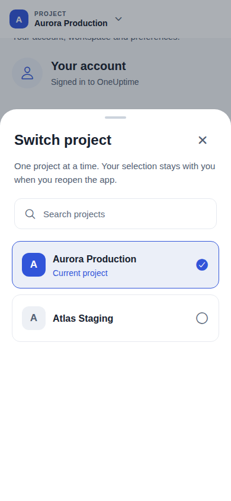
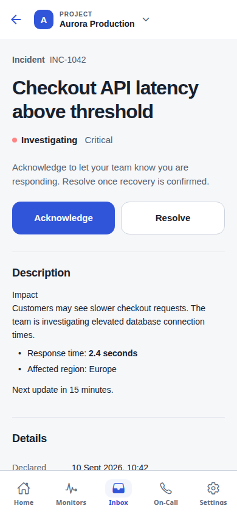
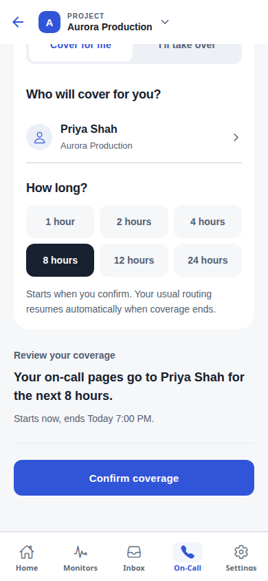
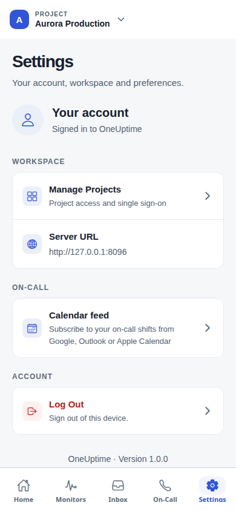
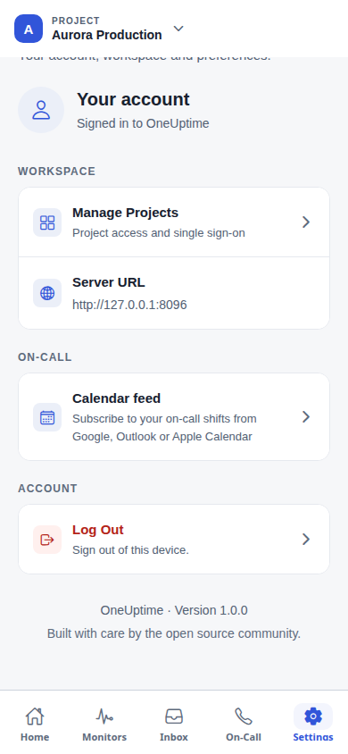

# Mobile experience v2 screenshots

These are screenshots of the actual Expo / React Native Web application using
synthetic projects, accounts and incident data. They are not native iOS or
Android device captures. Authentication codes and calendar URLs are deliberately
non-production fixtures.

The browser journeys cover every screen that can run on web, plus search,
recovery, project switching and bottom-scroll states. Biometric lock is covered
by native-platform component tests, not a fabricated browser capability.

This second redesign introduces the paper-and-ink theme, five-tab navigation,
a unified Inbox, compact response layouts and simpler authentication. These
captures replace the earlier navy design and wait for navigation to settle.

| Project-focused overview | Remembered project switcher | Incident inbox |
| --- | --- | --- |
|  |  |  |

| Incident response | On-call hub | Coverage review |
| --- | --- | --- |
|  |  |  |

| Sign in | Settings | Bottom clearance |
| --- | --- | --- |
|  |  |  |

All images use one of four viewport prefixes:

- `small-phone`: 320 × 740
- `iphone-size`: 390 × 844
- `android-size`: 412 × 915
- `tablet`: 768 × 1024

See [the visual testing guide](../UI_REDESIGN.md) for reproducible capture
commands, coverage and native-device validation limitations. CI attaches each
journey's screenshots to its Playwright report.
