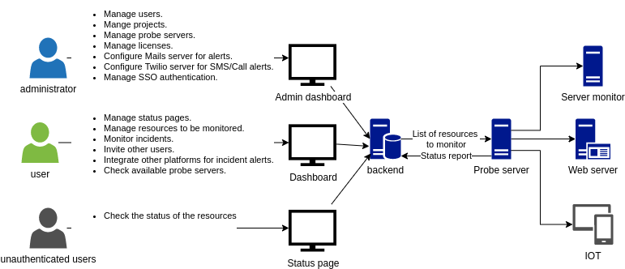
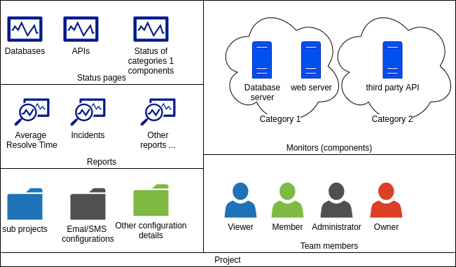

# Architecture

## General description

The main part of the project are:

-   User interfaces,
-   The probe server,
-   The backend.

### User interfaces

Fyipe has four separated projects for the UI:

#### accounts

It's responsible for the registration operations, and the login process in the frontend side.

#### admin-dashboard

It's the UI used by the administrators.

#### dashboard

It's the UI used by the users.

#### status-page

It's a public page that renders the reports about the situation of the monitored resources.

### The probe server

The probe server is a service that fetches periodically from backend the list of the resources (IoT devices, websites, servers, etc...) that should be monitors. Then, it tries to ping them one by one to report their status to the backend.

### The backend

The backend is the heart of the project. In addition to collecting the data from the probe servers, it implements all the other features like managing users, projects, incidents, alerts, etc...

### The server monitor

In addition to the three main components, we have the server monitor. This is an agent that needs to be installed in all the servers that will be monitored. Its main task is to collect data, like remaining storage space and CPU load, and to provide them to the probe server when requested.

The following diagram describes the general architecture of the Fyipe project.

## Features

### Administrator accounts

Using the admin dashboard, the administrator will be able to :

-   Manage users,
-   Manage projects,
-   Manage probe servers,
-   Check the audit logs,
-   Update the software license,
-   Configure the SMTP server to enable Fyipe sending emails like alerts, invitation, verifications, etc...
-   Configure Twilio account to enable Fyipe sending alerts SMS/calls,
-   Configure single sign-on domains to allow users to authenticate using third-party identity providers.

### User accounts

The dashboard is dedicated to normal users to allow them to:

-   Manage projects.
-   Define components.
-   Build status page.
-   Check reports.
-   Invite members.

#### Components

A component is one of the resources the user wants to monitor. It can be:

-   A web server.
-   A server

Un this case, the user will need to install the server monitor agent in the targeted server. The agent can be found in the folder server-monitor of the project.

-   An IoT device.
-   A script.

For every component, the user can define the different criteria that allow the backend to decide whether this component is working properly, degraded, or down.

In addition to the name, type, and criteria, the user can choose the category to which the resource should belong. The categories can be managed through the same dashboard under project settings.

#### Status pages

The user can create many status pages. For each page, he can select the resources that should be represented. The status page will have a public link that anyone, even unauthenticated users, can use to view the situation of the resources.

#### Reports

Fyipe generates several reports related to the incidents, the average resolve time, and monitors.

#### Inviting members

The user can invite by the email other users to join the team.

## Fyipe in production

Fyipe can be deployed in one of two modes: SAAS mode and enterprise mode. SAAS is the mode used by Hackerbay to run Fyipe. The clients can create accounts without being administrators or having access to the admin dashboard.
In enterprise mode, the client will have the fyipe code deployed on his personal servers.

The running mode needs to be configured on the following subprojects, by updating the .env file in each of them, as the behavior of some of their features may change depending on the mode.

-   accounts
-   backend
-   dashboard

### Some of the differences between SAAS and Enterprise mode

#### user registration

In SAAS, when a user submits the first form with his details: name, email, password, etc... to signup, a second form will show up to collect the credit card details. After submitting that form, the user will receive an email that contains the details to activate his account.

In enterprise mode, Only the first account in the database can be created using the signup form. Once created, the signup form will not be accessible. The initial account will be assigned the role of master administrator, and it'll have the privileges to create other new accounts.
