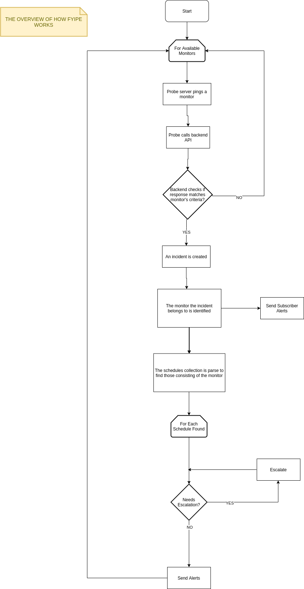

# How OneUptime Works

## The overview of how OneUptime works

One of the main purpose of OneUptime is to monitor resources. The flow of how this is done is depicted in the flowchart below.

## Description

1. The probe server has a cron job running that pings all available monitors at a time interval.
2. After the probe server pings a monitor, it calls the backend API along with the response from the monitor.
3. A monitor contains criteria for an UP, Down, and Degraded statuses. The backend checks if the response from the probe matches any of these criteria.
4. If there is a match, an incident is created.
5. External subscribers added to the monitor are alerted via SMS, Webhook or Email alerts.
6. All On-call schedules that are associated with the monitor are then identified.
7. Each schedule contains an escalation policy which defines which team will be alerted for the incident.
8. The members in the team will be alerted via SMS, Call and/or Email.

