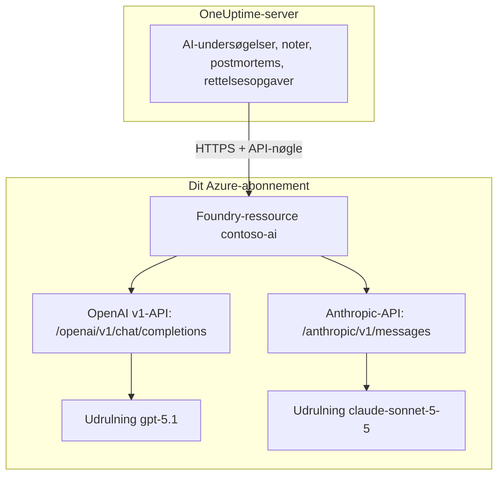

# Microsoft Foundry og Azure OpenAI

Kør OneUptimes AI-funktioner på modeller, du udruller i Microsoft Foundry (tidligere Azure AI Foundry) eller Azure OpenAI. OneUptime sender hver anmodning direkte til din ressource i dit Azure-abonnement, så prompts og svar behandles af den udrulning, du valgte, der hvor du valgte. Denne side fører dig fra et tomt abonnement til en udbyder, der virker: Azure-ressourcen, udrulningen af modellen, slutpunktet og nøglen, indstillingerne i OneUptime, netværket, og hvad du gør, når en anmodning mislykkes.

:::cards
- [Opsæt Azure](#opsæt-microsoft-foundry): Opret en ressource, udrul en model, kopiér dens slutpunkt og nøgle.
- [Forbind OneUptime](#forbind-oneuptime): Fire felter i projektindstillingerne, derefter knappen Test.
- [Selvhostet](#konfigurér-en-selvhostet-instans-med-miljøvariabler): Én udbyder til alle projekter, fra miljøvariabler.
- [Fejlfinding](#fejlfinding): 401, 403, en manglende udrulning, en api-version.
:::

## Sådan virker det

OneUptime kalder din Foundry-ressource over HTTPS fra OneUptime-serveren, aldrig fra folks browsere. Hver anmodning indeholder en af ressourcens API-nøgler og navngiver den udrulning, der skal besvare den.



Én udbydertype, **Azure OpenAI / Microsoft Foundry**, dækker alle udrulninger på ressourcen. Basis-URL'en fortæller OneUptime, hvilken API der skal kaldes:

| Model, du udruller | API, som OneUptime kalder | Basis-URL |
| --- | --- | --- |
| OpenAI-modeller, f.eks. GPT-5.1 og GPT-4.1 | OpenAI v1 chat completions | `https://contoso-ai.openai.azure.com/openai/v1` |
| Foundry Models med chat completions, f.eks. DeepSeek og Grok | OpenAI v1 chat completions | `https://contoso-ai.services.ai.azure.com/openai/v1` |
| Claude | Anthropic Messages | `https://contoso-ai.services.ai.azure.com/anthropic` |

> [!IMPORTANT]
> OneUptimes AI-funktioner kalder værktøjer: mens de arbejder, forespørger de dine monitorer, hændelser og telemetri. Udrul en model, der understøtter værktøjskald (function calling). Udbyderens knap **Test** tjekker det for dig.

## Før du begynder

Du skal bruge et Azure-abonnement, en rolle, der lader dig oprette og læse ressourcen, og en OneUptime-rolle, der må tilføje LLM-udbydere.

| For at | Det skal du bruge i Azure |
| --- | --- |
| Oprette ressourcen | **Owner** eller **Contributor** på ressourcegruppen, eller **Foundry Account Owner** |
| Udrulle en model | **Owner** eller **Contributor** på ressourcegruppen, eller **Foundry Owner** eller **Foundry Account Owner** på ressourcen. Claude kræver desuden tilladelse til at abonnere på tilbud i Azure Marketplace |
| Læse ressourcens nøgler | En rolle med `Microsoft.CognitiveServices/accounts/listKeys/action`, f.eks. **Owner**, **Contributor** eller **Cognitive Services Contributor** |

OneUptime selv har ikke brug for nogen Azure-rolle. En nøgle giver alene adgang til alle udrulninger på ressourcen uden rolletjek, så behandl den som en adgangskode.

I OneUptime kræver det **Project Owner**, **Project Admin**, **Project Member**, **Settings Admin**, **Settings Member** eller **Create LLM** at tilføje en udbyder til et projekt. En selvhostet instans kan i stedet registrere én udbyder til alle projekter fra miljøvariabler, hvilket kræver adgang til serveren.

## Opsæt Microsoft Foundry

:::steps
### Opret en ressource

Opret en Foundry-ressource i [Foundry-portalen](https://ai.azure.com), eller vælg en, du allerede har. En Azure OpenAI-ressource virker på samme måde. Notér ressourcens navn: Det er den første del af dens slutpunkt, f.eks. `contoso-ai` i `https://contoso-ai.openai.azure.com`.

Vælg en region, der tilbyder den ønskede model. Lad indtil videre ressourcens netværksadgang være åben for alle netværk; [Netværkskrav](#netværkskrav) forklarer, hvornår og hvordan du lukker den.

### Udrul en model

Vælg **Discover** i Foundry-portalen, derefter **Models**, og vælg en model, f.eks. `gpt-5.1` eller `claude-sonnet-5-5`. Vælg **Deploy** og derefter **Custom settings**:

- **Deployment name**: Foundry udfylder modellens navn. OneUptime beder om udrulningen under dette navn, så notér det præcist.
- **Deployment type**: afgør, hvor prompts behandles. Se [Hvor dine data behandles](#hvor-dine-data-behandles).

Vælg **Deploy**, og vent, til udrulningens status er **Succeeded**.

### Kopiér slutpunktet og en nøgle

Åbn ressourcen i [Azure-portalen](https://portal.azure.com) og derefter **Resource Management** > **Keys and Endpoint**. Kopiér **Endpoint** og **KEY 1**. Gem **KEY 2** til rotation: skift OneUptime over til den, og generér så **KEY 1** igen.

I Foundry-portalen står den samme nøgle på udrulningens fane **Details** ved siden af dens **Target URI**.
:::

:::details Foretrækker du kommandolinjen?
De samme trin med Azure CLI. `--model-version` skal være en version, som modelkataloget angiver for modellen.

```bash
az cognitiveservices account create \
  --name contoso-ai --resource-group oneuptime-ai \
  --kind AIServices --sku S0 --location eastus2 \
  --custom-domain contoso-ai

az cognitiveservices account deployment create \
  --name contoso-ai --resource-group oneuptime-ai \
  --deployment-name gpt-5.1 \
  --model-name gpt-5.1 --model-version <version> --model-format OpenAI \
  --sku-name GlobalStandard --sku-capacity 50

# KEY 1
az cognitiveservices account keys list \
  --name contoso-ai --resource-group oneuptime-ai \
  --query key1 --output tsv
```

Med `--custom-domain contoso-ai` er ressourcens slutpunkt `https://contoso-ai.openai.azure.com`.
:::

## Forbind OneUptime

:::steps
### Åbn LLM-udbydere

Gå til **Projektindstillinger** > **AI** > **LLM-udbydere**, og klik på **Opret LLM-udbyder**.

### Navngiv udbyderen

Under **Grundlæggende oplysninger** skal du indtaste et **Navn**, f.eks. `Azure gpt-5.1`, og eventuelt en **Beskrivelse**. Klik på **Næste**.

### Udfyld udbyderindstillingerne

| Felt | Hvad du indtaster |
| --- | --- |
| **LLM-udbyder** | **Azure OpenAI / Microsoft Foundry** |
| **API-nøgle** | Ressourcens **KEY 1** eller **KEY 2** |
| **Modelnavn** | Udrulningens navn, præcis som Foundry viser det, f.eks. `gpt-5.1` |
| **Basis-URL** | Ressourcens slutpunkt med `/openai/v1`, f.eks. `https://contoso-ai.openai.azure.com/openai/v1`. For Claude: `https://contoso-ai.services.ai.azure.com/anthropic` |

**Indstil som standard** under **Flere felter** er slået til: AI-funktioner bruger projektets standardudbyder. Klik på **Opret LLM-udbyder**.

### Test forbindelsen

Klik på **Test** i udbyderens række. En udbyder, der virker, svarer "Connection successful. The LLM provider responded to a test prompt and used tool calling." Hvis testen mislykkes, siger beskeden, hvad Azure svarede, og hvad du skal ændre; se [Fejlfinding](#fejlfinding).
:::

Den færdige udbyder som eksempel:

```text
Navn: Azure gpt-5.1
LLM-udbyder: Azure OpenAI / Microsoft Foundry
API-nøgle: <KEY 1 fra contoso-ai>
Modelnavn: gpt-5.1
Basis-URL: https://contoso-ai.openai.azure.com/openai/v1
```

Fra nu af bruger projektets AI-funktioner denne udrulning. På OneUptime Cloud betales deres anmodninger ikke af projektets AI-kreditter: Azure fakturerer dem til dit abonnement.

## Formater for basis-URL

OneUptime accepterer slutpunktet i de former, som Azure-portalen og Foundry-portalen viser det i, og sender hver anmodning til adressen ved siden af. Foretræk de korte: Basis-URL'en kan rumme højst 100 tegn.

| Basis-URL | Anmodninger går til |
| --- | --- |
| `https://contoso-ai.openai.azure.com` | `https://contoso-ai.openai.azure.com/openai/v1/chat/completions` |
| `https://contoso-ai.openai.azure.com/openai/v1` | `https://contoso-ai.openai.azure.com/openai/v1/chat/completions` |
| `https://contoso-ai.services.ai.azure.com/openai/v1` | `https://contoso-ai.services.ai.azure.com/openai/v1/chat/completions` |
| `https://contoso-ai.openai.azure.com/openai/deployments/gpt-4o` | `https://contoso-ai.openai.azure.com/openai/deployments/gpt-4o/chat/completions?api-version=2024-10-21` |
| `https://contoso-ai.services.ai.azure.com/anthropic` | `https://contoso-ai.services.ai.azure.com/anthropic/v1/messages` |

- **v1-API'en** (`/openai/v1`) er Microsofts nuværende API. Den behøver ingen `api-version`, tager udrulningens navn som model og betjener både OpenAI-modeller og andre Foundry Models. Brug den til nye udbydere.
- **En udrulnings-URL** (`/openai/deployments/<name>`) navngiver selv udrulningen, og Azure følger det navn frem for **Modelnavn**. OneUptime tilføjer `api-version=2024-10-21`, medmindre basis-URL'en har sin egen `api-version`. Udbydere, der er gemt sådan, virker fortsat som før.
- **En udrulnings Target URI**, indsat i sin helhed fra Foundry-portalen, virker også, så længe den kan være i 100 tegn.
- **Claude**: Foundry leverer kun Claude gennem Anthropic Messages API, på ressourcens sti `/anthropic`. OneUptime kalder den med den samme nøgle. Udbydertypen **Anthropic** når den også, med den samme basis-URL.

## Konfigurér en selvhostet instans med miljøvariabler

På en selvhostet instans registrerer variablerne `GLOBAL_LLM_PROVIDER_*` ved opstart én global LLM-udbyder, som alle projekter uden egen udbyder bruger, AI-rettelsesopgaver inklusive. Et projekts egen udbyder kommer altid først.

```bash
GLOBAL_LLM_PROVIDER_TYPE=AzureOpenAI
GLOBAL_LLM_PROVIDER_NAME=Azure gpt-5.1
GLOBAL_LLM_PROVIDER_BASE_URL=https://contoso-ai.openai.azure.com/openai/v1
GLOBAL_LLM_PROVIDER_MODEL_NAME=gpt-5.1
GLOBAL_LLM_PROVIDER_API_KEY=<KEY 1 of contoso-ai>
```

:::tabs
@tab Docker Compose
Tilføj variablerne i `config.env`, og start OneUptime igen på den måde, du startede det:

```bash
(export $(grep -v '^#' config.env | xargs) && docker compose up --remove-orphans -d)
```
@tab Kubernetes
Opbevar nøglen i en Secret, og send variablerne med chartets globale `extraEnv`:

```bash
kubectl create secret generic azure-foundry \
  --namespace oneuptime --from-literal=api-key='<KEY 1 of contoso-ai>'
```

```yaml title="values.yaml"
extraEnv:
  - name: GLOBAL_LLM_PROVIDER_TYPE
    value: AzureOpenAI
  - name: GLOBAL_LLM_PROVIDER_NAME
    value: Azure gpt-5.1
  - name: GLOBAL_LLM_PROVIDER_BASE_URL
    value: https://contoso-ai.openai.azure.com/openai/v1
  - name: GLOBAL_LLM_PROVIDER_MODEL_NAME
    value: gpt-5.1
  - name: GLOBAL_LLM_PROVIDER_API_KEY
    valueFrom:
      secretKeyRef:
        name: azure-foundry
        key: api-key
```

Kør derefter `helm upgrade` med disse værdier.
:::

Udbyderen følger variablerne: Ændrer du dem, opdateres den ved næste opstart, og fjerner du `GLOBAL_LLM_PROVIDER_TYPE`, slettes den. Mangler en nøgle eller en basis-URL for denne type, nævner opstartsloggen det. Se [LLM-udbydere](/docs/ai/llm-provider) for alle variabler og udbydertyper.

## Netværkskrav

OneUptime-serveren åbner HTTPS-forbindelser, på port 443, til ressourcens værtsnavn, f.eks. `contoso-ai.openai.azure.com` eller `contoso-ai.services.ai.azure.com`. Tillad denne udgående trafik i din firewall eller proxy.

- **OneUptime Cloud** når ressourcen over internettet, så ressourcen skal tage imod offentlig trafik. Hvis ressourcen skal holdes væk fra internettet, skal du selv hoste OneUptime.
- **Selvhostet, privat slutpunkt**: Placér ressourcen bag et privat slutpunkt i et virtuelt netværk, som OneUptime-serveren kan nå, og knyt de private DNS-zoner `privatelink.openai.azure.com`, `privatelink.services.ai.azure.com` og `privatelink.cognitiveservices.azure.com` til det, så ressourcens sædvanlige værtsnavn slås op til dens private adresse. Basis-URL'en forbliver den samme.
- **Private adresser**: En selvhostet instans forbinder til private adresser, medmindre `DATA_SOURCE_BLOCK_PRIVATE_ADDRESSES=true` er sat. En global LLM-udbyder forbinder til dem under alle omstændigheder.
- **Netværksregler på ressourcen**: Under ressourcens **Networking** holder **Selected networks and private endpoints** alt andet ude. En anmodning, som en regel afviser, mislykkes med 403.

## Hvor dine data behandles

Den udrulningstype, du vælger, når du udruller modellen, afgør, hvor Azure behandler OneUptimes prompts og modellens svar. Lagrede data forbliver i ressourcens Azure-geografi.

| Udrulningstype | Prompts og svar behandles |
| --- | --- |
| Global Standard, Global Provisioned | I enhver Azure-region |
| Data Zone Standard, Data Zone Provisioned | Kun inden for datazonen: USA, Den Europæiske Union eller Asien og Stillehavsområdet |
| Standard, Regional Provisioned | Inden for ressourcens Azure-geografi |

Claude-udrulninger er enten **Hosted on Azure** eller **Hosted on Anthropic**. Vælg **Hosted on Azure** for at holde prompts og svar inden for Azure. Se Microsofts [udrulningstyper](https://learn.microsoft.com/en-us/azure/foundry/foundry-models/concepts/deployment-types) for detaljer.

## Eksempel på anmodning og svar

For at tjekke en udrulning uden for OneUptime kan du sende den den anmodning, OneUptime sender, med `curl`:

:::tabs
@tab OpenAI v1 API
```bash
curl https://contoso-ai.openai.azure.com/openai/v1/chat/completions \
  -H "Content-Type: application/json" \
  -H "api-key: $AZURE_API_KEY" \
  -d '{
    "model": "gpt-5.1",
    "messages": [
      { "role": "user", "content": "Reply with the word: OK" }
    ]
  }'
```

Svaret, forkortet:

```json
{
  "id": "chatcmpl-7R1nGnsXO8n4oi9UPz2f3UHdgAYMn",
  "object": "chat.completion",
  "model": "gpt-5.1",
  "choices": [
    {
      "index": 0,
      "finish_reason": "stop",
      "message": { "role": "assistant", "content": "OK" }
    }
  ],
  "usage": { "prompt_tokens": 12, "completion_tokens": 2, "total_tokens": 14 }
}
```
@tab Anthropic API
```bash
curl https://contoso-ai.services.ai.azure.com/anthropic/v1/messages \
  -H "Content-Type: application/json" \
  -H "x-api-key: $AZURE_API_KEY" \
  -H "anthropic-version: 2023-06-01" \
  -d '{
    "model": "claude-sonnet-5-5",
    "max_tokens": 1024,
    "messages": [
      { "role": "user", "content": "Reply with the word: OK" }
    ]
  }'
```

Svaret, forkortet:

```json
{
  "id": "msg_01XFDUDYJgAACzvnptvVoYEL",
  "type": "message",
  "role": "assistant",
  "model": "claude-sonnet-5-5",
  "content": [{ "type": "text", "text": "OK" }],
  "stop_reason": "end_turn",
  "usage": { "input_tokens": 14, "output_tokens": 4 }
}
```
:::

OneUptimes egne anmodninger indeholder mere: dets instruktioner, samtalen, de værktøjer, modellen må kalde, og en tokengrænse. Fra svaret læser det teksten, værktøjskaldene, hvorfor modellen stoppede, og tokenforbruget, som **Projektindstillinger** > **AI** > **AI-logs** viser for hver anmodning. Udbyderens **Yderligere parametre** føjes til hver anmodning.

## Microsoft Entra ID og ressourcer uden nøgler

OneUptime logger på ressourcen med en af dens API-nøgler. Login med Microsoft Entra ID, som tjenesteprincipal eller administreret identitet, understøttes endnu ikke.

Hvis din organisation slår nøgleadgang fra for AI-ressourcer (`disableLocalAuth`), mislykkes anmodninger med `AuthenticationTypeDisabled`. Tillad enten nøgleadgang på den ressource, OneUptime bruger, eller sæt Azure API Management foran den:

1. Importér ressourcens udrulning i API Management som en Azure OpenAI-API. API Management logger derefter på ressourcen med sin egen administrerede identitet.
2. Sæt API'ens headernavn for abonnementsnøglen til `api-key`.
3. Sæt i OneUptime **Basis-URL** til API'ens adresse i API Management for udrulningen, f.eks. `https://contoso-apim.azure-api.net/aoai/openai/deployments/gpt-5.1`, med den `api-version`, som udrulningen kræver, som for enhver udrulnings-URL. Sæt **API-nøgle** til en abonnementsnøgle fra API Management.

Claude-modeller, der kun accepterer Microsoft Entra ID, f.eks. Claude Mythos, kan endnu ikke bruges.

## Fejlfinding

OneUptime sætter det, du skal ændre, først i fejlen, og derefter Azures eget svar. Knappen **Test** viser hele fejlen; **AI-logs** gemmer de første 490 tegn.

:::details "Azure did not accept the API key" (401)
Nøglen er forkert, er blevet genereret igen eller tilhører en anden ressource. Kopiér **KEY 1** igen fra **Keys and Endpoint** for den ressource, som basis-URL'en peger på, og indsæt den i **API-nøgle**.
:::

:::details "Key-based authentication is turned off for this resource" (403)
Azure svarede `AuthenticationTypeDisabled`: Ressourcen accepterer kun Microsoft Entra ID. Se [Microsoft Entra ID og ressourcer uden nøgler](#microsoft-entra-id-og-ressourcer-uden-nøgler).
:::

:::details "Azure refused the request" (403)
En netværksregel på ressourcen holdt anmodningen ude. Sammenhold ressourcens indstillinger under **Networking** med [netværkskravene](#netværkskrav).
:::

:::details "This resource has no deployment named ..." (404)
Azure svarede `DeploymentNotFound`. Sæt **Modelnavn** til udrulningens navn, præcis som Foundry-portalen viser det. En udrulning, der er oprettet inden for de seneste minutter, er måske ikke klar endnu. Hvis basis-URL'en er en udrulnings-URL, er det navnet efter `/openai/deployments/`, du skal tjekke.
:::

:::details "Azure found nothing at this address" (404)
Basis-URL'en fører ikke til en Azure OpenAI-API. Brug ressourcens slutpunkt med `/openai/v1`, f.eks. `https://contoso-ai.openai.azure.com/openai/v1`. Modelinferensslutpunktet fra det udfasede Azure AI Inference SDK (`/models`) er ikke en sådan: Brug `/openai/v1` på den samme ressource.
:::

:::details "This model needs api-version ... or later" (400)
En udrulnings-URL beder om `api-version=2024-10-21`, medmindre den angiver en anden, og nyere modeller, f.eks. o-serien og GPT-5, afviser så gamle versioner. Skift basis-URL'en til v1-API'en, `https://contoso-ai.openai.azure.com/openai/v1`, med udrulningens navn som **Modelnavn**. Eller tilføj den version, Azure nævner, f.eks. `?api-version=2024-12-01-preview`, til basis-URL'en.
:::

:::details "Azure's v1 API takes no dated api-version" (400)
Basis-URL'en ender på `/openai/v1` og har også en dateret `api-version`. Fjern `api-version` fra basis-URL'en.
:::

:::details "Basis-URL må ikke være længere end 100 tegn."
En Target URI med sin `api-version` er ofte længere end det. Brug ressourcens slutpunkt med `/openai/v1`, og skriv udrulningens navn i **Modelnavn**.
:::

:::details "...could not be reached" eller "...host name could not be resolved"
OneUptime-serveren kunne ikke forbinde til ressourcen. På OneUptime Cloud skal ressourcen kunne nås fra internettet. På en selvhostet instans skal du tjekke, at serveren kan slå ressourcens værtsnavn op, via den private DNS-zone ved et privat slutpunkt, og at udgående HTTPS er tilladt.
:::

:::details For mange anmodninger (429)
Udrulningens kvote af tokens pr. minut er opbrugt. AI-funktioner venter og prøver igen, op til ti forsøg inden for cirka fem minutter, før de melder fejlen; knappen **Test** giver op tidligere. Hæv udrulningens kvote i Foundry-portalen, eller flyt den til en anden udrulningstype.
:::

## Næste trin

:::cards
- [LLM-udbydere](/docs/ai/llm-provider): Alle udbydertyper, og hvordan et projekt vælger en.
- [AI SRE](/docs/ai/ai-sre): Undersøgelser, der kører på denne udbyder.
- [Ask AI](/docs/ai/ask-ai): Spørgsmål om dit system, besvaret i dashboardet.
:::
